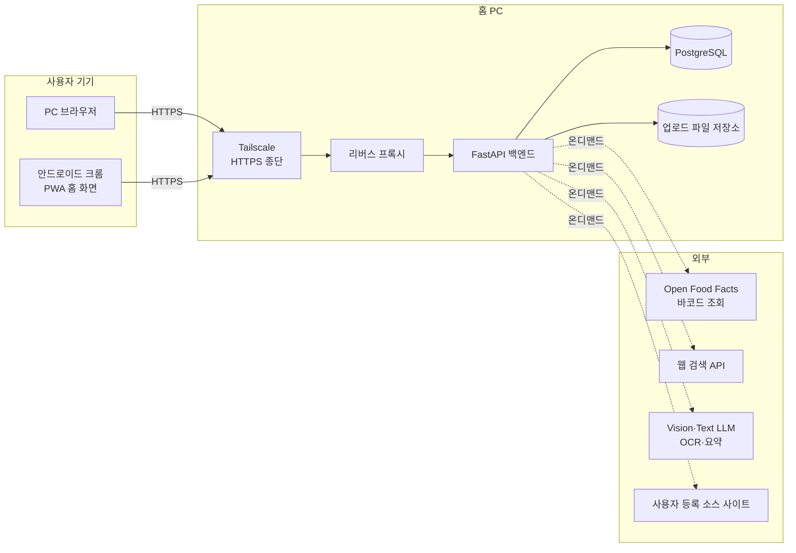
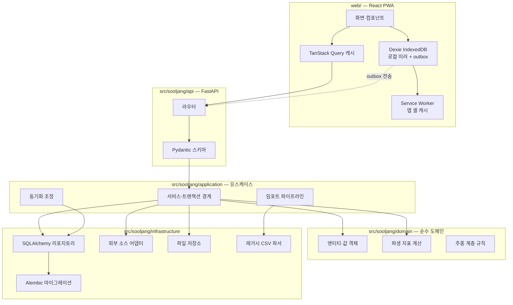
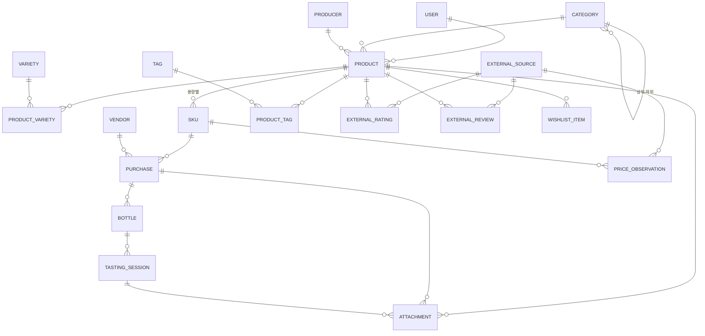
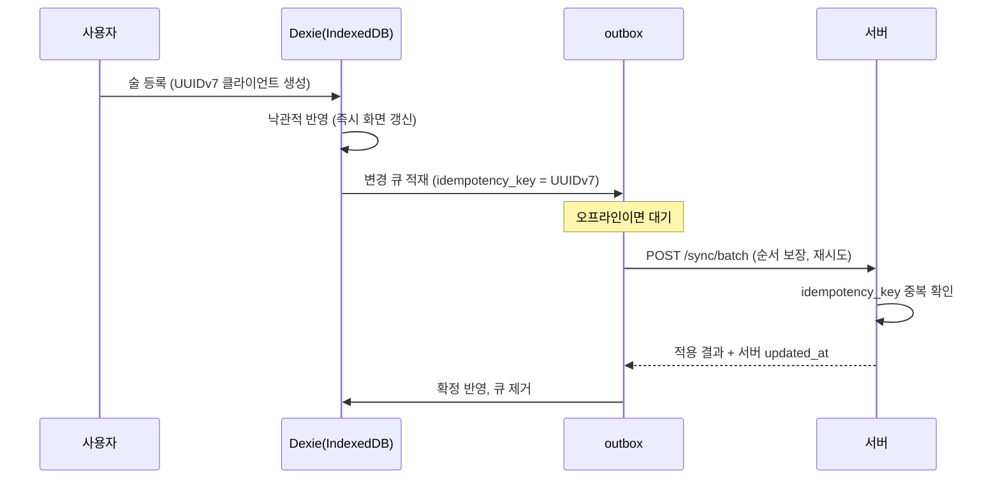

# 술장 아키텍처 설계

이 문서는 구현 전에 결정한 구조와 그 근거를 남긴다. 코드와 어긋나면 문서를 먼저 고친다.
레거시 데이터의 실측 근거는 [legacy-schema.md](legacy-schema.md), 작업 순서와 진행 현황은
[plan.md](plan.md)를 참조한다.

## 1. 시스템 개요

개인이 소유한 주류를 **제품 → 규격 → 구매 건 → 개별 병 → 시음 세션** 계층으로 기록하고,
파생 지표와 통계를 자동 계산하는 단일 사용자 중심 웹 애플리케이션이다. 향후 소수의 지인에게
공유할 수 있도록 처음부터 멀티테넌시를 준비한다.

### 1.1 시스템 컨텍스트



외부 호출은 모두 **사용자 조작에 의한 온디맨드**다. 백그라운드 대량 수집은 하지 않는다
(§9.4 근거). 오프라인 상태에서는 외부 호출 기능만 비활성화되고 기록·조회는 계속 동작한다.

### 1.2 컴포넌트 구조



의존 방향은 항상 안쪽(도메인)을 향한다. `domain/`은 SQLAlchemy·FastAPI·HTTP를 import하지
않는다. 파생 지표 계산이 DB 없이 단위 테스트되도록 하기 위한 제약이다.

## 2. 데이터 모델

### 2.1 ERD



### 2.2 공통 컬럼 규약

모든 업무 테이블에 다음을 둔다.

| 컬럼 | 타입 | 목적 |
|---|---|---|
| `id` | `UUID` (UUIDv7) | PK. 시간 정렬성이 있어 인덱스 지역성이 좋고, 오프라인 클라이언트가 서버 왕복 없이 생성할 수 있다 |
| `user_id` | `UUID` FK | 멀티테넌시. 단일 사용자 시기에도 반드시 채운다 |
| `created_at` | `timestamptz` | |
| `updated_at` | `timestamptz` | 동기화 LWW 판정 기준 |
| `deleted_at` | `timestamptz` NULL | soft delete. 삭제를 오프라인 클라이언트에 전파하기 위해 필수 |

조회는 기본적으로 `deleted_at IS NULL` 조건을 적용한다. 동기화 델타 조회만 예외다.

### 2.3 테이블 정의

#### `category` — 주종 (자기참조 계층)

| 컬럼 | 타입 | 제약 |
|---|---|---|
| `parent_id` | `UUID` NULL | 자기참조. NULL이면 최상위 |
| `name` | `text` | `UNIQUE(user_id, parent_id, name)` |
| `slug` | `text` | 검색·URL용 |
| `sort_order` | `int` | 표시 순서 |
| `depth` | `int` | 계산 저장. 최대 3단계로 제한 |

시드 계층은 레거시 통계의 롤업에서 도출한다([legacy-schema.md §4.4](legacy-schema.md)).

```
와인 ├ 레드와인 · 화이트와인 · 스파클링와인 · 로제와인
     ├ 스위트와인 ├ 토카이와인 · 소테른/바르삭/루피악 와인 · 파시토와인
     │            └ 남아공 스위트와인 · 리브잘트와인
     └ 주정강화와인 ├ 포트와인 · 셰리와인 · 마데이라와인 · 세투발와인
사케
전통주 ├ 탁주 · 약주 · 증류주 · 리큐르
맥주   ├ (스타일은 variety 로 표현)
양주   ├ 위스키 ├ 싱글몰트 위스키 · 블렌디드 위스키 · 버번 위스키 · 라이 위스키
       └ 기타 양주 ├ 브랜디 · 럼 · 데낄라 · 메즈칼 · 진 · 보드카 · 리큐르 · 백주
```

계층 조회는 재귀 CTE(`WITH RECURSIVE`)로 처리한다. "위스키" 필터가 하위 3종을 모두 포함해야
하므로, 조상-후손 판정을 매 쿼리에서 수행한다. 데이터 규모(수백~수천 행)에서 재귀 CTE로
충분하고, 병목이 확인되면 closure table로 전환한다.

#### `product` — 제품

| 컬럼 | 타입 | 비고 |
|---|---|---|
| `name` | `text` | 표시명. 레거시 이름 첫 줄 |
| `name_en` | `text` NULL | 영문명 |
| `category_id` | `UUID` FK | |
| `producer_id` | `UUID` FK NULL | |
| `country`, `region` | `text` NULL | |
| `abv` | `numeric(5,2)` NULL | `CHECK (abv >= 0 AND abv <= 100)` |
| `vintage` | `int` NULL | `CHECK (vintage BETWEEN 1800 AND 2200)` |
| `age_years` | `numeric(4,1)` NULL | 숙성 연수 |
| `note` | `text` NULL | 제품 메모. 레거시 `느낀 점`·이름 2번째 줄 이관 |
| `personal_rating` | `numeric(3,1)` NULL | `CHECK (0 < r <= 6)` — 레거시가 6점 만점 |
| `search_text` | `text` | 생성 컬럼. `pg_trgm` GIN 인덱스 대상 |

`personal_rating`은 제품 수준 총평이다. 시음 세션별 평점과 별개로 두어 레거시 데이터를 손실 없이
받고, 세션이 쌓이면 세션 평균을 함께 보여준다.

중복 판정 키: `(user_id, normalized_name, vintage, abv)`. `normalized_name`은 공백·대소문자·
전각문자·구두점을 정규화한 값이다.

#### `sku` — 규격 (용량별 단위)

| 컬럼 | 타입 | 비고 |
|---|---|---|
| `product_id` | `UUID` FK | |
| `volume_ml` | `int` | `CHECK (volume_ml > 0)` |
| `barcode` | `text` NULL | `UNIQUE(user_id, barcode) WHERE barcode IS NOT NULL` |
| `barcode_type` | `enum` NULL | `ean13`/`upca`/`ean8`/`other` |
| `package_note` | `text` NULL | 선물세트 등 |

`UNIQUE(product_id, volume_ml)`. 같은 술의 700ml와 1L을 구분하고, 바코드 매칭·100ml당 가격
계산의 단위가 된다.

#### `vendor` — 구매처

| 컬럼 | 타입 | 비고 |
|---|---|---|
| `name` | `text` | `UNIQUE(user_id, name)` |
| `kind` | `enum` | `mart`/`online`/`duty_free`/`bottle_shop`/`bar`/`event`/`gift`/`other` |
| `url` | `text` NULL | |
| `note` | `text` NULL | |

레거시에서 82개가 추출된다. `카카오톡 선물하기`·`회사선물`·`시윤이의 선물`은 `gift`,
`신라 온라인 면세`는 `duty_free`, `2024 수원 메가쇼`류는 `event`로 매핑한다.

#### `purchase` — 구매 건

| 컬럼 | 타입 | 비고 |
|---|---|---|
| `sku_id` | `UUID` FK | |
| `vendor_id` | `UUID` FK NULL | |
| `purchased_on` | `date` NULL | 레거시에 없어 NULL 허용 |
| `quantity` | `int` | `CHECK (quantity > 0)` |
| `unit_list_price` | `numeric(14,2)` NULL | **병당** 정가 (원화) |
| `unit_paid_price` | `numeric(14,2)` NULL | **병당** 실지불가 (원화) |
| `currency` | `char(3)` | 기본 `KRW` |
| `fx_rate` | `numeric(14,6)` NULL | 구매 시점 환율 스냅샷 |
| `foreign_unit_price` | `numeric(14,2)` NULL | 외화 표시 병당 가격 |
| `discount_note` | `text` NULL | `1+1`, `수원페이 10%` 등 원문 |
| `import_note` | `text` NULL | 레거시 원문 보존 (분할 실패한 구매처 문자열 등) |

레거시는 총액을 저장했지만([legacy-schema.md §4.2](legacy-schema.md)) DB는 **병당 단가**를
저장한다. 총액은 `unit_price × quantity`로 언제든 복원되고, 구매 건을 쪼갤 때 단가가 보존되어야
하기 때문이다. 임포트 시 `총액 ÷ 병수`로 변환한다.

외화 구매는 `foreign_unit_price × fx_rate`를 `unit_paid_price`에 저장하고 원시값도 함께 남겨
사후 검증이 가능하게 한다. 환율은 **구매 시점 값으로 고정**한다. 현재 환율로 재평가하면 과거
지출액이 매일 바뀌어 통계가 재현되지 않는다.

#### `bottle` — 개별 병

| 컬럼 | 타입 | 비고 |
|---|---|---|
| `purchase_id` | `UUID` FK | |
| `status` | `enum` | `unopened`/`open`/`finished`/`gifted`/`sold` |
| `opened_on` | `date` NULL | |
| `finished_on` | `date` NULL | |
| `remaining_ml` | `int` NULL | NULL이면 미개봉(= SKU 전량) |
| `storage_location` | `text` NULL | |
| `label_no` | `int` | 구매 건 내 순번. `UNIQUE(purchase_id, label_no)` |

제약: `status='unopened'`면 `opened_on IS NULL`, `status='finished'`면 `remaining_ml = 0`,
`remaining_ml <= sku.volume_ml` (애플리케이션 계층 검증. 크로스 테이블이라 DB CHECK로 표현 불가).

구매 건 저장 시 `quantity`만큼 `bottle` 행을 자동 생성한다. 레거시 임포트는 `소비` 병수만큼
`finished`, `미개봉`만큼 `unopened`, `개봉`만큼 `open`으로 초기화한다.

#### `tasting_session` — 시음 세션

| 컬럼 | 타입 | 비고 |
|---|---|---|
| `bottle_id` | `UUID` FK | |
| `tasted_at` | `timestamptz` | |
| `pour_ml` | `int` NULL | 기록 시 `bottle.remaining_ml` 차감 |
| `rating` | `numeric(3,1)` NULL | `CHECK (0 < rating <= 6)`, 0.5 단위 |
| `nose`, `palate`, `finish` | `text` NULL | |
| `note` | `text` NULL | |
| `companions`, `place` | `text` NULL | |

#### `external_source` — 외부 소스 레지스트리

| 컬럼 | 타입 | 비고 |
|---|---|---|
| `name` | `text` | 표시명 |
| `code` | `text` | 레거시 태그 매핑용. `RB`/`U`/`BA`/`VIVINO` 등 |
| `base_url` | `text` | |
| `kinds` | `text[]` | `rating`/`price`/`review` 복수 가능 |
| `category_scope` | `UUID[]` NULL | 적용 주종. NULL이면 전체 |
| `strategy` | `enum` | `search`(검색+LLM 요약) / `adapter`(YAML 셀렉터) |
| `adapter_spec` | `jsonb` NULL | `strategy='adapter'`일 때 셀렉터 정의 |
| `rating_scale` | `numeric(4,1)` NULL | 5·100 등 |
| `ttl_hours` | `int` | 캐시 유효 기간 |
| `rate_limit_per_min` | `int` | |
| `enabled` | `bool` | |
| `priority` | `int` | 표시·조회 순서 |

사용자가 UI에서 자유롭게 등록·수정·비활성·삭제·재정렬한다. 레거시 태그(`RB`/`U`/`BA`)는
초기 시드로 넣어 임포트가 소스별 평점을 정확히 연결할 수 있게 한다.

#### `external_rating` / `external_review` / `price_observation`

세 테이블 공통으로 `source_id`, `fetched_at`, `source_url`(**NOT NULL**), `raw_excerpt`,
`summary`를 갖는다. 출처 URL 없는 데이터는 저장을 거부한다. 사후에 사람이 원본을 확인할 수
없는 수치는 신뢰할 수 없기 때문이다.

- `external_rating`: `product_id`, `value`, `scale`, `review_count`
  단, 레거시 임포트는 URL을 모르므로 `source_url`에 `legacy://excel` 센티넬을 넣고
  `is_legacy=true`로 표시한다. 실측 조회로 대체되면 갱신한다
- `external_review`: `product_id`, `author`, `rating`, `excerpt`, `published_at`
- `price_observation`: `sku_id`, `observed_at`, `price`, `currency`, `in_stock`
  시계열이므로 `(sku_id, source_id, observed_at)` 인덱스를 둔다

#### 그 외

- `producer`, `variety`, `product_variety`, `tag`, `product_tag`: 단순 참조·연결 테이블
- `attachment`: `owner_type`/`owner_id` 다형 참조, `kind`(`label`/`receipt`/`tasting`),
  `mime`, `bytes`, `sha256`, `storage_path`
- `wishlist_item`: 구매 후보. `target_price` 도달 알림(Task 19)의 대상
- `saved_view`: 커스텀 피벗 정의(Task 20). `definition jsonb`
- `sync_cursor`, `outbox_receipt`: 동기화 상태(§5)
- `user`, `session`: 인증(§6)

### 2.4 인덱스

| 대상 | 인덱스 |
|---|---|
| 한글 부분 문자열 검색 | `GIN (search_text gin_trgm_ops)` on `product` |
| 목록 기본 정렬·필터 | `(user_id, deleted_at, category_id)` on `product` |
| 동기화 델타 | `(user_id, updated_at)` on 모든 동기화 대상 테이블 |
| 바코드 조회 | `UNIQUE (user_id, barcode) WHERE barcode IS NOT NULL` on `sku` |
| 집계 | `(sku_id)` on `purchase`, `(purchase_id, status)` on `bottle` |
| 시세 시계열 | `(sku_id, source_id, observed_at DESC)` on `price_observation` |

## 3. 파생 지표 계산 규칙

모두 계산 필드다. 저장하지 않는다. 저장하면 엑셀과 같은 불일치 문제가 재발한다.

기호: 제품 `p`, 규격 `s`, 구매 건 집합 `P`, 병 집합 `B`.

| 지표 | 정의 |
|---|---|
| 구매 병수 | `Σ_{i∈P} quantity_i` |
| 소비 병수 | `|{b∈B : status(b) = finished}|` |
| 증여·판매 병수 | `|{b∈B : status(b) ∈ {gifted, sold}}|` |
| 미개봉 병수 | `|{b∈B : status(b) = unopened}|` |
| 개봉 병수 | `|{b∈B : status(b) = open}|` |
| 재고 병수 | `미개봉 + 개봉` |
| 평단가 (`avg_list_price`) | `Σ(unit_list_price_i × quantity_i) / Σ quantity_i` |
| 실평단가 (`avg_paid_price`) | `Σ(unit_paid_price_i × quantity_i) / Σ quantity_i` |
| 100ml당 가격 | `avg_list_price / (volume_ml / 100)` — **정가 기준** |
| 100ml당 실가격 | `avg_paid_price / (volume_ml / 100)` — 신규 지표 |
| 할인율 | `1 − (Σ unit_paid × qty) / (Σ unit_list × qty)` |
| 재고 자산가치(원가) | `Σ_{b∈재고} avg_paid_price(sku(b))` |
| 재고 자산가치(시세) | `Σ_{b∈재고} latest_price_observation(sku(b))`, 관측 없으면 원가로 대체 |
| 개봉 후 소진 기간 | `finished_on − opened_on` (일) |
| 소비 속도 | 기간 내 `finished` 병 수 / 기간(월) |
| 가성비 | `rating / price_per_100ml` (높을수록 좋음) |

100ml당 가격이 **정가 기준**인 것은 레거시 통계와 일치시키기 위한 결정이다
([legacy-schema.md §4.2](legacy-schema.md), 391건 일치·불일치 0으로 검증). 실구매 기준 지표는
`price_per_100ml_paid`로 별도 제공한다.

여러 용량이 섞인 제품의 제품 수준 100ml당 가격은 **가중 평균**으로 계산한다:
`Σ(unit_list × qty) / Σ(volume_ml × qty / 100)`.

가격이 NULL인 구매 건(선물)은 금액 집계에서 제외하되 병수 집계에는 포함한다. 레거시에 정가
결측 33건, 실구매가 결측 34건이 있어 이 구분이 필요하다.

계산은 `domain/metrics.py`의 순수 함수로 구현하고, 목록·통계 조회 성능이 필요한 경로는 동일
공식을 SQL 뷰로 이중 구현한다. **두 구현이 같은 결과를 내는지 검증하는 테스트를 둔다.**

## 4. API 설계

### 4.1 규약

- 베이스 경로 `/api/v1`
- 리소스 중심 URL, 동사는 HTTP 메서드로 표현. 상태 전이 등 예외는 `POST /bottles/{id}:open` 형태
- 요청·응답 본문은 `snake_case` JSON
- 모든 쓰기 요청은 `Idempotency-Key` 헤더를 허용한다 (오프라인 outbox 재전송 대비)
- 에러는 RFC 9457 Problem Details

```json
{ "type": "https://sooljang.local/errors/validation",
  "title": "요청 값이 올바르지 않습니다",
  "status": 422,
  "detail": "remaining_ml 은 규격 용량을 초과할 수 없습니다",
  "errors": [{ "field": "remaining_ml", "code": "exceeds_volume" }] }
```

- 목록은 **커서 페이지네이션**. `?limit=50&cursor=<opaque>` → `{ "items": [...],
  "next_cursor": "..." }`. offset 방식은 데이터가 바뀌면 중복·누락이 생겨 무한 스크롤에
  부적합하다
- 정렬은 `?sort=price_per_100ml&order=asc`. 정렬 키에는 항상 `id`를 tie-breaker로 추가해
  커서 안정성을 보장한다

### 4.2 엔드포인트

| 메서드 · 경로 | 설명 | Task |
|---|---|---|
| `GET /health` | 헬스체크 (인증 불필요) | 5 |
| `POST /auth/login`, `POST /auth/logout`, `GET /auth/me` | 세션 인증 | 12 |
| `GET·POST /categories`, `PATCH·DELETE /categories/{id}` | 주종 계층 | 9 |
| `GET·POST /products`, `GET·PATCH·DELETE /products/{id}` | 제품 | 9 |
| `GET /products/{id}/metrics` | 파생 지표 | 9 |
| `GET·POST /products/{id}/skus`, `PATCH·DELETE /skus/{id}` | 규격 | 9 |
| `GET·POST /purchases`, `GET·PATCH·DELETE /purchases/{id}` | 구매 건 | 9 |
| `POST /purchases/{id}:split` | 구매 건 분할 (레거시 합성 lot 해체) | 9 |
| `GET /bottles`, `PATCH /bottles/{id}` | 개별 병 | 13 |
| `POST /bottles/{id}:open`, `:finish`, `:gift`, `:sell` | 상태 전이 | 13 |
| `GET·POST /bottles/{id}/tastings`, `PATCH·DELETE /tastings/{id}` | 시음 세션 | 13 |
| `GET·POST /vendors`, `PATCH·DELETE /vendors/{id}` | 구매처 | 9 |
| `POST /attachments` | 파일 업로드 | 10 |
| `POST /imports/legacy:analyze` | 업로드 파일 블록 분석·dry-run | 11 |
| `POST /imports/legacy:commit` | 실제 적재 | 11 |
| `GET /imports/{id}/report` | 실패 행·경고 리포트 | 11 |
| `GET /stats/rankings`, `GET /stats/by-category`, `GET /stats/summary` | 통계 v1 | 14 |
| `GET /stats/timeseries`, `POST /stats/pivot` | 통계 v2 | 20 |
| `GET·POST /saved-views`, `PATCH·DELETE /saved-views/{id}` | 커스텀 뷰 | 20 |
| `GET /sync?since=<cursor>` | 델타 풀 | 15 |
| `POST /sync/batch` | outbox 일괄 전송 | 15 |
| `GET /barcodes/{code}` | 바코드 조회 (로컬 → 외부 → 검색) | 16 |
| `POST /ocr/label` | 라벨 OCR 구조화 추출 | 17 |
| `GET·POST /external-sources`, `PATCH·DELETE /external-sources/{id}` | 소스 레지스트리 | 18 |
| `POST /external-sources:discover` | 추천 소스 자동 탐색 | 19 |
| `POST /products/{id}/external:refresh` | 외부 정보 온디맨드 조회 | 18 |
| `GET /products/{id}/external` | 저장된 스냅샷 조회 | 18 |
| `GET /skus/{id}/prices` | 시세 이력 | 19 |

### 4.3 필터 규약

`GET /products` 필터: `category_id`(하위 포함), `country`, `abv_min`/`abv_max`,
`price_per_100ml_min`/`_max`, `in_stock`(bool), `rating_min`, `vendor_id`, `tag`,
`q`(한글 부분 문자열), `vintage_min`/`_max`. 모두 AND로 결합한다.

## 5. 오프라인 동기화 프로토콜

### 5.1 원칙

단일 사용자 전제이므로 복잡한 CRDT가 필요 없다. **레코드 단위 last-write-wins**로 충분하다.
다만 충돌이 발생한 사실은 로그로 남겨 사용자가 확인할 수 있게 한다.

### 5.2 쓰기 경로 (outbox)



- PK를 클라이언트가 생성하므로 오프라인에서 만든 레코드를 서버 왕복 없이 즉시 참조할 수 있다
  (구매 건 → 병 → 시음 세션 연쇄 생성이 오프라인에서 가능해진다)
- `idempotency_key`는 `outbox_receipt`에 30일 보관한다. 재전송 시 같은 키면 이전 결과를 반환한다
- 전송은 **순서 보장**이 필요하다. 부모 레코드보다 자식이 먼저 도착하면 FK가 깨진다.
  outbox는 단일 직렬 큐로 처리하고, 실패 시 뒤 항목을 막는다(head-of-line blocking을 허용)

### 5.3 읽기 경로 (델타 풀)

`GET /sync?since=<cursor>` → `{ "changes": { "product": [...], "purchase": [...] },
"next_cursor": "...", "has_more": true }`

- 커서는 `(updated_at, id)` 복합값을 불투명 문자열로 인코딩한다. `updated_at`만 쓰면 동일
  타임스탬프 레코드에서 누락이 생긴다
- `deleted_at`이 채워진 레코드도 응답에 포함한다. 그래야 삭제가 전파된다
- 클라이언트는 `updated_at`을 비교해 로컬이 더 최신이면 유지, 아니면 덮어쓴다

### 5.4 충돌 처리

같은 레코드가 양쪽에서 수정된 경우 서버 `updated_at`이 더 최신이면 서버 값을 채택하고, 로컬
변경은 `conflict_log`에 원본과 함께 보관해 UI에 알린다. 사용자가 잃어버린 입력을 복구할 수
있어야 한다.

## 6. 인증과 권한

- **모든 API는 인증을 요구한다.** `GET /health`만 예외
- 비밀번호는 Argon2id로 해시한다
- 세션은 서버 저장 세션 ID를 `httpOnly` + `Secure` + `SameSite=Lax` 쿠키로 전달한다.
  JWT를 쓰지 않는 이유는 즉시 무효화(로그아웃·기기 분실)가 필요하고, 브라우저 저장소에 토큰을
  두면 XSS 노출면이 커지기 때문이다
- 쓰기 요청은 double-submit cookie 방식 CSRF 토큰을 검증한다
- 로그인 시도는 IP·계정 단위로 레이트 리밋한다
- 인증·권한 변경, 임포트, 삭제는 감사 로그에 남긴다
- 모든 쿼리는 `user_id`로 스코프한다. 리포지토리 계층에서 강제하고, 누락을 잡는 테스트를 둔다
- 공유(Task 20)는 읽기 전용 `share_link`(만료·취소 가능)와 `role`(`owner`/`viewer`)로 구현한다

Tailscale로 접근이 제한되어 있어도 앱 레벨 인증을 생략하지 않는다. 클라우드 이전이나 지인 공유
시점에 그대로 노출 위험이 되고, 기기 하나가 탈취되면 방어선이 사라진다.

## 7. 외부 데이터 어댑터

### 7.1 인터페이스

```python
class SourceAdapter(Protocol):
    async def search(self, query: SearchQuery) -> list[Candidate]: ...
    async def fetch(self, url: str) -> FetchedSnapshot: ...
```

`FetchedSnapshot`은 `ratings`, `reviews`, `prices`, `source_url`, `raw_excerpt`,
`fetched_at`을 담는다. `source_url`이 없으면 어댑터가 예외를 던진다.

### 7.2 두 가지 전략

| 전략 | 구현 | 용도 |
|---|---|---|
| `search` | 웹 검색 API로 후보를 찾고 LLM으로 구조화 요약. 출처 링크를 함께 저장 | 모든 주종 기본. 사이트별 구현 없이 즉시 동작 |
| `adapter` | `adapter_spec` JSON/YAML의 셀렉터로 페이지를 파싱 | 정확도가 중요한 사이트(국내 가격 비교 등) |

`adapter_spec` 스키마:

```yaml
version: 1
search:
  url_template: "https://example.com/search?q={query}"
  item: ".product-card"
  fields:
    name: { selector: ".title", attr: text }
    url:  { selector: "a", attr: href, absolute: true }
detail:
  fields:
    price:  { selector: ".price", attr: text, transform: [strip_currency, to_number] }
    rating: { selector: ".rating", attr: text, transform: [to_number] }
    scale:  { const: 5 }
```

셀렉터가 깨지면 예외 대신 **부분 결과 + 경고**를 반환하고 소스를 `degraded`로 표시해 사용자에게
알린다. 사이트 구조 변경은 정상적으로 발생하는 일이므로 실패가 앱 전체를 막아서는 안 된다.

### 7.3 준수 규칙

- 요청 전 `robots.txt`를 확인하고 캐시한다
- 소스별 `rate_limit_per_min`을 적용하고, 조회는 사용자 조작 시점에만 발생시킨다
- `ttl_hours` 내 재조회는 캐시를 반환한다
- User-Agent에 프로젝트 식별자와 연락 수단을 넣는다
- 대량 백그라운드 크롤링은 하지 않는다. 시세 추적(Task 19)도 관심 등록 품목에 한해 저빈도로 수행한다

## 8. 배포

### 8.1 토폴로지


**GitHub Actions는 홈 PC로 직접 배포할 수 없다.** 인바운드 접속 경로가 없기 때문이다. 태그
푸시는 GHCR에 이미지를 게시하는 것까지만 하고, 홈 PC가 이를 **pull**한다. 클라우드로 이전하면
같은 워크플로에 배포 스텝만 추가한다.

### 8.2 HTTPS와 secure context

바코드 스캔(`BarcodeDetector`), 카메라(`getUserMedia`), 서비스워커는 모두 secure context를
요구한다. 평문 HTTP에서는 권한 프롬프트조차 표시되지 않는다.

Tailscale이 `<머신>.<tailnet>.ts.net`에 대해 Let's Encrypt 인증서를 발급하므로 홈 PC에서도
정식 HTTPS를 얻는다. 머신당 인증서가 1개이므로 **단일 리버스 프록시에서 경로로 분기**한다
(`/api` → 백엔드, 그 외 → 정적 프론트엔드).

### 8.3 백업과 클라우드 이전

- `pg_dump -Fc` 일일 스케줄, 세대 보관, 복원 스크립트와 절차를 문서화한다
- 복원 리허설을 정기적으로 수행한다. 검증하지 않은 백업은 백업이 아니다
- 업로드 파일은 DB 밖에 있으므로 함께 백업한다
- 클라우드 이전 절차: 관리형 Postgres 생성 → `pg_restore` → 이미지 배포 → DNS·인증서 전환.
  스키마와 이미지가 동일하므로 애플리케이션 변경은 환경 변수뿐이다

### 8.4 환경 제약과 해결 (2026-07-31 실측)

| 항목 | 상태 | 대응 |
|---|---|---|
| Docker | **설치됨** (29.7.0, Compose v5.3.1) | 로컬·운영 모두 Docker Compose 를 기본 경로로 쓴다 |
| PostgreSQL | 시스템 설치 없음 | Compose 의 `postgres:17-alpine` 사용. Docker 를 쓸 수 없는 상황을 위해 `scripts/dev-db.sh` 폴백을 유지한다 (§8.5) |
| passwordless sudo | 불가 | 시스템 패키지 설치를 요구하지 않는 경로만 사용한다 |
| GitHub 브랜치 보호 | **불가** — 무료 플랜 private 저장소는 ruleset API 가 HTTP 403 (`Upgrade to GitHub Pro`) | 로컬 `pre-push` 훅으로 `main` 직접 푸시와 버전 태그 푸시를 차단 + PR 규율 |
| 사용 가능 | git 2.53.0, gh 2.86.0, uv 0.11.29, node 24.18.0, npm 11.16.0, python 3.14.4 | |

> Docker 를 설치한 직후에는 `docker` 그룹 추가가 기존 셸 세션에 반영되지 않아
> `permission denied ... /var/run/docker.sock` 가 발생한다. 새 셸(또는 새 WSL 세션)을 열면
> 해결된다.

### 8.5 데이터베이스 실행 방식

| 환경 | 실행 방식 | PostgreSQL |
|---|---|---|
| 로컬 개발·테스트 (기본) | `docker compose up -d db` | `postgres:17-alpine` |
| 로컬 개발·테스트 (폴백) | `scripts/dev-db.sh` — micromamba 로 홈 디렉토리에 설치, root·Docker 불필요, 포트 54329 | 17.10 |
| CI | GitHub Actions `services: postgres` | `postgres:17-alpine` |
| 운영(홈 PC) | `docker-compose.yml` | `postgres:17-alpine` |

모든 환경이 PostgreSQL 17 이므로 쿼리 동작이 갈라지지 않는다. 폴백 인스턴스는 루프백에만
바인딩하고 `trust` 인증을 쓴다. 운영은 비밀번호 인증을 요구하며 `POSTGRES_PASSWORD` 가 비어
있으면 기동을 거부한다.

폴백 경로를 남겨 두는 이유는 두 가지다. Docker 데몬 접근이 막힌 상황(그룹 반영 전, 데몬 미기동)
에서도 개발을 계속할 수 있고, 클라우드 이전이나 다른 기기에서 작업할 때 진입 장벽을 낮춘다.

`pgserver` PyPI 패키지도 검토했으나 Python 3.14 휠이 없어(cp39~cp312 만 제공) 쓸 수 없다.

#### 한글 부분 문자열 검색 실측 검증

`pg_trgm` GIN 인덱스가 한글 `ILIKE '%...%'` 를 실제로 가속하는지 확인했다.

```
EXPLAIN 결과: Bitmap Heap Scan → Bitmap Index Scan on t_name_trgm
              Index Cond: (name ~~* '%캐스크 스트렝스%')
```

5,000행 표본에서 인덱스를 사용했고, 유사도 검색(`similarity()`)도 한글에서 동작한다
(`'카발란 솔리스트 쉐리'` → 0.414 로 정확한 레코드 검출). 형태소 분석기 없이 §4.3 의
`q` 필터를 구현할 수 있다.

## 9. 기술 결정 기록 (ADR)

### 9.1 PostgreSQL (SQLite 아님)

- **선택**: PostgreSQL
- **이유**: (1) 클라우드 이전이 예정되어 있고 관리형 Postgres가 표준 선택지다 (2) `pg_trgm`으로
  형태소 분석기 없이 한글 부분 문자열 검색이 된다 (3) `jsonb`로 어댑터 정의·피벗 정의를 저장한다
  (4) 재귀 CTE, 윈도우 함수로 통계를 DB에서 처리한다
- **비용**: 로컬 실행에 별도 프로세스가 필요하다(§8.4 제약)
- **대안**: SQLite는 배포가 단순하지만 이전 시 스키마·쿼리를 다시 검증해야 하고, 한글 부분 검색과
  통계 쿼리에서 제약이 크다

### 9.2 PWA (네이티브 앱 아님)

- **선택**: 반응형 웹 + PWA
- **이유**: PC와 안드로이드를 하나의 코드베이스로 커버한다. 바코드·카메라·오프라인 저장·홈 화면
  추가·푸시가 모두 웹 API로 가능하다. 스토어 배포·서명 절차가 없다
- **비용**: secure context 필수(§8.2), iOS 지원 시 제약이 있다(현재 요구사항 아님)

### 9.3 4계층 데이터 모델

- **선택**: 제품 → 규격 → 구매 건 → 개별 병 (+ 시음 세션)
- **이유**: 엑셀 한계의 근본 원인이 제품과 구매의 혼합이다. 같은 술을 다른 시점·구매처·가격에
  산 이력을 보존하려면 구매 건이 독립 엔티티여야 한다. 규격(용량)을 분리해야 바코드 매칭과
  100ml당 가격이 정확해진다
- **비용**: 입력 단계가 늘어난다 → UI에서 제품·규격·구매를 한 폼에서 만들 수 있게 해 완화한다

### 9.4 온디맨드 검색 요약 (대량 스크래핑 아님)

- **선택**: `search` 전략 기본 + 사용자가 지정한 사이트만 `adapter`
- **이유**: 조사 결과 주요 소스에 사용 가능한 공식 API가 없다. Whiskybase는 공개 API가 없고,
  Vivino는 개발자 포털을 폐지했으며, Untappd는 상업 계약을 요구하고, Wine-Searcher는 유료
  파트너 전용이다. 국내 가격 사이트도 API가 없다. 개인이 필요할 때 조회하고 출처를 남기는 방식이
  약관 리스크가 가장 낮고, 사이트 구조 변경에도 덜 취약하다
- **비용**: 검색·LLM 호출 비용, 요약 정확도 한계 → 원문 발췌와 출처 URL을 항상 함께 저장해
  사용자가 검증할 수 있게 한다

### 9.5 파생값 비저장

- **선택**: 평단가·100ml당 가격·재고 병수 등을 저장하지 않고 매번 계산
- **이유**: 엑셀에서 파생값을 수동 관리하다 불일치가 발생한 것이 이 프로젝트의 출발점이다
- **비용**: 집계 쿼리 비용 → SQL 뷰와 인덱스로 처리하고, 도메인 순수 함수와 결과가 일치하는지
  테스트로 보장한다

### 9.6 UUIDv7 PK

- **선택**: UUIDv7
- **이유**: 오프라인 클라이언트가 PK를 생성해야 한다. 시간 정렬성이 있어 B-tree 지역성이
  UUIDv4보다 낫고, 동기화 커서의 tie-breaker로도 쓸 수 있다
- **비용**: 정수 PK보다 저장 공간이 크다. 이 규모에서는 무의미하다

### 9.7 서버 세션 쿠키 (JWT 아님)

§6에 근거를 기술했다. 즉시 무효화 필요성과 XSS 노출면 축소가 이유다.

## 10. 관측성

- 구조화 JSON 로깅. 요청 ID를 상관 키로 전파한다
- 로그에 비밀번호·세션 ID·API 키·개인 시음 노트 본문을 남기지 않는다
- `GET /health`는 DB 연결과 마이그레이션 버전을 함께 보고한다
- 외부 어댑터 호출은 소스별 성공률·응답 시간·캐시 히트율을 집계한다. 셀렉터 파손 조기 감지에 쓴다
- 임포트는 실행 단위로 요약(생성·병합·실패 건수)과 실패 행 상세를 남긴다

## 11. 테스트 전략

| 계층 | 방식 |
|---|---|
| 도메인 | 순수 함수 단위 테스트. 파생 지표 경계값(0병, 전량 소진, 가격 NULL, 다중 용량)을 촘촘히 |
| 레거시 파서 | 익명화·축약 fixture 기반 회귀. **블록 경계(326행 통과 / 432행 배제 / 464행 오탐 방지)를 명시적으로 검증** |
| 리포지토리 | 실제 Postgres에 대해 실행. `user_id` 스코프 누락을 잡는 테스트 포함 |
| API | FastAPI TestClient. 인증·필터·페이지네이션·에러 형식 |
| 동기화 | 오프라인 생성 → 재전송, 동시 수정 LWW, 삭제 전파, idempotency 중복 방지 |
| 외부 어댑터 | 고정 HTML/JSON fixture로 파싱 검증. 네트워크·LLM 호출은 목킹. 실호출은 opt-in 마커 |
| 프론트엔드 | Vitest 컴포넌트 테스트, 폼 검증, 모바일 뷰포트, 접근성 |
| 통계 | **레거시 실측 통계값과 대조** (Task 14) |

커버리지 기준은 Python 브랜치 85%, TypeScript 80%다. 실제 개인 기록은 테스트에 쓰지 않는다.
