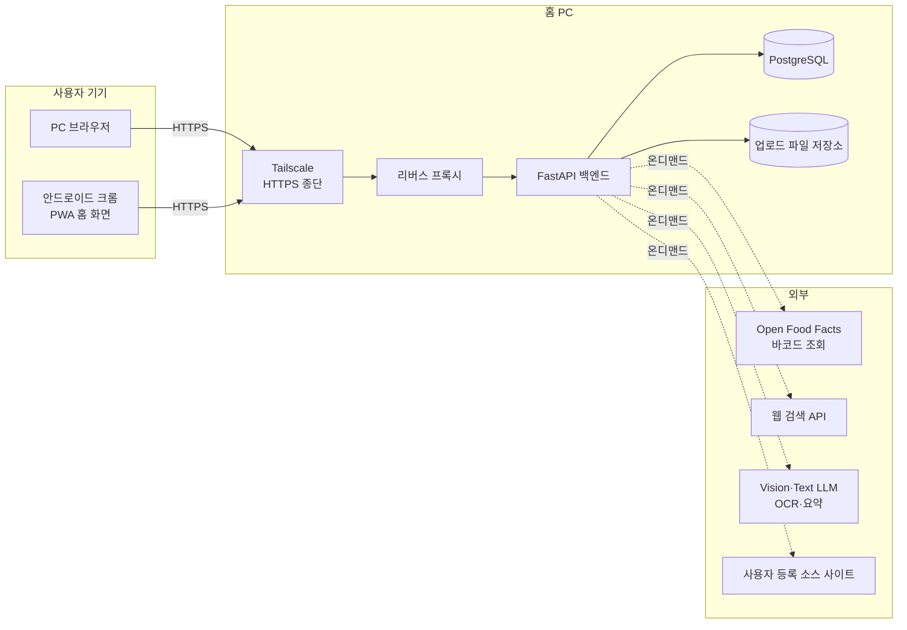
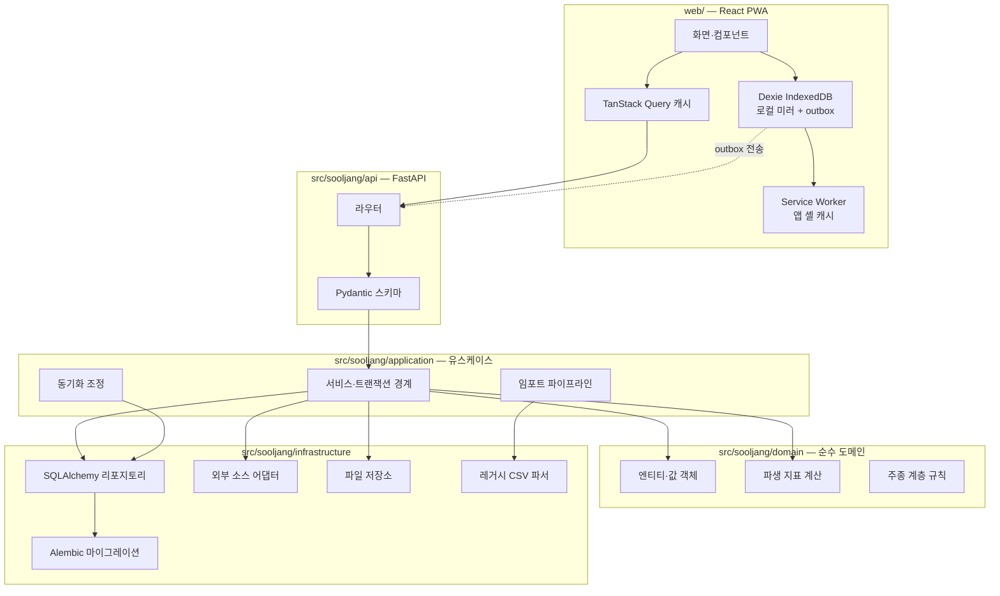
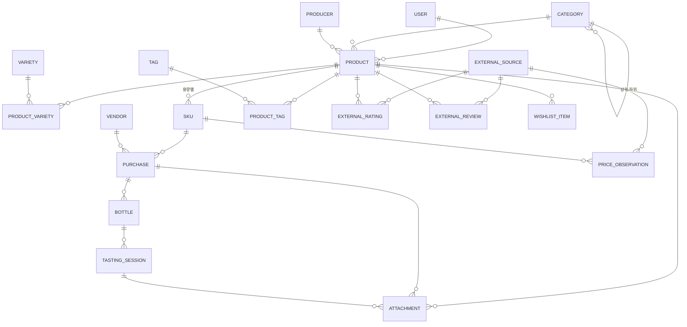
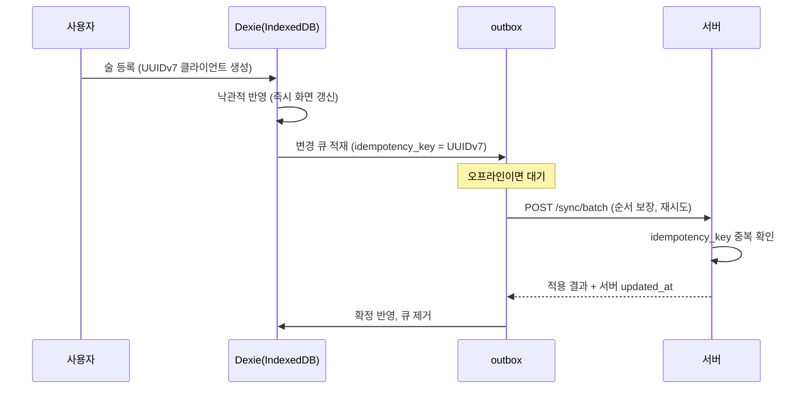
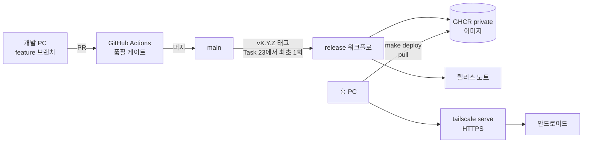

# 술장 아키텍처 설계

이 문서는 구현 전에 결정한 구조와 그 근거를 남긴다. 코드와 어긋나면 문서를 먼저 고친다.
레거시 데이터의 실측 근거는 [legacy-schema.md](legacy-schema.md), 작업 순서와 진행 현황은
[plan.md](plan.md)를 참조한다.

## 1. 시스템 개요

개인이 소유한 주류를 **제품 → 규격 → 구매 건 → 개별 병 → 시음 세션** 계층으로 기록하고,
파생 지표와 통계를 자동 계산하는 단일 사용자 중심 웹 애플리케이션이다. 향후 소수의 지인에게
공유할 수 있도록 처음부터 멀티테넌시를 준비한다.

### 1.1 시스템 컨텍스트



외부 호출은 모두 **사용자 조작에 의한 온디맨드**다. 백그라운드 대량 수집은 하지 않는다
(§9.4 근거). 오프라인 상태에서는 외부 호출 기능만 비활성화되고 기록·조회는 계속 동작한다.

### 1.2 컴포넌트 구조



의존 방향은 항상 안쪽(도메인)을 향한다. `domain/`은 SQLAlchemy·FastAPI·HTTP를 import하지
않는다. 파생 지표 계산이 DB 없이 단위 테스트되도록 하기 위한 제약이다.

## 2. 데이터 모델

### 2.1 ERD



### 2.2 공통 컬럼 규약

모든 업무 테이블에 다음을 둔다.

| 컬럼 | 타입 | 목적 |
|---|---|---|
| `id` | `UUID` (UUIDv7) | PK. 시간 정렬성이 있어 인덱스 지역성이 좋고, 오프라인 클라이언트가 서버 왕복 없이 생성할 수 있다 |
| `user_id` | `UUID` FK | 멀티테넌시. 단일 사용자 시기에도 반드시 채운다 |
| `created_at` | `timestamptz` | |
| `updated_at` | `timestamptz` | 동기화 LWW 판정 기준 |
| `deleted_at` | `timestamptz` NULL | soft delete. 삭제를 오프라인 클라이언트에 전파하기 위해 필수 |

조회는 기본적으로 `deleted_at IS NULL` 조건을 적용한다. 동기화 델타 조회만 예외다.

### 2.3 테이블 정의

#### `category` — 주종 (사용자가 관리하는 자기참조 계층)

주종 계층은 **고정 분류가 아니라 사용자 데이터**다. 최상위부터 말단까지 어느 깊이에서든
추가·이름 변경·이동·순서 변경·삭제·병합이 가능하다. 아래 시드는 기존 엑셀에서 도출한
**기본값일 뿐**이며, 사용자가 바꾸면 그 결과가 정답이 된다.

| 컬럼 | 타입 | 제약 |
|---|---|---|
| `parent_id` | `UUID` NULL | 자기참조. NULL이면 최상위 |
| `name` | `text` | `UNIQUE(user_id, parent_id, name) WHERE deleted_at IS NULL` — 같은 부모 아래 이름 중복 금지 |
| `slug` | `text` | 검색·URL용. 이름 변경 시 재생성하되 기존 slug 는 별칭으로 보존 |
| `sort_order` | `int` | 형제 간 표시 순서. 사용자가 지정 |
| `is_seeded` | `bool` | 기본 시드로 생성된 항목인지. UI 에서 "기본값으로 되돌리기"에 사용 |

**깊이 제한을 두지 않는다.** 사용자가 필요한 만큼 세분화할 수 있어야 한다. 대신 다음
불변식을 애플리케이션 계층에서 강제한다.

1. **순환 금지** — 어떤 카테고리도 자기 자신의 조상이 될 수 없다. 이동(`reparent`) 시
   대상이 자신의 후손인지 검사한다
2. **깊이 상한 8** — 순환 방지와 별개로 폭주하는 중첩을 막는 안전장치다. 실용적으로
   도달하지 않는 값이며, 재귀 CTE 성능과 UI 표현을 보호한다
3. **이동 시 후손 동반** — 부모를 바꾸면 서브트리 전체가 함께 이동한다

##### 삭제 정책

카테고리 삭제는 제품을 지우지 않는다. 개인 기록을 잃는 것이 가장 큰 손실이기 때문이다.

| 상황 | 동작 |
|---|---|
| 하위 카테고리가 있음 | 기본은 거부. `?strategy=promote_children` 으로 자식을 삭제 대상의 부모로 승격 후 삭제 |
| 소속 제품이 있음 | 기본은 거부. `?strategy=reassign&target_id=<id>` 로 제품을 다른 카테고리로 옮긴 뒤 삭제 |
| 둘 다 없음 | soft delete |

병합(`POST /categories/{id}:merge`)은 소속 제품과 하위 카테고리를 대상 카테고리로 옮기고
원본을 soft delete 한다. 중복 생성된 카테고리를 정리하는 경로다.

##### 기본 시드 (기존 엑셀에서 도출)

레거시 통계 블록의 롤업에서 도출했다([legacy-schema.md §4.4](legacy-schema.md)). 롤업 병수
합계가 1,078 로 시트 합계행과 일치해 이 구조가 실제 사용 중인 분류임을 확인했다.

```
맥주   (스타일은 variety 로 표현)
와인   ├ 레드와인 · 화이트와인 · 스파클링와인 · 로제와인 · 오렌지와인
       ├ 스위트와인   ├ 토카이와인 · 소테른/바르삭/루피악 와인 · 파시토와인
       │              └ 남아공 스위트와인 · 리브잘트와인 · 아이스와인 · 귀부와인
       └ 주정강화와인 └ 포트와인 · 셰리와인 · 마데이라와인 · 세투발와인
양주   ├ 위스키    └ 싱글몰트 · 블렌디드 · 버번 · 라이 · 블렌디드 몰트 · 그레인
       └ 기타 양주 └ 브랜디 · 럼 · 데낄라 · 메즈칼 · 진 · 보드카 · 리큐르 · 백주
전통주 └ 탁주 · 약주 · 증류주 · 리큐르 · 과실주
사케
미분류 (임포트가 사전에 없는 값을 넣는 자리. 사용자가 옮길 수 있다)
```

임포트는 사전에 없는 `종류` 값을 버리지 않고 `미분류` 아래에 그대로 만든다. 데이터를
조용히 잃는 것보다 사용자가 나중에 옮길 수 있게 보존하는 것이 낫다.

##### 조회

계층 조회는 재귀 CTE(`WITH RECURSIVE`)로 처리한다. "위스키" 필터가 하위 전부를 포함해야
하므로 조상-후손 판정을 매 쿼리에서 수행한다. 데이터 규모(수백~수천 행)에서 재귀 CTE로
충분하고, 병목이 확인되면 closure table 로 전환한다. `depth` 를 컬럼으로 저장하지 않는
이유는 이동이 자유로워 매 이동마다 서브트리 전체를 갱신해야 하고, 그 값이 어긋나면 조회가
조용히 틀리기 때문이다. 깊이는 조회 시 계산한다.

#### `product` — 제품

| 컬럼 | 타입 | 비고 |
|---|---|---|
| `name` | `text` | 표시명. 레거시 이름 첫 줄 |
| `name_en` | `text` NULL | 영문명 |
| `category_id` | `UUID` FK | |
| `producer_id` | `UUID` FK NULL | |
| `country`, `region` | `text` NULL | |
| `abv` | `numeric(5,2)` NULL | `CHECK (abv >= 0 AND abv <= 100)` |
| `vintage` | `int` NULL | `CHECK (vintage BETWEEN 1800 AND 2200)` |
| `age_years` | `numeric(4,1)` NULL | 숙성 연수 |
| `note` | `text` NULL | 제품 메모. 레거시 `느낀 점`·이름 2번째 줄 이관 |
| `personal_rating` | `numeric(3,1)` NULL | `CHECK (0 < r <= 6)` — 레거시가 6점 만점 |
| `search_text` | `text` | 생성 컬럼. `pg_trgm` GIN 인덱스 대상 |

`personal_rating`은 제품 수준 총평이다. 시음 세션별 평점과 별개로 두어 레거시 데이터를 손실 없이
받고, 세션이 쌓이면 세션 평균을 함께 보여준다.

중복 판정 키: `(user_id, normalized_name, vintage, abv)`. `normalized_name`은 공백·대소문자·
전각문자·구두점을 정규화한 값이다.

#### `sku` — 규격 (용량별 단위)

| 컬럼 | 타입 | 비고 |
|---|---|---|
| `product_id` | `UUID` FK | |
| `volume_ml` | `int` | `CHECK (volume_ml > 0)` |
| `barcode` | `text` NULL | `UNIQUE(user_id, barcode) WHERE barcode IS NOT NULL` |
| `barcode_type` | `enum` NULL | `ean13`/`upca`/`ean8`/`other` |
| `package_note` | `text` NULL | 선물세트 등 |

`UNIQUE(product_id, volume_ml)`. 같은 술의 700ml와 1L을 구분하고, 바코드 매칭·100ml당 가격
계산의 단위가 된다.

#### `vendor` — 구매처

| 컬럼 | 타입 | 비고 |
|---|---|---|
| `name` | `text` | `UNIQUE(user_id, name)` |
| `kind` | `enum` | `mart`/`online`/`duty_free`/`bottle_shop`/`bar`/`event`/`gift`/`other` |
| `url` | `text` NULL | |
| `note` | `text` NULL | |

레거시에서 82개가 추출된다. `카카오톡 선물하기`·`회사선물`·`시윤이의 선물`은 `gift`,
`신라 온라인 면세`는 `duty_free`, `2024 수원 메가쇼`류는 `event`로 매핑한다.

#### `purchase` — 구매 건

| 컬럼 | 타입 | 비고 |
|---|---|---|
| `sku_id` | `UUID` FK | |
| `vendor_id` | `UUID` FK NULL | |
| `purchased_on` | `date` NULL | 레거시에 없어 NULL 허용 |
| `quantity` | `int` | `CHECK (quantity > 0)` |
| `unit_list_price` | `numeric(14,2)` NULL | **병당** 정가 (원화) |
| `unit_paid_price` | `numeric(14,2)` NULL | **병당** 실지불가 (원화) |
| `currency` | `char(3)` | 기본 `KRW` |
| `fx_rate` | `numeric(14,6)` NULL | 구매 시점 환율 스냅샷 |
| `foreign_unit_price` | `numeric(14,2)` NULL | 외화 표시 병당 가격 |
| `discount_note` | `text` NULL | `1+1`, `수원페이 10%` 등 원문 |
| `import_note` | `text` NULL | 레거시 원문 보존 (분할 실패한 구매처 문자열 등) |

레거시는 총액을 저장했지만([legacy-schema.md §4.2](legacy-schema.md)) DB는 **병당 단가**를
저장한다. 총액은 `unit_price × quantity`로 언제든 복원되고, 구매 건을 쪼갤 때 단가가 보존되어야
하기 때문이다. 임포트 시 `총액 ÷ 병수`로 변환한다.

외화 구매는 `foreign_unit_price × fx_rate`를 `unit_paid_price`에 저장하고 원시값도 함께 남겨
사후 검증이 가능하게 한다. 환율은 **구매 시점 값으로 고정**한다. 현재 환율로 재평가하면 과거
지출액이 매일 바뀌어 통계가 재현되지 않는다.

#### `bottle` — 개별 병

| 컬럼 | 타입 | 비고 |
|---|---|---|
| `purchase_id` | `UUID` FK | |
| `status` | `enum` | `unopened`/`open`/`finished`/`gifted`/`sold` |
| `opened_on` | `date` NULL | |
| `finished_on` | `date` NULL | |
| `remaining_ml` | `int` NULL | NULL이면 미개봉(= SKU 전량) |
| `storage_location` | `text` NULL | |
| `label_no` | `int` | 구매 건 내 순번. `UNIQUE(purchase_id, label_no)` |

제약: `status='unopened'`면 `opened_on IS NULL`, `status='finished'`면 `remaining_ml = 0`,
`remaining_ml <= sku.volume_ml` (애플리케이션 계층 검증. 크로스 테이블이라 DB CHECK로 표현 불가).

구매 건 저장 시 `quantity`만큼 `bottle` 행을 자동 생성한다. 레거시 임포트는 `소비` 병수만큼
`finished`, `미개봉`만큼 `unopened`, `개봉`만큼 `open`으로 초기화한다.

#### `tasting_session` — 시음 세션

| 컬럼 | 타입 | 비고 |
|---|---|---|
| `bottle_id` | `UUID` FK | |
| `tasted_at` | `timestamptz` | |
| `pour_ml` | `int` NULL | 기록 시 `bottle.remaining_ml` 차감 |
| `rating` | `numeric(3,1)` NULL | `CHECK (0 < rating <= 6)`, 0.5 단위 |
| `nose`, `palate`, `finish` | `text` NULL | |
| `note` | `text` NULL | |
| `companions`, `place` | `text` NULL | |

#### `external_source` — 외부 소스 레지스트리

| 컬럼 | 타입 | 비고 |
|---|---|---|
| `name` | `text` | 표시명 |
| `code` | `text` | 레거시 태그 매핑용. `RB`/`U`/`BA`/`VIVINO` 등 |
| `base_url` | `text` | |
| `kinds` | `text[]` | `rating`/`price`/`review` 복수 가능 |
| `category_scope` | `UUID[]` NULL | 적용 주종. NULL이면 전체 |
| `strategy` | `enum` | `search`(검색+LLM 요약) / `adapter`(YAML 셀렉터) |
| `adapter_spec` | `jsonb` NULL | `strategy='adapter'`일 때 셀렉터 정의 |
| `rating_scale` | `numeric(4,1)` NULL | 5·100 등 |
| `ttl_hours` | `int` | 캐시 유효 기간 |
| `rate_limit_per_min` | `int` | |
| `enabled` | `bool` | |
| `priority` | `int` | 표시·조회 순서 |

사용자가 UI에서 자유롭게 등록·수정·비활성·삭제·재정렬한다. 레거시 태그(`RB`/`U`/`BA`)는
초기 시드로 넣어 임포트가 소스별 평점을 정확히 연결할 수 있게 한다.

#### `external_rating` / `external_review` / `price_observation`

세 테이블 공통으로 `source_id`, `fetched_at`, `source_url`(**NOT NULL**), `raw_excerpt`,
`summary`를 갖는다. 출처 URL 없는 데이터는 저장을 거부한다. 사후에 사람이 원본을 확인할 수
없는 수치는 신뢰할 수 없기 때문이다.

- `external_rating`: `product_id`, `value`, `scale`, `review_count`
  단, 레거시 임포트는 URL을 모르므로 `source_url`에 `legacy://excel` 센티넬을 넣고
  `is_legacy=true`로 표시한다. 실측 조회로 대체되면 갱신한다
- `external_review`: `product_id`, `author`, `rating`, `excerpt`, `published_at`
- `price_observation`: `sku_id`, `observed_at`, `price`, `currency`, `in_stock`
  시계열이므로 `(sku_id, source_id, observed_at)` 인덱스를 둔다

#### 그 외

- `producer`, `variety`, `product_variety`, `tag`, `product_tag`: 단순 참조·연결 테이블
- `attachment`: `product_id`/`bottle_id`/`tasting_session_id` 중 정확히 하나만 채우는 3개
  nullable FK 로 소유자를 표현한다(CHECK 제약으로 강제) — 다형 `owner_type`/`owner_id`
  컬럼 하나 대신 이 방식을 쓴 이유는 FK 제약을 그대로 걸 수 있어서다(다형 참조는 DB 가
  참조 무결성을 검사할 수 없다). `kind`(`label`/`tasting`/`bottle`/`other`), `content_type`,
  `byte_size`, `sha256`, `storage_path`. 업로드는 `POST /attachments`(Task 17) 가 이미지만
  받는다
- `wishlist_item`: 구매 후보. `target_price` 도달 알림(Task 19)의 대상
- `saved_view`: 커스텀 피벗 정의(Task 20). `name`, `definition jsonb`(검증하지 않는다 —
  불러와 `POST /stats/pivot` 에 다시 보낼 때 그 스키마가 검증한다). `EntityMixin` 을
  쓰지만 **동기화 대상이 아니다** — 통계 v2 전체가 온라인 전용이라(피벗 재계산 자체가
  서버 DB 조회를 전제한다) 저장된 정의만 오프라인에 미러링해 봐야 의미가 없다
- `sync_cursor`, `outbox_receipt`, `conflict_log`: 동기화 상태(§5). `conflict_log` 는
  LWW 충돌에서 진 로컬 변경을 보관한다(§5.4) — 다른 9개 동기화 대상 테이블과 같은
  공통 컬럼(`EntityMixin`)을 써서 풀 대상에 포함시킨다. 한 기기의 충돌이 다른 기기의
  로컬 미러에도 같은 배관으로 전파된다
- `llm_setting`: LLM 제공자·모델·API 키(Task 17). `EntityMixin` 을 쓰지만 **동기화 대상이
  아니다** — `SYNC_ENTITIES` 레지스트리에 의도적으로 넣지 않는다. API 키가 클라이언트
  IndexedDB 로 미러링되면 안 된다. 키는 평문이 아니라 Fernet 암호문(`api_key_ciphertext`)
  으로 저장하고, 화면에 마스킹 값을 보여주기 위한 마지막 4자만 별도 평문 컬럼
  (`api_key_hint`)으로 둔다
- `external_source`: 사용자가 등록한 조회 대상 사이트 하나(Task 18, §7). `name`,
  `base_url`, `adapter_spec jsonb`(§7.2 스키마), `category_id`(FK, `NULL` 이면 전역 소스),
  `priority`, `is_active`, `rate_limit_per_min`, `ttl_hours`. `llm_setting` 과 같은 이유로
  동기화 대상이 아니다 — 지금은 `adapter` 전략만 저장한다(`search` 전략은 별도 PR)
- `external_lookup_cache`: 소스·제품별 최근 조회 결과(§7.1 `FetchedSnapshot`). `source_id`,
  `product_id`, `snapshot jsonb`(`source_url`/`fields`/`raw_excerpt`), `degraded`,
  `warning`, `fetched_at`. `ttl_hours` 내 재조회 요청은 이 값을 그대로 돌려준다(§7.3).
  `source_url` 없는 결과는 저장하지 않는다(§7.1 절대 규칙) — 동기화 대상이 아니다
- `user`, `session`: 인증(§6)

### 2.4 인덱스

| 대상 | 인덱스 |
|---|---|
| 한글 부분 문자열 검색 | `GIN (search_text gin_trgm_ops)` on `product` |
| 목록 기본 정렬·필터 | `(user_id, deleted_at, category_id)` on `product` |
| 동기화 델타 | `(user_id, updated_at)` on 모든 동기화 대상 테이블 |
| 바코드 조회 | `UNIQUE (user_id, barcode) WHERE barcode IS NOT NULL` on `sku` |
| 집계 | `(sku_id)` on `purchase`, `(purchase_id, status)` on `bottle` |
| 시세 시계열 | `(sku_id, source_id, observed_at DESC)` on `price_observation` |

## 3. 파생 지표 계산 규칙

모두 계산 필드다. 저장하지 않는다. 저장하면 엑셀과 같은 불일치 문제가 재발한다.

기호: 제품 `p`, 규격 `s`, 구매 건 집합 `P`, 병 집합 `B`.

| 지표 | 정의 |
|---|---|
| 구매 병수 | `Σ_{i∈P} quantity_i` |
| 소비 병수 | `|{b∈B : status(b) = finished}|` |
| 증여·판매 병수 | `|{b∈B : status(b) ∈ {gifted, sold}}|` |
| 미개봉 병수 | `|{b∈B : status(b) = unopened}|` |
| 개봉 병수 | `|{b∈B : status(b) = open}|` |
| 재고 병수 | `미개봉 + 개봉` |
| 평단가 (`avg_list_price`) | `Σ(unit_list_price_i × quantity_i) / Σ quantity_i` |
| 실평단가 (`avg_paid_price`) | `Σ(unit_paid_price_i × quantity_i) / Σ quantity_i` |
| 100ml당 가격 | `avg_list_price / (volume_ml / 100)` — **정가 기준** |
| 100ml당 실가격 | `avg_paid_price / (volume_ml / 100)` — 신규 지표 |
| 할인율 | `1 − (Σ unit_paid × qty) / (Σ unit_list × qty)` |
| 재고 자산가치(원가) | `Σ_{b∈재고} avg_paid_price(sku(b))` |
| 재고 자산가치(시세) | `Σ_{b∈재고} latest_price_observation(sku(b))`, 관측 없으면 원가로 대체 |
| 개봉 후 소진 기간 | `finished_on − opened_on` (일) |
| 소비 속도 | 기간 내 `finished` 병 수 / 기간(월) |
| 가성비 | `rating / price_per_100ml` (높을수록 좋음) |

100ml당 가격이 **정가 기준**인 것은 레거시 통계와 일치시키기 위한 결정이다
([legacy-schema.md §4.2](legacy-schema.md), 391건 일치·불일치 0으로 검증). 실구매 기준 지표는
`price_per_100ml_paid`로 별도 제공한다.

여러 용량이 섞인 제품의 제품 수준 100ml당 가격은 **가중 평균**으로 계산한다:
`Σ(unit_list × qty) / Σ(volume_ml × qty / 100)`.

가격이 NULL인 구매 건(선물)은 금액 집계에서 제외하되 병수 집계에는 포함한다. 레거시에 정가
결측 33건, 실구매가 결측 34건이 있어 이 구분이 필요하다.

계산은 `domain/metrics.py`의 순수 함수로 구현하고, 목록·통계 조회 성능이 필요한 경로는 동일
공식을 SQL 뷰로 이중 구현한다. **두 구현이 같은 결과를 내는지 검증하는 테스트를 둔다.**

## 4. API 설계

### 4.1 규약

- 베이스 경로 `/api/v1`
- 리소스 중심 URL, 동사는 HTTP 메서드로 표현. 상태 전이 등 예외는 `POST /bottles/{id}:open` 형태
- 요청·응답 본문은 `snake_case` JSON
- 동기화 배치(`POST /sync/batch`)의 각 작업은 본문의 `idempotency_key` 필드로 재전송
  중복을 막는다(§5.2). 배치 하나에 작업이 여러 개 들어가므로 요청당 값 하나뿐인 HTTP
  헤더로는 표현할 수 없다 — 애초에 outbox 는 일반 CRUD 엔드포인트를 직접 부르지 않고
  전부 `/sync/batch` 로 모이므로, 다른 엔드포인트에 범용 `Idempotency-Key` 헤더를 따로
  둘 이유가 없다(Task 15, 코드와 어긋난 이전 문구를 정정)
- 에러는 RFC 9457 Problem Details

```json
{ "type": "https://sooljang.local/errors/validation",
  "title": "요청 값이 올바르지 않습니다",
  "status": 422,
  "detail": "remaining_ml 은 규격 용량을 초과할 수 없습니다",
  "errors": [{ "field": "remaining_ml", "code": "exceeds_volume" }] }
```

- 목록은 **커서 페이지네이션**. `?limit=50&cursor=<opaque>` → `{ "items": [...],
  "next_cursor": "..." }`. offset 방식은 데이터가 바뀌면 중복·누락이 생겨 무한 스크롤에
  부적합하다
- 정렬은 `?sort=price_per_100ml&order=asc`. 정렬 키에는 항상 `id`를 tie-breaker로 추가해
  커서 안정성을 보장한다

### 4.2 엔드포인트

| 메서드 · 경로 | 설명 | Task |
|---|---|---|
| `GET /health` | 헬스체크 (인증 불필요) | 5 |
| `POST /auth/login`, `POST /auth/logout`, `GET /auth/me` | 세션 인증 | 12 |
| `GET·POST /categories`, `PATCH·DELETE /categories/{id}` | 주종 계층 CRUD | 9 |
| `POST /categories/{id}:reparent` | 부모 변경 (서브트리 동반 이동, 순환 검사) | 9 |
| `POST /categories:reorder` | 형제 간 표시 순서 일괄 변경 | 9 |
| `POST /categories/{id}:merge` | 다른 카테고리로 병합 (제품·하위 이관 후 원본 soft delete) | 9 |
| `POST /categories:reset-seed` | 기본 시드 복원 (사용자 생성 항목은 유지) | 9 |
| `GET·POST /products`, `GET·PATCH·DELETE /products/{id}` | 제품 | 9 |
| `GET /products/{id}/metrics` | 파생 지표 | 9 |
| `GET·POST /products/{id}/skus`, `PATCH·DELETE /skus/{id}` | 규격 | 9 |
| `GET·POST /purchases`, `GET·PATCH·DELETE /purchases/{id}` | 구매 건 | 9 |
| `POST /purchases/{id}:split` | 구매 건 분할 (레거시 합성 lot 해체) | 9 |
| `GET /bottles`, `PATCH /bottles/{id}` | 개별 병 | 13 |
| `POST /bottles/{id}:open`, `:finish`, `:gift`, `:sell` | 상태 전이 | 13 |
| `GET·POST /bottles/{id}/tastings`, `PATCH·DELETE /tastings/{id}` | 시음 세션 | 13 |
| `GET·POST /vendors`, `PATCH·DELETE /vendors/{id}` | 구매처 | 9 |
| `POST /attachments` | 파일 업로드 | 10 |
| `POST /imports/legacy:analyze` | 업로드 파일 블록 분석·dry-run | 11 |
| `POST /imports/legacy:commit` | 실제 적재 | 11 |
| `GET /imports/{id}/report` | 실패 행·경고 리포트 | 11 |
| `GET /stats/rankings`, `GET /stats/by-category`, `GET /stats/summary` | 통계 v1 | 14 |
| `GET /stats/timeseries`, `POST /stats/pivot` | 통계 v2 | 20 |
| `GET·POST /saved-views`, `PATCH·DELETE /saved-views/{id}` | 커스텀 뷰 | 20 |
| `GET /sync?since=<cursor>` | 델타 풀 | 15 |
| `POST /sync/batch` | outbox 일괄 전송 | 15 |
| `GET /barcodes/{code}` | 바코드 조회 (로컬 → 외부 → 검색) | 16 |
| `GET·PUT·DELETE /llm-settings` | LLM 제공자·API 키(암호화 저장)·모델 설정 | 17 |
| `POST /ocr/label` | 라벨 OCR 구조화 추출. 아무것도 저장하지 않는다 | 17 |
| `GET·POST /external-sources`, `PATCH·DELETE /external-sources/{id}` | 소스 레지스트리 | 18 |
| `POST /external-sources:discover` | 추천 소스 자동 탐색 | 19 |
| `POST /products/{id}/external:refresh` | 외부 정보 온디맨드 조회 | 18 |
| `GET /products/{id}/external` | 저장된 스냅샷 조회 | 18 |
| `GET /skus/{id}/prices` | 시세 이력 | 19 |

### 4.3 필터 규약

`GET /products` 필터: `category_id`(하위 포함), `country`, `abv_min`/`abv_max`,
`price_per_100ml_min`/`_max`, `in_stock`(bool), `rating_min`, `vendor_id`, `tag`,
`q`(한글 부분 문자열), `vintage_min`/`_max`. 모두 AND로 결합한다.

## 5. 오프라인 동기화 프로토콜

### 5.1 원칙

단일 사용자 전제이므로 복잡한 CRDT가 필요 없다. **레코드 단위 last-write-wins**로 충분하다.
다만 충돌이 발생한 사실은 로그로 남겨 사용자가 확인할 수 있게 한다.

### 5.2 쓰기 경로 (outbox)



- PK를 클라이언트가 생성하므로 오프라인에서 만든 레코드를 서버 왕복 없이 즉시 참조할 수 있다
  (구매 건 → 병 → 시음 세션 연쇄 생성이 오프라인에서 가능해진다)
- `idempotency_key`는 `outbox_receipt`에 30일 보관한다. 재전송 시 같은 키면 이전 결과를 반환한다
- 전송은 **순서 보장**이 필요하다. 부모 레코드보다 자식이 먼저 도착하면 FK가 깨진다.
  outbox는 단일 직렬 큐로 처리하고, 실패 시 뒤 항목을 막는다(head-of-line blocking을 허용)

### 5.3 읽기 경로 (델타 풀)

`GET /sync?since=<cursor>` → `{ "changes": { "product": [...], "purchase": [...] },
"next_cursor": "...", "has_more": true }`

- 커서는 `(updated_at, id)` 복합값을 불투명 문자열로 인코딩한다. `updated_at`만 쓰면 동일
  타임스탬프 레코드에서 누락이 생긴다
- `deleted_at`이 채워진 레코드도 응답에 포함한다. 그래야 삭제가 전파된다
- 클라이언트는 `updated_at`을 비교해 로컬이 더 최신이면 유지, 아니면 덮어쓴다

### 5.4 충돌 처리

같은 레코드가 양쪽에서 수정된 경우 서버 `updated_at`이 더 최신이면 서버 값을 채택하고, 로컬
변경은 `conflict_log`에 원본과 함께 보관해 UI에 알린다. 사용자가 잃어버린 입력을 복구할 수
있어야 한다.

## 6. 인증과 권한

- **모든 API는 인증을 요구한다.** `GET /health`만 예외
- 비밀번호는 Argon2id로 해시한다
- 세션은 서버 저장 세션 ID를 `httpOnly` + `Secure` + `SameSite=Lax` 쿠키로 전달한다.
  JWT를 쓰지 않는 이유는 즉시 무효화(로그아웃·기기 분실)가 필요하고, 브라우저 저장소에 토큰을
  두면 XSS 노출면이 커지기 때문이다
- 쓰기 요청은 double-submit cookie 방식 CSRF 토큰을 검증한다
- 로그인 시도는 IP·계정 단위로 레이트 리밋한다
- 인증·권한 변경, 임포트, 삭제는 감사 로그에 남긴다
- 모든 쿼리는 `user_id`로 스코프한다. 리포지토리 계층에서 강제하고, 누락을 잡는 테스트를 둔다
- 공유(Task 20)는 읽기 전용 `share_link`(만료·취소 가능)와 `role`(`owner`/`viewer`)로 구현한다

Tailscale로 접근이 제한되어 있어도 앱 레벨 인증을 생략하지 않는다. 클라우드 이전이나 지인 공유
시점에 그대로 노출 위험이 되고, 기기 하나가 탈취되면 방어선이 사라진다.

### 6.1 구현 (Task 12)

| 항목 | 구현 |
|---|---|
| 테이블 | `app_user`, `app_session` (`0003_auth`) |
| 비밀번호 | Argon2id, 최소 10자. 파라미터가 올라가면 로그인 시점에 조용히 재해시 |
| 세션 토큰 | 32바이트 무작위. DB에는 **SHA-256 해시만** 저장 |
| 세션 수명 | 30일. `revoked_at`으로 즉시 무효화 |
| 쿠키 | `sooljang_session` (`httpOnly`), `sooljang_csrf` (JS 읽기 가능) |
| `Secure` | HTTPS 접속일 때만. `X-Forwarded-Proto`도 본다 |
| CSRF | 쓰기 메서드(`POST`/`PUT`/`PATCH`/`DELETE`)만 검사. 상수 시간 비교 |
| 레이트 리밋 | 계정·IP 각각 5분 8회. 인메모리 |
| 최초 계정 | `POST /auth/setup`. **사용자가 0명일 때만** 허용 |
| 비밀번호 변경 | 다른 모든 세션 폐기, 현재 세션만 유지 |

인증은 **라우터 단위**로 적용한다(`api/app.py`). 엔드포인트마다 개별로 붙이면 새 라우터를
추가할 때 빠뜨려 조용히 공개 엔드포인트가 된다. `/health`와 `/auth`만 예외다.

`api/deps.py`의 `current_user_id`가 세션 쿠키를 해석한다. Task 9에서 이 자리를 미리 둔
덕분에 이 함수만 바꿔 전 라우터에 인증이 적용됐다.

## 7. 외부 데이터 어댑터

### 7.1 인터페이스

```python
class SourceAdapter(Protocol):
    async def search(self, query: SearchQuery) -> list[Candidate]: ...
    async def fetch(self, url: str) -> FetchedSnapshot: ...
```

`FetchedSnapshot`은 `ratings`, `reviews`, `prices`, `source_url`, `raw_excerpt`,
`fetched_at`을 담는다. `source_url`이 없으면 어댑터가 예외를 던진다.

**매칭 정보(Task 34 PR1)**: 조회 결과에는 값뿐 아니라 "무엇에 어느 정도 확신으로
매칭됐는지"가 함께 담긴다 — `matched_name`, `match_score`, `needs_confirmation`,
`pinned`, `candidates`(상위 5개). 이름 유사도는 100%가 될 수 없으므로 **결과를 정답
하나로 제시하지 않는다.** 점수는 세 구간으로 나뉜다.

| 구간 | 조건 | 동작 |
|---|---|---|
| 자동 채택 | `score ≥ 0.85` | 값을 바로 보여준다 |
| 확인 필요 | `0.5 ≤ score < 0.85` | 값은 보여주되 후보를 함께 펼쳐 사용자 확인을 받는다 |
| 후보 없음 | `score < 0.5` | 값 없음. 후보만 노출해 사용자가 직접 고르게 한다 |

### 7.2 두 가지 전략

| 전략 | 구현 | 용도 |
|---|---|---|
| `search` | 웹 검색 API로 후보를 찾고 LLM으로 구조화 요약. 출처 링크를 함께 저장 | 모든 주종 기본. 사이트별 구현 없이 즉시 동작 |
| `adapter` | `adapter_spec` JSON/YAML의 셀렉터로 페이지를 파싱 | 정확도가 중요한 사이트(국내 가격 비교 등) |

`adapter_spec` 스키마(HTML 모드, 기본값):

```yaml
version: 1
search:
  url_template: "https://example.com/search?q={query}"
  item: ".product-card"
  fields:
    name: { selector: ".title", attr: text }
    url:  { selector: "a", attr: href, absolute: true }
detail:
  fields:
    price:  { selector: ".price", attr: text, transform: [strip_currency, to_number] }
    rating: { selector: ".rating", attr: text, transform: [to_number] }
    scale:  { const: 5 }
```

**JSON 모드**(`format: json`, Task 24 후속): 최근 국내 쇼핑몰은 Next.js 등으로 만들어져
검색 결과 페이지의 HTML을 그대로 받으면 상품 정보가 비어 있고, 대신 브라우저가 호출하는
별도 공개 JSON API가 있는 경우가 흔하다(데일리샷에서 실제로 겪음). 이 모드는 `selector`
대신 점 구분 JSON 경로 `path`를 쓴다. 검색 응답 자체에 상세 정보가 이미 다 있으면
`result_fields`로 상세 페이지를 다시 조회하지 않고 검색 응답에서 바로 최종 필드를 뽑는다.
상세 페이지 링크가 `href`로 바로 오지 않고 다른 필드로 조립해야 하면(`id`→URL 등)
`url_template`을 쓴다 — 아이템의 최상위 필드를 그대로 치환한다:

```yaml
version: 1
format: json
search:
  url_template: "https://api.example.com/items/search/?q={query}"
  item: "results"                                    # 리스트를 가리키는 JSON 경로
  fields:
    name: { path: "name" }
    url:  { url_template: "https://example.com/item/{id}" }  # item["id"] 를 채운다
  result_fields:                                       # 있으면 상세 페이지를 또 조회하지 않는다
    price:  { path: "price" }
    rating: { path: "review_rate" }
    scale:  { const: 5 }
```

셀렉터(또는 JSON 경로)가 깨지면 예외 대신 **부분 결과 + 경고**를 반환하고 소스를
`degraded`로 표시해 사용자에게 알린다. 사이트 구조 변경은 정상적으로 발생하는 일이므로
실패가 앱 전체를 막아서는 안 된다.

**표준 필드(Task 34 PR3)**: 소스마다 `가격`·`price`·`sale_price` 처럼 제각각인 필드명을
쓰면 비교·최저가 계산이 불가능하다. `detail.fields`/`search.result_fields` 가 아래 키로
값을 내보내면 `infrastructure/external/fields.py::split_fields` 가 이를 추려 타입까지
맞춘다. 표준 키가 아닌 값은 `extra`로 손실 없이 보존된다 — 소스가 아직 표준 키로 안
바뀌어도 값 자체는 그대로 보인다.

| 키 | 타입 | 비고 |
|---|---|---|
| `price_krw` | int | 실제 판매가 |
| `list_price_krw` | int \| null | 정가 |
| `currency` | str | 기본 `"KRW"` |
| `volume_ml` | int \| null | 이 가격이 어느 용량의 가격인지 |
| `rating` | float \| null | 원 척도 그대로 |
| `rating_scale` | float \| null | 5 / 100 등 |
| `review_count` | int \| null | |
| `in_stock` | bool \| null | |

파생값(`rating_normalized` = `rating / rating_scale × 5`, `price_per_100ml` = `price_krw /
volume_ml × 100`)은 **저장하지 않는다**(절대 규칙 6) — `NormalizedFields` 의 프로퍼티로
응답을 조립할 때마다 다시 계산된다. 이 분류는 `adapter.py` 가 아니라
`application/external_sources.py::lookup_product` 가 캐시 적중·신규 조회 양쪽 공통으로
호출한다 — `AdapterResult` 생성 지점이 여러 곳이라 그중 하나에 두면 캐시 적중 경로를
못 덮는다. 캐시 스냅샷에는 `"version": 2` 를 넣고, 버전이 낮은(표준 키 도입 이전) 행은
TTL 과 무관하게 stale 로 취급해 다음 조회에서 자연스럽게 새 모양으로 교체한다.

**`adapter_spec` v2**(Task 34 PR5): 실제 사이트를 붙이려면 `v1` 스펙으로는 부족하다.
`version` 키가 없거나 `1`이면 새 키가 없는 것으로 보고 기존 동작(`GET`, 헤더 없음) 그대로
동작한다 — 하위 호환이 깨지지 않는다.

```yaml
search:
  method: POST                  # 기본 GET. POST 로 검색하는 국내 몰용
  body: { keyword: "{query}" }  # method: POST 일 때만 쓴다. "{query}" 를 재귀 치환
  headers: { Accept: "application/json" }  # 정적 헤더
credentials:                    # 공식 API 키. 값은 스펙에 두지 않는다(아래 참조)
  - name: client_id
    inject: { type: header, key: "X-Naver-Client-Id" }
  - name: client_secret
    inject: { type: header, key: "X-Naver-Client-Secret" }
detail:
  fields:
    title: { path: "title", transform: [strip_tags] }  # `<b>` 강조 태그 제거(네이버 쇼핑 등)
```

**자격 증명**: 값 자체는 `adapter_spec` 에 두지 않고 `external_source_credential` 에
Fernet 으로 암호화해 저장한다(`LlmSetting` 과 같은 패턴, `infrastructure/security/
secrets.py`) — 평문 저장 금지, 마지막 4자만 힌트로 노출, 요청 직전에만 복호화한다.
**헤더 주입만 지원한다**(쿼리 파라미터 주입은 없음) — 값이 URL 에 들어가면 접근 로그·
리다이렉트 Location 등으로 새기 쉽다.

### 7.3 준수 규칙

- 요청 전 `robots.txt`를 확인하고 캐시한다 — **실제 요청 대상 호스트**에서 받는다
  (Task 34 PR5, D187). 검색 호스트와 상세 링크 호스트가 다른 소스(데일리샷의
  `api.dailyshot.co` vs `dailyshot.co`)에서, 소스의 `base_url` 호스트 것만 받으면 실제로
  요청이 나가는 다른 호스트의 규약을 확인하지 못한다 — robots.txt 는 호스트별 규약이다
- 소스별 `rate_limit_per_min`을 적용하고, 조회는 사용자 조작 시점에만 발생시킨다
- `ttl_hours` 내 재조회는 캐시를 반환한다
- User-Agent에 프로젝트 식별자와 연락 수단을 넣는다
- 대량 백그라운드 크롤링은 하지 않는다. 시세 추적(Task 19)도 관심 등록 품목에 한해 저빈도로 수행한다

**구현 결정(Task 18)**: robots.txt 파서 캐시와 rate limit 카운터는 DB 가 아니라 프로세스
메모리에 둔다. §8.1 토폴로지가 단일 프로세스 배포라 재시작 사이에 카운트가 리셋되는 정도는
안전 마진 안이다 — `llm_setting`(§9.14)의 "단일 활성 행을 애플리케이션 계층에서 강제" 판단과
같은 종류의 단순화다. 재조회 자체를 피하기 위한 TTL 캐시(`external_lookup_cache`)만 DB 에 둔다.

### 7.3.1 이름 매칭 규칙 (Task 34 PR2)

매칭 판정은 `infrastructure/external/matching.py`(네트워크 의존성 없는 순수 모듈)가 맡는다.
어댑터는 네트워크만 담당하고, 판정 규칙은 표 기반 테스트로 따로 검증한다.

**정규화** — 프로모션 블록(`[단독]`·`(1+1)`)을 걷어내고, 용량(`700ml`·`0.7L`·`70cl` →
700), 숙성 연수(`10년`·`10y`·`aged 10`), 도수(`46.3%`·`46.3도`), 빈티지(단독 4자리)를
속성으로 뽑아낸다. **속성으로 소비된 숫자는 토큰에서 빠진다** — 그래야 `700`이 빈티지로
잘못 읽히지 않는다. 표기 동의어(캐스크 스트렝스=CS, 쉐리=셰리, 버본=버번)는 공백으로 갈린
복합어까지 인접 토큰을 붙여 인식한다.

**점수** — `0.6 × 토큰 집합 Jaccard + 0.4 × 정규화 문자열 유사도`. 토큰 집합을 주 가중치로
둔 이유는 어순·수식어가 사이트마다 달라 문자열 비율이 그 흔들림에 약해서다.

**하드 제약** — 용량·숙성 연수·빈티지·도수가 **양쪽에 값이 다 있는데** 다르면 점수를 0으로
떨어뜨린다(도수는 0.6%p 허용 — 배치별 미세 차이). "양쪽에 다 있을 때만"이 핵심 안전장치다:
한쪽이 모르는 값으로 정답을 탈락시키면 안 된다.

이 규칙이 D148에 "순수 문자열 비교로는 원천적으로 구분할 수 없다"고 기록된 한계를 푼다.
"우드포드 리저브"↔"우드포드 리저브 라이"는 `라이` 토큰이 한쪽에만 있어 토큰 점수가 떨어지고,
"글렌고인"↔"글렌리벳"은 0.2까지 내려간다. 그래서 **접두사 게이트(`_plausible_candidate`)를
제거했다** — 그 게이트는 `[단독] 글렌알라키…`처럼 상품명 앞에 문구가 붙으면 오히려 정답을
탈락시키는 부작용이 있었다.

**질의 확장** — `name` → `name_en`(있고 다를 때) → 배치 표기를 뺀 축약형 순으로 최대 3개를
시도하되, **자동 채택 구간에 들면 즉시 멈춘다.** 질의 하나가 HTTP 요청 1회라 소스의
`rate_limit_per_min`을 그만큼 소비하기 때문이다. 고정된 소스는 질의를 확장하지 않는다.

### 7.4 매칭 고정 (Task 34 PR1)

`external_product_match`에 "이 제품 = 이 소스의 이 상품"을 저장한다. 한 번 고정하면 이후
조회는 유사도를 쓰지 않고 그 상품을 그대로 본다 — 그 제품에 한해 정확도가 100%가 된다.

**고정은 사용자의 명시적 조작으로만 만들어진다.** 점수가 높다고 자동으로 고정하지 않는다
(오답을 영구화할 위험). 고정하거나 해제하면 해당 `(소스, 제품)`의 `external_lookup_cache`
행을 즉시 버린다 — 남겨 두면 `ttl_hours` 동안 옛 상품 값을 계속 보여준다.

조회 경로는 소스 형태에 따라 갈린다. **고정은 "매칭 결정"을 고정하는 것이지 "요청 경로"를
고정하는 것이 아니다.**

| 소스 형태 | 동작 | 이유 |
|---|---|---|
| 상세 페이지가 따로 있는 소스 | 검색을 **건너뛰고** `external_url`을 직접 조회 | 왕복 1회 절감 + 검색 순위 변동에 영향받지 않음 |
| `search.result_fields` 를 쓰는 JSON 모드 | 검색은 하되 후보 선택을 **유사도 대신 `external_key`/URL 일치**로 | 이 모드는 상세를 조회하지 않는다 — 값이 검색 응답 안에만 있어 검색을 건너뛸 수 없다 |

두 번째 경로에서 고정된 키가 검색 결과에 더 이상 없으면(단종·개편) `degraded=True`로
알리고 후보를 함께 돌려줘 재고정을 유도한다. **조용히 유사도 매칭으로 되돌아가지 않는다**
— 그러면 고정의 의미가 사라진다.

고정 URL은 **저장 시점과 조회 시점 양쪽에서** 소스의 `base_url`과 같은 호스트인지 확인한다
(SSRF 방어). 저장 후에 `base_url`이 바뀔 수 있고, 클라이언트가 보낸 URL을 그대로 믿을
이유도 없다.

### 7.5 소스 헬스 체크 (Task 34 PR4)

`external_lookup_cache`는 **성공한 조회만** 담아(절대 규칙 7 + `ok` 가드) 실패 이력이
남는 곳이 없었다 — 소스가 언제부터 깨졌는지 알 방법이 없다는 뜻이다. `external_source_probe`
가 그 공백을 메운다: 소스 하나에 실제로 조회를 시도한 결과(`ok`·`degraded`·`warning`)를
성공·실패 가리지 않고 남기는 롤링 로그다(소스별 최근 20개). 절대 규칙 6(파생값 저장
금지)에 걸리지 않는다 — 도메인 파생 지표가 아니라 다른 어디서도 재계산할 수 없는 1차
사실(운영 로그)이다.

**기록 시점**: `lookup_product`의 **실제 시도**(fresh fetch)와 `POST
/external-sources/{id}/probe`(샘플 제품명으로 하는 테스트 조회) 에서만 기록한다. 캐시
적중·rate limit 스킵은 시도가 아니므로 기록하지 않는다 — 헬스는 "사이트가 지금 살아
있는가"를 보려는 것이지 캐시 재사용 빈도를 보려는 게 아니다. 테스트 조회는 실제 소유한
제품이 아니라서 `external_lookup_cache`에는 저장하지 않는다.

**헬스 판정**(최근 시도, 최신순):

| 상태 | 조건 |
|---|---|
| `failing` | 가장 최근 시도부터 연속 실패가 3회 이상 |
| `degraded` | `failing`이 아니고, 가장 최근 시도가 실패했거나 `degraded=True` |
| `healthy` | 가장 최근 시도가 성공이고 `degraded=False` |
| `unknown` | 시도 이력이 아예 없음(등록만 하고 조회한 적 없음) |

`GET /external-sources/health`가 소스별 상태·마지막 성공 시각·연속 실패 횟수·마지막
경고를 돌려준다. `SourcesPage`가 배지로 보여주고, "테스트 조회" 버튼으로 샘플 제품명을
넣어 즉시 확인할 수 있다.

### 7.6 소스 프리셋 카탈로그 (Task 34 PR5)

`adapter_spec` JSON 을 직접 쓰는 등록(Task 18)은 정확하지만 사용자가 셀렉터 문법을
알아야 한다. `infrastructure/external/presets.py::PRESET_CATALOG` 가 검증된 스펙을
이름 하나로 골라 등록할 수 있게 한다 — `GET /external-sources/presets` 로 목록을 받고,
`POST /external-sources`에 `preset_key`만 넘기면 `base_url`·`adapter_spec`을 프리셋
값으로 채운다.

**자동 갱신**: `external_source`에 `preset_key`·`preset_version`·`spec_overridden`을
둔다. `list_sources` 조회 시점에(부팅 훅이 아니다) `spec_overridden=False`인 프리셋
소스를 카탈로그의 최신 버전으로 맞춘다. 사용자가 `adapter_spec`을 직접 고치면
`spec_overridden=True`로 자동 전환되어, 앱 업데이트가 그 편집을 덮어쓰지 않는다.

### 7.7 애매 구간 LLM 재판정 (Task 34 PR6)

PR1 의 "확인 필요" 구간(점수 0.5~0.85)에서 사용자가 매번 후보를 직접 골라야 하는 빈도를
줄이는 **완전 opt-in** 보조 기능이다. `infrastructure/external/match_llm.py::rematch()`
가 `llm.py::extract_label`(Task 17 라벨 OCR)과 같은 `chat.completions.parse` 구조화
출력 패턴을 쓴다.

**ToS 위험이 없다** — D167 에서 폐기한 `search` 전략(검색엔진 결과 스크래핑)과 다르다.
이미 `adapter` 가 정당하게 받아온 검색 후보 이름 중에서 고르는 것뿐이고, 외부 사이트에
추가 요청이 나가지 않는다.

**호출 조건 전부**(하나라도 안 맞으면 호출 자체가 없다):

1. 최고 점수 후보가 확인 필요 구간(`needs_confirmation=True`)
2. `LlmSetting` 이 활성 상태
3. 사용자가 설정 화면에서 "LLM 매칭 보조"를 켬(`rematch_enabled`, **기본 꺼짐**)
4. 같은 `(소스, 제품)` 조합을 24시간 안에 호출하지 않았음
5. 이번 달 호출 수가 사용자 설정 월 상한(`rematch_monthly_cap`, 기본 200회) 미만

**입력을 최소화한다**: 내 제품의 이름·생산자·도수·용량·숙성·빈티지와 후보 **이름만**
LLM 에 보낸다 — 가격·URL·후기는 함수 시그니처 자체에 실을 자리가 없다.

**자동 고정하지 않는다.** `rematch()` 는 추천 인덱스만 돌려주고, `lookup_product` 가
그 추천을 `SourceLookupResult.llm_recommended_url` 에 담아 응답에 실을 뿐이다.
`SourcesPage`/`ExternalInfoCard` 는 그 URL 과 일치하는 후보에 "LLM 추천" 배지만 붙인다
— 고정은 다른 후보와 똑같이 사용자가 "이걸로 고정"을 눌러야 한다(PR1 의 "고정은 사용자
명시 조작으로만" 원칙).

**실패는 예외 없이 조용한 폴백이다.** `rematch()` 는 `extract_label` 과 같은 계약이다
— 인증 오류·타임아웃·거부·스키마 불일치·후보 범위를 벗어난 인덱스, 무엇이든 `None` 으로
통일한다. 호출부(`_maybe_llm_rematch`)는 이 반환값을 그대로 신뢰하고 추가로 감싸지
않는다 — `fetch_snapshot` 의 `ok` 를 호출부가 그대로 믿는 것과 같은 판단이다.

**비용 가드는 DB 롤링 로그로 강제한다.** `rate_limit_per_min` 처럼 인메모리 슬라이딩
윈도를 쓰지 않는 이유는, 재시작으로 카운트가 날아가면 월 상한이 무의미해지기 때문이다.
`external_llm_rematch_log`(`external_source_probe` 와 같은 패턴)에 호출을 **실제로
시도한 시점**을 성공·실패 가리지 않고 남긴다 — 잘못된 마스터 키로 계속 재시도하며 API
요청을 낭비하는 경로를 막으려면 실패도 기록해야 한다.

## 8. 배포

### 8.1 토폴로지



**GitHub Actions는 홈 PC로 직접 배포할 수 없다.** 인바운드 접속 경로가 없기 때문이다. 태그
푸시는 GHCR에 이미지를 게시하는 것까지만 하고, 홈 PC가 이를 **pull**한다. 클라우드로 이전하면
같은 워크플로에 배포 스텝만 추가한다.

### 8.2 HTTPS와 secure context

바코드 스캔(`BarcodeDetector`), 카메라(`getUserMedia`), 서비스워커는 모두 secure context를
요구한다. 평문 HTTP에서는 권한 프롬프트조차 표시되지 않는다.

Tailscale이 `<머신>.<tailnet>.ts.net`에 대해 Let's Encrypt 인증서를 발급하므로 홈 PC에서도
정식 HTTPS를 얻는다. 머신당 인증서가 1개이므로 **단일 리버스 프록시에서 경로로 분기**한다
(`/api` → 백엔드, 그 외 → 정적 프론트엔드).

### 8.3 백업과 클라우드 이전

- `pg_dump -Fc` 일일 스케줄, 세대 보관, 복원 스크립트와 절차를 문서화한다
- 복원 리허설을 정기적으로 수행한다. 검증하지 않은 백업은 백업이 아니다
- 업로드 파일은 DB 밖에 있으므로 함께 백업한다
- 클라우드 이전 절차: 관리형 Postgres 생성 → `pg_restore` → 이미지 배포 → DNS·인증서 전환.
  스키마와 이미지가 동일하므로 애플리케이션 변경은 환경 변수뿐이다

### 8.4 환경 제약과 해결 (2026-07-31 실측)

| 항목 | 상태 | 대응 |
|---|---|---|
| Docker | **설치됨** (29.7.0, Compose v5.3.1) | 로컬·운영 모두 Docker Compose 를 기본 경로로 쓴다 |
| PostgreSQL | 시스템 설치 없음 | Compose 의 `postgres:17-alpine` 사용. Docker 를 쓸 수 없는 상황을 위해 `scripts/dev-db.sh` 폴백을 유지한다 (§8.5) |
| passwordless sudo | 불가 | 시스템 패키지 설치를 요구하지 않는 경로만 사용한다 |
| GitHub 브랜치 보호 | **불가** — 무료 플랜 private 저장소는 ruleset API 가 HTTP 403 (`Upgrade to GitHub Pro`) | 로컬 `pre-push` 훅으로 `main` 직접 푸시와 버전 태그 푸시를 차단 + PR 규율 |
| 사용 가능 | git 2.53.0, gh 2.86.0, uv 0.11.29, node 24.18.0, npm 11.16.0, python 3.14.4 | |

> Docker 를 설치한 직후에는 `docker` 그룹 추가가 기존 셸 세션에 반영되지 않아
> `permission denied ... /var/run/docker.sock` 가 발생한다. 새 셸(또는 새 WSL 세션)을 열면
> 해결된다.

### 8.5 데이터베이스 실행 방식

| 환경 | 실행 방식 | PostgreSQL |
|---|---|---|
| 로컬 개발·테스트 (기본) | `docker compose up -d db` | `postgres:17-alpine` |
| 로컬 개발·테스트 (폴백) | `scripts/dev-db.sh` — micromamba 로 홈 디렉토리에 설치, root·Docker 불필요, 포트 54329 | 17.10 |
| CI | GitHub Actions `services: postgres` | `postgres:17-alpine` |
| 운영(홈 PC) | `docker-compose.yml` | `postgres:17-alpine` |

모든 환경이 PostgreSQL 17 이므로 쿼리 동작이 갈라지지 않는다. 폴백 인스턴스는 루프백에만
바인딩하고 `trust` 인증을 쓴다. 운영은 비밀번호 인증을 요구하며 `POSTGRES_PASSWORD` 가 비어
있으면 기동을 거부한다.

폴백 경로를 남겨 두는 이유는 두 가지다. Docker 데몬 접근이 막힌 상황(그룹 반영 전, 데몬 미기동)
에서도 개발을 계속할 수 있고, 클라우드 이전이나 다른 기기에서 작업할 때 진입 장벽을 낮춘다.

`pgserver` PyPI 패키지도 검토했으나 Python 3.14 휠이 없어(cp39~cp312 만 제공) 쓸 수 없다.

#### 한글 부분 문자열 검색 실측 검증

`pg_trgm` GIN 인덱스가 한글 `ILIKE '%...%'` 를 실제로 가속하는지 확인했다.

```
EXPLAIN 결과: Bitmap Heap Scan → Bitmap Index Scan on t_name_trgm
              Index Cond: (name ~~* '%캐스크 스트렝스%')
```

5,000행 표본에서 인덱스를 사용했고, 유사도 검색(`similarity()`)도 한글에서 동작한다
(`'카발란 솔리스트 쉐리'` → 0.414 로 정확한 레코드 검출). 형태소 분석기 없이 §4.3 의
`q` 필터를 구현할 수 있다.

## 9. 기술 결정 기록 (ADR)

### 9.1 PostgreSQL (SQLite 아님)

- **선택**: PostgreSQL
- **이유**: (1) 클라우드 이전이 예정되어 있고 관리형 Postgres가 표준 선택지다 (2) `pg_trgm`으로
  형태소 분석기 없이 한글 부분 문자열 검색이 된다 (3) `jsonb`로 어댑터 정의·피벗 정의를 저장한다
  (4) 재귀 CTE, 윈도우 함수로 통계를 DB에서 처리한다
- **비용**: 로컬 실행에 별도 프로세스가 필요하다(§8.4 제약)
- **대안**: SQLite는 배포가 단순하지만 이전 시 스키마·쿼리를 다시 검증해야 하고, 한글 부분 검색과
  통계 쿼리에서 제약이 크다

### 9.2 PWA (네이티브 앱 아님)

- **선택**: 반응형 웹 + PWA
- **이유**: PC와 안드로이드를 하나의 코드베이스로 커버한다. 바코드·카메라·오프라인 저장·홈 화면
  추가·푸시가 모두 웹 API로 가능하다. 스토어 배포·서명 절차가 없다
- **비용**: secure context 필수(§8.2), iOS 지원 시 제약이 있다(현재 요구사항 아님)

### 9.3 4계층 데이터 모델

- **선택**: 제품 → 규격 → 구매 건 → 개별 병 (+ 시음 세션)
- **이유**: 엑셀 한계의 근본 원인이 제품과 구매의 혼합이다. 같은 술을 다른 시점·구매처·가격에
  산 이력을 보존하려면 구매 건이 독립 엔티티여야 한다. 규격(용량)을 분리해야 바코드 매칭과
  100ml당 가격이 정확해진다
- **비용**: 입력 단계가 늘어난다 → UI에서 제품·규격·구매를 한 폼에서 만들 수 있게 해 완화한다

### 9.4 온디맨드 검색 요약 (대량 스크래핑 아님)

- **선택**: `search` 전략 기본 + 사용자가 지정한 사이트만 `adapter`
- **이유**: 조사 결과 주요 소스에 사용 가능한 공식 API가 없다. Whiskybase는 공개 API가 없고,
  Vivino는 개발자 포털을 폐지했으며, Untappd는 상업 계약을 요구하고, Wine-Searcher는 유료
  파트너 전용이다. 국내 가격 사이트도 API가 없다. 개인이 필요할 때 조회하고 출처를 남기는 방식이
  약관 리스크가 가장 낮고, 사이트 구조 변경에도 덜 취약하다
- **비용**: 검색·LLM 호출 비용, 요약 정확도 한계 → 원문 발췌와 출처 URL을 항상 함께 저장해
  사용자가 검증할 수 있게 한다

### 9.5 파생값 비저장

- **선택**: 평단가·100ml당 가격·재고 병수 등을 저장하지 않고 매번 계산
- **이유**: 엑셀에서 파생값을 수동 관리하다 불일치가 발생한 것이 이 프로젝트의 출발점이다
- **비용**: 집계 쿼리 비용 → SQL 뷰와 인덱스로 처리하고, 도메인 순수 함수와 결과가 일치하는지
  테스트로 보장한다

### 9.6 UUIDv7 PK

- **선택**: UUIDv7
- **이유**: 오프라인 클라이언트가 PK를 생성해야 한다. 시간 정렬성이 있어 B-tree 지역성이
  UUIDv4보다 낫고, 동기화 커서의 tie-breaker로도 쓸 수 있다
- **비용**: 정수 PK보다 저장 공간이 크다. 이 규모에서는 무의미하다

### 9.11 인증은 라우터 단위로 적용한다

**결정**: 엔드포인트별 `Depends`가 아니라 `app.include_router(..., dependencies=[...])`로 건다.

**이유**: 엔드포인트마다 인증을 붙이면 새 라우터를 추가할 때 빠뜨릴 수 있고, 빠뜨려도 아무
오류가 없다. 조용히 공개 엔드포인트가 되는 것이 가장 위험하다. 기본을 인증으로 두고 예외
(`/health`, `/auth`)만 명시하면, 실수의 방향이 "열려 버림"에서 "닫혀 버림"으로 바뀐다.
닫히면 즉시 눈에 띈다.

**대가**: 라우터 안의 개별 엔드포인트를 공개하려면 라우터를 쪼개야 한다.

### 9.12 테스트에서 인증을 우회하지 않는다

**결정**: `api_client` fixture가 실제 `/auth/setup`을 호출해 세션 쿠키를 받는다. FastAPI
의존성 오버라이드로 인증을 끄지 않는다.

**이유**: 인증을 오버라이드하면 인증이 깨져도 기존 테스트 110개가 전부 초록색이다. 실제
로그인 흐름을 거치게 하면 쿠키 전달·CSRF·세션 해석이 매 테스트에서 함께 검증된다.

**대가**: 테스트마다 Argon2 해시 계산이 한 번 든다(약 50ms). 전체 실행 시간 증가는 감수
가능한 수준이었다(측정: 43초 → 44초).

### 9.13 세션 토큰은 해시만 저장한다

**결정**: `app_session.token_hash`에 SHA-256 해시를 저장하고 원문은 발급 시점에만 존재한다.

**이유**: 세션 토큰은 비밀번호와 같은 등급의 비밀이다. 원문을 저장하면 DB 유출 시 공격자가
모든 사용자의 세션을 그대로 쓸 수 있다. 비밀번호는 해시하면서 세션 토큰은 평문으로 두는 것은
일관성이 없다.

비밀번호와 달리 느린 해시(Argon2)를 쓰지 않는 이유는, 토큰이 32바이트 무작위라 사전 공격이
불가능하고 요청마다 검증하므로 속도가 중요하기 때문이다.

### 9.14 LLM API 키는 암호화해 DB 에 저장한다 (평문 `.env` 아님)

**결정**: `llm_setting.api_key_ciphertext` 에 Fernet 대칭 암호화한 바이트를 저장한다. 마스터
키(`SOOLJANG_SECRET_KEY`)만 배포 시 환경 변수로 한 번 설정하고, 그 위의 제공자·모델·API 키는
전부 로그인 후 설정 화면에서 관리한다(Task 17).

**이유**: 세션 토큰(§9.13)과 달리 API 키는 **원문을 다시 꺼내 LLM 호출에 써야 한다** — 단방향
해시(Argon2)로는 불가능하다. `.env` 에 고정하는 방식도 검토했지만, Task 17 착수 시점에
사용자가 명시적으로 "설정 작업까지 애플리케이션 안에서" 하길 원했다 — `.env` 를 고치고
프로세스를 재시작해야 하는 방식은 이 요구와 맞지 않는다.

DB 에 두더라도 평문으로 두지 않는 이유는, `pg_dump` 백업 파일이나 DB 접근 권한이 있는 다른
경로로 유출될 표면을 줄이기 위해서다. 대칭 암호화는 이 경우 유의미한 방어선이다 — 마스터 키가
없으면 암호문만으로는 아무것도 못 한다.

**대가**: 마스터 키 자체는 여전히 평문 환경 변수다 — 이 키가 유출되면 저장된 모든 LLM API 키가
함께 노출된다. 단일 사용자 앱에서는 감수 가능한 위험으로 판단했다. 여러 사용자·조직 규모가
되면 키 관리 서비스(KMS) 도입을 재검토해야 한다.

### 9.7 서버 세션 쿠키 (JWT 아님)

§6에 근거를 기술했다. 즉시 무효화 필요성과 XSS 노출면 축소가 이유다.

### 9.8 프론트엔드: 일반 CSS와 상태 기반 화면 전환

- **선택**: React + Vite + TypeScript + TanStack Query. 스타일은 일반 CSS + CSS 커스텀 속성.
  라우터 라이브러리와 UI 컴포넌트 라이브러리를 쓰지 않는다
- **이유**
  - Tailwind + shadcn/ui 를 검토했으나 화면이 목록·상세·폼·트리 넷뿐이고 디자인 시스템이
    필요한 규모가 아니다. 유틸리티 클래스 생성기가 없어 CSS 가 4.6kB 로 유지된다
  - 화면이 셋이고 URL 공유가 요구사항이 아니라 라우터가 필요하지 않다
- **비용**: 컴포넌트가 늘면 스타일 반복이 생긴다. Task 15(PWA)에서 딥링크가 필요해지면 라우터를
  도입한다. 그 시점의 판단으로 남긴다

### 9.9 반응형은 CSS 만으로, JS 뷰포트 감지 없이

- **선택**: 목록을 테이블과 카드로 **둘 다 렌더**하고 미디어 쿼리로 하나만 보이게 한다
- **이유**: JS 로 화면 폭을 감지하면 초기 페인트에서 잘못된 뷰가 잠깐 보인다. 두 뷰가 항상
  DOM 에 있으므로 테스트에서 데스크톱·모바일 표현을 모두 검증할 수 있다
- **비용**: DOM 노드가 두 배다. 수백 행 규모에서 측정 가능한 영향이 없고, 가상 스크롤이 필요한
  규모가 되면 그때 재검토한다

### 9.10 금액 표시 규칙을 한 곳에 고정

- **선택**: `web/src/format.ts` 의 `formatMoney` 만 금액을 문자열로 바꾼다
- **이유**: 금액이 `null` 인 것은 **0원이 아니라 가격 정보가 없다**는 뜻이다. 무료로 받은 술과
  가격을 기록하지 않은 술을 구분해야 한다. 컴포넌트마다 되풀이하면 언젠가 한 곳에서 빠진다
- **검증**: `formatMoney(null)` 이 `0원` 을 포함하지 않는다는 테스트를 둔다

## 10. 관측성

- 구조화 JSON 로깅. 요청 ID를 상관 키로 전파한다
- 로그에 비밀번호·세션 ID·API 키·개인 시음 노트 본문을 남기지 않는다
- `GET /health`는 DB 연결과 마이그레이션 버전을 함께 보고한다
- 외부 어댑터 호출은 소스별 성공률·응답 시간·캐시 히트율을 집계한다. 셀렉터 파손 조기 감지에 쓴다
- 임포트는 실행 단위로 요약(생성·병합·실패 건수)과 실패 행 상세를 남긴다

## 11. 테스트 전략

| 계층 | 방식 |
|---|---|
| 도메인 | 순수 함수 단위 테스트. 파생 지표 경계값(0병, 전량 소진, 가격 NULL, 다중 용량)을 촘촘히 |
| 레거시 파서 | 익명화·축약 fixture 기반 회귀. **블록 경계(326행 통과 / 432행 배제 / 464행 오탐 방지)를 명시적으로 검증** |
| 리포지토리 | 실제 Postgres에 대해 실행. `user_id` 스코프 누락을 잡는 테스트 포함 |
| API | FastAPI TestClient. 인증·필터·페이지네이션·에러 형식 |
| 동기화 | 오프라인 생성 → 재전송, 동시 수정 LWW, 삭제 전파, idempotency 중복 방지 |
| 외부 어댑터 | 고정 HTML/JSON fixture로 파싱 검증. 네트워크·LLM 호출은 목킹. 실호출은 opt-in 마커 |
| 프론트엔드 | Vitest 컴포넌트 테스트, 폼 검증, 모바일 뷰포트, 접근성 |
| 통계 | **레거시 실측 통계값과 대조** (Task 14) |

커버리지 기준은 Python 브랜치 85%, TypeScript 80%다. 실제 개인 기록은 테스트에 쓰지 않는다.
