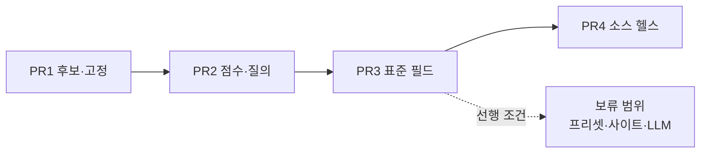

# 외부 정보 조회 v2 — 즉시 착수 범위 (Task 34 / 1단계)

`docs/plan.md` §4 Task 34 의 **실행 계획 중, 사용자 입력 없이 지금 바로 착수해 머지까지
갈 수 있는 PR 만** 담는다. 사용자 답변·자격 증명·사이트 응답 샘플이 있어야 진행되는
나머지는 [plan-external-v2-deferred.md](plan-external-v2-deferred.md) 로 분리했다.

- 설계 근거: [architecture.md](architecture.md) §7 (외부 데이터 어댑터)
- 보류 범위: [plan-external-v2-deferred.md](plan-external-v2-deferred.md)
- 개발 관례·품질 게이트: [../AGENTS.md](../AGENTS.md), [plan.md](plan.md) §7·§8

> **왜 나눴나.** 차단 분석을 해 보니 열 개 PR 중 넷은 사용자가 아무것도 하지 않아도
> 끝까지 갈 수 있고, 나머지는 답변·API 키·사이트 샘플을 기다려야 했다. 그리고
> **정확도 문제의 실질적 해결이 전부 앞의 넷 안에 있었다.** 기다리는 작업이 기다리지
> 않는 작업의 진행과 배포를 막지 않도록 문서를 범위별로 갈랐다.

---

## 1. 목표와 비목표

### 목표

1. **정확도** — 엉뚱한 술을 정답처럼 보여주는 일을 없앤다. 확신이 없으면 확신이 없다고
   말하고, 사용자가 한 번 고치면 그 제품은 영구히 정확해진다. (PR1·PR2)
2. **비교 가능성** — 소스가 여럿일 때 값을 나란히 놓고 비교할 수 있는 형태를 먼저 만든다.
   사이트를 실제로 늘리는 것은 보류 범위지만, **그 전제조건인 필드 표준화는 지금 끝낸다**
   — 나중에 차단이 풀렸을 때 사이트 작업만 남게 된다. (PR3)
3. **운영 가시성** — 소스가 깨졌는지 볼 수 있게 한다. 소스를 늘리기 전에 있어야 한다. (PR4)

Task 34 전체의 두 번째 목표인 "사이트를 늘리는 비용을 낮춘다"(프리셋 카탈로그)는
사용자 입력이 있어야 해서 [보류 범위](plan-external-v2-deferred.md)로 갔다.

### 비목표 (이번 Task 에서 하지 않는 것)

- `search` 전략(검색엔진 SERP 스크래핑). D167 에서 **폐기**로 결정됐다. "웹에서 검색"
  링크가 그 자리를 대신한다.
- Task 19 본 사양(시세 이력 차트·목표가 알림·웹 푸시). 다만 PR3(표준 필드 스키마)이
  그 선행 조건을 만든다 — 필드가 표준화돼야 시계열이 의미를 갖는다.
- 대량 백그라운드 크롤링. §7.3 준수 규칙은 그대로다 — 조회는 사용자 조작 시점에만.

---

## 2. 현황 진단 (코드 근거)

| # | 문제 | 위치 | 결과 |
|---|---|---|---|
| 1 | 정규화가 공백 제거 + 소문자화뿐 | `adapter.py::_normalize` | `[단독]`·`(1+1)`·`10y` vs `10년`·`0.7L` vs `700ml` 이 전부 점수 노이즈로 들어간다 |
| 2 | 점수가 `difflib` 전체 문자열 유사도 하나 | `adapter.py::_similarity` | 토큰이 하나 더 붙은 다른 제품(라이·캐스크 스트렝스)을 구분하지 못한다 |
| 3 | `_MIN_SIMILARITY = 0.4` 로 매우 느슨 | `adapter.py` | 그럴듯한 후보가 없어도 뭔가는 통과한다 |
| 4 | 접두사 게이트가 임시방편 | `adapter.py::_plausible_candidate` | 주석에 적힌 대로 "우드포드 리저브"→"우드포드 리저브 라이"를 못 거른다. 반대로 `[단독] 글렌알라키…` 처럼 앞에 뭐가 붙으면 정답을 탈락시킨다 |
| 5 | DB 의 식별 정보를 하나도 안 쓴다 | `application/external_sources.py::lookup_product` (`query=product.name`) | `name_en`·`abv`·`vintage`·`age_years`·`producer`·`sku.volume_ml` 이 스키마에 있는데 매칭에 쓰이지 않는다 |
| 6 | 최고점 후보 1개를 조용히 채택 | `adapter.py::_fetch_snapshot_unsafe` | 후보도 점수도 사용자에게 안 보이고, 고칠 수단이 없다 |
| 7 | 틀린 매칭이 TTL 동안 고정 | 캐시 키가 `(source_id, product_id)` | 기본 `ttl_hours=24` — 하루 동안 같은 오답을 반복한다 |
| 8 | `fields` 가 자유 dict | `external_lookup_cache.snapshot`, `SourceLookupOut.fields` | 소스마다 `price`/`가격`/`sale_price` 가 제각각이라 소스가 늘어도 비교·집계가 불가능하다 |
| 9 | 소스 등록이 JSON 원문 직접 입력 | `web/src/pages/SourcesPage.tsx` (textarea) | 사이트 6곳 추가가 현실적으로 불가능하고, 사이트 개편 시 사용자가 직접 고쳐야 한다 |
| 10 | 소스가 깨져도 알 방법이 없다 | — | `degraded` 는 조회할 때만 보인다. 소스가 여럿이면 어디가 죽었는지 모른다 |

7번이 체감상 가장 나쁘다 — 틀린 답이 정답처럼 보이고, 하루 동안 유지된다.

**이 문서의 네 PR 이 1~8·10 번을 전부 덮는다.** 9번(소스 등록이 JSON 원문 직접 입력)만
프리셋 카탈로그가 필요해 보류 범위로 넘어갔다 — 등록 편의 문제라 정확도에는 영향이 없다.

---

## 3. 이 문서의 범위

### 담는 것 — 차단 없음

| PR | 내용 | 방안 | 브랜치 | 마이그레이션 | 결정 로그 |
|---|---|---|---|---|---|
| 1 | 후보 노출과 매칭 고정 | A+B | `feat/external-match-pin` | `0009_external_product_match` | D175~D178 |
| 2 | 매칭 점수 재작성과 질의 확장 | C+D | `feat/external-matching-score` | — | D179~D181 |
| 3 | 표준 필드 스키마와 가격 비교 뷰 | G | `feat/external-normalized-fields` | — (스냅샷 버전) | D182~D184 |
| 4 | 소스 헬스 체크 | J | `feat/external-source-health` | `0010_external_source_probe` | D185 |

네 PR 모두 **기존 코드·스키마와 이미 등록된 데일리샷 소스만으로 구현·검증이 끝난다.**
새 외부 사이트도, API 키도, 사용자 답변도 필요 없다.

### 담지 않는 것 — 보류

프리셋 카탈로그, LLM 재판정, 제외 키워드, 사이트 추가 3건은
[plan-external-v2-deferred.md](plan-external-v2-deferred.md) 에 계획과 체크리스트만
남겼다. 각 항목의 **차단 해제 조건**(무엇이 오면 착수 가능한지)이 그 문서 맨 앞에 있다.

### 의존 관계



PR1→PR2→PR3 은 순서를 지킨다. PR4(소스 헬스)는 PR3 뒤 아무 때나 넣어도 되고, 다른
셋과 독립적이라 병렬로 진행해도 된다.

### 왜 이 순서인가

- **PR1 이 먼저다.** 점수 함수를 아무리 고쳐도 100% 는 안 된다. "확신 없으면 물어본다 +
  한 번 고치면 영구히 맞는다"가 정확도의 바닥을 만들고, 그 위에서 PR2 가 자동 정확도를
  올린다. 순서가 반대면 PR2 의 개선 효과를 측정할 기준선이 없다.
- **PR3 은 보류 범위의 전제조건이기도 하다.** 필드가 표준화되지 않은 채 소스가 5곳이
  되면 서로 다른 이름의 값을 나열하는 카드 5개가 될 뿐이다. 사이트를 붙이기 전에
  끝내 두면, 나중에 차단이 풀렸을 때 사이트 작업만 하면 된다.
- **PR4 를 앞으로 당겼다.** 원래 제외 키워드와 묶여 맨 뒤에 있었는데, 소스를 늘리는
  동안 무엇이 깨졌는지 보려면 오히려 사이트를 붙이기 **전에** 있어야 한다.

---

## 4. 공통 규약

| 항목 | 규약 |
|---|---|
| 브랜치 | 위 표의 이름. `main` 에서 분기하고 머지 후 삭제 |
| 커밋 | Conventional Commits (`feat(external): …`). commitlint 가 CI 에서 강제 |
| 문서 갱신 | 모든 PR 이 `plan.md` §1·§3·§5·§6 과 이 문서 §6 진행 상태를 같은 PR 에서 갱신 (절대 규칙 8). 보류 범위의 차단이 풀리면 [보류 계획서](plan-external-v2-deferred.md) 도 함께 갱신 |
| 마이그레이션 | 현재 head 는 `757982c7b323`. PR1 이 그 뒤에 붙고, 이후 PR 은 직전 PR 의 head 뒤에 붙는다. up/down 왕복이 CI 게이트 |
| 커버리지 | Python 브랜치 ≥ 85%, TypeScript ≥ 80%. 새 모듈은 자체 테스트로 이 선을 넘긴다 |
| 네트워크 | 모든 백엔드 테스트는 `httpx.MockTransport` 로 스텁한다. 실제 외부 호출을 하는 테스트는 만들지 않는다 (기존 `tests/infrastructure/external/test_adapter.py` 패턴) |
| 동기화 | 새 테이블은 전부 `SYNC_ENTITIES` 에 **넣지 않는다**. 외부 조회는 온라인 전용이고, `external_source`·`external_lookup_cache` 도 이미 제외돼 있다 |
| 절대 규칙 | 7번(출처 URL 없는 외부 데이터 저장 금지)과 6번(파생값 DB 저장 금지)을 각 PR 의 완료 조건에 명시적으로 재확인한다 |

---

## PR1 — 후보 노출과 매칭 고정 (방안 A+B)

> 브랜치 `feat/external-match-pin` · 마이그레이션 `0009_external_product_match` · 결정 D175~D178

### 목적

진단 6·7 번을 없앤다. 조회 결과를 "정답 하나"가 아니라 **"이 후보를 골랐고, 확신은 이
정도이며, 틀렸으면 여기서 고칠 수 있다"**로 바꾼다.

### 설계

#### 신뢰 구간 3분할

| 구간 | 조건 | 동작 |
|---|---|---|
| 자동 채택 | `score ≥ 0.85` | 지금처럼 바로 값을 보여준다. `needs_confirmation=False` |
| 확인 필요 | `0.5 ≤ score < 0.85` | 값은 보여주되 `needs_confirmation=True`. 카드에 후보 최대 5개를 함께 노출 |
| 후보 없음 | `score < 0.5` | 값 없음 + 후보만 노출 (사용자가 직접 고를 수 있게) |

기존 `_MIN_SIMILARITY = 0.4` 를 `MIN_CANDIDATE = 0.5` 로 올린다. 0.4 는 실측에서
"아무거나 통과"에 가까웠다. 임계값은 모듈 상수로 두고 근거 주석을 단다 — PR2 에서 점수
함수가 바뀌면 재조정이 필요하다는 것을 명시한다.

#### 매칭 고정 (pin)

새 테이블 `external_product_match` 에 "이 제품 = 이 소스의 이 URL" 을 저장한다.

```python
class ExternalProductMatch(Base, EntityMixin):
    __tablename__ = "external_product_match"

    source_id: FK external_source.id (ondelete=CASCADE)
    product_id: FK product.id (ondelete=CASCADE)
    external_url: Text NOT NULL          # 절대 규칙 7 — URL 없는 고정은 성립하지 않는다
    external_name: Text NOT NULL         # 화면에 "무엇으로 고정했는지" 보여주기 위한 값
    external_key: String(200) | None     # JSON API 아이템 id (result_fields 모드용)
    confirmed_at: DateTime(timezone=True) NOT NULL

    __table_args__ = (
        Index("uq_external_product_match_identity", "source_id", "product_id",
              unique=True, postgresql_where="deleted_at IS NULL"),
        Index("ix_external_product_match_user_id_product_id", "user_id", "product_id"),
    )
```

부분 유니크 인덱스는 `uq_product_identity` 선례를 따른다 — soft delete 된 행이 자리를
차지해 재고정을 막는 문제를 피한다.

#### 고정된 소스의 조회 경로 — 두 갈래

여기가 이 PR 에서 놓치기 쉬운 지점이다. 고정은 **"매칭 결정"을 고정하는 것이지 "요청
경로"를 고정하는 것이 아니다.**

| 소스 형태 | 동작 | 이유 |
|---|---|---|
| 상세 페이지가 따로 있는 소스 (HTML 모드, 또는 `result_fields` 없는 JSON 모드) | 검색을 **건너뛰고** `external_url` 을 직접 조회 | 왕복 1회 절감 + 검색 결과 순위 변동에 영향받지 않음 |
| `search.result_fields` 를 쓰는 JSON 모드 (데일리샷) | 검색은 하되, 후보 선택을 **유사도 대신 `external_key`/`external_url` 일치**로 한다 | 이 모드는 상세 페이지를 아예 조회하지 않는다 — 값이 검색 응답 안에 있어서, 검색을 건너뛰면 가져올 값이 없다 |

두 번째 경로에서 고정된 키가 검색 결과에 더 이상 없으면(상품 단종·개편) `degraded=True`
+ `warning="고정된 상품을 검색 결과에서 찾지 못했습니다"` 로 알리고, 후보 목록을 함께
돌려줘 재고정을 유도한다. 조용히 유사도 매칭으로 되돌아가지 않는다 — 그러면 고정의
의미가 사라진다.

#### SSRF 재검증

고정 URL 은 **저장 시점과 조회 시점 양쪽에서** `_same_host(source.base_url, url)` 로
검증한다. 저장 후에 소스의 `base_url` 이 바뀔 수 있고, 클라이언트가 보낸 URL 을 그대로
믿을 이유도 없다. 기존 `_same_host` 를 재사용한다.

### 변경 파일

**신규**

- `src/sooljang/infrastructure/database/models/external_source.py` — `ExternalProductMatch` 추가 (기존 모듈에 함께 둔다; 외부 소스 3형제가 한 파일에 모여 있는 편이 읽기 쉽다)
- `src/sooljang/infrastructure/database/migrations/versions/0009_external_product_match.py`
- `tests/api/test_external_matches.py`

**수정**

| 파일 | 변경 |
|---|---|
| `infrastructure/external/adapter.py` | `AdapterResult` 에 `candidates`·`matched_name`·`match_score`·`needs_confirmation` 추가. `fetch_snapshot(..., pinned=PinnedMatch \| None)` 파라미터. 후보 선택 로직을 `_select_candidate()` 로 분리 |
| `infrastructure/database/models/__init__.py` | 새 모델 export |
| `application/external_sources.py` | `pin_match`·`unpin_match`·`get_match` 추가. `lookup_product` 가 고정을 먼저 조회해 어댑터에 넘김. 고정 변경 시 해당 `(source_id, product_id)` 캐시 행 삭제 |
| `api/schemas/external_sources.py` | `LookupCandidateOut`, `ExternalProductMatchCreate/Out` 추가. `SourceLookupOut` 확장 |
| `api/routes/products.py` (또는 외부 소스 라우터) | `POST /products/{id}/external-matches`, `DELETE /products/{id}/external-matches/{source_id}` |
| `web/src/api/types.ts` · `client.ts` | 타입·엔드포인트 추가 |
| `web/src/components/ExternalInfoCard.tsx` | 후보 목록 UI, "이걸로 고정"·"고정 해제", 고정 배지, `needs_confirmation` 경고 |
| `docs/architecture.md` §7 | §7.1 에 `candidates`/`needs_confirmation`, §7.4 "매칭 고정" 신설 |

### API 계약

```
POST /products/{product_id}/external-matches
  body: { source_id, external_url, external_name, external_key? }
  201 → ExternalProductMatchOut
  422 → external_url 의 호스트가 소스의 base_url 과 다름
  404 → 소유하지 않은 product/source

DELETE /products/{product_id}/external-matches/{source_id}
  204

POST /products/{product_id}/external-lookup     (기존, 응답 확장)
  SourceLookupOut += {
    matched_name: str | None,
    match_score: float | None,
    needs_confirmation: bool,
    pinned: bool,
    candidates: [{ name, url, key, score }]      # 최대 5개
  }
```

`GET` 전용 조회 엔드포인트는 만들지 않는다 — 고정 상태는 조회 응답의 `pinned` 로
전달되고, 화면이 그 밖에서 고정 정보를 필요로 하는 시점이 없다.

### 캐시 스냅샷 변경

```json
{ "source_url": "...", "fields": {...}, "raw_excerpt": "...",
  "matched_name": "글렌알라키 10년 캐스크 스트렝스 배치 5",
  "match_score": 0.91, "external_key": "12345" }
```

기존 행은 새 키가 없을 뿐이라 그대로 읽힌다(`.get()` 접근). 별도 데이터 마이그레이션은
하지 않는다.

### 테스트

**백엔드** (`tests/infrastructure/external/test_adapter.py`, `tests/api/test_external_matches.py`)

1. 자동 채택 구간 — `score ≥ 0.85` 면 `needs_confirmation=False`, 후보도 함께 온다
2. 확인 필요 구간 — 값은 있고 `needs_confirmation=True`
3. 후보 없음 구간 — `fields` 비어 있고 `candidates` 는 채워짐
4. 후보 정렬 — 점수 내림차순, 최대 5개로 잘림
5. 고정 시 검색 생략 — `MockTransport` 가 검색 URL 요청을 **한 번도** 받지 않음을 단언
6. 고정 + `result_fields` 모드 — 검색은 하되 `external_key` 로 후보를 고른다(유사도가 더 높은 다른 후보가 있어도 무시)
7. 고정된 키가 검색 결과에서 사라짐 → `degraded=True` + 후보 목록 반환, 유사도 폴백 없음
8. 다른 호스트 URL 로 고정 시도 → 422
9. 고정/해제가 해당 캐시 행을 삭제한다
10. 남의 제품·남의 소스 id → 404 (소유권)
11. 소스 삭제 시 고정 행 CASCADE 삭제

**프론트엔드** (`web/src/components/ExternalInfoCard.test.tsx`)

12. `needs_confirmation=true` 면 확인 문구와 후보 목록이 렌더된다
13. 후보의 "이걸로 고정" 클릭 → `POST .../external-matches` 호출 + 재조회
14. `pinned=true` 면 고정 배지와 "고정 해제" 가 보인다
15. 오프라인이면 고정 버튼이 비활성

### 완료 조건

- [ ] 위 15개 테스트 통과, 커버리지 게이트 유지
- [ ] `alembic upgrade head` / `downgrade -1` 왕복 성공
- [ ] 절대 규칙 7 재확인 — `external_url` 이 NOT NULL 이고, URL 없는 결과는 여전히 캐시하지 않는다
- [ ] `docs/architecture.md` §7.4 신설, `plan.md` 갱신

### 위험과 대응

| 위험 | 대응 |
|---|---|
| 임계값 0.85/0.5 가 실측과 안 맞을 수 있다 | 모듈 상수 + 근거 주석. PR2 에서 점수 함수가 바뀌면 재조정한다는 것을 문서에 명시 |
| 후보를 5개 노출하면 카드가 길어진다 | 기본 접힘 — `needs_confirmation` 일 때만 펼친 상태로 렌더 |
| 고정이 오히려 오답을 영구화 | 고정은 **사용자 명시 조작으로만** 생성한다. 자동 고정은 이 PR 에도, 보류 PR6(LLM 재판정)에도 넣지 않는다 |

---

## PR2 — 매칭 점수 재작성과 질의 확장 (방안 C+D)

> 브랜치 `feat/external-matching-score` · 마이그레이션 없음 · 결정 D179~D181

### 목적

진단 1~5 번. 자동 정확도 자체를 올려 PR1 의 "확인 필요" 구간에 들어오는 빈도를 줄인다.

### 설계

#### 순수 모듈로 분리

`src/sooljang/infrastructure/external/matching.py` (신규, **네트워크 의존성 없음**).
AGENTS.md 의 "네트워크 부수효과를 순수 변환 로직과 분리" 규약을 따른다. 이 분리 덕에
매칭 로직은 HTTP 스텁 없이 표 기반 테스트로 검증된다.

```python
@dataclass(frozen=True)
class ProductIdentity:
    name: str
    name_en: str | None
    producer: str | None
    abv: Decimal | None
    vintage: int | None
    age_years: Decimal | None
    volumes_ml: tuple[int, ...]  # 이 제품의 SKU 용량들


@dataclass(frozen=True)
class NameFacts:
    tokens: frozenset[str]
    volume_ml: int | None
    age_years: float | None
    abv: float | None
    vintage: int | None


def parse_name(text: str) -> NameFacts: ...
def score(identity: ProductIdentity, candidate_name: str) -> MatchScore: ...
def build_queries(identity: ProductIdentity) -> list[str]: ...
```

#### 정규화 규칙

| 규칙 | 예시 |
|---|---|
| 프로모션 블록 제거 | `[단독]`, `[한정]`, `(1+1)`, `(무료배송)`, `★`, `NEW` |
| 용량 추출 | `700ml` · `700 ml` · `0.7L` · `70cl` → `volume_ml=700` |
| 숙성 연수 추출 | `10년` · `10y` · `10yo` · `10 years` · `aged 10` → `age_years=10` |
| 도수 추출 | `46.3%` · `46.3도` · `ABV 46.3` → `abv=46.3` |
| 빈티지 추출 | 단독 4자리 1900~2100. **용량·도수로 이미 소비된 숫자는 제외** |
| 표기 동의어 | 캐스크스트렝스=CS, 싱글몰트=SM, 논칠필터드=NCF, 쉐리=셰리, 버본=버번 |
| 잔여 토큰화 | 남은 문자열을 공백·구두점으로 분해한 집합 |

#### 점수

```
value = 0.6 × jaccard(query.tokens, candidate.tokens)
      + 0.4 × SequenceMatcher(정규화 문자열 전체).ratio()
```

토큰 집합을 주 가중치로 둔 이유: "글렌알라키 10y 캐스크 스트렝스 #5" 처럼 긴 이름은
어순·수식어가 사이트마다 다르고, 문자열 비율은 그 흔들림에 약하다.

#### 하드 제약 (양쪽에 값이 **다 있을 때만** 적용)

| 속성 | 불일치 판정 | 근거 |
|---|---|---|
| `volume_ml` | 다르면 탈락 | 700ml 와 375ml 는 다른 상품이고, 가격 비교도 무의미해진다 |
| `age_years` | 다르면 탈락 | 10년과 12년은 다른 제품 |
| `vintage` | 다르면 탈락 | 같은 이유 |
| `abv` | 차이 > 0.6%p 면 탈락 | 배치별 미세 차이(46.0 vs 46.3)는 허용, 40 vs 46 은 탈락 |

**이것이 문서화된 한계를 실제로 푼다.** "우드포드 리저브" vs "우드포드 리저브 라이"는
토큰 집합이 다르고(`라이` 가 한쪽에만 있다) 도수도 다르다. 순수 문자열 비교로는 원천적
으로 못 푼다고 적혀 있던 케이스다.

#### 접두사 게이트 제거

`_PREFIX_LENGTH` · `_MIN_PREFIX_SIMILARITY` · `_plausible_candidate` 를 삭제한다.
토큰 집합 + 하드 제약이 그 역할(글렌고인/글렌리벳 오탐 차단)을 더 정확히 수행하고,
접두사 게이트는 `[단독] 글렌알라키…` 같은 이름에서 오히려 정답을 탈락시킨다.
**삭제 전에 기존 오탐 3건(글렌고인/글렌리벳, 글렌알라키/글렌그란트, 우드포드/우드포드
라이)을 새 점수 함수로 재현하는 테스트를 먼저 추가**해, 회귀를 막는다.

#### 질의 확장

`lookup_product` 가 `product.name` 하나만 넘기던 것을 최대 3개 질의로 확장한다.

1. `name`
2. `name_en` (있고 `name` 과 다를 때)
3. 축약형 — 수식어·배치 표기(`#5`, `배치 3`, `한정판`)를 뺀 핵심 토큰

**첫 질의가 자동 채택 구간(≥0.85)에 들면 즉시 멈춘다.** 각 질의가 요청 1회이므로
소스의 `rate_limit_per_min` 을 그만큼 소비한다 — 상한 3개를 넘기지 않고, 조기 종료를
기본으로 한다. rate limit 소진 시에는 이미 시도한 질의의 최선 결과를 쓴다.

### 변경 파일

**신규**: `infrastructure/external/matching.py`, `tests/infrastructure/external/test_matching.py`

**수정**: `adapter.py`(점수 계산을 `matching` 에 위임, 접두사 게이트 삭제, 다중 질의
루프), `application/external_sources.py`(`ProductIdentity` 조립 — `product.skus` 에서
용량 수집), `docs/architecture.md` §7.2 에 매칭 규칙 절 추가

### 테스트

`tests/infrastructure/external/test_matching.py` 를 **표 기반**으로 작성한다 (네트워크
불필요, 케이스 추가 비용이 낮다).

| # | 질의 | 후보 | 기대 |
|---|---|---|---|
| 1 | 글렌고인 12년 | 글렌리벳 12년 | 탈락 |
| 2 | 글렌알라키 10년 | 글렌그란트 10년 | 탈락 |
| 3 | 우드포드 리저브 | 우드포드 리저브 라이 | 탈락 (토큰 차이) |
| 4 | 글렌알라키 10년 CS | `[단독] 글렌알라키 10년 캐스크 스트렝스 배치5` | 채택 (프로모션 블록·동의어 처리) |
| 5 | 발베니 12년 700ml | 발베니 12년 375ml | 탈락 (용량 하드 제약) |
| 6 | 아드벡 10년 | 아드벡 우가달 | 탈락 (숙성 연수 한쪽만 있음 → 하드 제약 미적용, 토큰 점수로 탈락) |
| 7 | 라가불린 16년 43% | 라가불린 16년 43.0도 | 채택 (표기 차이 흡수) |
| 8 | 맥캘란 12 셰리 오크 | 맥캘란 12 쉐리 오크 | 채택 (동의어) |

추가로: `build_queries` 가 `name_en` 없을 때 2개만 만든다 / 축약형이 원본과 같으면
중복 질의를 만들지 않는다 / `parse_name` 이 `2019` 를 빈티지로, `700ml` 의 `700` 은
빈티지로 읽지 않는다.

**어댑터 통합** (`test_adapter.py`): 첫 질의가 자동 채택이면 두 번째 요청이 나가지
않는다 / 질의 3개를 모두 소진해도 후보가 없으면 마지막 경고가 남는다.

### 완료 조건

- [ ] 위 표의 8케이스 + 보조 케이스 전부 통과
- [ ] 기존 `test_adapter.py` 가 임계값 조정 외에는 그대로 통과 (계약 유지 확인)
- [ ] `_PREFIX_LENGTH` 관련 코드·주석·문서가 모두 제거되고 새 규칙으로 교체됨

### 위험과 대응

| 위험 | 대응 |
|---|---|
| 하드 제약이 지나쳐 정답을 탈락시킴 | "양쪽에 값이 다 있을 때만" 적용이 핵심 안전장치. 상품명에 용량이 없으면 제약이 걸리지 않는다 |
| 질의 3회로 rate limit 조기 소진 | 조기 종료 + 상한 3. 기본 `rate_limit_per_min=6` 이면 제품 2개 조회분 |
| 동의어 표가 계속 늘어난다 | 모듈 상수 dict 로 두고 실측으로만 추가한다. 추측으로 채우지 않는다 |

---

## PR3 — 표준 필드 스키마와 가격 비교 뷰 (방안 G)

> 브랜치 `feat/external-normalized-fields` · 마이그레이션 없음 · 결정 D182~D184

### 목적

진단 8번. 소스를 늘리기 전에 **비교 가능한 형태**를 먼저 만든다.

### 설계

#### 표준 키

`adapter_spec` 의 `detail.fields` / `search.result_fields` 가 아래 키로 값을 내보낸다.
표준 키에 없는 값은 `extra` 에 그대로 담아 손실 없이 보존한다.

| 키 | 타입 | 비고 |
|---|---|---|
| `price_krw` | int | 실제 판매가 |
| `list_price_krw` | int \| null | 정가 (할인율 계산용) |
| `currency` | str | 기본 `"KRW"`. 해외 사이트 대비 |
| `volume_ml` | int \| null | 이 가격이 어느 용량의 가격인지 |
| `rating` | float \| null | 원 척도 그대로 |
| `rating_scale` | float \| null | 5 / 100 등 |
| `review_count` | int \| null | |
| `in_stock` | bool \| null | |
| `extra` | dict | 표준 키에 없는 값 |

#### 파생값은 저장하지 않는다 (절대 규칙 6)

- `rating_normalized`(0~5 환산)와 **100ml당 가격**은 API 응답 조립 시점에 계산하고
  DB 에 넣지 않는다. 계산식은 `rating / rating_scale × 5`, `price_krw / volume_ml × 100`.
- 이 앱은 이미 `price_per_100ml` 개념을 쓰고 있어(파생 지표 계층), 같은 단위로 비교된다.

#### 캐시 호환

스냅샷에 `"version": 2` 를 넣고 `SNAPSHOT_VERSION = 2` 상수를 둔다. `_fresh_cache` 는
버전이 낮은 행을 **TTL 과 무관하게 stale 로 취급**한다 — 데이터 마이그레이션 없이 다음
조회에서 자연스럽게 새 모양으로 교체된다. 이 방식을 택한 이유: 캐시는 정의상 언제든
버려도 되는 데이터라, 마이그레이션 스크립트를 쓸 이유가 없다.

#### 기존 데일리샷 소스

등록된 `adapter_spec` 의 필드명(`price`·`rating` 등)을 표준 키로 바꾸는 것은 **사용자의
DB 안 데이터**다. 앱이 시작할 때 자동으로 고치지 않고, 보류 PR5(프리셋)의 경로가 생긴 뒤
"프리셋으로 교체" 버튼으로 처리한다. 이 PR 에서는 **표준 키가 아닌 값은 전부 `extra` 로
가므로 기존 소스도 깨지지 않는다** — 비교 뷰에 안 잡힐 뿐, 값은 그대로 보인다.

### 프론트엔드 — 비교 뷰

소스별 카드 나열을 **표 하나**로 바꾼다.

| 소스 | 가격 | 100ml당 | 평점 | 재고 | 확인 |
|---|---|---|---|---|---|
| 데일리샷 | 89,000원 **(최저)** | 12,714원 | 4.3/5 | 있음 | 2시간 전 |
| 이마트몰 | 95,000원 | 13,571원 | — | 있음 | 방금 |

- 최저가 배지
- **내 실평단가 대비 델타** — `ProductDetail` 이 이미 파생 지표를 갖고 있다. "내가 산
  가격보다 12% 비쌈" 이 이 기능의 실질 가치다.
- 값이 없는 칸은 `—` 로 두고, `degraded` 소스는 행에 경고 아이콘 + 사유 툴팁
- 매장 모드(`StoreModePage`)는 같은 컴포넌트를 그대로 쓴다 (`ExternalInfoCard` 공용)

### 변경 파일

**신규**: `infrastructure/external/fields.py`(표준 키 정의·정규화·검증), `tests/infrastructure/external/test_fields.py`

**수정**: `adapter.py`(추출 결과를 표준/`extra` 로 분류), `application/external_sources.py`
(`SNAPSHOT_VERSION`, `_fresh_cache` 버전 검사), `api/schemas/external_sources.py`
(`NormalizedFieldsOut` + 파생값 계산), `web/src/components/ExternalInfoCard.tsx`(비교 표),
`web/src/api/types.ts`, `docs/architecture.md` §7.2 에 표준 필드 표 추가

### 테스트

1. 표준 키로 추출된 값이 타입까지 맞게 들어온다 (문자열 `"89,000원"` → `price_krw=89000`)
2. 표준 키가 아닌 값은 `extra` 로 간다 (기존 소스 무손상)
3. `rating_scale=100`, `rating=87` → `rating_normalized=4.35`
4. `volume_ml` 이 없으면 100ml당 가격은 `null` (0 나눗셈 방지)
5. 버전 1 캐시 행은 TTL 이 남아 있어도 stale 로 취급된다
6. 버전 2 캐시 행은 TTL 안이면 그대로 재사용된다
7. (Vitest) 최저가 배지가 최저 가격 행에만 붙는다 / 가격이 하나뿐이면 배지 없음
8. (Vitest) `degraded` 행에 경고와 사유가 보인다
9. (Vitest) 실평단가가 없는 제품이면 델타 칸이 비어 있고 깨지지 않는다

### 완료 조건

- [ ] 절대 규칙 6 재확인 — `rating_normalized`·100ml당 가격이 DB 어디에도 저장되지 않음
- [ ] 기존 데일리샷 소스로 조회했을 때 값이 하나도 사라지지 않음 (`extra` 폴백 확인)

---

## PR4 — 소스 헬스 체크 (방안 J)

> 브랜치 `feat/external-source-health` · 마이그레이션 `0010_external_source_probe` · 결정 D185

**사용자 입력이 전혀 필요 없다.** 원래 제외 키워드와 한 PR 로 묶여 맨 뒤에 있었지만,
소스를 늘리는 동안 무엇이 깨졌는지 보려면 오히려 **사이트를 붙이기 전에** 있어야 한다 —
그래서 즉시 착수 묶음으로 당겼고, 제외 키워드만 보류 문서에 남겼다.

### 왜 새 테이블이 필요한가

헬스를 `external_lookup_cache` 에서 계산할 수 없다. 그 테이블은 **성공한 조회만** 담기
때문이다(절대 규칙 7 + `ok` 가드). 실패 기록이 남는 곳이 없어 "이 소스가 언제부터
깨졌는지"를 알 방법이 없다.

`external_source_probe(source_id, attempted_at, ok, degraded, warning)` — 소스별 최근
20행만 유지하는 롤링 로그. 절대 규칙 6(파생값 DB 저장 금지)에 걸리지 않는다: 이것은
도메인 파생 지표(평단가 등)가 아니라 **운영 로그**이고, 다른 어디에서도 재계산할 수 없는
1차 사실이다. 이 판단을 결정 로그에 남긴다.

### 기능

- `GET /external-sources/health` — 소스별 최근 성공 시각, 연속 실패 횟수, 마지막 경고
- `POST /external-sources/{id}/probe` — 샘플 제품명으로 테스트 조회 (저장 없음)
- `SourcesPage` 에 상태 배지(정상 / 부분 실패 / 실패) + "테스트 조회" 버튼
- 기존 `HealthPanel` 의 배지 패턴을 재사용한다

### 테스트

1. probe 행이 20개를 넘으면 오래된 것부터 삭제된다
2. 연속 실패 3회 이상이면 헬스가 `failing`
3. 테스트 조회는 캐시에 저장하지 않는다
4. 소스 삭제 시 probe 행 CASCADE 삭제
5. (Vitest) 배지 3상태 렌더 / 테스트 조회 버튼이 결과를 인라인 표시

### 완료 조건

- [ ] `alembic` 왕복 성공
- [ ] 데일리샷 하나만 등록된 상태에서도 배지·테스트 조회가 정상 동작

---

## 5. 릴리스 계획

| 버전 | 포함 | 기준 |
|---|---|---|
| `v1.5.0` | PR1~PR4 (이 문서 전부) | 사용자 입력 없이 완결되는 묶음. 소스가 데일리샷 하나여도 체감 개선이 크다 |

보류 범위의 릴리스 계획은 [plan-external-v2-deferred.md](plan-external-v2-deferred.md)
에 있다. 이 문서의 네 PR 은 그것과 무관하게 배포할 수 있다.

`v1.4.1` 릴리스·재배포가 아직 진행 중이므로 **그것을 먼저 마친 뒤 PR1 을 시작한다.**

## 6. 진행 상태

| PR | 상태 | 차단 | 비고 |
|---|---|---|---|
| 1 | ⬜ 대기 | 없음 | |
| 2 | ⬜ 대기 | 없음 | PR1 선행 |
| 3 | ⬜ 대기 | 없음 | PR2 선행 |
| 4 | ⬜ 대기 | 없음 | PR3 뒤 아무 때나, 병렬 가능 |
