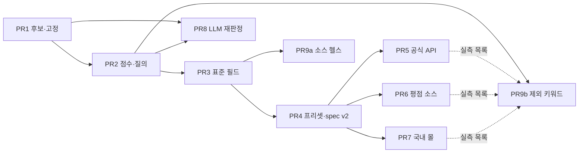

# 외부 정보 조회 v2 — 정확도 개선과 소스 확장 (Task 34)

`docs/plan.md` §4 Task 34 의 **상세 실행 계획**이다. 상위 문서(`plan.md`)에는 요약과
체크리스트만 두고, PR 단위 설계·파일 목록·테스트 케이스는 여기에 모은다 — Task 22 에서
"세션 로컬 plan 파일"로 흩어졌던 상세 계획을 이번에는 저장소에 남긴다.

- 설계 근거: [architecture.md](architecture.md) §7 (외부 데이터 어댑터)
- 개발 관례·품질 게이트: [../AGENTS.md](../AGENTS.md), [plan.md](plan.md) §7·§8

---

## 1. 목표와 비목표

### 목표

1. **정확도** — 엉뚱한 술을 정답처럼 보여주는 일을 없앤다. 확신이 없으면 확신이 없다고
   말하고, 사용자가 한 번 고치면 그 제품은 영구히 정확해진다.
2. **확장성** — 사이트를 늘리는 비용을 "JSON 을 손으로 쓰기"에서 "목록에서 고르기"로
   낮추고, 소스가 여럿일 때 값을 나란히 **비교**할 수 있게 한다.

### 비목표 (이번 Task 에서 하지 않는 것)

- `search` 전략(검색엔진 SERP 스크래핑). D167 에서 **폐기**로 결정됐다. "웹에서 검색"
  링크가 그 자리를 대신한다.
- Task 19 본 사양(시세 이력 차트·목표가 알림·웹 푸시). 다만 PR3(표준 필드 스키마)이
  그 선행 조건을 만든다 — 필드가 표준화돼야 시계열이 의미를 갖는다.
- 대량 백그라운드 크롤링. §7.3 준수 규칙은 그대로다 — 조회는 사용자 조작 시점에만.

---

## 2. 현황 진단 (코드 근거)

| # | 문제 | 위치 | 결과 |
|---|---|---|---|
| 1 | 정규화가 공백 제거 + 소문자화뿐 | `adapter.py::_normalize` | `[단독]`·`(1+1)`·`10y` vs `10년`·`0.7L` vs `700ml` 이 전부 점수 노이즈로 들어간다 |
| 2 | 점수가 `difflib` 전체 문자열 유사도 하나 | `adapter.py::_similarity` | 토큰이 하나 더 붙은 다른 제품(라이·캐스크 스트렝스)을 구분하지 못한다 |
| 3 | `_MIN_SIMILARITY = 0.4` 로 매우 느슨 | `adapter.py` | 그럴듯한 후보가 없어도 뭔가는 통과한다 |
| 4 | 접두사 게이트가 임시방편 | `adapter.py::_plausible_candidate` | 주석에 적힌 대로 "우드포드 리저브"→"우드포드 리저브 라이"를 못 거른다. 반대로 `[단독] 글렌알라키…` 처럼 앞에 뭐가 붙으면 정답을 탈락시킨다 |
| 5 | DB 의 식별 정보를 하나도 안 쓴다 | `application/external_sources.py::lookup_product` (`query=product.name`) | `name_en`·`abv`·`vintage`·`age_years`·`producer`·`sku.volume_ml` 이 스키마에 있는데 매칭에 쓰이지 않는다 |
| 6 | 최고점 후보 1개를 조용히 채택 | `adapter.py::_fetch_snapshot_unsafe` | 후보도 점수도 사용자에게 안 보이고, 고칠 수단이 없다 |
| 7 | 틀린 매칭이 TTL 동안 고정 | 캐시 키가 `(source_id, product_id)` | 기본 `ttl_hours=24` — 하루 동안 같은 오답을 반복한다 |
| 8 | `fields` 가 자유 dict | `external_lookup_cache.snapshot`, `SourceLookupOut.fields` | 소스마다 `price`/`가격`/`sale_price` 가 제각각이라 소스가 늘어도 비교·집계가 불가능하다 |
| 9 | 소스 등록이 JSON 원문 직접 입력 | `web/src/pages/SourcesPage.tsx` (textarea) | 사이트 6곳 추가가 현실적으로 불가능하고, 사이트 개편 시 사용자가 직접 고쳐야 한다 |
| 10 | 소스가 깨져도 알 방법이 없다 | — | `degraded` 는 조회할 때만 보인다. 소스가 여럿이면 어디가 죽었는지 모른다 |

7번이 체감상 가장 나쁘다 — 틀린 답이 정답처럼 보이고, 하루 동안 유지된다.

---

## 3. PR 지도

사용자가 승인한 실행 순서(A+B → C+D → G → H+I → E, F, J)를 그대로 따른다.
**절대 규칙 9**(PR 을 계층별로 쪼개지 않는다)에 따라 각 PR 은 백엔드·프론트엔드·테스트·
문서 갱신을 전부 포함한다.

| PR | 제목 | 방안 | 브랜치 | 마이그레이션 | 결정 로그 |
|---|---|---|---|---|---|
| 1 | 후보 노출과 매칭 고정 | A+B | `feat/external-match-pin` | `0009_external_product_match` | D175~D178 |
| 2 | 매칭 점수 재작성과 질의 확장 | C+D | `feat/external-matching-score` | — | D179~D181 |
| 3 | 표준 필드 스키마와 가격 비교 뷰 | G | `feat/external-normalized-fields` | — (스냅샷 버전) | D182~D184 |
| 4 | 소스 프리셋 카탈로그와 adapter_spec v2 | H | `feat/external-source-presets` | `0010_source_presets_credentials` | D185~D187 |
| 5 | 공식 API 소스 — 네이버 쇼핑·Untappd | I | `feat/external-api-sources` | — | D188~D189 |
| 6 | 평점 소스 — Whiskybase·RateBeer·BeerAdvocate | I | `feat/external-rating-sources` | — | D190~D191 |
| 7 | 국내 몰 소스 — 이마트몰·트레이더스·코스트코 | I | `feat/external-mall-sources` | — | D192~D193 |
| 8 | 애매 구간 LLM 재판정 | E | `feat/external-llm-rematch` | — | D194~D195 |
| 9a | 소스 헬스 체크 | J | `feat/external-source-health` | `0011_external_source_probe` | D196 |
| 9b | 제외 키워드 | F | `feat/external-exclude-keywords` | — | D197 |

각 PR 이 사용자 입력을 얼마나 필요로 하는지는 **§7 착수 차단 분석**에 따로 정리했다 —
어떤 것을 지금 바로 시킬 수 있고 어떤 것이 사용자를 기다려야 하는지가 순서보다 중요하다.

### 의존 관계



PR5~7 은 서로 독립이라 순서를 바꾸거나 병렬로 진행해도 된다. 다만 **PR4 가 선행**해야
한다 — 프리셋과 `credentials` 없이는 사이트를 붙일 자리가 없다.

### 왜 이 순서인가

- **PR1 이 먼저다.** 점수 함수를 아무리 고쳐도 100% 는 안 된다. "확신 없으면 물어본다 +
  한 번 고치면 영구히 맞는다"가 정확도의 바닥을 만들고, 그 위에서 PR2 가 자동 정확도를
  올린다. 순서가 반대면 PR2 의 실측 개선 효과를 측정할 기준선이 없다.
- **PR3 이 사이트 확장의 전제조건이다.** 필드가 표준화되지 않은 채 소스가 5곳이 되면
  서로 다른 이름의 값을 나열하는 카드 5개가 될 뿐이다.
- **PR9 를 9a·9b 로 쪼갠 이유**: 원래는 하나로 묶어 맨 뒤에 뒀는데, 차단 분석(§7)을
  해 보니 두 절반의 성격이 달랐다. **헬스 체크(9a)는 사용자 입력이 전혀 필요 없어**
  지금 바로 만들 수 있고, 오히려 소스를 늘리기 **전에** 있어야 사이트를 붙이는 동안
  무엇이 깨졌는지 볼 수 있다. 반면 **제외 키워드 목록(9b)은 실측이 있어야** 채워진다 —
  추측으로 만든 목록보다 실제로 걸린 상품을 보고 만든 목록이 낫다. 그래서 9a 를 앞으로
  당기고 9b 만 뒤에 남겼다.

---

## 4. 공통 규약

| 항목 | 규약 |
|---|---|
| 브랜치 | 위 표의 이름. `main` 에서 분기하고 머지 후 삭제 |
| 커밋 | Conventional Commits (`feat(external): …`). commitlint 가 CI 에서 강제 |
| 문서 갱신 | 모든 PR 이 `plan.md` §1·§3·§5·§6 과 이 문서의 해당 PR 절 상태를 같은 PR 에서 갱신 (절대 규칙 8) |
| 마이그레이션 | 현재 head 는 `757982c7b323`. PR1 이 그 뒤에 붙고, 이후 PR 은 직전 PR 의 head 뒤에 붙는다. up/down 왕복이 CI 게이트 |
| 커버리지 | Python 브랜치 ≥ 85%, TypeScript ≥ 80%. 새 모듈은 자체 테스트로 이 선을 넘긴다 |
| 네트워크 | 모든 백엔드 테스트는 `httpx.MockTransport` 로 스텁한다. 실제 외부 호출을 하는 테스트는 만들지 않는다 (기존 `tests/infrastructure/external/test_adapter.py` 패턴) |
| 동기화 | 새 테이블은 전부 `SYNC_ENTITIES` 에 **넣지 않는다**. 외부 조회는 온라인 전용이고, `external_source`·`external_lookup_cache` 도 이미 제외돼 있다 |
| 절대 규칙 | 7번(출처 URL 없는 외부 데이터 저장 금지)과 6번(파생값 DB 저장 금지)을 각 PR 의 완료 조건에 명시적으로 재확인한다 |

---

## PR1 — 후보 노출과 매칭 고정 (방안 A+B)

> 브랜치 `feat/external-match-pin` · 마이그레이션 `0009_external_product_match` · 결정 D175~D178

### 목적

진단 6·7 번을 없앤다. 조회 결과를 "정답 하나"가 아니라 **"이 후보를 골랐고, 확신은 이
정도이며, 틀렸으면 여기서 고칠 수 있다"**로 바꾼다.

### 설계

#### 신뢰 구간 3분할

| 구간 | 조건 | 동작 |
|---|---|---|
| 자동 채택 | `score ≥ 0.85` | 지금처럼 바로 값을 보여준다. `needs_confirmation=False` |
| 확인 필요 | `0.5 ≤ score < 0.85` | 값은 보여주되 `needs_confirmation=True`. 카드에 후보 최대 5개를 함께 노출 |
| 후보 없음 | `score < 0.5` | 값 없음 + 후보만 노출 (사용자가 직접 고를 수 있게) |

기존 `_MIN_SIMILARITY = 0.4` 를 `MIN_CANDIDATE = 0.5` 로 올린다. 0.4 는 실측에서
"아무거나 통과"에 가까웠다. 임계값은 모듈 상수로 두고 근거 주석을 단다 — PR2 에서 점수
함수가 바뀌면 재조정이 필요하다는 것을 명시한다.

#### 매칭 고정 (pin)

새 테이블 `external_product_match` 에 "이 제품 = 이 소스의 이 URL" 을 저장한다.

```python
class ExternalProductMatch(Base, EntityMixin):
    __tablename__ = "external_product_match"

    source_id: FK external_source.id (ondelete=CASCADE)
    product_id: FK product.id (ondelete=CASCADE)
    external_url: Text NOT NULL          # 절대 규칙 7 — URL 없는 고정은 성립하지 않는다
    external_name: Text NOT NULL         # 화면에 "무엇으로 고정했는지" 보여주기 위한 값
    external_key: String(200) | None     # JSON API 아이템 id (result_fields 모드용)
    confirmed_at: DateTime(timezone=True) NOT NULL

    __table_args__ = (
        Index("uq_external_product_match_identity", "source_id", "product_id",
              unique=True, postgresql_where="deleted_at IS NULL"),
        Index("ix_external_product_match_user_id_product_id", "user_id", "product_id"),
    )
```

부분 유니크 인덱스는 `uq_product_identity` 선례를 따른다 — soft delete 된 행이 자리를
차지해 재고정을 막는 문제를 피한다.

#### 고정된 소스의 조회 경로 — 두 갈래

여기가 이 PR 에서 놓치기 쉬운 지점이다. 고정은 **"매칭 결정"을 고정하는 것이지 "요청
경로"를 고정하는 것이 아니다.**

| 소스 형태 | 동작 | 이유 |
|---|---|---|
| 상세 페이지가 따로 있는 소스 (HTML 모드, 또는 `result_fields` 없는 JSON 모드) | 검색을 **건너뛰고** `external_url` 을 직접 조회 | 왕복 1회 절감 + 검색 결과 순위 변동에 영향받지 않음 |
| `search.result_fields` 를 쓰는 JSON 모드 (데일리샷) | 검색은 하되, 후보 선택을 **유사도 대신 `external_key`/`external_url` 일치**로 한다 | 이 모드는 상세 페이지를 아예 조회하지 않는다 — 값이 검색 응답 안에 있어서, 검색을 건너뛰면 가져올 값이 없다 |

두 번째 경로에서 고정된 키가 검색 결과에 더 이상 없으면(상품 단종·개편) `degraded=True`
+ `warning="고정된 상품을 검색 결과에서 찾지 못했습니다"` 로 알리고, 후보 목록을 함께
돌려줘 재고정을 유도한다. 조용히 유사도 매칭으로 되돌아가지 않는다 — 그러면 고정의
의미가 사라진다.

#### SSRF 재검증

고정 URL 은 **저장 시점과 조회 시점 양쪽에서** `_same_host(source.base_url, url)` 로
검증한다. 저장 후에 소스의 `base_url` 이 바뀔 수 있고, 클라이언트가 보낸 URL 을 그대로
믿을 이유도 없다. 기존 `_same_host` 를 재사용한다.

### 변경 파일

**신규**

- `src/sooljang/infrastructure/database/models/external_source.py` — `ExternalProductMatch` 추가 (기존 모듈에 함께 둔다; 외부 소스 3형제가 한 파일에 모여 있는 편이 읽기 쉽다)
- `src/sooljang/infrastructure/database/migrations/versions/0009_external_product_match.py`
- `tests/api/test_external_matches.py`

**수정**

| 파일 | 변경 |
|---|---|
| `infrastructure/external/adapter.py` | `AdapterResult` 에 `candidates`·`matched_name`·`match_score`·`needs_confirmation` 추가. `fetch_snapshot(..., pinned=PinnedMatch \| None)` 파라미터. 후보 선택 로직을 `_select_candidate()` 로 분리 |
| `infrastructure/database/models/__init__.py` | 새 모델 export |
| `application/external_sources.py` | `pin_match`·`unpin_match`·`get_match` 추가. `lookup_product` 가 고정을 먼저 조회해 어댑터에 넘김. 고정 변경 시 해당 `(source_id, product_id)` 캐시 행 삭제 |
| `api/schemas/external_sources.py` | `LookupCandidateOut`, `ExternalProductMatchCreate/Out` 추가. `SourceLookupOut` 확장 |
| `api/routes/products.py` (또는 외부 소스 라우터) | `POST /products/{id}/external-matches`, `DELETE /products/{id}/external-matches/{source_id}` |
| `web/src/api/types.ts` · `client.ts` | 타입·엔드포인트 추가 |
| `web/src/components/ExternalInfoCard.tsx` | 후보 목록 UI, "이걸로 고정"·"고정 해제", 고정 배지, `needs_confirmation` 경고 |
| `docs/architecture.md` §7 | §7.1 에 `candidates`/`needs_confirmation`, §7.4 "매칭 고정" 신설 |

### API 계약

```
POST /products/{product_id}/external-matches
  body: { source_id, external_url, external_name, external_key? }
  201 → ExternalProductMatchOut
  422 → external_url 의 호스트가 소스의 base_url 과 다름
  404 → 소유하지 않은 product/source

DELETE /products/{product_id}/external-matches/{source_id}
  204

POST /products/{product_id}/external-lookup     (기존, 응답 확장)
  SourceLookupOut += {
    matched_name: str | None,
    match_score: float | None,
    needs_confirmation: bool,
    pinned: bool,
    candidates: [{ name, url, key, score }]      # 최대 5개
  }
```

`GET` 전용 조회 엔드포인트는 만들지 않는다 — 고정 상태는 조회 응답의 `pinned` 로
전달되고, 화면이 그 밖에서 고정 정보를 필요로 하는 시점이 없다.

### 캐시 스냅샷 변경

```json
{ "source_url": "...", "fields": {...}, "raw_excerpt": "...",
  "matched_name": "글렌알라키 10년 캐스크 스트렝스 배치 5",
  "match_score": 0.91, "external_key": "12345" }
```

기존 행은 새 키가 없을 뿐이라 그대로 읽힌다(`.get()` 접근). 별도 데이터 마이그레이션은
하지 않는다.

### 테스트

**백엔드** (`tests/infrastructure/external/test_adapter.py`, `tests/api/test_external_matches.py`)

1. 자동 채택 구간 — `score ≥ 0.85` 면 `needs_confirmation=False`, 후보도 함께 온다
2. 확인 필요 구간 — 값은 있고 `needs_confirmation=True`
3. 후보 없음 구간 — `fields` 비어 있고 `candidates` 는 채워짐
4. 후보 정렬 — 점수 내림차순, 최대 5개로 잘림
5. 고정 시 검색 생략 — `MockTransport` 가 검색 URL 요청을 **한 번도** 받지 않음을 단언
6. 고정 + `result_fields` 모드 — 검색은 하되 `external_key` 로 후보를 고른다(유사도가 더 높은 다른 후보가 있어도 무시)
7. 고정된 키가 검색 결과에서 사라짐 → `degraded=True` + 후보 목록 반환, 유사도 폴백 없음
8. 다른 호스트 URL 로 고정 시도 → 422
9. 고정/해제가 해당 캐시 행을 삭제한다
10. 남의 제품·남의 소스 id → 404 (소유권)
11. 소스 삭제 시 고정 행 CASCADE 삭제

**프론트엔드** (`web/src/components/ExternalInfoCard.test.tsx`)

12. `needs_confirmation=true` 면 확인 문구와 후보 목록이 렌더된다
13. 후보의 "이걸로 고정" 클릭 → `POST .../external-matches` 호출 + 재조회
14. `pinned=true` 면 고정 배지와 "고정 해제" 가 보인다
15. 오프라인이면 고정 버튼이 비활성

### 완료 조건

- [ ] 위 15개 테스트 통과, 커버리지 게이트 유지
- [ ] `alembic upgrade head` / `downgrade -1` 왕복 성공
- [ ] 절대 규칙 7 재확인 — `external_url` 이 NOT NULL 이고, URL 없는 결과는 여전히 캐시하지 않는다
- [ ] `docs/architecture.md` §7.4 신설, `plan.md` 갱신

### 위험과 대응

| 위험 | 대응 |
|---|---|
| 임계값 0.85/0.5 가 실측과 안 맞을 수 있다 | 모듈 상수 + 근거 주석. PR2 에서 점수 함수가 바뀌면 재조정한다는 것을 문서에 명시 |
| 후보를 5개 노출하면 카드가 길어진다 | 기본 접힘 — `needs_confirmation` 일 때만 펼친 상태로 렌더 |
| 고정이 오히려 오답을 영구화 | 고정은 **사용자 명시 조작으로만** 생성한다. 자동 고정은 이 PR 에도, PR8 에도 넣지 않는다 |

---

## PR2 — 매칭 점수 재작성과 질의 확장 (방안 C+D)

> 브랜치 `feat/external-matching-score` · 마이그레이션 없음 · 결정 D179~D181

### 목적

진단 1~5 번. 자동 정확도 자체를 올려 PR1 의 "확인 필요" 구간에 들어오는 빈도를 줄인다.

### 설계

#### 순수 모듈로 분리

`src/sooljang/infrastructure/external/matching.py` (신규, **네트워크 의존성 없음**).
AGENTS.md 의 "네트워크 부수효과를 순수 변환 로직과 분리" 규약을 따른다. 이 분리 덕에
매칭 로직은 HTTP 스텁 없이 표 기반 테스트로 검증된다.

```python
@dataclass(frozen=True)
class ProductIdentity:
    name: str
    name_en: str | None
    producer: str | None
    abv: Decimal | None
    vintage: int | None
    age_years: Decimal | None
    volumes_ml: tuple[int, ...]  # 이 제품의 SKU 용량들


@dataclass(frozen=True)
class NameFacts:
    tokens: frozenset[str]
    volume_ml: int | None
    age_years: float | None
    abv: float | None
    vintage: int | None


def parse_name(text: str) -> NameFacts: ...
def score(identity: ProductIdentity, candidate_name: str) -> MatchScore: ...
def build_queries(identity: ProductIdentity) -> list[str]: ...
```

#### 정규화 규칙

| 규칙 | 예시 |
|---|---|
| 프로모션 블록 제거 | `[단독]`, `[한정]`, `(1+1)`, `(무료배송)`, `★`, `NEW` |
| 용량 추출 | `700ml` · `700 ml` · `0.7L` · `70cl` → `volume_ml=700` |
| 숙성 연수 추출 | `10년` · `10y` · `10yo` · `10 years` · `aged 10` → `age_years=10` |
| 도수 추출 | `46.3%` · `46.3도` · `ABV 46.3` → `abv=46.3` |
| 빈티지 추출 | 단독 4자리 1900~2100. **용량·도수로 이미 소비된 숫자는 제외** |
| 표기 동의어 | 캐스크스트렝스=CS, 싱글몰트=SM, 논칠필터드=NCF, 쉐리=셰리, 버본=버번 |
| 잔여 토큰화 | 남은 문자열을 공백·구두점으로 분해한 집합 |

#### 점수

```
value = 0.6 × jaccard(query.tokens, candidate.tokens)
      + 0.4 × SequenceMatcher(정규화 문자열 전체).ratio()
```

토큰 집합을 주 가중치로 둔 이유: "글렌알라키 10y 캐스크 스트렝스 #5" 처럼 긴 이름은
어순·수식어가 사이트마다 다르고, 문자열 비율은 그 흔들림에 약하다.

#### 하드 제약 (양쪽에 값이 **다 있을 때만** 적용)

| 속성 | 불일치 판정 | 근거 |
|---|---|---|
| `volume_ml` | 다르면 탈락 | 700ml 와 375ml 는 다른 상품이고, 가격 비교도 무의미해진다 |
| `age_years` | 다르면 탈락 | 10년과 12년은 다른 제품 |
| `vintage` | 다르면 탈락 | 같은 이유 |
| `abv` | 차이 > 0.6%p 면 탈락 | 배치별 미세 차이(46.0 vs 46.3)는 허용, 40 vs 46 은 탈락 |

**이것이 문서화된 한계를 실제로 푼다.** "우드포드 리저브" vs "우드포드 리저브 라이"는
토큰 집합이 다르고(`라이` 가 한쪽에만 있다) 도수도 다르다. 순수 문자열 비교로는 원천적
으로 못 푼다고 적혀 있던 케이스다.

#### 접두사 게이트 제거

`_PREFIX_LENGTH` · `_MIN_PREFIX_SIMILARITY` · `_plausible_candidate` 를 삭제한다.
토큰 집합 + 하드 제약이 그 역할(글렌고인/글렌리벳 오탐 차단)을 더 정확히 수행하고,
접두사 게이트는 `[단독] 글렌알라키…` 같은 이름에서 오히려 정답을 탈락시킨다.
**삭제 전에 기존 오탐 3건(글렌고인/글렌리벳, 글렌알라키/글렌그란트, 우드포드/우드포드
라이)을 새 점수 함수로 재현하는 테스트를 먼저 추가**해, 회귀를 막는다.

#### 질의 확장

`lookup_product` 가 `product.name` 하나만 넘기던 것을 최대 3개 질의로 확장한다.

1. `name`
2. `name_en` (있고 `name` 과 다를 때)
3. 축약형 — 수식어·배치 표기(`#5`, `배치 3`, `한정판`)를 뺀 핵심 토큰

**첫 질의가 자동 채택 구간(≥0.85)에 들면 즉시 멈춘다.** 각 질의가 요청 1회이므로
소스의 `rate_limit_per_min` 을 그만큼 소비한다 — 상한 3개를 넘기지 않고, 조기 종료를
기본으로 한다. rate limit 소진 시에는 이미 시도한 질의의 최선 결과를 쓴다.

### 변경 파일

**신규**: `infrastructure/external/matching.py`, `tests/infrastructure/external/test_matching.py`

**수정**: `adapter.py`(점수 계산을 `matching` 에 위임, 접두사 게이트 삭제, 다중 질의
루프), `application/external_sources.py`(`ProductIdentity` 조립 — `product.skus` 에서
용량 수집), `docs/architecture.md` §7.2 에 매칭 규칙 절 추가

### 테스트

`tests/infrastructure/external/test_matching.py` 를 **표 기반**으로 작성한다 (네트워크
불필요, 케이스 추가 비용이 낮다).

| # | 질의 | 후보 | 기대 |
|---|---|---|---|
| 1 | 글렌고인 12년 | 글렌리벳 12년 | 탈락 |
| 2 | 글렌알라키 10년 | 글렌그란트 10년 | 탈락 |
| 3 | 우드포드 리저브 | 우드포드 리저브 라이 | 탈락 (토큰 차이) |
| 4 | 글렌알라키 10년 CS | `[단독] 글렌알라키 10년 캐스크 스트렝스 배치5` | 채택 (프로모션 블록·동의어 처리) |
| 5 | 발베니 12년 700ml | 발베니 12년 375ml | 탈락 (용량 하드 제약) |
| 6 | 아드벡 10년 | 아드벡 우가달 | 탈락 (숙성 연수 한쪽만 있음 → 하드 제약 미적용, 토큰 점수로 탈락) |
| 7 | 라가불린 16년 43% | 라가불린 16년 43.0도 | 채택 (표기 차이 흡수) |
| 8 | 맥캘란 12 셰리 오크 | 맥캘란 12 쉐리 오크 | 채택 (동의어) |

추가로: `build_queries` 가 `name_en` 없을 때 2개만 만든다 / 축약형이 원본과 같으면
중복 질의를 만들지 않는다 / `parse_name` 이 `2019` 를 빈티지로, `700ml` 의 `700` 은
빈티지로 읽지 않는다.

**어댑터 통합** (`test_adapter.py`): 첫 질의가 자동 채택이면 두 번째 요청이 나가지
않는다 / 질의 3개를 모두 소진해도 후보가 없으면 마지막 경고가 남는다.

### 완료 조건

- [ ] 위 표의 8케이스 + 보조 케이스 전부 통과
- [ ] 기존 `test_adapter.py` 가 임계값 조정 외에는 그대로 통과 (계약 유지 확인)
- [ ] `_PREFIX_LENGTH` 관련 코드·주석·문서가 모두 제거되고 새 규칙으로 교체됨

### 위험과 대응

| 위험 | 대응 |
|---|---|
| 하드 제약이 지나쳐 정답을 탈락시킴 | "양쪽에 값이 다 있을 때만" 적용이 핵심 안전장치. 상품명에 용량이 없으면 제약이 걸리지 않는다 |
| 질의 3회로 rate limit 조기 소진 | 조기 종료 + 상한 3. 기본 `rate_limit_per_min=6` 이면 제품 2개 조회분 |
| 동의어 표가 계속 늘어난다 | 모듈 상수 dict 로 두고 실측으로만 추가한다. 추측으로 채우지 않는다 |

---

## PR3 — 표준 필드 스키마와 가격 비교 뷰 (방안 G)

> 브랜치 `feat/external-normalized-fields` · 마이그레이션 없음 · 결정 D182~D184

### 목적

진단 8번. 소스를 늘리기 전에 **비교 가능한 형태**를 먼저 만든다.

### 설계

#### 표준 키

`adapter_spec` 의 `detail.fields` / `search.result_fields` 가 아래 키로 값을 내보낸다.
표준 키에 없는 값은 `extra` 에 그대로 담아 손실 없이 보존한다.

| 키 | 타입 | 비고 |
|---|---|---|
| `price_krw` | int | 실제 판매가 |
| `list_price_krw` | int \| null | 정가 (할인율 계산용) |
| `currency` | str | 기본 `"KRW"`. 해외 사이트 대비 |
| `volume_ml` | int \| null | 이 가격이 어느 용량의 가격인지 |
| `rating` | float \| null | 원 척도 그대로 |
| `rating_scale` | float \| null | 5 / 100 등 |
| `review_count` | int \| null | |
| `in_stock` | bool \| null | |
| `extra` | dict | 표준 키에 없는 값 |

#### 파생값은 저장하지 않는다 (절대 규칙 6)

- `rating_normalized`(0~5 환산)와 **100ml당 가격**은 API 응답 조립 시점에 계산하고
  DB 에 넣지 않는다. 계산식은 `rating / rating_scale × 5`, `price_krw / volume_ml × 100`.
- 이 앱은 이미 `price_per_100ml` 개념을 쓰고 있어(파생 지표 계층), 같은 단위로 비교된다.

#### 캐시 호환

스냅샷에 `"version": 2` 를 넣고 `SNAPSHOT_VERSION = 2` 상수를 둔다. `_fresh_cache` 는
버전이 낮은 행을 **TTL 과 무관하게 stale 로 취급**한다 — 데이터 마이그레이션 없이 다음
조회에서 자연스럽게 새 모양으로 교체된다. 이 방식을 택한 이유: 캐시는 정의상 언제든
버려도 되는 데이터라, 마이그레이션 스크립트를 쓸 이유가 없다.

#### 기존 데일리샷 소스

등록된 `adapter_spec` 의 필드명(`price`·`rating` 등)을 표준 키로 바꾸는 것은 **사용자의
DB 안 데이터**다. 앱이 시작할 때 자동으로 고치지 않고, PR4 의 프리셋 경로가 생긴 뒤
"프리셋으로 교체" 버튼으로 처리한다. 이 PR 에서는 **표준 키가 아닌 값은 전부 `extra` 로
가므로 기존 소스도 깨지지 않는다** — 비교 뷰에 안 잡힐 뿐, 값은 그대로 보인다.

### 프론트엔드 — 비교 뷰

소스별 카드 나열을 **표 하나**로 바꾼다.

| 소스 | 가격 | 100ml당 | 평점 | 재고 | 확인 |
|---|---|---|---|---|---|
| 데일리샷 | 89,000원 **(최저)** | 12,714원 | 4.3/5 | 있음 | 2시간 전 |
| 이마트몰 | 95,000원 | 13,571원 | — | 있음 | 방금 |

- 최저가 배지
- **내 실평단가 대비 델타** — `ProductDetail` 이 이미 파생 지표를 갖고 있다. "내가 산
  가격보다 12% 비쌈" 이 이 기능의 실질 가치다.
- 값이 없는 칸은 `—` 로 두고, `degraded` 소스는 행에 경고 아이콘 + 사유 툴팁
- 매장 모드(`StoreModePage`)는 같은 컴포넌트를 그대로 쓴다 (`ExternalInfoCard` 공용)

### 변경 파일

**신규**: `infrastructure/external/fields.py`(표준 키 정의·정규화·검증), `tests/infrastructure/external/test_fields.py`

**수정**: `adapter.py`(추출 결과를 표준/`extra` 로 분류), `application/external_sources.py`
(`SNAPSHOT_VERSION`, `_fresh_cache` 버전 검사), `api/schemas/external_sources.py`
(`NormalizedFieldsOut` + 파생값 계산), `web/src/components/ExternalInfoCard.tsx`(비교 표),
`web/src/api/types.ts`, `docs/architecture.md` §7.2 에 표준 필드 표 추가

### 테스트

1. 표준 키로 추출된 값이 타입까지 맞게 들어온다 (문자열 `"89,000원"` → `price_krw=89000`)
2. 표준 키가 아닌 값은 `extra` 로 간다 (기존 소스 무손상)
3. `rating_scale=100`, `rating=87` → `rating_normalized=4.35`
4. `volume_ml` 이 없으면 100ml당 가격은 `null` (0 나눗셈 방지)
5. 버전 1 캐시 행은 TTL 이 남아 있어도 stale 로 취급된다
6. 버전 2 캐시 행은 TTL 안이면 그대로 재사용된다
7. (Vitest) 최저가 배지가 최저 가격 행에만 붙는다 / 가격이 하나뿐이면 배지 없음
8. (Vitest) `degraded` 행에 경고와 사유가 보인다
9. (Vitest) 실평단가가 없는 제품이면 델타 칸이 비어 있고 깨지지 않는다

### 완료 조건

- [ ] 절대 규칙 6 재확인 — `rating_normalized`·100ml당 가격이 DB 어디에도 저장되지 않음
- [ ] 기존 데일리샷 소스로 조회했을 때 값이 하나도 사라지지 않음 (`extra` 폴백 확인)

---

## PR4 — 소스 프리셋 카탈로그와 adapter_spec v2 (방안 H)

> 브랜치 `feat/external-source-presets` · 마이그레이션 `0010_source_presets_credentials` · 결정 D185~D187

> **선행 입력 1건**: 현재 등록된 데일리샷 `adapter_spec` JSON 원문(`#sources` 편집 폼에서
> 복사). 이 스펙은 저장소에 없고 사용자 DB 안에만 있다 — `docs/plan.md` D147 에는
> 엔드포인트와 대략의 모양만 적혀 있다. **없어도 프리셋 구조·spec v2·자격 증명·UI 는
> 전부 만들 수 있고, 번들 프리셋 파일 하나만 비워 두면 된다.** 추측으로 복원하지 않는다
> (§PR5~7 공통의 경고와 같은 이유).

### 목적

진단 9번. 사이트 추가 비용을 낮추고, 사이트 개편 시 **앱 업데이트로 스펙을 갱신**할 수
있게 한다. PR5~7 의 선행 조건이다.

### 설계

#### 프리셋 카탈로그

```
src/sooljang/infrastructure/external/presets/
  dailyshot.yaml
  naver_shopping.yaml      # PR5
  whiskybase.yaml          # PR6
  ...
  __init__.py → presets.py (로더)
```

각 프리셋: `key`, `name`, `base_url`, `description`, `category_hint`, `requires_credentials`,
`version`(정수), `adapter_spec`.

- `GET /external-sources/presets` — 카탈로그 목록
- `POST /external-sources` 가 `adapter_spec` 대신 `preset_key` 를 받을 수 있다
- `external_source` 에 컬럼 3개 추가: `preset_key`, `preset_version`, `spec_overridden`
- 앱 시작 시 `spec_overridden=False` 인 소스는 최신 프리셋 버전으로 `adapter_spec` 을
  자동 갱신한다. 사용자가 스펙을 직접 손대면 `spec_overridden=True` 가 되어 자동 갱신
  대상에서 빠진다 — **사용자 편집을 앱 업데이트가 덮어쓰지 않는다.**
- 기존 커스텀 등록 경로(JSON textarea)는 그대로 둔다. 프리셋은 추가 선택지다.

#### adapter_spec v2 확장

실제 사이트를 붙이려면 지금 스펙으로는 부족하다.

| 추가 | 용도 |
|---|---|
| `search.method` (`GET`/`POST`) + `search.body` | POST 로 검색하는 국내 몰 |
| `search.headers` | `Referer`·`Accept` 필수인 내부 API |
| `credentials` | 공식 API 키 (PR5 의 네이버·Untappd) |
| `transform: strip_tags` | 네이버 쇼핑 `title` 에 `<b>` 태그가 섞여 온다 |

`version: 1` 스펙은 그대로 동작한다 — 새 키가 없으면 기존 기본값(GET, 헤더 없음)이다.

#### 자격 증명 저장

새 테이블 `external_source_credential(source_id, name, secret_ciphertext, hint)`.
`LlmSetting` 의 Fernet 패턴(`infrastructure/security/secrets.py`)을 그대로 재사용한다 —
평문 저장 금지, 마지막 4자만 `hint` 로 화면에 노출, `SYNC_ENTITIES` 제외.

```yaml
credentials:
  - name: client_id
    inject: { type: header, key: "X-Naver-Client-Id" }
  - name: client_secret
    inject: { type: header, key: "X-Naver-Client-Secret" }
```

**값은 요청 직전에만 복호화해 주입하고, 로그·`raw_excerpt`·에러 메시지에 절대 남기지
않는다.** 이 점을 테스트로 강제한다 (아래 테스트 6).

#### CI 가드

번들된 모든 프리셋을 스키마 검증하는 테스트를 둔다. 네트워크 없이 실행되며, 프리셋
오타가 사용자에게 배포되는 것을 막는다.

### 변경 파일

**신규**: `infrastructure/external/presets/*.yaml`, `infrastructure/external/presets.py`,
`infrastructure/database/models/external_source.py`(`ExternalSourceCredential`),
마이그레이션 `0010_…`, `tests/infrastructure/external/test_presets.py`,
`tests/api/test_source_presets.py`

**수정**: `adapter.py`(method/headers/body/credentials/`strip_tags`),
`application/external_sources.py`(프리셋 기반 생성, 시작 시 동기화, 자격 증명 CRUD),
`api/schemas/external_sources.py`, `api/routes/…`, `web/src/pages/SourcesPage.tsx`
("추천 소스에서 추가" 목록 + 자격 증명 입력), `docs/architecture.md` §7.2 v2 스펙

### 테스트

1. 번들 프리셋 전부가 스키마 검증을 통과한다 (CI 가드)
2. `preset_key` 로 소스 생성 시 `adapter_spec` 이 프리셋에서 채워진다
3. 프리셋 버전이 오르면 `spec_overridden=False` 소스만 자동 갱신된다
4. 사용자가 스펙을 편집하면 `spec_overridden=True` 가 되고 이후 자동 갱신에서 제외된다
5. `credentials` 가 요청 헤더에 주입된다 (`MockTransport` 로 헤더 단언)
6. **자격 증명이 로그·`raw_excerpt`·에러 메시지 어디에도 나타나지 않는다** (`caplog` + 응답 전체 문자열 검사)
7. Fernet 암복호화 왕복, `hint` 는 마지막 4자만
8. `method: POST` + `body` 로 검색 요청이 나간다
9. `strip_tags` 가 `<b>글렌</b>피딕` → `글렌피딕`
10. v1 스펙(새 키 없음)이 그대로 동작한다 (하위 호환)
11. (Vitest) 추천 소스 목록에서 추가 클릭 → 생성 요청 / 자격 증명 필요 소스는 입력 폼을 먼저 요구

### 완료 조건

- [ ] 자격 증명 유출 테스트(6번) 통과
- [ ] `alembic` 왕복 성공
- [ ] (선행 입력을 받았다면) 데일리샷을 프리셋으로 전환하고 PR3 표준 키로 매핑 — 못 받았으면
      이 항목만 남기고 나머지를 머지한 뒤 후속 커밋으로 채운다

---

## PR5~PR7 공통 — 사이트 추가 (방안 I)

세 PR 은 같은 절차를 따르므로 공통 사항을 먼저 둔다.

### ⚠️ 환경 제약 — 이 작업은 혼자 끝낼 수 없다

`plan.md` Task 18 절에 기록된 대로, **개발 샌드박스에서 외부 도메인 DNS 조회 자체가
안 된다**(`example.com` 조차 `ETIMEOUT`). GitHub·PyPI·npm 등 소수 호스트로만 아웃바운드가
열려 있다. 따라서 실제 검색 엔드포인트·응답 모양은 **사용자 환경에서 확인해 전달**받아야
한다. 이 제약을 무시하고 추측으로 셀렉터를 쓰면 배포된 프리셋이 전부 깨진다.

#### 협업 루프 (사이트 1곳당)

| 단계 | 담당 | 산출물 |
|---|---|---|
| 1 | 사용자 | `https://<사이트>/robots.txt` 원문 |
| 2 | 사용자 | 브라우저 DevTools → Network 탭에서 검색 시 실제로 나가는 요청의 URL·메서드·필수 헤더, 그리고 응답 샘플 (JSON 이면 그대로, HTML 이면 상품 카드 부분) — **쿠키·세션·개인정보는 제거해서** 전달 |
| 3 | 개발 | 프리셋 작성 + 그 샘플을 fixture 로 넣은 오프라인 테스트 |
| 4 | 사용자 | 배포 환경(홈 PC)에서 실제 제품 3종으로 조회 확인 + 결과 스크린샷 |
| 5 | 개발 | 어긋난 부분 수정 → 머지 |

2단계 샘플은 `tests/fixtures/external/<사이트>.json` 으로 커밋한다 (절대 규칙 4 —
익명화·축약 fixture 만). 상품명·가격 정도라 개인정보는 없지만 응답을 통째로 넣지 않고
필요한 항목만 축약한다.

### 사이트별 사전 판단 기준

각 사이트를 붙이기 전에 아래를 확인하고 **문서에 결과를 남긴다.** 하나라도 막히면 그
사이트는 등록하지 않고 사유를 기록한다 — 어댑터가 robots 차단 시 `degraded` 를 반환하긴
하지만, 애초에 못 쓸 프리셋을 배포하지 않는 게 맞다.

1. `robots.txt` 가 검색·상세 경로를 허용하는가
2. 이용약관이 자동화 접근을 금지하지 않는가
3. 공식 API 가 있는가 (있으면 스크래핑보다 우선)
4. 로그인 없이 검색 결과에 접근 가능한가

---

## PR5 — 공식 API 소스: 네이버 쇼핑·Untappd

> 브랜치 `feat/external-api-sources` · 마이그레이션 없음 · 결정 D188~D189

공식 API 를 먼저 붙인다. ToS 가 명확하고, 셀렉터가 깨질 일이 없으며, PR4 의 `credentials`
경로를 실사용으로 검증한다.

### 네이버 쇼핑 검색 API

- 엔드포인트: `https://openapi.naver.com/v1/search/shop.json?query={query}&display=20`
- 헤더 2개(`X-Naver-Client-Id`, `X-Naver-Client-Secret`) → PR4 `credentials` 사용
- 응답 매핑: `items[].title`(→ `strip_tags` 필요), `lprice`→`price_krw`, `link`→url,
  `mallName`→`extra.mall`
- `format: json`, `search.item: "items"`, `result_fields` 로 상세 조회 없이 완결
- **주의**: 주류는 온라인 통신판매가 제한돼 검색 결과가 잔·안주·굿즈·빈병 위주로 나올
  수 있다. 전통주·와인 일부는 정상적으로 잡힌다. 실측 후 **"유지할지 폐기할지"를 이 PR
  안에서 판단**하고, 유지하면 PR9 의 제외 키워드 목록 초안을 여기서 수집한다.
- `_same_host` 검증 주의: 검색은 `openapi.naver.com`, 상세 링크는 `smartstore.naver.com`
  등 **다른 호스트**다. 현행 어댑터는 이 경우 결과를 버린다 → 프리셋에 `link_hosts`
  허용 목록을 두고, 상세 페이지를 조회하지 않는 `result_fields` 모드에서는 링크를 표시
  전용으로만 쓰도록 어댑터를 손본다 (조회하지 않는 URL 에는 SSRF 위험이 없다).

### Untappd (맥주)

- 레거시 엑셀에 `U` 태그 평점이 19건 있다 — 사용자가 실제로 참고해 온 소스다
- API 키 발급에 승인 절차가 있다. **승인이 지연되면 이 PR 에서 빼고 PR6 으로 넘긴다**
  (열린 질문 Q11 참조)
- `category_id` 를 맥주로 지정해 다른 주종 조회에서 빠지게 한다

### 테스트

fixture 기반. 네이버 응답 샘플로 `strip_tags` + `lprice` 매핑, 자격 증명 헤더 주입,
다른 호스트 링크가 표시 전용으로 남는지, 자격 증명 미설정 시 `degraded` + 안내 문구.

### 완료 조건

- [ ] 사용자 환경에서 실제 제품 3종 조회 확인 (협업 루프 4단계)
- [ ] 네이버 소스의 유지/폐기 판단을 결정 로그에 기록
- [ ] 자격 증명 없이도 앱이 정상 동작 (소스만 `degraded`)

---

## PR6 — 평점 소스: Whiskybase·RateBeer·BeerAdvocate

> 브랜치 `feat/external-rating-sources` · 마이그레이션 없음 · 결정 D190~D191

레거시 엑셀의 외부 평점 태그 실측(`plan.md` §4)이 근거다 — **RB 28건·U 19건·BA 18건**.
사용자가 이미 손으로 옮겨 적던 값이라, 자동화 가치가 가장 확실한 소스들이다.

| 사이트 | 주종 범위 | 비고 |
|---|---|---|
| Whiskybase | 위스키 | 상품명이 정형화돼 있어 매칭 난이도가 낮다. 시세 정보도 있다 |
| RateBeer | 맥주 | 레거시 RB 28건 |
| BeerAdvocate | 맥주 | 레거시 BA 18건 |

셋 다 스크래핑 대상이므로 위 "사전 판단 기준" 4개를 먼저 통과해야 한다. robots 나 ToS 가
막으면 그 사이트는 빼고 사유를 기록한다.

`category_id` 를 지정해 위스키 조회에 맥주 사이트가 끼지 않게 한다 — 소스가 늘수록 무관한
소스의 실패 메시지가 화면을 채우는 것이 실제 문제가 된다.

### 완료 조건

- [ ] 각 사이트의 robots·ToS 확인 결과를 문서에 기록 (등록/미등록 무관하게 남긴다)
- [ ] 레거시 평점이 있는 제품으로 조회해, 엑셀에 적힌 값과 비슷하게 나오는지 대조

---

## PR7 — 국내 몰 소스: 이마트몰·트레이더스·코스트코

> 브랜치 `feat/external-mall-sources` · 마이그레이션 없음 · 결정 D192~D193

Q3 에서 사용자가 답한 초기 목록 중 남은 곳들이다.

- 대부분 SPA + 내부 JSON API 구조라 데일리샷과 같은 `format: json` 패턴을 예상한다
- 코스트코는 로그인이 필요할 수 있다 → 불가하면 등록하지 않고 사유 기록
- **CU·GS25·emart24 는 이번 범위에서 제외한다.** 편의점 온라인몰에는 주류 시세가 사실상
  없어 투자 대비 가치가 낮다. Q3 답변에는 포함돼 있었으므로, 제외 판단을 결정 로그에
  남겨 나중에 맥락을 잃지 않게 한다.

### 완료 조건

- [ ] 최소 2곳 등록 성공 (3곳 모두 막히면 이 PR 은 사유 기록 후 닫는다)
- [ ] PR3 비교 뷰에서 데일리샷과 나란히 가격이 비교되는 것을 스크린샷으로 확인

---

## PR8 — 애매 구간 LLM 재판정 (방안 E)

> 브랜치 `feat/external-llm-rematch` · 마이그레이션 없음 · 결정 D194~D195

### 목적

PR1 의 "확인 필요" 구간(0.5~0.85)에서 사용자를 귀찮게 하는 빈도를 더 줄인다.

### 왜 ToS 위험이 없는가

D167 에서 폐기한 `search` 전략은 **검색엔진 결과를 스크래핑**하는 것이었다. 이것은
다르다 — **이미 우리가 정당하게 받아온 후보 목록 안에서 고르는 것**뿐이고, 외부 사이트에
추가 요청이 나가지 않는다. LLM 에는 상품명 문자열만 전달한다.

### 설계

- 신규 `infrastructure/external/match_llm.py`
- 호출 조건 **전부** 만족할 때만: ① 최고 점수가 0.5~0.85 구간 ② `LlmSetting` 활성
  ③ 사용자가 설정에서 "LLM 매칭 보조"를 켬 (기본 **꺼짐**)
- 입력: 내 제품 메타데이터(이름·생산자·도수·용량·숙성·빈티지) + 후보 최대 5개의 **이름만**.
  가격·URL·후기는 보내지 않는다 (불필요한 데이터 최소화)
- 출력: 구조화(`chat.completions.parse`) — `{ index: int | null, confidence: float }`.
  `llm.py::LabelExtraction` 과 같은 패턴
- **자동 고정하지 않는다.** LLM 이 고른 후보에 "LLM 추천" 배지를 붙여 사용자 확인을
  받는다. 자동 고정은 오답을 영구화할 위험이 있고, PR1 에서 "고정은 사용자 명시 조작
  으로만" 이라고 정한 원칙과도 어긋난다.
- 실패·타임아웃·미설정 → **조용히 기존 경로로 폴백**. 예외를 밖으로 내보내지 않는다
  (`fetch_snapshot` 과 같은 계약)
- 비용 가드: 조회 1건당 최대 1회, 같은 (제품, 소스) 조합은 24시간에 1회

### 테스트

1. 자동 채택 구간에서는 LLM 을 호출하지 않는다
2. `LlmSetting` 이 없으면 호출하지 않고 기존 결과 그대로
3. 설정이 꺼져 있으면 호출하지 않는다
4. LLM 이 `index=null` 을 주면 후보 없음이 유지된다
5. LLM 타임아웃 → 기존 점수 결과로 폴백, 예외 없음
6. LLM 추천 결과가 자동으로 고정되지 **않는다**
7. 24시간 내 재호출이 억제된다
8. (Vitest) "LLM 추천" 배지가 렌더되고, 고정 버튼은 여전히 사용자 클릭을 요구한다

### 완료 조건

- [ ] 기본값이 꺼짐이고, 켜지 않으면 OpenAI 호출이 0건임을 테스트로 확인
- [ ] 비용 상한 정책을 결정 로그에 기록 (열린 질문 Q10)

---

## PR9a — 소스 헬스 체크 (방안 J)

> 브랜치 `feat/external-source-health` · 마이그레이션 `0011_external_source_probe` · 결정 D196

**사용자 입력이 전혀 필요 없다.** 원래 PR9 로 묶여 맨 뒤에 있었지만, 소스를 늘리는 동안
무엇이 깨졌는지 보려면 오히려 **사이트를 붙이기 전에** 있어야 한다(§7 차단 분석).

### 왜 새 테이블이 필요한가

헬스를 `external_lookup_cache` 에서 계산할 수 없다. 그 테이블은 **성공한 조회만** 담기
때문이다(절대 규칙 7 + `ok` 가드). 실패 기록이 남는 곳이 없어 "이 소스가 언제부터
깨졌는지"를 알 방법이 없다.

`external_source_probe(source_id, attempted_at, ok, degraded, warning)` — 소스별 최근
20행만 유지하는 롤링 로그. 절대 규칙 6(파생값 DB 저장 금지)에 걸리지 않는다: 이것은
도메인 파생 지표(평단가 등)가 아니라 **운영 로그**이고, 다른 어디에서도 재계산할 수 없는
1차 사실이다. 이 판단을 결정 로그에 남긴다.

### 기능

- `GET /external-sources/health` — 소스별 최근 성공 시각, 연속 실패 횟수, 마지막 경고
- `POST /external-sources/{id}/probe` — 샘플 제품명으로 테스트 조회 (저장 없음)
- `SourcesPage` 에 상태 배지(정상 / 부분 실패 / 실패) + "테스트 조회" 버튼
- 기존 `HealthPanel` 의 배지 패턴을 재사용한다

### 테스트

1. probe 행이 20개를 넘으면 오래된 것부터 삭제된다
2. 연속 실패 3회 이상이면 헬스가 `failing`
3. 테스트 조회는 캐시에 저장하지 않는다
4. 소스 삭제 시 probe 행 CASCADE 삭제
5. (Vitest) 배지 3상태 렌더 / 테스트 조회 버튼이 결과를 인라인 표시

### 완료 조건

- [ ] `alembic` 왕복 성공
- [ ] 데일리샷 하나만 등록된 상태에서도 배지·테스트 조회가 정상 동작

---

## PR9b — 제외 키워드 (방안 F)

> 브랜치 `feat/external-exclude-keywords` · 마이그레이션 없음 · 결정 D197

### 설계

`adapter_spec.search.exclude_keywords` — 후보 이름에 이 단어가 있으면 후보에서 뺀다.
소스 컬럼이 아니라 **스펙 안에 두는 이유**: 프리셋으로 함께 배포·갱신되어야 하기 때문이다.

주의: 단순 부분 문자열 매칭은 오작동한다(`잔` 이 `잔티`·`발란자`에 걸린다). PR2 의
토큰 집합을 재사용해 **토큰 단위로** 비교한다.

### 목록을 언제 확정하는가

**메커니즘은 지금 만들 수 있지만 목록은 실측이 있어야 채워진다.** 두 단계로 나눈다.

| 단계 | 근거 | 내용 |
|---|---|---|
| 초안 | 데일리샷 실사용 | `잔`, `글라스`, `디캔터`, `미니어처`, `공병`, `굿즈`, `안주`, `선물세트`, `쇼핑백`, `보관함` |
| 확정 | PR5~7 실측 | 각 사이트에서 실제로 걸린 비주류 상품을 보고 소스별로 보강 |

초안은 데일리샷 하나만으로도 근거가 서는 항목만 담는다 — 붙이지도 않은 사이트를
상상해 채우지 않는다. 네이버 쇼핑(PR5)은 주류 통신판매 제한 때문에 제외어가 특히 많이
필요할 것으로 보이지만, 그건 실측 후에 넣는다.

### 테스트

1. 제외 키워드가 토큰 단위로 동작한다 (`위스키 잔` 제외, `잔티 12년` 유지)
2. 제외 후 후보가 하나도 안 남으면 "후보 없음" 경고
3. 제외어가 없는 스펙(기존 소스)은 동작이 변하지 않는다

### 완료 조건

- [ ] 초안 목록이 데일리샷 실사용 근거와 함께 반영됨 (추측으로 채우지 않는다)
- [ ] PR5~7 중 실제로 머지된 사이트의 실측 제외어가 반영됨

---

## 5. 릴리스 계획

차단 상태(§7)에 맞춰 묶는다 — 사용자를 기다리는 PR 이 기다리지 않는 PR 의 배포를 막지
않게 한다.

| 버전 | 포함 | 기준 |
|---|---|---|
| `v1.5.0` | PR1~PR3, PR9a | **사용자 입력 없이 완결되는 묶음.** 소스가 데일리샷 하나여도 체감 개선이 크다 |
| `v1.6.0` | PR4, PR8 | 프리셋 기반 + LLM 보조. 데일리샷 스펙 원문 1건과 Q10 답변만 있으면 된다 |
| `v1.7.0` | PR5~PR7, PR9b | 사이트 확장. 실제로 붙은 사이트 수에 따라 릴리스 노트를 조정 |

각 릴리스는 기존 절차(태그 푸시 → GHCR 게시 → `docker compose pull && up -d`)를 따른다.
`v1.4.1` 릴리스·재배포가 아직 진행 중이므로 **그것을 먼저 마친 뒤 PR1 을 시작한다.**

## 6. 열린 질문 (사용자 결정 필요)

| # | 질문 | 관련 PR | 차단 성격 |
|---|---|---|---|
| Q10 | LLM 재판정의 월 비용 상한을 얼마로 둘 것인가. 텍스트만 보내므로 조회 1건당 수십 원 미만이지만, 상한 없이 켜 두는 것은 Q2 에서 우려했던 문제와 같다 | PR8 | **약함** — 구현은 막지 않는다. 설정 가능한 값 + 보수적 기본값으로 만들어 두고 리뷰에서 확정하면 된다 |
| Q11 | 네이버 개발자센터 애플리케이션 등록과 Untappd API 승인 신청을 누가 진행할 것인가 (계정 소유자만 가능) | PR5 | **강함** — 키 없이는 실제 조회 검증이 불가능하다. 프리셋·fixture 테스트까지는 쓸 수 있다 |
| Q12 | PR6·PR7 사이트 중 robots·ToS 가 애매한 곳이 나오면, 보수적으로 제외할 것인가 / 개인 사용 범위로 보고 등록할 것인가 | PR6, PR7 | **조건부** — 애매한 사이트가 **실제로 나왔을 때만** 답이 필요하다. 명확히 허용/금지인 곳은 답 없이 진행 |
| Q13 | CU·GS25·emart24 를 최종적으로 범위에서 빼는 데 동의하는가 | PR7 | **약함** — 뺀 채로 진행하고 이의가 있으면 되돌리면 된다. 되돌리는 비용이 낮다 |

## 7. 착수 차단 분석

**"열린 질문 답이 있어야만 되는 것"과 "아닌 것"을 구분한 표다.** 실제로 진행을 막는 것은
열린 질문(§6)만이 아니라 **사용자만 구할 수 있는 데이터**(API 키, 사이트 응답 샘플,
사용자 DB 에 있는 기존 설정)이기도 하다. 두 종류를 함께 놓아야 "지금 무엇을 시킬 수
있는가"에 답이 된다.

### A. 차단 없음 — 지금 바로 착수해서 머지까지 갈 수 있다

| PR | 내용 | 비고 |
|---|---|---|
| PR1 | 후보 노출과 매칭 고정 | 전부 기존 코드·스키마 위에서 완결된다 |
| PR2 | 매칭 점수 재작성과 질의 확장 | 테스트가 표 기반이라 실제 사이트가 필요 없다 |
| PR3 | 표준 필드 스키마와 가격 비교 뷰 | 기존 데일리샷 소스로 회귀 확인 가능 |
| PR9a | 소스 헬스 체크 | 소스 1곳만 있어도 동작·검증된다 |

**정확도 문제의 실질적 해결(진단 1~8번)이 전부 이 묶음 안에 있다.** 사용자가 아무것도
하지 않아도 "엉뚱한 술을 정답처럼 보여주는" 문제는 여기서 끝난다.

### B. 붙여넣기 한 번이면 되는 것

| PR | 필요한 것 | 없으면 어디까지 |
|---|---|---|
| PR4 | **현재 등록된 데일리샷 `adapter_spec` JSON 원문** — `#sources` 화면의 편집 폼에서 복사하면 된다 | 프리셋 구조·`adapter_spec` v2·자격 증명 저장·UI 까지 전부 완성 가능. 번들 프리셋 파일 하나만 비어 있다 |

이 스펙은 **저장소 어디에도 없다.** `docs/plan.md` D147 에 엔드포인트
(`api.dailyshot.co/items/search/`)와 대략의 모양만 적혀 있고, 실제 등록된 JSON 은
사용자 DB 안에만 있다. 이걸 추측으로 복원하면 §PR5~7 공통에서 경고한 그대로 — 배포된
프리셋이 조용히 깨진다.

### C. 답만 있으면 되는 것 — 착수는 막지 않는다

| PR | 필요한 답 | 진행 방식 |
|---|---|---|
| PR8 | Q10 (LLM 월 비용 상한) | 보수적 기본값을 제안해 구현하고, 리뷰에서 숫자만 확정 |
| PR9b | 제외 키워드 목록 | 데일리샷 근거가 서는 초안으로 먼저 구현하고, PR5~7 실측으로 보강 |

### D. 사용자 없이는 완료할 수 없는 것

| PR | 필요한 것 | 사용자 없이 가능한 범위 |
|---|---|---|
| PR5 | Q11(네이버·Untappd API 키) + 실제 응답 샘플 | 프리셋 초안 + fixture 기반 테스트까지. 실조회 검증 불가 |
| PR6 | robots.txt 원문 + 검색 요청·응답 샘플 (+ 애매하면 Q12) | 동일 |
| PR7 | 검색 요청·응답 샘플 (+ Q13 확인) | 동일 |

근본 원인은 열린 질문이 아니라 **환경 제약**이다 — 개발 샌드박스에서 외부 도메인 DNS
조회 자체가 안 된다(§PR5~7 공통). 절차는 그 절의 협업 루프 5단계를 따른다.

### 요약

```
사용자가 아무것도 안 해도 진행       PR1 · PR2 · PR3 · PR9a        (4개)
붙여넣기 1건이면 진행                PR4                            (1개)
답 1개면 진행(기본값 제안 가능)      PR8 · PR9b                     (2개)
사용자 협업 필요                     PR5 · PR6 · PR7                (3개)
```

**권장**: A 묶음(PR1~PR3, PR9a)을 먼저 끝내 `v1.5.0` 으로 배포한다. 그 사이에 데일리샷
스펙 원문과 Q10 답을 받아 두면 PR4·PR8 이 이어서 막힘 없이 진행되고, 사이트 확장
(PR5~7)은 사용자가 시간이 날 때 사이트별로 하나씩 붙이면 된다.

## 8. 진행 상태

| PR | 상태 | 차단 | 비고 |
|---|---|---|---|
| 1 | ⬜ 대기 | 없음 | |
| 2 | ⬜ 대기 | 없음 | |
| 3 | ⬜ 대기 | 없음 | |
| 9a | ⬜ 대기 | 없음 | PR3 뒤 아무 때나 |
| 4 | ⬜ 대기 | 입력 1건 | 데일리샷 `adapter_spec` 원문 |
| 8 | ⬜ 대기 | 답 1건 | Q10 (기본값 제안 후 확정 가능) |
| 9b | ⬜ 대기 | 답 1건 | 제외어 목록 (초안 선행 가능) |
| 5 | ⬜ 대기 | 협업 | Q11 + 응답 샘플 |
| 6 | ⬜ 대기 | 협업 | robots + 샘플 (+ 조건부 Q12) |
| 7 | ⬜ 대기 | 협업 | 샘플 (+ Q13 확인) |
