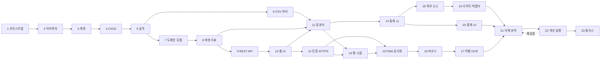

# 작업 계획과 진행 현황

**작업을 재개할 때 이 문서부터 읽는다.** §1에서 현재 위치를 확인하고, §2 절차로 환경을 되살린
다음, §4의 해당 Task 항목을 펼쳐 작업을 이어간다.

- 설계 근거: [architecture.md](architecture.md)
- 레거시 데이터 사양: [legacy-schema.md](legacy-schema.md)
- 개발 관례: [../AGENTS.md](../AGENTS.md)

> **갱신 규칙**: 모든 Task PR은 이 문서의 §1(현재 위치), §3(체크리스트), §5(결정 로그),
> §6(열린 질문) 갱신을 **같은 PR에 포함**한다. 문서 갱신 없는 Task는 완료로 보지 않는다.

---

## 1. 현재 위치

| 항목 | 값 |
|---|---|
| 최종 갱신 | 2026-08-01 |
| 완료된 Task | **Task 1 ~ Task 9** |
| 다음 착수 Task | **Task 10 — 웹 UI 수직 슬라이스** |
| 현재 브랜치 | `feature/rest-api` (Task 9) |
| 진행 중 잔여 항목 | 없음 |
| 최신 버전 | `0.1.0` (미태그. 태그는 Task 23에서만) |

> 세션이 바뀌어 이어받는 경우 [handoff.md](handoff.md) 를 먼저 읽는다. 환경 함정과 재개
> 절차를 5분 안에 파악할 수 있게 정리해 두었다.

### 즉시 해야 할 일 (Task 10)

API 는 준비됐다(엔드포인트 17개). 이제 화면을 붙인다.

1. 반응형 레이아웃 — PC 테이블 뷰 / 모바일 카드 뷰
2. 제품 목록 + 필터 사이드바 — `GET /products` 의 필터를 UI 로 노출.
   무한 스크롤은 `next_cursor` 를 그대로 이어 보낸다
3. 제품 상세 — 구매 이력, 병 목록, 파생 지표
4. 제품·구매 등록 폼 — 제품·규격·구매를 한 폼에서 만들 수 있게 해 4계층 입력 부담을 완화
5. **카테고리 관리 화면** — 계층 트리에서 추가·이름 변경·이동·순서 변경·삭제·병합.
   삭제 시 하위·소속 제품 처리 방식을 사용자에게 묻는다 (§5-D24, D25)
6. 사진 첨부 업로드
7. 접근성 — 키보드 내비게이션, 라벨 연결, 명암비, 트리 조작의 키보드 접근성

### 차단 요인

없음.

### 로컬 환경 기동

```bash
make install      # 의존성 설치 + git 훅 활성화
make db-up        # PostgreSQL 기동 (Docker, 운영과 같은 postgres:17-alpine)
make migrate
make api          # 다른 터미널에서 make web
make check        # CI 와 동일한 전체 검증
```

Docker 를 쓸 수 없는 상황에서는 폴백을 쓴다. `scripts/dev-db.sh` 가 micromamba 로 홈
디렉토리에 PostgreSQL 17 을 설치해 root 없이 실행한다.

```bash
make db-local-setup   # 최초 1회
make db-local-start
export SOOLJANG_DATABASE_URL=postgresql+psycopg://sooljang@127.0.0.1:54329/sooljang_dev
```

> Docker 를 설치한 직후에는 `docker` 그룹 추가가 기존 셸 세션에 반영되지 않아
> `permission denied ... /var/run/docker.sock` 가 발생한다. 새 셸을 열거나
> `sg docker -c "docker ..."` 로 감싼다.

---

## 1-1. CI 잡 활성화 상태

Task 4의 품질 게이트는 프로젝트 파일 존재 여부로 잡을 게이팅한다. Task 5에서 해당 파일이
추가되어 모든 잡이 활성화되었다.

| 잡 | 활성 조건 | 현재 |
|---|---|---|
| `commit-convention` | 항상 | ✅ 동작 |
| `workflow-lint` | 항상 | ✅ 동작 |
| `secret-scan` | 항상 | ✅ 동작 |
| `python-quality` | `pyproject.toml` | ✅ 활성 (Task 5) |
| `migration-check` | `alembic.ini` | ✅ 활성 (Task 5) |
| `web-quality` | `web/package.json` | ✅ 활성 (Task 5) |
| `docker-build` | `Dockerfile` 또는 `docker/*.Dockerfile` | ✅ 활성 (Task 5) |
| `quality-gate` | 항상 (skipped 는 통과로 취급) | ✅ 동작 |

CI 는 `services: postgres`(`postgres:17-alpine`)를 쓰므로 로컬 Docker 부재와 무관하다.

---

## 2. 재개 절차

```bash
cd /mnt/e/projects/SoolJang

# 1) 위치 확인
git status -sb
git log --oneline -5
gh pr list --state all --limit 5

# 2) main 최신화
git switch main && git pull --ff-only

# 3) git 훅 활성화 (클론 직후 1회. main 직접 푸시·버전 태그 푸시를 차단한다)
bash scripts/install-hooks.sh

# 4) 개발 환경 (Task 5 이후 유효)
uv sync                       # Python 의존성
npm ci --prefix web           # 프론트엔드 의존성
cp .env.example .env          # 최초 1회, 값 채우기

# 5) 검증
uv run ruff check . && uv run ruff format --check .
uv run ty check
uv run pytest                 # 브랜치 커버리지 85% 강제
npm --prefix web run check    # 포맷·린트·타입·테스트·빌드
bash scripts/scan-secrets.sh  # 시크릿·개인 데이터 커밋 여부

# 6) 새 Task 시작
git switch -c feature/<task-slug>
```

Task 5 이전에는 `uv`·`npm` 프로젝트가 아직 없어 4~5단계 일부를 건너뛴다.

---

## 3. Task 체크리스트

상태: ⬜ 대기 · 🟡 진행중 · ✅ 완료

| # | Task | 상태 | 브랜치 | PR |
|---|---|---|---|---|
| 1 | 환경 부트스트랩 — 디렉토리와 private repo 생성 | ✅ | (main 부트스트랩) | — |
| 2 | 아키텍처 설계 문서 | ✅ | `feature/architecture-docs` | [#1](https://github.com/jihoon22-lee/SoolJang/pull/1) |
| 3 | 상세 작업 계획 문서 | ✅ | `feature/work-plan-doc` | [#2](https://github.com/jihoon22-lee/SoolJang/pull/2) |
| 4 | CI/CD 워크플로 구축 | ✅ | `feature/ci-cd` | [#3](https://github.com/jihoon22-lee/SoolJang/pull/3) |
| 5 | 애플리케이션 골격 | ✅ | `feature/app-skeleton` | [#4](https://github.com/jihoon22-lee/SoolJang/pull/4) |
| 6 | 레거시 CSV 블록 분리 파서 | ✅ | `feature/legacy-parser` | [#5](https://github.com/jihoon22-lee/SoolJang/pull/5) |
| 7 | 도메인 모델과 마이그레이션 | ✅ | `feature/domain-model` | [#6](https://github.com/jihoon22-lee/SoolJang/pull/6) |
| 8 | 파생 지표 계산 계층 | ✅ | `feature/derived-metrics` | [#7](https://github.com/jihoon22-lee/SoolJang/pull/7) |
| 9 | REST API와 검색·필터·정렬 | ✅ | `feature/rest-api` | [#8](https://github.com/jihoon22-lee/SoolJang/pull/8) |
| 10 | 웹 UI 수직 슬라이스 | ⬜ | `feature/web-ui-slice` | |
| 11 | 레거시 데이터 임포터 | ⬜ | `feature/legacy-import` | |
| 12 | 인증과 로컬 HTTPS 접근 환경 | ⬜ | `feature/auth-https` | |
| 13 | 개별 병 관리와 시음 세션 | ⬜ | `feature/bottles-tastings` | |
| 14 | 통계 대시보드 v1 | ⬜ | `feature/stats-v1` | |
| 15 | PWA와 오프라인 동기화 | ⬜ | `feature/pwa-sync` | |
| 16 | 바코드 스캔과 제품 매칭 | ⬜ | `feature/barcode-scan` | |
| 17 | 라벨 OCR 프리필 | ⬜ | `feature/label-ocr` | |
| 18 | 외부 소스 레지스트리와 온디맨드 조회 | ⬜ | `feature/external-sources` | |
| 19 | 사이트별 어댑터와 시세 이력 | ⬜ | `feature/site-adapters` | |
| 20 | 통계 v2 — 커스텀 피벗과 취향 분석 | ⬜ | `feature/stats-v2` | |
| 21 | 자체 통합 테스트와 다각도 분석 | ⬜ | `feature/self-review` | |
| 22 | 분석 결과 기반 개선 실행 | ⬜ | `feature/improvements-*` | |
| 23 | 첫 정식 릴리스와 배포 | ⬜ | `release/v1.0.0` | |

### 의존 관계



Task 21 → 22 는 **반복 루프**다. 분석에서 도출된 개선안을 실행하고 다시 검증하며, 남은
개선안이 없거나 릴리스 이후로 미룰 항목만 남았을 때 Task 23 으로 넘어간다. 릴리스를 분석
뒤에 두는 이유는 이미 개선 여지를 아는 상태로 `v1.0.0` 을 내보내지 않기 위해서다.

핵심 마일스톤은 **Task 12**다. 이 지점에서 폰으로 HTTPS 접속해 실제 데이터를 보게 되므로,
이후 Task는 실사용 피드백을 받으며 진행할 수 있다.

---

## 4. Task 상세

각 Task는 PR 1개다. 완료 조건을 모두 만족해야 머지한다.

### ✅ Task 1 — 환경 부트스트랩

- **산출물**: `/mnt/e/projects/SoolJang`, git 저장소, `jihoon22-lee/SoolJang`(private),
  `.gitignore`, `README.md`, `AGENTS.md`, `.editorconfig`
- **완료 조건**: private 저장소 생성, `main` 추적, 초기 커밋 푸시
- **결과**: 커밋 `652d98d`. `gh repo view`로 `"visibility":"PRIVATE"` 확인
- **비고**: 저장소 생성 커밋만 `main` 직접 푸시를 허용했다(부트스트랩 예외). 이후는 전부 PR

### ✅ Task 2 — 아키텍처 설계 문서

- **산출물**: `docs/architecture.md`(665줄), `docs/legacy-schema.md`(275줄)
- **완료 조건**: 데이터 모델·API·동기화·배포·위협 모델·ADR 기술, 레거시 실측 근거 기록,
  mermaid 문법 검증
- **결과**: PR [#1](https://github.com/jihoon22-lee/SoolJang/pull/1) 머지. mermaid 5개 전체 통과
- **주요 산출 사실**: §5 결정 로그 D3~D8 참조

### ✅ Task 3 — 상세 작업 계획 문서

- **산출물**: `docs/plan.md` (이 문서)
- **완료 조건**: 이 문서만 읽고 다음 할 일을 특정할 수 있다. 재개 절차, 의존 그래프, 결정 로그,
  열린 질문 포함
- **결과**: PR [#2](https://github.com/jihoon22-lee/SoolJang/pull/2)

### ✅ Task 4 — CI/CD 워크플로 구축

- **산출물**
  - `.github/workflows/quality.yml` — PR 트리거. 잡 8개: `detect`, `commit-convention`,
    `workflow-lint`, `secret-scan`, `python-quality`, `migration-check`, `web-quality`,
    `docker-build`, 그리고 단일 필수 체크 역할의 `quality-gate`
  - `.github/workflows/release.yml` — `v*.*.*` 태그 + `workflow_dispatch`(dry-run 기본값 true).
    **작성만 하고 실행하지 않았다**
  - `.github/release.yml`, `.github/pull_request_template.md`, `.github/ISSUE_TEMPLATE/`
  - `.githooks/commit-msg`, `.githooks/pre-push`, `scripts/install-hooks.sh`,
    `scripts/check_commit_message.sh`, `scripts/scan-secrets.sh`, `.node-version`
- **검증 결과**
  - `actionlint` 1.7.12 + `shellcheck` 0.11.0 — 오류 0
  - 커밋 메시지 검증: 정상 3종 통과, 비정상 3종 거부, 머지 커밋 예외 통과
  - `pre-push`: `main` 푸시 차단(exit 1), `v1.0.0` 태그 푸시 차단(exit 1),
    `SOOLJANG_ALLOW_TAG_PUSH=1` 우회 통과, feature 브랜치 통과
  - 시크릿 스캔: 정상 상태 통과, `alcohol.csv`·OpenAI 키 패턴 주입 시 2건 검출
- **설계 판단**
  - Task 5 이전에는 Python·Node 프로젝트가 없다. `detect` 잡이 파일 존재 여부를 출력하고
    후속 잡이 이를 조건으로 삼아, 워크플로가 지금도 유효하고 Task 5에서 자동 활성화된다
  - Docker 관련 서드파티 액션을 쓰지 않고 러너 내장 `buildx`를 직접 호출한다. 공급망 표면을
    줄이고 검증되지 않은 액션 SHA를 pin 하지 않기 위한 선택이다
  - 개별 검사를 `continue-on-error`로 돌리고 마지막에 합산한다. 첫 실패에서 멈추면 나머지
    문제를 다음 실행에서야 알게 되어 왕복이 늘어난다
  - `quality-gate`가 `needs.*.result`를 합산해 `skipped`는 통과로 취급한다. 게이팅된 잡이
    필수 체크를 영구 대기 상태로 만드는 문제를 피한다

### ✅ Task 5 — 애플리케이션 골격

- **산출물**
  - `pyproject.toml` (uv + hatchling, Python 3.14, ruff line-length 100, pytest 브랜치 85% 게이트)
  - `src/sooljang/` — `config.py`(환경 변수 설정, 시크릿 기본값 없음), `api/app.py`(앱 팩토리),
    `api/routes/health.py`, `infrastructure/database/{session,base}.py`
  - `web/` — Vite + React 19 + TS + Biome + Vitest. npm 스크립트 `lint`·`typecheck`·
    `test:coverage`·`build`·`check` (CI 가 호출하는 이름)
  - `alembic.ini`, `migrations/env.py`, `0001_enable_pg_trgm` 마이그레이션
  - `docker/{api,web}.Dockerfile`, `docker/nginx.conf`, `docker-compose.yml`
  - `Makefile`(21개 명령), `.env.example`, `scripts/dev-db.sh`
- **검증 결과**
  - `ruff check`·`ruff format --check`·`ty check` — 전부 통과
  - `pytest` — 30개 통과, **브랜치 커버리지 100%** (기준 85%)
  - Vitest — 11개 통과, 커버리지 100% stmts / 95.65% branch (기준 80%)
  - `vite build` — 성공 (76 모듈, 229.85 kB)
  - Alembic up → down → up 왕복 성공 (사용자 영역 인스턴스와 Docker `postgres:17-alpine`
    양쪽에서 확인). `pg_trgm` 생성·삭제 확인
  - **Docker Compose 전체 스택 기동 성공** — `db`/`api`/`web` 모두 `healthy`.
    `docker/api.Dockerfile`·`docker/web.Dockerfile` 이미지 빌드 성공
  - web 컨테이너(8080)를 통한 `/api/v1/health` → `200 {"status":"ok","environment":
    "production","database_connected":true,"migration_revision":"0001_enable_pg_trgm"}`
    → 리버스 프록시 경로까지 검증됨
  - `make check` 전체 통과
- **설계 판단**
  - 시크릿에 기본값을 두지 않는다. 기본값이 있으면 설정을 잊은 채 배포되어도 동작해
    잘못된 구성이 조용히 통과한다
  - `/health` 는 DB 장애 시 503 과 함께 본문을 반환한다. 프론트엔드는 503 을 오류로 던지지
    않고 degraded 로 표시한다. 상태 표시 화면이 사라지면 원인을 알 수 없다
  - 제약 이름 규칙(`NAMING_CONVENTION`)을 metadata 에 고정했다. 이름 없는 제약은 Alembic
    downgrade 에서 찾을 수 없어 왕복이 깨진다
  - Compose 포트를 `127.0.0.1` 에만 바인딩한다. 외부 노출은 `tailscale serve` 가 담당한다
  - 프론트엔드 컨테이너가 정적 자산 서빙과 `/api` 프록시를 겸한다. Tailscale 이 머신당
    인증서 1개만 발급하므로 단일 진입점이 필요하다
  - uv 공식 이미지에 Python 3.14 태그가 없어, `python:3.14-slim` 위에 버전을 고정한 설치
    스크립트로 uv 를 넣는다. 버전을 고정하지 않으면 재현 가능한 빌드가 깨진다

### ✅ Task 6 — 레거시 CSV 블록 분리 파서

- **산출물** `src/sooljang/infrastructure/legacy/`
  - `blocks.py` — 블록 분리. 헤더 시그니처 인식, 빈 행 통과, 합계행 배제, 가로 배치
    블록 모양 판정
  - `normalize.py` — CP949 금액(`\`=₩), 용량, 도수, 정수, 평점(6점), 다중값 분해,
    이름/부가설명 분리, 후행 빈티지 추출, 외부 평점 소스 태그 파싱, 비고 외화 파싱,
    중복 판정용 이름 정규화
  - `categories.py` — 기본 시드 계층(사용자가 자유롭게 관리), forward-fill, 미분류 보존
  - `varieties.py` — 오타 정규화 사전(실측 `Carbernet Sauvignon` 포함), 다중값 중복 제거
  - `records.py` — 행→레코드 변환, **총액→병당 단가 환산**, 경고 수집, 집계 리포트
  - `report.py` — 데모·dry-run 용 요약 출력 CLI
  - `scripts/generate_legacy_fixture.py` — 합성 픽스처 생성 (실제 데이터 비커밋)
- **검증 결과**
  - 합성 픽스처 테스트 **145개 통과, 커버리지 98%** (기준 85%)
  - **실제 시트 대조 검증 14개 전부 통과** (opt-in): 레코드 429건, 병수
    1,078/819/259/225/34, 정가 42,401,108원, 실구매 36,495,454원, 총 용량 704,970ml,
    고유 구매처 82곳, 다중 구매처 28행, 빈티지 99행, 외부 평점 태그 RB 28·U 19·BA 18·
    무태그 107, 외화 15행, 주종 전파 실패 0건, 총액→병당 단가 환산이 시트 평단가 컬럼과
    380건 이상 비교해 불일치 0
  - 데모 CLI 출력이 문서 기준값과 정확히 일치. 빈 행 [326] 통과, 합계행 [432] 배제,
    통계 블록 100행 배제, 경고 0건
- **설계 판단**
  - 빈 행에서 종료하지 않고 **행 모양으로 판정**한다. 실측 326행 빈 줄이 데이터 종료가
    아니기 때문이다
  - 가로 배치 블록(실측 464~476)은 이름·병수 조건을 모두 통과한다. **도수 칸이 비어
    있지 않다면 유효한 도수여야 한다**는 조건이 유일한 방어선이다. 합계행 도달만으로도
    실측 파일은 처리되지만, 합계행이 없는 시트에서도 안전하도록 모양 자체로 판정한다
  - 형식이 깨진 행 하나로 블록을 끝내지 않는다. 연속 2회일 때만 종료한다
  - 파싱 실패는 예외 대신 경고로 모은다. 429행 중 한 행의 이상값이 전체 임포트를
    중단시키면 사용자는 아무것도 얻지 못한다
  - 사전에 없는 주종·품종은 버리지 않고 보존한다. 데이터를 조용히 잃는 것보다 사용자가
    나중에 옮길 수 있게 하는 것이 낫다
  - 테스트 격리 결함을 수정했다. 설정이 개발자의 로컬 `.env` 를 읽어 CORS 테스트가
    환경에 따라 실패했다. `SOOLJANG_ENV_FILE` 재정의 지점을 추가해 차단

### ✅ Task 7 — 도메인 모델과 마이그레이션

- **산출물**
  - `infrastructure/database/models/category.py` — `Category`(자기참조), `Producer`, `Variety`
  - `infrastructure/database/models/product.py` — `Product`, `ProductVariety`, `Sku`
  - `infrastructure/database/models/inventory.py` — `Vendor`, `Purchase`, `Bottle`
  - `application/categories.py` — 재귀 CTE 조회, 순환 검사, 깊이 상한, 시드 upsert
  - 마이그레이션 `0002_domain_model` (테이블 9개)
- **검증 결과**
  - **45개 DB 테스트 통과.** 전체 190개 통과, 커버리지 97% (기준 85%)
  - 마이그레이션 up → down → up 왕복 성공, `alembic check` 드리프트 없음
  - metadata 기준 드리프트 검사도 통과 (`compare_metadata` 결과 빈 목록)
  - 깊이 8까지 계층 생성 성공, 9단계 시도는 `CategoryDepthError`
  - 후손을 부모로 지정하는 이동은 `CategoryCycleError` 로 거부. 서브트리 동반 이동 확인
  - 같은 제품에 서로 다른 구매처·가격·구매일의 구매 건 2개 저장 성공 (엑셀 한계 해결 확인),
    병 3개가 개별 레코드로 생성
  - 제약 검증: 도수 범위, 빈티지 범위, 6점 평점, 용량 양수, 병수 양수, 외화에 환율 필수,
    미개봉에 개봉일 금지, 소진 시 잔량 0, 소진일 ≥ 개봉일, 병 순번 유일, 바코드 사용자 범위 유일
  - `user_id` 스코프 격리 확인 (다른 사용자의 계층이 섞이지 않음)
- **설계 판단**
  - `Enum` 컬럼은 **값**으로 저장한다. SQLAlchemy 기본은 멤버 **이름**(`UNOPENED`)을 저장해
    `status <> 'unopened'` CHECK 제약이 절대 일치하지 않고 조용히 무력화된다. 실제로 이 문제로
    두 제약이 통과해 버리는 것을 테스트가 잡아냈다. `str_enum_column` 헬퍼로 고정
  - 유일 인덱스는 `deleted_at IS NULL` 부분 인덱스로 만든다. 그러지 않으면 soft delete 후
    같은 이름을 다시 만들 수 없다
  - `Producer` 에 종류 구분을 강제하지 않는다. 주종을 넘나드는 생산자가 있어 분류를 강제하면
    사용자가 맞지 않는 값을 고르게 된다
  - 재귀 CTE 의 경로 컬럼은 `text` 로 캐스팅해야 한다. PostgreSQL 은 비재귀 항과 재귀 항의
    타입이 같아야 하고, `varchar(120)` 과 연결 결과 `text` 가 달라 실패한다
  - 경로 구분자는 `\x1f`(unit separator). 카테고리 이름에 나타날 수 없는 문자여야
    `와인 > 레드와인` 같은 이름을 쪼갤 때 오작동하지 않는다
  - conftest 가 모델을 명시적으로 import 한다. 없으면 `Base.metadata` 가 비어 `create_all` 이
    아무 테이블도 만들지 않고 그 사실이 조용히 통과한다
  - `alembic.ini` 의 post-write 훅을 `console_scripts` → `exec` 로 바꿨다. `ruff` 는 별도
    실행 파일이라 alembic 프로세스 안에서 entrypoint 를 찾지 못한다

### ✅ Task 8 — 파생 지표 계산 계층

- **산출물**
  - `domain/metrics.py` — 순수 함수. SQLAlchemy·HTTP 를 import 하지 않아 DB 없이 테스트 가능
  - `infrastructure/database/metrics_sql.py` — 같은 공식의 SQL 구현 (목록·통계 성능 경로)
  - `tests/domain/test_metrics.py` — 단위 테스트 31개
  - `tests/infrastructure/database/test_metrics_parity.py` — **두 구현 일치 검증 12개**
- **검증 결과**
  - 전체 **233개 통과, 커버리지 98%** (기준 85%). 프론트엔드 11개 통과, 빌드 성공
  - ruff / ruff format / ty 전부 통과
  - 레거시 실측 케이스 재현: 750ml 1병 23,980원 → 100ml당 3,197.33원,
    500ml 2병 32,000원 → 평단가 16,000원·100ml당 3,200원,
    평단가 219,900/750ml → 29,320원(정가 기준. 실구매 기준이면 23,986.67원으로 어긋난다)
  - 일치 검증 시나리오 12종: 단일/다중 구매, 다중 용량 가중 평균, 선물(가격 결측),
    전부 선물, 정가만 있는 경우, 부분 가격 할인율, 증여·판매 제외, 병 없는 제품,
    사용자 스코프, soft delete 제외, 도메인 상태 문자열과 ORM enum 값 일치
- **설계 판단**
  - 가격 정보가 없을 때 **0 이 아니라 None** 을 반환한다. 0 을 반환하면 "전부 무료" 와
    "가격 정보 없음" 을 구분할 수 없다
  - 평단가의 분모는 **가격이 있는 구매 건의 병수**다. 선물 병수가 분모에 들어가면
    평단가가 실제보다 낮게 나온다
  - 할인율은 정가와 실구매가가 **모두 있는** 구매 건만으로 계산한다. 한쪽만 있는 구매 건을
    섞으면 분자와 분모의 모집단이 달라져 왜곡된다
  - 100ml당 가격은 여러 용량이 섞인 경우를 위해 가중 평균으로 계산한다.
    `Σ(단가×병수)×100 / Σ(용량×병수)`. 단일 용량이면 단순 공식과 같은 결과다
  - 도메인 계층은 ORM enum 을 import 하지 않는다. import 하면 의존 방향이 뒤집힌다.
    값이 어긋나는 것은 전용 테스트가 잡는다
  - 병수 정합성 불일치는 예외 대신 경고다. 레거시 데이터가 완벽하지 않을 수 있고, 지표를
    아예 못 보는 것보다 경고와 함께 보는 것이 낫다
  - SQL 은 `NULLIF` 로 0 분모를 NULL 로 바꿔 나눗셈 오류 대신 NULL 을 만든다

### ✅ Task 9 — REST API와 검색·필터·정렬

- **산출물** (엔드포인트 17개)
  - `api/errors.py` — RFC 9457 Problem Details. 도메인 예외·검증 실패·DB 제약 위반·HTTP
    예외를 한 형식으로 통일
  - `api/pagination.py` — `(정렬키, id)` 복합 커서. 불투명 문자열로 인코딩
  - `api/deps.py` — 세션과 현재 사용자. **Task 12 에서 실제 인증으로 교체할 지점**
  - `api/schemas/{category,product}.py` — 요청·응답 스키마
  - `api/routes/{categories,products,purchases}.py` — 라우터
  - `application/products.py` — 필터·검색·정렬 쿼리 조립
  - `application/categories.py` 확장 — 삭제 전략, 병합, 순서 변경, 제품 수 롤업
- **검증 결과**
  - 전체 **317개 통과, 커버리지 95%** (기준 85%). ruff/format/ty 통과
  - API 테스트 67개: 카테고리 20, 제품 27, 구매 18, 페이지네이션 19(단위)
  - 실서버 데모: "도수 40% 이상 + 위스키(하위 포함) + 재고 있음 + 100ml당 가격 오름차순"
    → 라프로익 12,857.14원 / 글렌알라키 21,428.57원 순으로 정렬. 재고 없는 위스키와
    저도수 리큐르는 제외됨
  - 한글 부분 검색, Problem Details(404·422 필드 오류), 구매 건 분할 모두 실서버 확인
- **설계 판단**
  - **커서 페이지네이션.** offset 은 목록을 보는 중에 술을 등록하면 중복·누락이 생긴다.
    정렬키만으로는 값이 같은 행에서 순서가 불안정해 `id` 를 tie-breaker 로 항상 붙인다
  - **NULL 정렬키를 명시적으로 처리.** NULL 비교는 항상 거짓이라 커서 조건에 그대로 넣으면
    나머지 페이지가 조용히 사라진다. 레거시에 도수 결측 26건, 평점 결측 114건이 있어 실제로
    발생하는 문제다. `nullslast()` 와 NULL 그룹 전용 분기로 해결하고 회귀 테스트로 고정
  - **구매 건이 없는 제품도 목록에 남는다.** 지표 서브쿼리를 LEFT JOIN 한다. 등록만 하고
    구매 기록을 넣지 않은 술이 사라지면 데이터가 없어진 것으로 오해한다
  - **지표 조회는 구매 건이 없어도 404 가 아니다.** "구매 기록이 아직 없다" 는 정상 상태를
    오류로 알리면 안 된다. 병수 0, 금액 null 로 응답한다
  - **금액을 응답 경계에서 정규화한다.** SQL 은 `Numeric(20,4)` 로 계산해
    `12857.142857142857900000` 처럼 나오는데, 그대로 내보내면 화면에서 잘라야 하고 순수 함수
    구현의 출력과 형식이 달라진다
  - **구매 건 응답은 항상 DB 값을 읽는다.** flush 직후 인메모리 값은 입력 그대로 `85000` 이지만
    저장된 값은 `85000.00` 이다. 생성 직후와 재조회 형식이 다르면 클라이언트가 같은 필드를
    두 방식으로 처리해야 한다
  - **부모 변경을 `PATCH` 에 섞지 않고 `:reparent` 로 분리.** 순환 검사와 깊이 검사가 필요한
    별개의 연산이다
  - **구매 건 분할은 병 레코드를 재배치한다.** 새로 만들면 시음 기록이 끊긴다
  - **구매처 삭제는 사용 중이면 거부.** 구매 건의 구매처를 NULL 로 만들면 "어디서 샀는지
    모름" 과 구분할 수 없게 된다

### ⬜ Task 10 — 웹 UI 수직 슬라이스

- **산출물**: 반응형 레이아웃(PC 테이블 / 모바일 카드), 제품 목록 + 필터, 제품 상세(구매 이력·
  병 목록·파생 지표), 제품·구매 등록·수정 폼, 사진 첨부
- **카테고리 관리 화면 (§5-D24)**: 계층 트리 뷰에서 추가·이름 변경·드래그 이동·순서 변경·
  삭제·병합. 삭제 시 하위·소속 제품 처리 방식을 사용자에게 묻는다
- **테스트**: 컴포넌트 렌더, 폼 검증, 모바일 뷰포트, 접근성(키보드·라벨 연결·명암비),
  트리 조작의 키보드 접근성
- **데모**: 브라우저에서 술 등록 후 구매 건 2건 추가 → 지표 갱신 확인. 카테고리를 새로
  만들어 제품에 지정하고 다른 부모로 옮겨 보기
- **주의**: 제품·규격·구매를 한 폼에서 만들 수 있게 해 4계층 입력 부담을 완화한다

### ⬜ Task 11 — 레거시 데이터 임포터

- **산출물**: 업로드 → 블록 분석 → 매핑 조정 UI → dry-run 미리보기 → 적재,
  제품 자동 병합(`normalized_name`+`vintage`+`abv`), 구매처 개행 분할 시도,
  실패 행 리포트, 재실행 멱등성
- **테스트**: 익명화 fixture 회귀, 병합, 재실행 중복 방지, **[legacy-schema.md](legacy-schema.md)
  §5 기준값 전체 대조**(1,078/819/259/225/34병, ₩42,401,100, ₩36,495,447, 704,970ml, 평점 3.4,
  구매처 82개)
- **데모**: 실제 기록 429행 전량 이관 후 요약 리포트가 엑셀 합계와 일치
- **주의**: 구매처 분할은 총합이 `구매` 병수와 맞지 않으면 포기하고 단일 구매 건으로 적재하되
  원문을 `import_note`에 보존한다

### ⬜ Task 12 — 인증과 로컬 HTTPS 접근 환경 🔑 핵심 마일스톤

- **산출물**: Argon2id 해시, 서버 세션 쿠키, CSRF, 레이트 리밋, 감사 로그, 전 API 인증 적용,
  Docker Compose 로컬 프로덕션 구성, `tailscale serve --https=443`, `pg_dump` 백업·복원 스크립트
- **테스트**: 미인증 차단, 세션 만료, 비밀번호 정책, 레이트 리밋, 백업·복원 왕복
- **데모**: 갤럭시 폰 크롬에서 `https://<머신>.<tailnet>.ts.net` 접속·로그인해 이관 데이터 조회
- **범위 제외**: 이미지 게시·릴리스 노트·버전 태그 (Task 23)

### ⬜ Task 13 — 개별 병 관리와 시음 세션

- **산출물**: 병 상태 전이(`:open`/`:finish`/`:gift`/`:sell`), 잔량 추적, 시음 세션 기록
  (날짜·따른 양·평점 6점 0.5단위·향/맛/피니시·사진·동석자·장소), 시음 타임라인
- **테스트**: 세션 기록 시 잔량 차감, 잔량 초과 거부, 상태 전이 제약, 세션 평균 평점,
  평점 변화 추이
- **데모**: 병 개봉 후 시음 2회 기록 → 잔량 감소와 평점 추이

### ⬜ Task 14 — 통계 대시보드 v1 (엑셀 통계 재현)

- **산출물**: 병당 가격·총 구매액·100ml당 가격·개인 평점 랭킹, 주종별 집계(병수·총액·평균 도수·
  평균 평점·평균 100ml가·할인율), 전체 합계, 주종 분포 차트
- **테스트**: **엑셀 실측 통계값과 대조**, 동점 처리, 빈 데이터, 대량 데이터 성능
- **데모**: 엑셀 통계표(주종별 통계 26행, 랭킹 3종, 합계)와 앱 화면 비교해 일치
- **주의**: 100ml당 가격은 **정가 기준**이다([legacy-schema.md](legacy-schema.md) §4.2)

### ⬜ Task 15 — PWA와 오프라인 동기화

- **사양**: [architecture.md](architecture.md) §5
- **산출물**: Workbox 앱 셸, Dexie 로컬 미러, outbox 직렬 큐, `GET /sync?since=`,
  `(updated_at, id)` 복합 커서, LWW 병합, soft delete 전파, 충돌 로그, 동기화 상태 UI, manifest
- **테스트**: 오프라인 생성 후 재전송, 동시 수정 LWW, 삭제 전파, idempotency 중복 방지,
  부모-자식 순서 보장
- **데모**: 폰 비행기 모드에서 등록 → 복구 시 PC 반영

### ⬜ Task 16 — 바코드 스캔과 제품 매칭

- **산출물**: `BarcodeDetector` + `@zxing/browser` 폴백 스캐너, 로컬 SKU → Open Food Facts →
  검색 폴백, 사용자 확인 후 바코드 학습 저장
- **테스트**: EAN-13/UPC-A 정규화, 로컬 히트·미스 분기, 외부 실패 시 수동 경로, RCN 경고
- **데모**: 실제 병 바코드 스캔으로 기존 제품 즉시 매칭
- **전제**: Task 12의 HTTPS(secure context)가 없으면 카메라가 동작하지 않는다

### ⬜ Task 17 — 라벨 OCR 프리필

- **산출물**: Vision LLM 구조화 추출(이름·생산자·도수·용량·빈티지·숙성연수·주종 추정),
  필드별 신뢰도 표시, 사용자 검수 후 저장, 원본·결과 보관
- **테스트**: 고정 이미지 fixture로 스키마 검증(LLM 목킹), 저신뢰 필드 표시, 실패 시 수동 폴백,
  실호출은 opt-in 마커
- **데모**: 라벨 촬영으로 폼 자동 완성

### ⬜ Task 18 — 외부 소스 레지스트리와 온디맨드 조회

- **사양**: [architecture.md](architecture.md) §7
- **산출물**: `external_source` 관리 UI(등록·수정·비활성·삭제·주종 범위·우선순위),
  `GenericSearchAdapter`, 스냅샷 저장, TTL 캐시·rate limit·robots.txt, 제품 상세 외부 정보 카드
- **테스트**: 어댑터 계약, 캐시 히트·만료, rate limit, 부분 결과 저장, **출처 URL 누락 시 저장 거부**
- **데모**: 보유 위스키에서 외부 평점·판매가·후기 요약을 출처와 함께 조회
- **주의**: 레거시 임포트가 넣은 `legacy://excel` 평점을 실측 조회로 갱신하는 경로를 포함한다

### ⬜ Task 19 — 사이트별 어댑터와 시세 이력

- **산출물**: YAML 셀렉터 `SiteAdapter`, 추천 소스 자동 탐색·승인 등록, 가격 시계열 차트,
  목표가 감시와 웹 푸시 알림
- **테스트**: YAML 스키마 검증, 셀렉터 파손 시 graceful 실패·`degraded` 표시, 시계열 집계,
  알림 중복 방지
- **데모**: 사이트 등록 후 가격 수집 → 추이 그래프와 목표가 알림

### ⬜ Task 20 — 통계 v2 — 커스텀 피벗과 취향 분석

- **산출물**: 피벗 뷰 빌더(그룹·집계·필터·정렬 저장), 시계열(월별 지출·누적 자산·소비 속도·
  개봉 후 소진 기간), 구매처별 할인율·절약액, 분포 히스토그램, 가성비 지표,
  개인 vs 외부 평점 상관, CSV·엑셀 내보내기, 읽기 전용 공유 링크
- **테스트**: 피벗 정의 직렬화·복원, 집계 정확성, 대량 성능, 내보내기 왕복, 공유 권한 격리
- **데모**: "구매처별 × 주종별 평균 할인율" 뷰 저장, 취향 리포트, 엑셀 내보내기

### ⬜ Task 21 — 자체 통합 테스트와 다각도 분석

기능 구현이 끝난 상태에서 **직접 써 보며** 개선 여지를 찾는다. 단위 테스트가 통과하는 것과
쓰기 좋은 것은 다른 문제다. 사용자 요구사항이며, 결과는 Task 22 의 입력이 된다.

- **통합 테스트 (실제 데이터 기준)**
  - 엔드투엔드 시나리오: 임포트 → 검색·필터 → 구매 건 추가·분할 → 병 개봉 → 시음 기록 →
    통계 확인 → 외부 정보 조회 → 오프라인 입력 후 동기화
  - 실사용 규모 성능: 429 제품 / 1,078병 기준으로 목록·통계·피벗 응답 시간 측정. 규모를
    10배로 늘린 합성 데이터에서도 확인
  - 모바일 실기기 검증: 갤럭시에서 입력 흐름, 바코드 스캔, OCR, 오프라인 전환
  - 장애 주입: DB 중단, 외부 소스 타임아웃, 셀렉터 파손, 동기화 충돌
  - 데이터 무결성: 백업 → 복원 → 통계 재계산 결과가 동일한지
- **다각도 분석**
  | 관점 | 확인할 것 |
  |---|---|
  | 입력 효율 | 술 1병을 기록하는 데 필요한 탭·입력 횟수. 엑셀보다 빨라졌는가 |
  | 정보 밀도 | 목록에서 판단에 필요한 정보가 한눈에 보이는가. 모바일에서 잘리지 않는가 |
  | 탐색 | 찾고 싶은 술에 도달하는 경로가 몇 단계인가. 검색·필터가 실제로 쓰이는가 |
  | 통계 유용성 | 엑셀에서 보던 것 외에 실제로 의사결정에 쓰이는 지표가 있는가 |
  | 접근성 | 키보드 전용 조작, 스크린리더, 명암비, 터치 타깃 크기 |
  | 성능 | 체감 지연이 있는 화면과 원인 |
  | 오류 회복 | 잘못 입력했을 때 되돌릴 수 있는가. 실수로 삭제한 기록을 복구할 수 있는가 |
  | 데이터 안전 | 백업이 실제로 복원되는가. 동기화가 기록을 잃지 않는가 |
- **산출물**: `docs/review-<날짜>.md` — 발견 사항, 근거(측정값·스크린샷·로그), 개선안 후보,
  영향도·난이도 평가, 우선순위. `docs/plan.md` §3 에 Task 22 하위 항목으로 등재
- **완료 조건**: 개선안이 우선순위와 함께 목록화되고, 각 항목이 "무엇을 왜 어떻게" 수준으로
  실행 가능하게 기술됨

### ⬜ Task 22 — 분석 결과 기반 개선 실행

Task 21 에서 도출된 개선안을 우선순위대로 실행한다. 항목별로 별도 PR 을 만들고
`feature/improvements-<slug>` 브랜치를 쓴다. 실행 후 Task 21 의 해당 검증을 다시 수행해
개선이 실제로 효과가 있었는지 확인한다.

- **범위 판단 기준**: 사용성·안정성·데이터 안전에 관한 것은 릴리스 전에 처리한다. 새 기능
  아이디어는 `docs/plan.md` §9(릴리스 후 백로그)로 옮기고 `v1.0.0` 을 막지 않는다
- **완료 조건**: 릴리스 전 처리로 분류한 항목이 모두 반영되고 재검증을 통과. 미룬 항목은
  백로그에 근거와 함께 기록
- **주의**: 이 단계에서 범위가 무한히 늘어날 수 있다. Task 21 에서 정한 우선순위를 임의로
  확장하지 않고, 새로 발견된 항목은 백로그에 넣는다

### ⬜ Task 23 — 첫 정식 릴리스와 배포

- **산출물**: 전체 회귀 통과, `v1.0.0` 태그, CHANGELOG, GHCR private 이미지, 자동 릴리스 노트,
  PC pull 배포, 백업·롤백 리허설, 운영 문서(업데이트 절차·백업 스케줄·클라우드 이전 지점)
- **테스트**: 릴리스 워크플로 전 단계 성공, 배포 이미지 스모크, 롤백 성공
- **데모**: 태그 1개 푸시로 릴리스 노트·이미지 생성, PC 재기동 후 폰에서 정상 동작
- **주의**: **여기가 유일하게 태그를 푸시하는 Task다.** `pre-push` 훅이 태그 푸시를 차단하므로
  `SOOLJANG_ALLOW_TAG_PUSH=1` 로 명시적으로 우회해야 한다

---

## 9. 릴리스 후 백로그

Task 21 분석에서 나왔지만 `v1.0.0` 을 막지 않는 항목을 여기에 모은다. 각 항목은 근거와 함께
기록해, 나중에 다시 판단할 때 맥락을 잃지 않게 한다.

| 항목 | 근거 | 비고 |
|---|---|---|
| (Task 21 이후 채운다) | | |

---

## 5. 결정 로그

| # | 결정 | 근거 |
|---|---|---|
| D1 | 프로젝트명 `SoolJang`, 패키지 `sooljang`, 표시명 "술장" | 사용자 선택 |
| D2 | 기존 `NaverBlogAutomation` 관례 계승 (uv·ruff·ty·pytest 85%·Biome·Vitest 80%·Conventional Commits·한글 우선 문서) | 학습 비용 최소화, 도구 일관성 |
| D3 | 레거시 `종류` 컬럼은 forward-fill 대상 (AI 분류 불필요) | 결측 94.1%인데 고유값 26개가 각 1회만 등장 = 그룹 구분자. forward-fill 후 전파 실패 0건 |
| D4 | 레거시 `가격`·`실구매가`는 총액. DB에는 병당 단가 저장 | `평단가 = 가격/구매병수` 391건 검증(불일치 0). 구매 건 분할 시 단가가 보존되어야 함 |
| D5 | 100ml당 가격은 **정가 기준** | 실구매 기준으로 계산하면 168건 불일치. 레거시 통계 재현을 위해 정가 기준 확정 |
| D6 | 개인 평점 스케일 0.5~6.0 (6점 만점) | 레거시 실측 값 분포 |
| D7 | 외부 평점은 소스별 분리 저장 (`external_rating`) | 레거시가 `3.40 (RB)`/`3.96/89 (BA)`/`3.578 (U)`처럼 소스·스케일이 다른 값을 한 셀에 담고 있음 |
| D8 | 주종 최상위는 와인·사케·전통주·맥주·양주 5개 | 레거시 통계 롤업 병수 170+12+120+642+134 = 1,078 (합계행 일치) |
| D9 | 브랜치 보호 대신 로컬 `pre-push` 훅 | 무료 플랜 private 저장소는 ruleset API가 HTTP 403 (`Upgrade to GitHub Pro`) |
| D10 | PR 머지는 merge commit (`gh pr merge --merge`) | "작은 단위는 커밋" 요구를 만족하려면 개별 커밋이 히스토리에 남아야 함. squash는 이를 잃는다 |
| D11 | 배포는 GHCR pull 방식 | GitHub Actions가 홈 PC로 인바운드 배포할 수 없음 |
| D12 | 릴리스 태그는 Task 23에서만 1회 | 사용자 지시. 워크플로는 미리 작성하고 dry-run으로만 검증 |
| D13 | UUIDv7 PK, 파생값 비저장, 서버 세션 쿠키, PostgreSQL, PWA | [architecture.md](architecture.md) §9 ADR 참조 |
| D14 | CI 잡을 프로젝트 파일 존재 여부로 게이팅 | Task 5 이전에는 Python·Node 프로젝트가 없다. 게이팅하면 워크플로가 지금도 유효하고 Task 5에서 자동 활성화된다 |
| D15 | 단일 필수 체크 `quality-gate`로 결과 합산 | 게이팅으로 `skipped`된 잡이 필수 체크를 영구 대기 상태로 만드는 문제를 피한다. `skipped`는 통과, `failure`·`cancelled`만 실패로 취급 |
| D16 | Docker 서드파티 액션 대신 러너 내장 `buildx` 직접 호출 | 공급망 표면 축소. 검증되지 않은 액션 SHA를 pin 하지 않는다 |
| D17 | 액션은 커밋 SHA로 pin | 기존 프로젝트에서 검증된 SHA를 재사용한다 (`actions/checkout@de0fac2` v6.0.2, `actions/setup-node@2499707` v6, `astral-sh/setup-uv@0880764` v8.1.0) |
| D18 | 시크릿 스캔은 자체 스크립트 | 이 프로젝트의 고유 위험(개인 음주 기록 파일, 자격증명)에 초점을 맞춘다. 외부 스캐너 의존과 라이선스 제약을 피하고, 필요하면 나중에 gitleaks 로 교체·병행한다 |
| D19 | `pre-push` 훅이 버전 태그 푸시도 차단 | 릴리스는 Task 23에서 1회만 수행해야 한다. 의도한 릴리스는 `SOOLJANG_ALLOW_TAG_PUSH=1`로 우회 |
| D20 | 개별 검사를 `continue-on-error`로 실행하고 마지막에 합산 | 첫 실패에서 멈추면 나머지 문제를 다음 실행에서야 알게 되어 수정 왕복이 늘어난다 |
| D21 | 로컬 DB 는 Docker Compose 를 기본, `scripts/dev-db.sh`(micromamba) 를 폴백으로 | 운영과 같은 `postgres:17-alpine` 을 쓰면 동작 차이가 없다. 폴백은 Docker 접근이 막힌 상황에서도 개발을 계속할 수 있게 한다. `pgserver` PyPI 는 Python 3.14 휠이 없어 배제 |
| D22 | 컨테이너 이미지는 `python:3.14-slim` + 버전 고정 uv 설치 스크립트 | uv 공식 이미지에 Python 3.14 태그가 없다. 버전을 고정하지 않으면 재현 가능한 빌드가 깨진다 |
| D23 | 시크릿 설정에 기본값을 두지 않는다 | 기본값이 있으면 설정을 잊은 채 배포되어도 동작해 잘못된 구성이 조용히 통과한다 |
| **D24** | **주종 계층은 사용자 데이터다. 깊이 제한 없이 추가·수정·이동·순서 변경·삭제·병합이 가능하고, 레거시에서 도출한 계층은 기본 시드일 뿐이다** | 사용자 요구. 개인 컬렉션의 분류 기준은 사용자마다 다르고 시간이 지나며 바뀐다. 고정 분류는 반드시 어긋난다. 상세는 [architecture.md](architecture.md) §2.3 |
| D25 | 카테고리 삭제는 제품을 지우지 않는다 | 개인 기록을 잃는 것이 가장 큰 손실이다. 하위·소속 제품이 있으면 기본은 거부하고, `promote_children`·`reassign` 전략을 명시적으로 지정해야 삭제된다 |
| D26 | `category.depth` 를 컬럼으로 저장하지 않는다 | 이동이 자유로워 매 이동마다 서브트리 전체를 갱신해야 하고, 값이 어긋나면 조회가 조용히 틀린다. 깊이는 조회 시 계산한다 |
| D27 | 시드 적용은 upsert | 사용자가 이름을 바꾸거나 삭제한 항목을 시드가 되살리면 사용자의 편집을 무시하는 셈이 된다 |
| D28 | 레거시 파서는 빈 행이 아니라 **행 모양**으로 블록 경계를 판정한다 | 실측 326행 빈 줄이 데이터 종료가 아니다. 가로 배치 블록(464~476)은 이름·병수 조건을 통과하므로 도수 칸의 유효성이 유일한 방어선이다 |
| D29 | 파싱 실패는 예외 대신 경고로 수집 | 429행 중 한 행의 이상값이 전체 임포트를 중단시키면 사용자는 아무것도 얻지 못한다 |
| D31 | `Enum` 컬럼은 멤버 **값**으로 저장한다 (`str_enum_column`) | SQLAlchemy 기본은 멤버 **이름**을 저장해 `status <> 'unopened'` 같은 CHECK 제약이 절대 일치하지 않고 조용히 무력화된다. 실제로 두 제약이 통과해 버리는 것을 테스트가 잡아냈다 |
| D32 | 유일 인덱스는 `deleted_at IS NULL` 부분 인덱스 | 그러지 않으면 soft delete 후 같은 이름을 다시 만들 수 없다 |
| D34 | 파생 지표는 순수 함수와 SQL 로 **이중 구현**하고 일치를 테스트로 보장한다 | 목록·통계에서 제품 수백~수천 건을 한 번에 계산해야 해 SQL 이 필요하고, 경계값 검증에는 순수 함수가 필요하다. 갈라지면 화면과 API 가 다른 값을 보여준다 |
| D35 | 가격 정보가 없으면 0 이 아니라 NULL/None | 0 을 반환하면 "전부 무료" 와 "가격 정보 없음" 을 구분할 수 없다 |
| D37 | 커서 페이지네이션 (`(정렬키, id)` 복합, 불투명 인코딩) | offset 은 데이터가 바뀌면 중복·누락이 생긴다. 정렬키만으로는 동일값 행에서 순서가 불안정하다. 불투명하게 만들어 클라이언트가 내부 구조에 의존하지 않게 한다 |
| D38 | NULL 정렬키를 별도 분기로 처리 | NULL 비교는 항상 거짓이라 나머지 페이지가 조용히 사라진다. 레거시에 도수 결측 26건, 평점 결측 114건 |
| D39 | 에러는 RFC 9457 Problem Details 로 통일 | FastAPI 기본 `{"detail": ...}` 는 필드별 오류를 표현하기 어렵고 타입 식별자가 없다. 폼 화면이 어느 입력에 오류를 표시할지 알아야 한다 |
| D40 | 금액은 응답 경계에서 소수 둘째 자리로 정규화 | SQL 은 정밀도를 유지해야 하지만 응답은 순수 함수 구현과 형식이 같아야 한다 |
| D36 | 평단가 분모는 가격이 있는 구매 건의 병수, 할인율은 양쪽 가격이 모두 있는 구매 건만 | 선물 병수가 분모에 들어가면 평단가가 실제보다 낮게 나오고, 한쪽만 있는 구매 건을 섞으면 할인율의 모집단이 어긋난다 |
| D33 | 재귀 CTE 경로 컬럼은 `text` 캐스팅, 구분자는 `\x1f` | PostgreSQL 은 비재귀 항과 재귀 항 타입이 같아야 한다. 구분자는 카테고리 이름에 나타날 수 없는 문자여야 경로 분해가 안전하다 |
| D30 | 테스트는 `SOOLJANG_ENV_FILE=""` 로 로컬 `.env` 를 차단한다 | 설정이 개발자의 `.env` 를 읽어 CORS 테스트가 환경에 따라 실패했다. 로컬과 CI 결과가 갈리면 게이트를 신뢰할 수 없다 |

---

## 6. 열린 질문

| # | 질문 | 상태 | 필요 시점 |
|---|---|---|---|
| ~~Q1~~ | ~~데이터베이스 실행 방식~~ | **✅ 해결 (Task 5)** — Docker Compose `postgres:17-alpine` 을 기본 경로로, `scripts/dev-db.sh`(micromamba, root 불필요) 를 폴백으로 확정. CI 는 Actions `services: postgres`. 세 환경 모두 PostgreSQL 17 | — |
| Q2 | 검색·LLM API 제공자와 예산. Task 17(OCR)·18(요약)에 필요. 기존 프로젝트에 `anthropic`·`google-genai`·`openai` 의존성이 있어 키 보유로 추정 | 미해결 | Task 17 |
| Q3 | 초기 등록할 외부 소스 사이트 목록. 국내 가격은 데일리샷·이마트·GS25 와인25+ 등 후보. 사용자 승인 필요 | 미해결 | Task 18 |
| Q4 | Tailscale 설치·로그인 여부와 tailnet 이름. HTTPS 인증서 발급에 필요 | 미해결 | Task 12 |
| Q5 | 웹 푸시 알림 채널. 목표가 알림을 웹 푸시로 할지 다른 수단(이메일 등)으로 할지 | 미해결 | Task 19 |
| Q6 | 지인 공유 시 권한 모델 상세. 읽기 전용 링크만으로 충분한지, 계정 발급이 필요한지 | 미해결 | Task 20 |

---

## 7. 품질 게이트 (Task 4에서 구현)

PR마다 아래를 모두 통과해야 머지한다.

| 검사 | 도구 | 기준 |
|---|---|---|
| Python 린트 | `ruff check` | 위반 0 |
| Python 포맷 | `ruff format --check` | 차이 0 |
| Python 타입 | `ty check` | 오류 0 |
| Python 테스트 | `pytest` | 브랜치 커버리지 ≥ 85% |
| TS 린트·포맷 | Biome | 위반 0 |
| TS 타입 | `tsc --noEmit` | 오류 0 |
| TS 테스트 | Vitest | 커버리지 ≥ 80% |
| 마이그레이션 | Alembic | up/down 왕복 성공, 모델-마이그레이션 드리프트 없음 |
| 컨테이너 | Docker build | 빌드 성공 |
| 커밋 형식 | commitlint | Conventional Commits 준수 |
| 워크플로 | `actionlint` | 오류 0 |
| 의존성 취약점 | `pip-audit`, `npm audit` | 고위험 0 |
| 시크릿 | 시크릿 스캔 | 검출 0 |

---

## 8. 절대 규칙

1. `main`에 직접 푸시하지 않는다 (저장소 부트스트랩 커밋만 예외)
2. 개발 기간 중 `v*.*.*` 태그를 푸시하지 않는다 (Task 23 전용)
3. 실제 음주 기록(`alcohol.csv`·`alcohol.xlsx`), `.env`, 백업 덤프, 업로드 이미지를 커밋하지 않는다
4. 테스트에는 익명화·축약 fixture만 사용한다
5. 모든 API는 인증을 요구한다 (`/health` 예외)
6. 파생값을 DB에 저장하지 않는다
7. 외부 데이터는 출처 URL 없이 저장하지 않는다
8. 모든 Task PR에 이 문서 갱신을 포함한다
