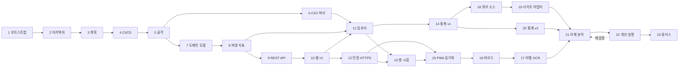

# 작업 계획과 진행 현황

**작업을 재개할 때 이 문서부터 읽는다.** §1에서 현재 위치를 확인하고, §2 절차로 환경을 되살린
다음, §4의 해당 Task 항목을 펼쳐 작업을 이어간다.

- 설계 근거: [architecture.md](architecture.md)
- 레거시 데이터 사양: [legacy-schema.md](legacy-schema.md)
- 개발 관례: [../AGENTS.md](../AGENTS.md)

> **갱신 규칙**: 모든 Task PR은 이 문서의 §1(현재 위치), §3(체크리스트), §5(결정 로그),
> §6(열린 질문) 갱신을 **같은 PR에 포함**한다. 문서 갱신 없는 Task는 완료로 보지 않는다.

---

## 1. 현재 위치

| 항목 | 값 |
|---|---|
| 최종 갱신 | 2026-08-02 (Task 17 PR) |
| 완료된 Task | **Task 1 ~ Task 17** |
| 다음 착수 Task | **Task 20 — 통계 v2** (Task 18·19 는 여전히 검색 API 미해결로 차단, 아래 참조) |
| 현재 브랜치 | `main` (Task 17 까지 머지 완료, 열린 PR 없음) |
| 진행 중 잔여 항목 | 없음 |
| 최신 버전 | `0.1.0` (미태그. 태그는 Task 23에서만) |

> 세션이 바뀌어 이어받는 경우 [handoff.md](handoff.md) 를 먼저 읽는다. 환경 함정과 재개
> 절차를 5분 안에 파악할 수 있게 정리해 두었다.

### 차단 요인 — Task 18·19 는 여전히 사용자 확인이 필요하다

Q2(§6)는 "검색·LLM API 제공자와 예산"을 하나로 묶고 있었지만, 실제로는 서로 다른 두
결정이었다. Task 17 PR 에서 **LLM 쪽만** 풀렸다 — 사용자가 OpenAI API 키를 제공했고,
`.env` 로 고정하는 대신 로그인 후 설정 화면에서 관리하게 만들었다(D82). 단,
"테스트로 몇 차례만" 이라는 제한적 승인만 받았다 — 상시적으로 LLM 을 호출하는 기능
(예: Task 18 의 외부 후기 요약)을 붙이기 전에는 실사용 예산 상한을 다시 확인해야 한다.

**검색 API 제공자는 여전히 미해결이다.** Task 18(외부 소스 레지스트리)의 `search` 전략은
웹 검색 API 가 필요한데, 이건 아직 선택되지 않았다. Task 18 은 `adapter` 전략(사이트별
셀렉터, 검색 API 불필요)만으로 부분 착수할 수는 있지만, 사양의 핵심인 "모든 주종 기본
지원"(§7.2)은 `search` 전략에 달려 있어 실질적으로는 계속 막혀 있다고 본다.

**Task 20(통계 v2)는 이미 착수 가능하다** — 외부 API 없이 Task 14(통계 v1) 데이터만으로
진행할 수 있고, 의존 관계상으로도 Task 18·19 를 거치지 않고 바로 시작할 수 있다(§3 의존
관계 다이어그램 참조). Task 17 완료 후 다음 착수 대상으로 이를 권장한다.

### 로컬 환경 기동

```bash
make install      # 의존성 설치 + git 훅 활성화
make db-up        # PostgreSQL 기동 (Docker, 운영과 같은 postgres:17-alpine)
make migrate
make api          # 다른 터미널에서 make web
make check        # CI 와 동일한 전체 검증
```

Docker 를 쓸 수 없는 상황에서는 폴백을 쓴다. `scripts/dev-db.sh` 가 micromamba 로 홈
디렉토리에 PostgreSQL 17 을 설치해 root 없이 실행한다.

```bash
make db-local-setup   # 최초 1회
make db-local-start
export SOOLJANG_DATABASE_URL=postgresql+psycopg://sooljang@127.0.0.1:54329/sooljang_dev
```

> Docker 를 설치한 직후에는 `docker` 그룹 추가가 기존 셸 세션에 반영되지 않아
> `permission denied ... /var/run/docker.sock` 가 발생한다. 새 셸을 열거나
> `sg docker -c "docker ..."` 로 감싼다.

---

## 1-1. CI 잡 활성화 상태

Task 4의 품질 게이트는 프로젝트 파일 존재 여부로 잡을 게이팅한다. Task 5에서 해당 파일이
추가되어 모든 잡이 활성화되었다.

| 잡 | 활성 조건 | 현재 |
|---|---|---|
| `commit-convention` | 항상 | ✅ 동작 |
| `workflow-lint` | 항상 | ✅ 동작 |
| `secret-scan` | 항상 | ✅ 동작 |
| `python-quality` | `pyproject.toml` | ✅ 활성 (Task 5) |
| `migration-check` | `alembic.ini` | ✅ 활성 (Task 5) |
| `web-quality` | `web/package.json` | ✅ 활성 (Task 5) |
| `docker-build` | `Dockerfile` 또는 `docker/*.Dockerfile` | ✅ 활성 (Task 5) |
| `quality-gate` | 항상 (skipped 는 통과로 취급) | ✅ 동작 |

CI 는 `services: postgres`(`postgres:17-alpine`)를 쓰므로 로컬 Docker 부재와 무관하다.

---

## 2. 재개 절차

```bash
cd /mnt/e/projects/SoolJang

# 1) 위치 확인
git status -sb
git log --oneline -5
gh pr list --state all --limit 5

# 2) main 최신화
git switch main && git pull --ff-only

# 3) git 훅 활성화 (클론 직후 1회. main 직접 푸시·버전 태그 푸시를 차단한다)
bash scripts/install-hooks.sh

# 4) 개발 환경 (Task 5 이후 유효)
uv sync                       # Python 의존성
npm ci --prefix web           # 프론트엔드 의존성
cp .env.example .env          # 최초 1회, 값 채우기

# 5) 검증
uv run ruff check . && uv run ruff format --check .
uv run ty check
uv run pytest                 # 브랜치 커버리지 85% 강제
npm --prefix web run check    # 포맷·린트·타입·테스트·빌드
bash scripts/scan-secrets.sh  # 시크릿·개인 데이터 커밋 여부

# 6) 새 Task 시작
git switch -c feature/<task-slug>
```

Task 5 이전에는 `uv`·`npm` 프로젝트가 아직 없어 4~5단계 일부를 건너뛴다.

---

## 3. Task 체크리스트

상태: ⬜ 대기 · 🟡 진행중 · ✅ 완료

| # | Task | 상태 | 브랜치 | PR |
|---|---|---|---|---|
| 1 | 환경 부트스트랩 — 디렉토리와 private repo 생성 | ✅ | (main 부트스트랩) | — |
| 2 | 아키텍처 설계 문서 | ✅ | `feature/architecture-docs` | [#1](https://github.com/jihoon22-lee/SoolJang/pull/1) |
| 3 | 상세 작업 계획 문서 | ✅ | `feature/work-plan-doc` | [#2](https://github.com/jihoon22-lee/SoolJang/pull/2) |
| 4 | CI/CD 워크플로 구축 | ✅ | `feature/ci-cd` | [#3](https://github.com/jihoon22-lee/SoolJang/pull/3) |
| 5 | 애플리케이션 골격 | ✅ | `feature/app-skeleton` | [#4](https://github.com/jihoon22-lee/SoolJang/pull/4) |
| 6 | 레거시 CSV 블록 분리 파서 | ✅ | `feature/legacy-parser` | [#5](https://github.com/jihoon22-lee/SoolJang/pull/5) |
| 7 | 도메인 모델과 마이그레이션 | ✅ | `feature/domain-model` | [#6](https://github.com/jihoon22-lee/SoolJang/pull/6) |
| 8 | 파생 지표 계산 계층 | ✅ | `feature/derived-metrics` | [#7](https://github.com/jihoon22-lee/SoolJang/pull/7) |
| 9 | REST API와 검색·필터·정렬 | ✅ | `feature/rest-api` | [#8](https://github.com/jihoon22-lee/SoolJang/pull/8) |
| 10 | 웹 UI 수직 슬라이스 | ✅ | `feature/web-ui-slice` | [#9](https://github.com/jihoon22-lee/SoolJang/pull/9) |
| 11 | 레거시 데이터 임포터 | ✅ | `feature/legacy-import` | [#10](https://github.com/jihoon22-lee/SoolJang/pull/10) |
| 12 | 인증과 로컬 HTTPS 접근 환경 | ✅ | `feature/auth-https` | [#13](https://github.com/jihoon22-lee/SoolJang/pull/13) |
| 13 | 개별 병 관리와 시음 세션 | ✅ | `feature/bottles-tastings`, `feature/bottles-tastings-ui` | [#14](https://github.com/jihoon22-lee/SoolJang/pull/14), [#15](https://github.com/jihoon22-lee/SoolJang/pull/15) |
| 14 | 통계 대시보드 v1 | ✅ | `feature/stats-v1` | [#21](https://github.com/jihoon22-lee/SoolJang/pull/21) |
| 15 | PWA와 오프라인 동기화 | ✅ | `feature/pwa-sync` | [#22](https://github.com/jihoon22-lee/SoolJang/pull/22) |
| 16 | 바코드 스캔과 제품 매칭 | ✅ | `feature/barcode-scan` | [#23](https://github.com/jihoon22-lee/SoolJang/pull/23) |
| 17 | 라벨 OCR 프리필 | ✅ | `feature/label-ocr` | (이 PR) |
| 18 | 외부 소스 레지스트리와 온디맨드 조회 | ⬜ | `feature/external-sources` | |
| 19 | 사이트별 어댑터와 시세 이력 | ⬜ | `feature/site-adapters` | |
| 20 | 통계 v2 — 커스텀 피벗과 취향 분석 | ⬜ | `feature/stats-v2` | |
| 21 | 자체 통합 테스트와 다각도 분석 | ⬜ | `feature/self-review` | |
| 22 | 분석 결과 기반 개선 실행 | ⬜ | `feature/improvements-*` | |
| 23 | 첫 정식 릴리스와 배포 | ⬜ | `release/v1.0.0` | |

### 의존 관계



Task 21 → 22 는 **반복 루프**다. 분석에서 도출된 개선안을 실행하고 다시 검증하며, 남은
개선안이 없거나 릴리스 이후로 미룰 항목만 남았을 때 Task 23 으로 넘어간다. 릴리스를 분석
뒤에 두는 이유는 이미 개선 여지를 아는 상태로 `v1.0.0` 을 내보내지 않기 위해서다.

핵심 마일스톤은 **Task 12**다. 이 지점에서 폰으로 HTTPS 접속해 실제 데이터를 보게 되므로,
이후 Task는 실사용 피드백을 받으며 진행할 수 있다.

---

## 4. Task 상세

각 Task는 PR 1개다. 완료 조건을 모두 만족해야 머지한다.

### ✅ Task 1 — 환경 부트스트랩

- **산출물**: `/mnt/e/projects/SoolJang`, git 저장소, `jihoon22-lee/SoolJang`(private),
  `.gitignore`, `README.md`, `AGENTS.md`, `.editorconfig`
- **완료 조건**: private 저장소 생성, `main` 추적, 초기 커밋 푸시
- **결과**: 커밋 `652d98d`. `gh repo view`로 `"visibility":"PRIVATE"` 확인
- **비고**: 저장소 생성 커밋만 `main` 직접 푸시를 허용했다(부트스트랩 예외). 이후는 전부 PR

### ✅ Task 2 — 아키텍처 설계 문서

- **산출물**: `docs/architecture.md`(665줄), `docs/legacy-schema.md`(275줄)
- **완료 조건**: 데이터 모델·API·동기화·배포·위협 모델·ADR 기술, 레거시 실측 근거 기록,
  mermaid 문법 검증
- **결과**: PR [#1](https://github.com/jihoon22-lee/SoolJang/pull/1) 머지. mermaid 5개 전체 통과
- **주요 산출 사실**: §5 결정 로그 D3~D8 참조

### ✅ Task 3 — 상세 작업 계획 문서

- **산출물**: `docs/plan.md` (이 문서)
- **완료 조건**: 이 문서만 읽고 다음 할 일을 특정할 수 있다. 재개 절차, 의존 그래프, 결정 로그,
  열린 질문 포함
- **결과**: PR [#2](https://github.com/jihoon22-lee/SoolJang/pull/2)

### ✅ Task 4 — CI/CD 워크플로 구축

- **산출물**
  - `.github/workflows/quality.yml` — PR 트리거. 잡 8개: `detect`, `commit-convention`,
    `workflow-lint`, `secret-scan`, `python-quality`, `migration-check`, `web-quality`,
    `docker-build`, 그리고 단일 필수 체크 역할의 `quality-gate`
  - `.github/workflows/release.yml` — `v*.*.*` 태그 + `workflow_dispatch`(dry-run 기본값 true).
    **작성만 하고 실행하지 않았다**
  - `.github/release.yml`, `.github/pull_request_template.md`, `.github/ISSUE_TEMPLATE/`
  - `.githooks/commit-msg`, `.githooks/pre-push`, `scripts/install-hooks.sh`,
    `scripts/check_commit_message.sh`, `scripts/scan-secrets.sh`, `.node-version`
- **검증 결과**
  - `actionlint` 1.7.12 + `shellcheck` 0.11.0 — 오류 0
  - 커밋 메시지 검증: 정상 3종 통과, 비정상 3종 거부, 머지 커밋 예외 통과
  - `pre-push`: `main` 푸시 차단(exit 1), `v1.0.0` 태그 푸시 차단(exit 1),
    `SOOLJANG_ALLOW_TAG_PUSH=1` 우회 통과, feature 브랜치 통과
  - 시크릿 스캔: 정상 상태 통과, `alcohol.csv`·OpenAI 키 패턴 주입 시 2건 검출
- **설계 판단**
  - Task 5 이전에는 Python·Node 프로젝트가 없다. `detect` 잡이 파일 존재 여부를 출력하고
    후속 잡이 이를 조건으로 삼아, 워크플로가 지금도 유효하고 Task 5에서 자동 활성화된다
  - Docker 관련 서드파티 액션을 쓰지 않고 러너 내장 `buildx`를 직접 호출한다. 공급망 표면을
    줄이고 검증되지 않은 액션 SHA를 pin 하지 않기 위한 선택이다
  - 개별 검사를 `continue-on-error`로 돌리고 마지막에 합산한다. 첫 실패에서 멈추면 나머지
    문제를 다음 실행에서야 알게 되어 왕복이 늘어난다
  - `quality-gate`가 `needs.*.result`를 합산해 `skipped`는 통과로 취급한다. 게이팅된 잡이
    필수 체크를 영구 대기 상태로 만드는 문제를 피한다

### ✅ Task 5 — 애플리케이션 골격

- **산출물**
  - `pyproject.toml` (uv + hatchling, Python 3.14, ruff line-length 100, pytest 브랜치 85% 게이트)
  - `src/sooljang/` — `config.py`(환경 변수 설정, 시크릿 기본값 없음), `api/app.py`(앱 팩토리),
    `api/routes/health.py`, `infrastructure/database/{session,base}.py`
  - `web/` — Vite + React 19 + TS + Biome + Vitest. npm 스크립트 `lint`·`typecheck`·
    `test:coverage`·`build`·`check` (CI 가 호출하는 이름)
  - `alembic.ini`, `migrations/env.py`, `0001_enable_pg_trgm` 마이그레이션
  - `docker/{api,web}.Dockerfile`, `docker/nginx.conf`, `docker-compose.yml`
  - `Makefile`(21개 명령), `.env.example`, `scripts/dev-db.sh`
- **검증 결과**
  - `ruff check`·`ruff format --check`·`ty check` — 전부 통과
  - `pytest` — 30개 통과, **브랜치 커버리지 100%** (기준 85%)
  - Vitest — 11개 통과, 커버리지 100% stmts / 95.65% branch (기준 80%)
  - `vite build` — 성공 (76 모듈, 229.85 kB)
  - Alembic up → down → up 왕복 성공 (사용자 영역 인스턴스와 Docker `postgres:17-alpine`
    양쪽에서 확인). `pg_trgm` 생성·삭제 확인
  - **Docker Compose 전체 스택 기동 성공** — `db`/`api`/`web` 모두 `healthy`.
    `docker/api.Dockerfile`·`docker/web.Dockerfile` 이미지 빌드 성공
  - web 컨테이너(8080)를 통한 `/api/v1/health` → `200 {"status":"ok","environment":
    "production","database_connected":true,"migration_revision":"0001_enable_pg_trgm"}`
    → 리버스 프록시 경로까지 검증됨
  - `make check` 전체 통과
- **설계 판단**
  - 시크릿에 기본값을 두지 않는다. 기본값이 있으면 설정을 잊은 채 배포되어도 동작해
    잘못된 구성이 조용히 통과한다
  - `/health` 는 DB 장애 시 503 과 함께 본문을 반환한다. 프론트엔드는 503 을 오류로 던지지
    않고 degraded 로 표시한다. 상태 표시 화면이 사라지면 원인을 알 수 없다
  - 제약 이름 규칙(`NAMING_CONVENTION`)을 metadata 에 고정했다. 이름 없는 제약은 Alembic
    downgrade 에서 찾을 수 없어 왕복이 깨진다
  - Compose 포트를 `127.0.0.1` 에만 바인딩한다. 외부 노출은 `tailscale serve` 가 담당한다
  - 프론트엔드 컨테이너가 정적 자산 서빙과 `/api` 프록시를 겸한다. Tailscale 이 머신당
    인증서 1개만 발급하므로 단일 진입점이 필요하다
  - uv 공식 이미지에 Python 3.14 태그가 없어, `python:3.14-slim` 위에 버전을 고정한 설치
    스크립트로 uv 를 넣는다. 버전을 고정하지 않으면 재현 가능한 빌드가 깨진다

### ✅ Task 6 — 레거시 CSV 블록 분리 파서

- **산출물** `src/sooljang/infrastructure/legacy/`
  - `blocks.py` — 블록 분리. 헤더 시그니처 인식, 빈 행 통과, 합계행 배제, 가로 배치
    블록 모양 판정
  - `normalize.py` — CP949 금액(`\`=₩), 용량, 도수, 정수, 평점(6점), 다중값 분해,
    이름/부가설명 분리, 후행 빈티지 추출, 외부 평점 소스 태그 파싱, 비고 외화 파싱,
    중복 판정용 이름 정규화
  - `categories.py` — 기본 시드 계층(사용자가 자유롭게 관리), forward-fill, 미분류 보존
  - `varieties.py` — 오타 정규화 사전(실측 `Carbernet Sauvignon` 포함), 다중값 중복 제거
  - `records.py` — 행→레코드 변환, **총액→병당 단가 환산**, 경고 수집, 집계 리포트
  - `report.py` — 데모·dry-run 용 요약 출력 CLI
  - `scripts/generate_legacy_fixture.py` — 합성 픽스처 생성 (실제 데이터 비커밋)
- **검증 결과**
  - 합성 픽스처 테스트 **145개 통과, 커버리지 98%** (기준 85%)
  - **실제 시트 대조 검증 14개 전부 통과** (opt-in): 레코드 429건, 병수
    1,078/819/259/225/34, 정가 42,401,108원, 실구매 36,495,454원, 총 용량 704,970ml,
    고유 구매처 82곳, 다중 구매처 28행, 빈티지 99행, 외부 평점 태그 RB 28·U 19·BA 18·
    무태그 107, 외화 15행, 주종 전파 실패 0건, 총액→병당 단가 환산이 시트 평단가 컬럼과
    380건 이상 비교해 불일치 0
  - 데모 CLI 출력이 문서 기준값과 정확히 일치. 빈 행 [326] 통과, 합계행 [432] 배제,
    통계 블록 100행 배제, 경고 0건
- **설계 판단**
  - 빈 행에서 종료하지 않고 **행 모양으로 판정**한다. 실측 326행 빈 줄이 데이터 종료가
    아니기 때문이다
  - 가로 배치 블록(실측 464~476)은 이름·병수 조건을 모두 통과한다. **도수 칸이 비어
    있지 않다면 유효한 도수여야 한다**는 조건이 유일한 방어선이다. 합계행 도달만으로도
    실측 파일은 처리되지만, 합계행이 없는 시트에서도 안전하도록 모양 자체로 판정한다
  - 형식이 깨진 행 하나로 블록을 끝내지 않는다. 연속 2회일 때만 종료한다
  - 파싱 실패는 예외 대신 경고로 모은다. 429행 중 한 행의 이상값이 전체 임포트를
    중단시키면 사용자는 아무것도 얻지 못한다
  - 사전에 없는 주종·품종은 버리지 않고 보존한다. 데이터를 조용히 잃는 것보다 사용자가
    나중에 옮길 수 있게 하는 것이 낫다
  - 테스트 격리 결함을 수정했다. 설정이 개발자의 로컬 `.env` 를 읽어 CORS 테스트가
    환경에 따라 실패했다. `SOOLJANG_ENV_FILE` 재정의 지점을 추가해 차단

### ✅ Task 7 — 도메인 모델과 마이그레이션

- **산출물**
  - `infrastructure/database/models/category.py` — `Category`(자기참조), `Producer`, `Variety`
  - `infrastructure/database/models/product.py` — `Product`, `ProductVariety`, `Sku`
  - `infrastructure/database/models/inventory.py` — `Vendor`, `Purchase`, `Bottle`
  - `application/categories.py` — 재귀 CTE 조회, 순환 검사, 깊이 상한, 시드 upsert
  - 마이그레이션 `0002_domain_model` (테이블 9개)
- **검증 결과**
  - **45개 DB 테스트 통과.** 전체 190개 통과, 커버리지 97% (기준 85%)
  - 마이그레이션 up → down → up 왕복 성공, `alembic check` 드리프트 없음
  - metadata 기준 드리프트 검사도 통과 (`compare_metadata` 결과 빈 목록)
  - 깊이 8까지 계층 생성 성공, 9단계 시도는 `CategoryDepthError`
  - 후손을 부모로 지정하는 이동은 `CategoryCycleError` 로 거부. 서브트리 동반 이동 확인
  - 같은 제품에 서로 다른 구매처·가격·구매일의 구매 건 2개 저장 성공 (엑셀 한계 해결 확인),
    병 3개가 개별 레코드로 생성
  - 제약 검증: 도수 범위, 빈티지 범위, 6점 평점, 용량 양수, 병수 양수, 외화에 환율 필수,
    미개봉에 개봉일 금지, 소진 시 잔량 0, 소진일 ≥ 개봉일, 병 순번 유일, 바코드 사용자 범위 유일
  - `user_id` 스코프 격리 확인 (다른 사용자의 계층이 섞이지 않음)
- **설계 판단**
  - `Enum` 컬럼은 **값**으로 저장한다. SQLAlchemy 기본은 멤버 **이름**(`UNOPENED`)을 저장해
    `status <> 'unopened'` CHECK 제약이 절대 일치하지 않고 조용히 무력화된다. 실제로 이 문제로
    두 제약이 통과해 버리는 것을 테스트가 잡아냈다. `str_enum_column` 헬퍼로 고정
  - 유일 인덱스는 `deleted_at IS NULL` 부분 인덱스로 만든다. 그러지 않으면 soft delete 후
    같은 이름을 다시 만들 수 없다
  - `Producer` 에 종류 구분을 강제하지 않는다. 주종을 넘나드는 생산자가 있어 분류를 강제하면
    사용자가 맞지 않는 값을 고르게 된다
  - 재귀 CTE 의 경로 컬럼은 `text` 로 캐스팅해야 한다. PostgreSQL 은 비재귀 항과 재귀 항의
    타입이 같아야 하고, `varchar(120)` 과 연결 결과 `text` 가 달라 실패한다
  - 경로 구분자는 `\x1f`(unit separator). 카테고리 이름에 나타날 수 없는 문자여야
    `와인 > 레드와인` 같은 이름을 쪼갤 때 오작동하지 않는다
  - conftest 가 모델을 명시적으로 import 한다. 없으면 `Base.metadata` 가 비어 `create_all` 이
    아무 테이블도 만들지 않고 그 사실이 조용히 통과한다
  - `alembic.ini` 의 post-write 훅을 `console_scripts` → `exec` 로 바꿨다. `ruff` 는 별도
    실행 파일이라 alembic 프로세스 안에서 entrypoint 를 찾지 못한다

### ✅ Task 8 — 파생 지표 계산 계층

- **산출물**
  - `domain/metrics.py` — 순수 함수. SQLAlchemy·HTTP 를 import 하지 않아 DB 없이 테스트 가능
  - `infrastructure/database/metrics_sql.py` — 같은 공식의 SQL 구현 (목록·통계 성능 경로)
  - `tests/domain/test_metrics.py` — 단위 테스트 31개
  - `tests/infrastructure/database/test_metrics_parity.py` — **두 구현 일치 검증 12개**
- **검증 결과**
  - 전체 **233개 통과, 커버리지 98%** (기준 85%). 프론트엔드 11개 통과, 빌드 성공
  - ruff / ruff format / ty 전부 통과
  - 레거시 실측 케이스 재현: 750ml 1병 23,980원 → 100ml당 3,197.33원,
    500ml 2병 32,000원 → 평단가 16,000원·100ml당 3,200원,
    평단가 219,900/750ml → 29,320원(정가 기준. 실구매 기준이면 23,986.67원으로 어긋난다)
  - 일치 검증 시나리오 12종: 단일/다중 구매, 다중 용량 가중 평균, 선물(가격 결측),
    전부 선물, 정가만 있는 경우, 부분 가격 할인율, 증여·판매 제외, 병 없는 제품,
    사용자 스코프, soft delete 제외, 도메인 상태 문자열과 ORM enum 값 일치
- **설계 판단**
  - 가격 정보가 없을 때 **0 이 아니라 None** 을 반환한다. 0 을 반환하면 "전부 무료" 와
    "가격 정보 없음" 을 구분할 수 없다
  - 평단가의 분모는 **가격이 있는 구매 건의 병수**다. 선물 병수가 분모에 들어가면
    평단가가 실제보다 낮게 나온다
  - 할인율은 정가와 실구매가가 **모두 있는** 구매 건만으로 계산한다. 한쪽만 있는 구매 건을
    섞으면 분자와 분모의 모집단이 달라져 왜곡된다
  - 100ml당 가격은 여러 용량이 섞인 경우를 위해 가중 평균으로 계산한다.
    `Σ(단가×병수)×100 / Σ(용량×병수)`. 단일 용량이면 단순 공식과 같은 결과다
  - 도메인 계층은 ORM enum 을 import 하지 않는다. import 하면 의존 방향이 뒤집힌다.
    값이 어긋나는 것은 전용 테스트가 잡는다
  - 병수 정합성 불일치는 예외 대신 경고다. 레거시 데이터가 완벽하지 않을 수 있고, 지표를
    아예 못 보는 것보다 경고와 함께 보는 것이 낫다
  - SQL 은 `NULLIF` 로 0 분모를 NULL 로 바꿔 나눗셈 오류 대신 NULL 을 만든다

### ✅ Task 9 — REST API와 검색·필터·정렬

- **산출물** (엔드포인트 17개)
  - `api/errors.py` — RFC 9457 Problem Details. 도메인 예외·검증 실패·DB 제약 위반·HTTP
    예외를 한 형식으로 통일
  - `api/pagination.py` — `(정렬키, id)` 복합 커서. 불투명 문자열로 인코딩
  - `api/deps.py` — 세션과 현재 사용자. **Task 12 에서 실제 인증으로 교체할 지점**
  - `api/schemas/{category,product}.py` — 요청·응답 스키마
  - `api/routes/{categories,products,purchases}.py` — 라우터
  - `application/products.py` — 필터·검색·정렬 쿼리 조립
  - `application/categories.py` 확장 — 삭제 전략, 병합, 순서 변경, 제품 수 롤업
- **검증 결과**
  - 전체 **317개 통과, 커버리지 95%** (기준 85%). ruff/format/ty 통과
  - API 테스트 67개: 카테고리 20, 제품 27, 구매 18, 페이지네이션 19(단위)
  - 실서버 데모: "도수 40% 이상 + 위스키(하위 포함) + 재고 있음 + 100ml당 가격 오름차순"
    → 라프로익 12,857.14원 / 글렌알라키 21,428.57원 순으로 정렬. 재고 없는 위스키와
    저도수 리큐르는 제외됨
  - 한글 부분 검색, Problem Details(404·422 필드 오류), 구매 건 분할 모두 실서버 확인
- **설계 판단**
  - **커서 페이지네이션.** offset 은 목록을 보는 중에 술을 등록하면 중복·누락이 생긴다.
    정렬키만으로는 값이 같은 행에서 순서가 불안정해 `id` 를 tie-breaker 로 항상 붙인다
  - **NULL 정렬키를 명시적으로 처리.** NULL 비교는 항상 거짓이라 커서 조건에 그대로 넣으면
    나머지 페이지가 조용히 사라진다. 레거시에 도수 결측 26건, 평점 결측 114건이 있어 실제로
    발생하는 문제다. `nullslast()` 와 NULL 그룹 전용 분기로 해결하고 회귀 테스트로 고정
  - **구매 건이 없는 제품도 목록에 남는다.** 지표 서브쿼리를 LEFT JOIN 한다. 등록만 하고
    구매 기록을 넣지 않은 술이 사라지면 데이터가 없어진 것으로 오해한다
  - **지표 조회는 구매 건이 없어도 404 가 아니다.** "구매 기록이 아직 없다" 는 정상 상태를
    오류로 알리면 안 된다. 병수 0, 금액 null 로 응답한다
  - **금액을 응답 경계에서 정규화한다.** SQL 은 `Numeric(20,4)` 로 계산해
    `12857.142857142857900000` 처럼 나오는데, 그대로 내보내면 화면에서 잘라야 하고 순수 함수
    구현의 출력과 형식이 달라진다
  - **구매 건 응답은 항상 DB 값을 읽는다.** flush 직후 인메모리 값은 입력 그대로 `85000` 이지만
    저장된 값은 `85000.00` 이다. 생성 직후와 재조회 형식이 다르면 클라이언트가 같은 필드를
    두 방식으로 처리해야 한다
  - **부모 변경을 `PATCH` 에 섞지 않고 `:reparent` 로 분리.** 순환 검사와 깊이 검사가 필요한
    별개의 연산이다
  - **구매 건 분할은 병 레코드를 재배치한다.** 새로 만들면 시음 기록이 끊긴다
  - **구매처 삭제는 사용 중이면 거부.** 구매 건의 구매처를 NULL 로 만들면 "어디서 샀는지
    모름" 과 구분할 수 없게 된다

### ✅ Task 10 — 웹 UI 수직 슬라이스

- **산출물**
  - `api/types.ts`, `api/client.ts` — 타입과 클라이언트. Problem Details 를 `ApiError` 에
    보존해 폼이 필드별 오류를 표시할 수 있다
  - `format.ts` — 표시 형식. **금액 `null` → "가격 정보 없음"** 규칙을 여기 한 곳에 고정
  - `components/ProductList.tsx` — PC 테이블 / 모바일 카드
  - `components/ProductFilterPanel.tsx` — 필터 6종 + 정렬
  - `components/ProductForm.tsx` — 제품·규격·구매를 한 폼에서
  - `components/ProductDetail.tsx` — 파생 지표 10종 + 구매 이력
  - `components/CategoryManager.tsx` — 계층 트리 추가·이름 변경·이동·병합·삭제 전략
  - `pages/{ProductsPage,CategoriesPage}.tsx` — TanStack Query 연결, 커서 기반 더 보기
  - `App.tsx` — 앱 셸, 건너뛰기 링크, 화면 전환
  - `styles.css` — 반응형·접근성 기본 스타일
- **검증 결과**
  - **119개 테스트 통과.** 커버리지 90.4% stmts / 87.2% branches / 83.9% functions (기준 80%)
  - Biome / `tsc --noEmit` 통과, `vite build` 성공 (CSS 4.58kB, JS 260.84kB gzip 79.97kB)
  - 실서버 연동 확인: Vite 개발 서버 프록시 경유로 제품 4건·카테고리 45개 조회 성공,
    100ml당 가격 21,428.57 표시
- **설계 판단** (상세는 [architecture.md](architecture.md) §9.8~§9.10)
  - **금액 표시 규칙을 `formatMoney` 한 곳에 고정.** `null` 은 0원이 아니라 가격 정보 없음이다.
    `formatMoney(null)` 이 `0원` 을 포함하지 않는다는 테스트를 뒀다
  - **반응형은 CSS 만으로.** 테이블과 카드를 둘 다 렌더하고 미디어 쿼리로 하나만 보인다.
    JS 뷰포트 감지는 초기 페인트에서 잘못된 뷰를 잠깐 보이게 하고, 테스트에서 한쪽만 검증된다
  - **Tailwind·shadcn/ui 를 쓰지 않는다.** 화면이 넷뿐이고 디자인 시스템이 필요한 규모가
    아니다. CSS 가 4.6kB 로 유지된다
  - **라우터 라이브러리를 쓰지 않는다.** 화면이 셋이고 URL 공유가 요구사항이 아니다
  - **카테고리 이동은 드래그가 아니라 드롭다운.** 드래그는 키보드로 조작할 수 없고 모바일에서
    스크롤과 충돌한다. 계층 변경은 드문 작업이라 정확성이 편의보다 중요하다
  - **자기 자신과 후손은 이동·병합 대상에서 제외한다.** 서버도 거부하지만 애초에 고를 수 없게
    하는 것이 낫다
  - **터치 타깃 최소 44px.** 모바일에서 누르기 어려우면 기록 자체를 안 하게 된다
- **범위에서 제외한 것**
  - **사진 첨부.** 첨부 API(`POST /attachments`)가 아직 없고, 시음 사진이 필요한 Task 13 에서
    업로드 저장소·검증·표시를 함께 다루는 것이 응집도가 높다. Task 13 으로 이동

### ✅ Task 11 — 레거시 데이터 임포터

- **산출물**
  - `application/import_plan.py` — 적재 전 계획 수립. DB 를 건드리지 않는 순수 계산
  - `application/legacy_import.py` — 계획 적재. 멱등성, 행 단위 격리, 구매처 종류 추정
  - `api/routes/legacy_import.py` + `api/schemas/legacy_import.py` — `:analyze` / `:commit`
  - `web/src/pages/ImportPage.tsx` — 분석 → 확인 → 적재 화면
- **검증 결과 (실제 429행)**
  | 항목 | 적재 결과 | 엑셀 합계행 | 일치 |
  |---|---|---|---|
  | 원본 행 수 | 429 | 429 | ✅ |
  | 구매 병수 | 1,078 | 1,078 | ✅ |
  | 정가 총액 | ₩42,401,108 | ₩42,401,108 | ✅ |
  | 실구매 총액 | ₩36,495,453 | ₩36,495,454 | 1원 차 (아래 설명) |
  | 총 용량 | 704,970ml | 704,970ml | ✅ |
  | 소비 / 미개봉 / 개봉 | 819 / 225 / 34 | 819 / 225 / 34 | ✅ |
  - 실패 행 **0건**. 제품 405종 생성 + 24종 병합(= 429행), 규격 414, 구매 건 434,
    주종 33, 구매처 64, 품종 82
  - **재실행 멱등성 확인**: 두 번째 실행에서 제품 생성 0, 병 생성 0, 구매 건 434건 skip
  - 전체 테스트 352개 통과(커버리지 95%), 프론트엔드 131개 통과(커버리지 90.9%)
  - 실제 시트 opt-in 검증 10개 전부 통과
- **실구매 총액 1원 차이의 원인**: 레거시는 총액을 저장했고 DB 는 병당 단가를 저장한다.
  `총액 ÷ 병수` 를 소수 둘째 자리로 반올림한 뒤 다시 `× 병수` 하면 나누어떨어지지 않는
  건에서 1원 미만 잔여가 생긴다. 병당 단가를 저장하는 것이 구매 건 분할에 필요하므로
  (§5-D4) 이 오차를 받아들인다. 허용 범위를 20원으로 두고 테스트로 고정했다
- **실제 데이터가 드러낸 두 가지 결함** (합성 픽스처로는 잡히지 않았다)
  1. **환율 뒤 부가어.** `$195.00 (환율 1378원 정도)` 처럼 `원` 뒤에 말이 붙으면 정규식이
     환율을 놓쳐 외화 가격만 남고, DB 의 "외화 가격에는 환율 필수" 제약을 위반해 3행이
     실패했다. 정규식을 닫는 괄호까지 허용하도록 고치고, 그래도 환율이 없으면 외화 필드를
     비우고 원문만 보존하도록 방어했다
  2. **한 행에 같은 구매처가 두 번.** `스타보틀 인계 * 3 / 스타보틀 인계 * 1` 처럼 같은
     구매처가 반복되면 멱등성 키가 충돌해 두 번째 조각이 재실행으로 오인되어 건너뛰어졌다
     (병수 1,077로 1병 손실). 멱등성 키에 조각 순번을 넣어 해결
- **설계 판단**
  - **계획과 적재를 분리한다.** dry-run 과 실제 적재가 같은 `ImportPlan` 을 쓰므로 미리 본
    것과 다른 결과가 나오지 않는다
  - **구매처 분할은 확실할 때만 한다.** 병수 힌트(`* 3`, 뒤따르는 정수)의 합이 `구매` 병수와
    맞을 때만 나눈다. 어긋나면 포기하고 단일 구매 건으로 적재하되 원문을 `import_note` 에
    보존해 사용자가 나중에 쪼갤 수 있게 한다. 억지로 균등 분배하면 실제와 다른 금액이 기록된다
  - **괄호 안 숫자는 병수가 아니다.** `레투와(9.1)` 은 만원 단위 가격 메모다. 병수로 오인하면
    9병으로 적재된다
  - **행 단위로 격리한다.** savepoint 로 감싸 한 행이 실패해도 나머지를 적재한다. 전체를
    되돌리면 429행 중 428행이 정상인데도 아무것도 얻지 못한다
  - **멱등성은 출처 표시로 판정한다.** 레거시에 구매일이 없어 (규격, 구매처, 병수) 만으로는
    정상적인 중복 구매와 재실행을 구분할 수 없다
  - **구매처 종류는 추정하되 강제하지 않는다.** 이름으로 맞히지 못하면 `기타` 로 두고 사용자가
    고친다. 틀린 분류를 넣는 것보다 낫다

### ✅ Task 12 — 인증과 로컬 HTTPS 접근 환경 🔑 핵심 마일스톤

- **산출물**: Argon2id 해시, 서버 세션 쿠키(`app_user`·`app_session`, `0003_auth`), double-submit
  cookie CSRF, 로그인 레이트 리밋(계정·IP 각 5분 8회), 라우터 단위 인증 적용,
  `scripts/serve-https.sh`(Tailscale), `scripts/backup.sh`(`pg_dump -Fc` + 검증)
- **결과**: PR [#13](https://github.com/jihoon22-lee/SoolJang/pull/13) 머지. 결정 근거는
  §5 D50~D59
- **검증 결과**: 미인증 401, CSRF 없는 쓰기 403, 로그아웃 후 재접근 401, 백업 34K 생성 →
  `pg_restore --list` 테이블 12개 확인 → 복원 → 데이터 유지 확인. 실서버 확인 상세는
  [handoff.md](handoff.md)
- **범위 제외**: 감사 로그(미구현, [handoff.md](handoff.md) §6 참조), 이미지 게시·릴리스
  노트·버전 태그(Task 23)
- **Tailscale 실접속**: Task 14 세션에서 확인됨. 설치·로그인 완료, tailnet
  `tail30f401.ts.net`, 접속 주소 `https://main.tail30f401.ts.net`. Docker 이미지를
  재빌드(`docker compose up -d --build`)한 뒤 `scripts/serve-https.sh` 로 공개한다 —
  현재 컨테이너는 Task 12 이전 빌드다

### ✅ Task 13 — 개별 병 관리와 시음 세션

- **산출물**: 병 상태 전이(`:open`/`:finish`/`:gift`/`:sell`/`:reopen`), 잔량 추적, 시음 세션
  기록(날짜·따른 양·평점 6점 0.5단위·향/맛/피니시·동석자·장소), 시음 타임라인·요약(평점 추이).
  테이블 `tasting_session`·`attachment`(`0004_tasting`)
- **결과**: PR [#14](https://github.com/jihoon22-lee/SoolJang/pull/14)(백엔드),
  [#15](https://github.com/jihoon22-lee/SoolJang/pull/15)(프론트엔드) 머지. 결정 근거는 §5
  D60~D67
- **검증 결과**: 실서버에서 병 개봉 → 시음 2회 기록(40ml·60ml) → 잔량 700→600ml, 평점 추이
  4.0→5.0(+1.0) 확인. 잔량 초과 요청은 409. 상세는 [handoff.md](handoff.md)
- **범위 제외**: 사진 첨부(`POST /attachments` 미구현, Task 10 에서 이미 이관 결정)

### ✅ Task 14 — 통계 대시보드 v1 (엑셀 통계 재현)

- **산출물**
  - `infrastructure/database/metrics_sql.py` 확장 — `product_stats_rows_query(user_id)`.
    기존 `product_metrics_query` 서브쿼리를 `Product.category_id`·`abv`·`personal_rating` 과
    조인하고, 주종별 집계에 필요한 `list_volume`·`discount_list_total`·`discount_paid_total`
    을 추가로 노출한다
  - `application/stats.py`(신규) — `get_rankings`·`get_category_rollup`·`get_summary`.
    제품 수백 건 규모라 파이썬에서 집계한다
  - `api/schemas/stats.py`·`api/routes/stats.py`(신규) — `GET /stats/rankings`,
    `GET /stats/by-category`, `GET /stats/summary` (`docs/architecture.md` §4.2 에 이미
    정의된 엔드포인트). 결과가 항상 작고 고정 크기라 커서 페이지네이션을 쓰지 않는다
  - `web/src/pages/StatsPage.tsx` — 전체 합계(`metrics-grid` 재사용), 랭킹 4종, 주종별 집계
    표(`stats-table`/`stats-cards` 이중 렌더), 주종 분포는 새 의존성 없이 CSS 막대로 표현
  - `App.tsx` 에 "통계" 탭 추가
- **검증 결과**
  - 합성 데이터 테스트: `tests/infrastructure/database/test_stats.py`(10개),
    `tests/api/test_stats.py`(4개), 프론트엔드 `StatsPage.test.tsx`(3개) 전부 통과
  - **실제 시트 대조** (`tests/api/test_legacy_stats_real.py`,
    `SOOLJANG_LEGACY_SHEET=/mnt/e/alcohol.csv uv run pytest -m requires_legacy_sheet`):
    구매/소비/재고/미개봉/개봉 병수·총 용량 정확히 일치, 정가·실구매 총액·평균 정가
    (39,333원)·평균 실구매(33,855원)·평균 100ml가(6,015원)·평균 평점(3.4) 오차범위 내 일치,
    주종 롤업 병수(와인 170·사케 12·전통주 120·맥주 642·양주 134) 정확히 일치, 100ml당
    가격 랭킹 1위(글렌고인 25y, ₩154,286/100ml) 일치
  - 전체 스위트 496 passed, 커버리지 95.06%. 프론트엔드 167 passed, 커버리지 88.23%
    stmts / 81.12% branch
- **설계 판단** (§5 결정 로그 참조)
  - **랭킹 3종의 금액 기준이 서로 다르다.** "병당 가격"·"총 구매액"은 **실구매가** 기준,
    "100ml당 가격"은 기존 **정가** 기준(D5)이다. 엑셀 원본 랭킹 블록(464~531행)을 직접
    파싱해 상위 20건 소계(₩8,246,807 / ₩11,689,451 / ₩1,303,064)와 대조해 확정했다.
    엑셀 라벨은 "상위 10위"지만 실제로는 20건씩 들어 있었다
  - **"총 구매액" 랭킹은 엑셀 소계를 완전히 재현하지 못한다.** 이 앱은 같은 제품의 반복
    구매를 하나로 합산하지만(§9.3, 엑셀 한계 해결의 핵심), 엑셀은 반복 구매를 별도 행으로
    남겼다. 병합된 제품이 어떤 단일 행보다도 큰 총액을 갖게 되어 상위권 구성이 달라진다.
    이는 결함이 아니라 데이터 모델 개선의 자연스러운 결과다
  - **전체 합계의 평균값은 전체 병수·용량을 분모로 쓴다.** 제품별 지표(`avg_list_price` 등,
    분모가 가격 있는 병수)와 다른 기준이다. 실측 대조로 발견: `39,333원 = 정가 총액 ÷
    전체 1,078병`(가격 없는 선물 병도 분모에 포함). "가격이 있는 것만의 평균"이 아니라
    "컬렉션 전체의 평균"이기 때문이다
  - **주종별 집계는 SQL 이 아니라 파이썬에서 그룹핑한다.** 카테고리 깊이가 컬럼으로
    저장되지 않아(D26) 최상위 조상을 구하려면 부모 포인터를 루트까지 따라가야 하는데,
    제품 수백 건·카테고리 수십 개 규모에서는 SQL 재귀 조인보다 `load_tree()` 결과를 한 번
    읽어 파이썬에서 매핑하는 편이 간단하다
  - **차트는 새 의존성 없이 CSS 로 만든다.** 이 프로젝트는 라우터·Tailwind·shadcn 을
    "필요 규모가 아니다"로 배제해 온 관례가 있다(D41). 병수 막대 하나만 필요한데 차트
    라이브러리를 추가할 이유가 없다

### ✅ Task 15 — PWA와 오프라인 동기화

- **사양**: [architecture.md](architecture.md) §5(오프라인 동기화 프로토콜)·§1.2(컴포넌트
  다이어그램)
- **사용자 결정**: 오프라인 읽기 범위로 "최근 본 화면만"(가벼움) 대신 **"전체 컬렉션 오프라인
  탐색"**(큰 쪽)을 선택했다 — Dexie 미러가 각 화면의 기본 조회 경로가 되고, 파생 지표 공식을
  TypeScript 로 세 번째 구현해야 함을 뜻한다(아래 참조)
- **백엔드 산출물**
  - 마이그레이션 `0005_offline_sync.py` — `outbox_receipt`(재전송 시 멱등 응답 캐시)·
    `sync_cursor`(부기용)·`conflict_log`(EntityMixin 사용, 풀 대상) 3개 테이블 + 기존
    12개 동기화 대상 테이블에 `(user_id, updated_at)` 인덱스
  - `application/sync.py`(신규, ~840줄) — `pull_changes`(단조 커서 델타 풀, `deleted_at`
    필터 없음), `apply_batch`(SAVEPOINT 로 작업별 격리, 실패 시 이후 작업 중단 —
    head-of-line blocking), 엔티티별 제네릭 CRUD 디스패치 + `bottle`/`tasting_session`
    의 `action` 오퍼레이션(기존 `application/tastings.py` 함수 재사용, 재구현하지 않음)
  - `api/routes/sync.py`·`api/schemas/sync.py` — `GET /sync?since=`, `POST /sync/batch`,
    `POST /sync/conflicts/{id}:resolve`
  - `create_category`·`record_tasting` 에 `id` 파라미터 추가 — 오프라인 클라이언트가 미리
    생성한 UUIDv7 PK 를 그대로 반영
- **프론트엔드 산출물**
  - `web/src/sync/db.ts` — Dexie 로 12개 미러 테이블 + `outbox` + `sync_meta`
  - `web/src/sync/outbox.ts`·`engine.ts` — `enqueue()`(낙관적 로컬 반영 + 큐 적재),
    `SyncEngine`(outbox FIFO 전송 → 델타 풀, 대기 중 항목이 있는 행은 풀로 덮어쓰지 않음)
  - `web/src/domain/metrics.ts` — `domain/metrics.py` 의 TS 포팅. 공유 골든값 픽스처
    (`tests/fixtures/metrics_cases.json`)로 Python 순수 함수·SQL·TS 3-way parity 확인
  - `web/src/sync/queries.ts`(~520줄) — Dexie 미러에서 `api/types.ts` 모양을 만든다.
    `application/products.py` 의 필터·정렬·카테고리 하위 포함 로직과 `application/stats.py`
    의 랭킹·주종 롤업·전체 합계 로직을 TS 로 재구현하되, 파생 지표 계산 자체는
    `domain/metrics.ts` 를 그대로 써서 공식이 네 번째로 갈라지지 않게 했다
  - Products·Categories·Bottles·Stats 4개 화면을 Dexie 기반 조회(`useLiveQuery`)로 전환
  - outbox 로 전환한 쓰기: 주종 생성·이름 변경, 병 상태 전이(개봉·소진·증여·판매·되돌리기),
    시음 기록, 제품 등록 체인(제품→규격→구매처→구매, 서버가 `purchase.create` 안에서
    `bottle_ids` 로 병을 자동 생성하므로 별도 `bottle.create` 오퍼레이션은 보내지 않는다),
    제품 소프트 삭제
  - 온라인 전용으로 남긴 쓰기: 주종 이동·병합·삭제(전략 지정)·기본값 복원(순환·깊이
    재검사가 필요해 로컬의 오래됐을 수 있는 미러를 신뢰하면 위험하다), 온라인일 때의 제품
    등록(품종 지정 지원 — outbox 는 아직 `product_variety` 를 쓰기 대상으로 지원하지 않는다)
  - `vite-plugin-pwa` 로 앱 셸 프리캐시 + manifest(`filename: "sw.js"`, 기존
    `docker/nginx.conf` 의 `/sw.js` 캐시 무효화 규칙과 이름을 맞췄다)
  - `SyncStatusBadge` — 헤더에 항상 노출(탭 무관). "동기화 중…"/"오프라인 (대기 N건)"/
    "동기화 실패 N건"/"충돌 N건"(클릭 → 확인 패널)/"최신 상태"
- **검증 결과**
  - 백엔드: `ruff check`·`ruff format --check`·`ty check` 전부 통과, `alembic` 업/다운그레이드
    왕복 정상, 드리프트 없음. `pytest` **521 passed, 27 skipped**(skip 는 전부
    `SOOLJANG_LEGACY_SHEET` opt-in 테스트), 커버리지 90.10%(임계값 85%)
  - 프론트엔드: `npm run check`(lint + typecheck + coverage + build) 전부 통과. **207
    passed**, 커버리지 89.0% stmts / 80.2% branch / 84.5% funcs / 91.0% lines — branch
    임계값(80%)에 가장 근접했던 지점이라 `SyncStatusBadge`·`BottlePanel`·
    `ProductFilterPanel`·`ProductForm` 상호작용 테스트를 추가로 보강했다
  - `SyncStatusBadge` 충돌 패널 테스트에서 재현 가능한 플레이키(약 20% 확률)를 하나
    발견·수정: `useLiveQuery` 로 막 마운트된 컴포넌트의 첫 계산은 비동기라, 클릭 직후
    동기 `getByText` 로 단언하면 로딩 중 빈 상태를 잡을 수 있다 — `findByText` 로 바꿔
    해결. 프로덕션 버그가 아니라 테스트 자체의 async 처리 누락이었다
- **설계 판단** (§5 결정 로그 참조)
  - **오프라인 쓰기 대상은 7개 엔티티로 제한한다**(`category`·`product`·`sku`·`vendor`·
    `purchase`·`bottle`·`tasting_session`). `producer`·`variety`·`product_variety`·
    `attachment`·`conflict_log` 는 풀(읽기) 대상이지만 오프라인에서 새로 만들 수 없다
  - **온라인 제품 등록과 오프라인 제품 등록은 별개 코드 경로**다. 온라인일 때는 기존
    REST 체인(`productsApi.create` + `purchasesApi.create`, 품종 지정 지원)을 그대로
    쓰고, 오프라인일 때만 outbox 체인으로 전환한다. 온라인에서도 outbox 로 통일하면
    품종 입력이 조용히 무시되므로, 이미 검증된 경로를 그대로 살리는 쪽을 택했다
  - **PWA 는 API 응답 런타임 캐싱을 하지 않는다.** 읽기가 이제 Dexie 가 우선이라
    Workbox 의 역할은 설치 가능성 + 앱 셸(JS/CSS/HTML) 캐싱으로 좁아진다

### ✅ Task 16 — 바코드 스캔과 제품 매칭

- **백엔드 산출물**
  - `application/barcodes.py`(신규) — `normalize_and_classify(raw)`: EAN-8·UPC-A·EAN-13
    인식, UPC-A → EAN-13 정규화(GS1 표준대로 0 패딩), RCN(Restricted Circulation Number,
    매장 내부용) 판별. UPC-A 는 원본 12자리의 "number system digit" 이 2 인지로,
    네이티브 EAN-13 은 정규화된 13자리의 접두어(20~29·04)로 각각 판별한다 — 패딩 때문에
    자릿수가 밀려 두 규칙을 하나로 합칠 수 없다(구현 중 발견, 테스트로 고정)
  - `infrastructure/external/open_food_facts.py`(신규) — 유일한 온디맨드 외부 조회
    (§1.1). 인증·API 키 불필요. 실패해도 예외를 던지지 않고 `None` — "있으면 좋은"
    보조 정보일 뿐이라 실패가 전체 요청을 막지 않는다. `httpx.AsyncClient` 에 `transport`
    를 주입할 수 있게 열어 둬 `httpx.MockTransport` 로 실제 네트워크 없이 테스트한다
  - `GET /barcodes/{code}`(신규) — 로컬 SKU → Open Food Facts 순으로 조회만 한다(쓰지
    않는다). RCN 이면 전역 조회가 무의미해 외부 호출 자체를 건너뛴다
  - `PATCH /skus/{id}`(신규) — 이미 등록된 규격에 나중에 바코드를 붙이는 "학습" 경로.
    architecture.md 가 Task 9 산출물로 이미 문서화했지만 실제로는 구현되지 않았던
    엔드포인트다(문서-코드 불일치, 이번에 정정). 바코드 필드는 항상
    `normalize_and_classify` 를 거쳐 저장되므로, 어느 경로로 등록하든(생성·수정) 조회
    정규화와 형식이 항상 맞는다
- **프론트엔드 산출물**
  - `web/src/barcode/scanner.ts` — 네이티브 `BarcodeDetector` 우선, 미지원 브라우저는
    `@zxing/browser` 로 폴백(동적 import 로 코드 스플릿 — 대부분의 사용자는 다운로드하지
    않는다). `startScanning` 을 주입 가능한 함수로 노출해, 실제 하드웨어 없이는 검증할 수
    없는 카메라 상호작용과 UI 로직을 분리했다
  - `web/src/components/BarcodeScanPanel.tsx` — 스캔 → 조회 → (로컬 매칭 시 이동 /
    미매칭 시 새로 등록 또는 기존 규격에 연결) 흐름. 스캔은 카메라 + 온디맨드 외부 조회가
    필요해 **온라인 전용**이다(오프라인이면 버튼 자체를 감춘다 — Task 15 의 다른
    온라인 전용 기능들과 같은 패턴)
  - `ProductsPage.tsx` 에 "바코드로 스캔" 버튼 추가
- **검증 결과**
  - 백엔드: `ruff check`·`ruff format --check`·`ty check` 전부 통과. `pytest` 정확한
    건수는 §2(handoff.md) 참조. UPC-A RCN 판별 버그(자릿수 밀림)를 테스트 작성 중 직접
    발견·수정 — 처음 짠 구현은 "20000100000X" 류의 UPC-A 를 EAN13 으로 잘못 분류했다
  - 프론트엔드: `npm run check` 전부 통과. 카메라 하드웨어 상호작용(`scanner.ts`)까지
    `navigator.mediaDevices`·`BarcodeDetector`·`@zxing/browser` 를 전부 가짜로 주입해
    실제 브라우저 없이 검증했다 — "테스트 못 하니 제외"가 아니라 목킹으로 커버리지
    임계값(branch 80%)을 실제로 통과시켰다
  - `docker build -f docker/web.Dockerfile .` · `docker build -f docker/api.Dockerfile .`
    양쪽 다 새 의존성(`@zxing/browser`)·새 모듈(`infrastructure/external/`) 포함해서
    정상 빌드 확인
- **설계 판단** (§5 결정 로그 참조)
  - **바코드 정규화·분류를 저장 시점에 서버가 강제한다.** 클라이언트가 보낸
    `barcode_type` 힌트를 신뢰하지 않고 서버가 다시 계산한다 — 분류는 신뢰 경계에서
    확정해야 하는 데이터이지 UI 편의 값이 아니다
  - **"검색 폴백"은 별도 검색 API 통합이 아니라 앱 안의 수동 등록·연결 흐름이다.**
    Task 18(외부 소스 레지스트리)의 웹 검색 API 도입까지 기다리지 않고, 로컬·외부
    양쪽에서 못 찾으면 사용자가 직접 새로 등록하거나 기존 술에 연결하게 한다. 이렇게
    범위를 좁혀 Q2(검색·LLM API 제공자 미해결)에 막히지 않고 Task 16 을 끝냈다
  - **스캔으로 만드는 새 제품은 outbox 를 거치지 않는다.** 카메라 접근과 Open Food
    Facts 조회 자체가 온라인을 전제하므로, 오프라인 대응 범위를 넓히는 대신 버튼을
    숨기는 쪽을 택했다(Task 15 의 주종 이동·병합 등과 같은 판단)

### ✅ Task 17 — 라벨 OCR 프리필

Q2(검색·LLM API 제공자)가 미해결이라 차단돼 있었으나, 세션 도중 사용자가 OpenAI API 키를
제공하며 착수를 지시했다(§6 Q2 갱신 참조). 동시에 "LLM API 설정 등은 애플리케이션
내에서 할 수 있게" 해 달라는 새 요구가 나와, Task 17 자체보다 먼저 **LLM 설정 인프라**를
만들어야 했다 — 이 PR 은 그래서 라벨 OCR 뿐 아니라 그 전제 조건인 설정 화면·저장 방식까지
포함한다.

- **백엔드 산출물**
  - `infrastructure/security/secrets.py`(신규) — Fernet 대칭 암호화 `encrypt_secret`/
    `decrypt_secret`. 마스터 키(`SOOLJANG_SECRET_KEY`, 신규 필수 환경 변수, 기본값 없음)는
    호출부가 매번 넘긴다 — 전역 상태로 두지 않아 이 모듈만 마스터 키 없이도 단위 테스트할
    수 있다
  - `models/llm.py`(신규) — `LlmSetting`(`EntityMixin`), API 키는 암호문(`api_key_ciphertext`,
    `LargeBinary`)만 저장하고 마지막 4자만 평문 힌트(`api_key_hint`)로 따로 둬, 매번
    복호화하지 않고도 조회 응답에 마스킹 값(`...ab12`)을 실을 수 있게 했다. **동기화
    대상에서 의도적으로 제외**했다 — API 키가 클라이언트 IndexedDB 로 미러링되면 안 된다.
    마이그레이션 `0006_llm_settings`
  - `GET·PUT·DELETE /llm-settings`(신규) — 저장·조회·삭제. 응답은 항상 마스킹된 값뿐,
    원문은 절대 내려주지 않는다
  - `infrastructure/external/llm.py`(신규) — OpenAI `chat.completions.parse` 로 구조화
    출력을 받는다(수작업 JSON 파싱 대신 SDK 가 Pydantic 모델로 직접 역직렬화). 거부·
    스키마 불일치·네트워크 오류를 전부 `LabelExtractionFailedError` 하나로 통일해, 호출부가
    SDK 예외 종류를 몰라도 "실패 시 수동 폴백"으로 넘어갈 수 있게 했다. `http_client`
    주입점으로 `httpx.MockTransport` 목킹(Task 16 의 Open Food Facts 패턴과 동일)
  - `POST /ocr/label`(신규) — 아무것도 저장하지 않는다. 설정이 없으면 별도 에러 타입
    (`llm-not-configured`, 409)으로 구분해, 프론트가 일반 오류와 다르게(설정 화면 안내)
    보여줄 수 있게 했다
  - `POST /attachments`(신규) — **문서-코드 갭 메우기.** architecture.md 가 Task 10
    산출물로 문서화했지만 실제로는 구현되지 않았던 엔드포인트다(Task 16 의
    `PATCH /skus/{id}` 와 같은 종류). 라벨 OCR 의 "원본 보관"이 실제 첨부 저장을 요구해서
    이번에 채웠다. 이미지만 받는다(`infrastructure/storage.py`)
  - **부수 발견**: `httpx` 가 Task 16 부터 프로덕션 코드(`open_food_facts.py`)에서 실제로
    쓰이는데 `pyproject.toml` 의 dev 그룹에만 있었다 — `docker build --no-dev` 로 만든
    운영 이미지엔 `httpx` 가 아예 설치되지 않는 잠재 버그였다. 이번에 main dependencies 로
    옮겨 정정(§5 결정 로그 D83)
- **프론트엔드 산출물**
  - `pages/SettingsPage.tsx`(신규) — API 키 입력·모델 지정·저장·삭제. 새 탭("설정")으로
    노출
  - `components/LabelOcrPanel.tsx`(신규) — `<input type="file" capture="environment">`
    로 사진 한 장만 받는다(`BarcodeScanPanel` 과 달리 실시간 카메라 스트림이 필요 없어
    `barcode/scanner.ts` 같은 별도 모듈이 없다 — 테스트도 `userEvent.upload` 로 바로
    가능). 인식 결과를 필드별 신뢰도와 함께 보여주고, "이 정보로 등록"을 누르면
    `ProductForm` 을 프리필해서 연다
  - `ProductForm.tsx` 에 `initialValues` prop 추가(마운트 시점에만 반영). `ProductsPage.tsx`
    는 라벨 스캔이 이미 열려 있는 폼에 다시 프리필해야 할 때(재촬영) `key` 를 바꿔 강제
    리마운트한다
  - **필드 매핑의 한계**: OCR 이 뽑는 생산자·숙성연수는 `ProductForm` 에 대응하는 입력칸이
    없다(제품 생성 API 자체가 아직 `producer_id` 를 프리필할 자유 텍스트 경로를 제공하지
    않는 기존 공백 — Task 17 이 새로 만들지 않는다). 잃어버리지 않게 메모 필드에 적어
    둔다. 주종 추정은 카테고리 목록과 이름이 정확히 일치할 때만 채운다(오탐이 이름
    불일치로 안 채워지는 것보다 나쁘다)
  - 저장 성공 시 같은 사진을 `POST /attachments` 로 한 번 더 올려 원본을 보관한다("원본·
    결과 보관" — 원본은 첨부, 결과는 저장된 제품 필드 자체다)
- **검증 결과**
  - 백엔드: `ruff check`·`ruff format --check`·`ty check` 전부 통과. `pytest` 592
    passed(opt-in `live_llm` 제외), 커버리지 90.84%(임계값 85%)
  - **실제 OpenAI API 로 1회 왕복 검증**: `live_llm` 마커 테스트를 실제 키로 1회 실행해
    인증·요청 형식·구조화 출력 파싱이 실제로 동작함을 확인했다(평소 CI 는 이 마커를
    제외한다 — 비용과 결정성 때문에 기본 실행 대상이 아니다)
  - 프론트엔드: `npm run check` 전부 통과. `vitest` 237 passed, 커버리지 89.87%
    stmts / **80.2% branch**(임계값 80%, 근소하게 통과) / 85.79% funcs / 91.96% lines
  - `docker build -f docker/api.Dockerfile .` 로 만든 이미지를 직접 실행해
    `create_app()` 이 새 의존성(`openai`·`cryptography`) 전부 정상 임포트하는지 확인 —
    `httpx` 버그가 재발하지 않았는지 같은 방식으로 재확인한 것이다.
    `docker build -f docker/web.Dockerfile .` 도 정상 빌드
- **설계 판단** (§5 결정 로그 D82~D86 참조)

### ⬜ Task 18 — 외부 소스 레지스트리와 온디맨드 조회

- **사양**: [architecture.md](architecture.md) §7
- **산출물**: `external_source` 관리 UI(등록·수정·비활성·삭제·주종 범위·우선순위),
  `GenericSearchAdapter`, 스냅샷 저장, TTL 캐시·rate limit·robots.txt, 제품 상세 외부 정보 카드
- **테스트**: 어댑터 계약, 캐시 히트·만료, rate limit, 부분 결과 저장, **출처 URL 누락 시 저장 거부**
- **데모**: 보유 위스키에서 외부 평점·판매가·후기 요약을 출처와 함께 조회
- **주의**: 레거시 임포트가 넣은 `legacy://excel` 평점을 실측 조회로 갱신하는 경로를 포함한다

### ⬜ Task 19 — 사이트별 어댑터와 시세 이력

- **산출물**: YAML 셀렉터 `SiteAdapter`, 추천 소스 자동 탐색·승인 등록, 가격 시계열 차트,
  목표가 감시와 웹 푸시 알림
- **테스트**: YAML 스키마 검증, 셀렉터 파손 시 graceful 실패·`degraded` 표시, 시계열 집계,
  알림 중복 방지
- **데모**: 사이트 등록 후 가격 수집 → 추이 그래프와 목표가 알림

### ⬜ Task 20 — 통계 v2 — 커스텀 피벗과 취향 분석

- **산출물**: 피벗 뷰 빌더(그룹·집계·필터·정렬 저장), 시계열(월별 지출·누적 자산·소비 속도·
  개봉 후 소진 기간), 구매처별 할인율·절약액, 분포 히스토그램, 가성비 지표,
  개인 vs 외부 평점 상관, CSV·엑셀 내보내기, 읽기 전용 공유 링크
- **테스트**: 피벗 정의 직렬화·복원, 집계 정확성, 대량 성능, 내보내기 왕복, 공유 권한 격리
- **데모**: "구매처별 × 주종별 평균 할인율" 뷰 저장, 취향 리포트, 엑셀 내보내기

### ⬜ Task 21 — 자체 통합 테스트와 다각도 분석

기능 구현이 끝난 상태에서 **직접 써 보며** 개선 여지를 찾는다. 단위 테스트가 통과하는 것과
쓰기 좋은 것은 다른 문제다. 사용자 요구사항이며, 결과는 Task 22 의 입력이 된다.

- **통합 테스트 (실제 데이터 기준)**
  - 엔드투엔드 시나리오: 임포트 → 검색·필터 → 구매 건 추가·분할 → 병 개봉 → 시음 기록 →
    통계 확인 → 외부 정보 조회 → 오프라인 입력 후 동기화
  - 실사용 규모 성능: 429 제품 / 1,078병 기준으로 목록·통계·피벗 응답 시간 측정. 규모를
    10배로 늘린 합성 데이터에서도 확인
  - 모바일 실기기 검증: 갤럭시에서 입력 흐름, 바코드 스캔, OCR, 오프라인 전환
  - 장애 주입: DB 중단, 외부 소스 타임아웃, 셀렉터 파손, 동기화 충돌
  - 데이터 무결성: 백업 → 복원 → 통계 재계산 결과가 동일한지
- **다각도 분석**
  | 관점 | 확인할 것 |
  |---|---|
  | 입력 효율 | 술 1병을 기록하는 데 필요한 탭·입력 횟수. 엑셀보다 빨라졌는가 |
  | 정보 밀도 | 목록에서 판단에 필요한 정보가 한눈에 보이는가. 모바일에서 잘리지 않는가 |
  | 탐색 | 찾고 싶은 술에 도달하는 경로가 몇 단계인가. 검색·필터가 실제로 쓰이는가 |
  | 통계 유용성 | 엑셀에서 보던 것 외에 실제로 의사결정에 쓰이는 지표가 있는가 |
  | 접근성 | 키보드 전용 조작, 스크린리더, 명암비, 터치 타깃 크기 |
  | 성능 | 체감 지연이 있는 화면과 원인 |
  | 오류 회복 | 잘못 입력했을 때 되돌릴 수 있는가. 실수로 삭제한 기록을 복구할 수 있는가 |
  | 데이터 안전 | 백업이 실제로 복원되는가. 동기화가 기록을 잃지 않는가 |
- **산출물**: `docs/review-<날짜>.md` — 발견 사항, 근거(측정값·스크린샷·로그), 개선안 후보,
  영향도·난이도 평가, 우선순위. `docs/plan.md` §3 에 Task 22 하위 항목으로 등재
- **완료 조건**: 개선안이 우선순위와 함께 목록화되고, 각 항목이 "무엇을 왜 어떻게" 수준으로
  실행 가능하게 기술됨

### ⬜ Task 22 — 분석 결과 기반 개선 실행

Task 21 에서 도출된 개선안을 우선순위대로 실행한다. 항목별로 별도 PR 을 만들고
`feature/improvements-<slug>` 브랜치를 쓴다. 실행 후 Task 21 의 해당 검증을 다시 수행해
개선이 실제로 효과가 있었는지 확인한다.

- **범위 판단 기준**: 사용성·안정성·데이터 안전에 관한 것은 릴리스 전에 처리한다. 새 기능
  아이디어는 `docs/plan.md` §9(릴리스 후 백로그)로 옮기고 `v1.0.0` 을 막지 않는다
- **완료 조건**: 릴리스 전 처리로 분류한 항목이 모두 반영되고 재검증을 통과. 미룬 항목은
  백로그에 근거와 함께 기록
- **주의**: 이 단계에서 범위가 무한히 늘어날 수 있다. Task 21 에서 정한 우선순위를 임의로
  확장하지 않고, 새로 발견된 항목은 백로그에 넣는다

### ⬜ Task 23 — 첫 정식 릴리스와 배포

- **산출물**: 전체 회귀 통과, `v1.0.0` 태그, CHANGELOG, GHCR private 이미지, 자동 릴리스 노트,
  PC pull 배포, 백업·롤백 리허설, 운영 문서(업데이트 절차·백업 스케줄·클라우드 이전 지점)
- **테스트**: 릴리스 워크플로 전 단계 성공, 배포 이미지 스모크, 롤백 성공
- **데모**: 태그 1개 푸시로 릴리스 노트·이미지 생성, PC 재기동 후 폰에서 정상 동작
- **주의**: **여기가 유일하게 태그를 푸시하는 Task다.** `pre-push` 훅이 태그 푸시를 차단하므로
  `SOOLJANG_ALLOW_TAG_PUSH=1` 로 명시적으로 우회해야 한다

---

## 9. 릴리스 후 백로그

Task 21 분석에서 나왔지만 `v1.0.0` 을 막지 않는 항목을 여기에 모은다. 각 항목은 근거와 함께
기록해, 나중에 다시 판단할 때 맥락을 잃지 않게 한다.

| 항목 | 근거 | 비고 |
|---|---|---|
| (Task 21 이후 채운다) | | |

---

## 5. 결정 로그

| # | 결정 | 근거 |
|---|---|---|
| D1 | 프로젝트명 `SoolJang`, 패키지 `sooljang`, 표시명 "술장" | 사용자 선택 |
| D2 | 기존 `NaverBlogAutomation` 관례 계승 (uv·ruff·ty·pytest 85%·Biome·Vitest 80%·Conventional Commits·한글 우선 문서) | 학습 비용 최소화, 도구 일관성 |
| D3 | 레거시 `종류` 컬럼은 forward-fill 대상 (AI 분류 불필요) | 결측 94.1%인데 고유값 26개가 각 1회만 등장 = 그룹 구분자. forward-fill 후 전파 실패 0건 |
| D4 | 레거시 `가격`·`실구매가`는 총액. DB에는 병당 단가 저장 | `평단가 = 가격/구매병수` 391건 검증(불일치 0). 구매 건 분할 시 단가가 보존되어야 함 |
| D5 | 100ml당 가격은 **정가 기준** | 실구매 기준으로 계산하면 168건 불일치. 레거시 통계 재현을 위해 정가 기준 확정 |
| D6 | 개인 평점 스케일 0.5~6.0 (6점 만점) | 레거시 실측 값 분포 |
| D7 | 외부 평점은 소스별 분리 저장 (`external_rating`) | 레거시가 `3.40 (RB)`/`3.96/89 (BA)`/`3.578 (U)`처럼 소스·스케일이 다른 값을 한 셀에 담고 있음 |
| D8 | 주종 최상위는 와인·사케·전통주·맥주·양주 5개 | 레거시 통계 롤업 병수 170+12+120+642+134 = 1,078 (합계행 일치) |
| D9 | 브랜치 보호 대신 로컬 `pre-push` 훅 | 무료 플랜 private 저장소는 ruleset API가 HTTP 403 (`Upgrade to GitHub Pro`) |
| D10 | PR 머지는 merge commit (`gh pr merge --merge`) | "작은 단위는 커밋" 요구를 만족하려면 개별 커밋이 히스토리에 남아야 함. squash는 이를 잃는다 |
| D11 | 배포는 GHCR pull 방식 | GitHub Actions가 홈 PC로 인바운드 배포할 수 없음 |
| D12 | 릴리스 태그는 Task 23에서만 1회 | 사용자 지시. 워크플로는 미리 작성하고 dry-run으로만 검증 |
| D13 | UUIDv7 PK, 파생값 비저장, 서버 세션 쿠키, PostgreSQL, PWA | [architecture.md](architecture.md) §9 ADR 참조 |
| D14 | CI 잡을 프로젝트 파일 존재 여부로 게이팅 | Task 5 이전에는 Python·Node 프로젝트가 없다. 게이팅하면 워크플로가 지금도 유효하고 Task 5에서 자동 활성화된다 |
| D15 | 단일 필수 체크 `quality-gate`로 결과 합산 | 게이팅으로 `skipped`된 잡이 필수 체크를 영구 대기 상태로 만드는 문제를 피한다. `skipped`는 통과, `failure`·`cancelled`만 실패로 취급 |
| D16 | Docker 서드파티 액션 대신 러너 내장 `buildx` 직접 호출 | 공급망 표면 축소. 검증되지 않은 액션 SHA를 pin 하지 않는다 |
| D17 | 액션은 커밋 SHA로 pin | 기존 프로젝트에서 검증된 SHA를 재사용한다 (`actions/checkout@de0fac2` v6.0.2, `actions/setup-node@2499707` v6, `astral-sh/setup-uv@0880764` v8.1.0) |
| D18 | 시크릿 스캔은 자체 스크립트 | 이 프로젝트의 고유 위험(개인 음주 기록 파일, 자격증명)에 초점을 맞춘다. 외부 스캐너 의존과 라이선스 제약을 피하고, 필요하면 나중에 gitleaks 로 교체·병행한다 |
| D19 | `pre-push` 훅이 버전 태그 푸시도 차단 | 릴리스는 Task 23에서 1회만 수행해야 한다. 의도한 릴리스는 `SOOLJANG_ALLOW_TAG_PUSH=1`로 우회 |
| D20 | 개별 검사를 `continue-on-error`로 실행하고 마지막에 합산 | 첫 실패에서 멈추면 나머지 문제를 다음 실행에서야 알게 되어 수정 왕복이 늘어난다 |
| D21 | 로컬 DB 는 Docker Compose 를 기본, `scripts/dev-db.sh`(micromamba) 를 폴백으로 | 운영과 같은 `postgres:17-alpine` 을 쓰면 동작 차이가 없다. 폴백은 Docker 접근이 막힌 상황에서도 개발을 계속할 수 있게 한다. `pgserver` PyPI 는 Python 3.14 휠이 없어 배제 |
| D22 | 컨테이너 이미지는 `python:3.14-slim` + 버전 고정 uv 설치 스크립트 | uv 공식 이미지에 Python 3.14 태그가 없다. 버전을 고정하지 않으면 재현 가능한 빌드가 깨진다 |
| D23 | 시크릿 설정에 기본값을 두지 않는다 | 기본값이 있으면 설정을 잊은 채 배포되어도 동작해 잘못된 구성이 조용히 통과한다 |
| **D24** | **주종 계층은 사용자 데이터다. 깊이 제한 없이 추가·수정·이동·순서 변경·삭제·병합이 가능하고, 레거시에서 도출한 계층은 기본 시드일 뿐이다** | 사용자 요구. 개인 컬렉션의 분류 기준은 사용자마다 다르고 시간이 지나며 바뀐다. 고정 분류는 반드시 어긋난다. 상세는 [architecture.md](architecture.md) §2.3 |
| D25 | 카테고리 삭제는 제품을 지우지 않는다 | 개인 기록을 잃는 것이 가장 큰 손실이다. 하위·소속 제품이 있으면 기본은 거부하고, `promote_children`·`reassign` 전략을 명시적으로 지정해야 삭제된다 |
| D26 | `category.depth` 를 컬럼으로 저장하지 않는다 | 이동이 자유로워 매 이동마다 서브트리 전체를 갱신해야 하고, 값이 어긋나면 조회가 조용히 틀린다. 깊이는 조회 시 계산한다 |
| D27 | 시드 적용은 upsert | 사용자가 이름을 바꾸거나 삭제한 항목을 시드가 되살리면 사용자의 편집을 무시하는 셈이 된다 |
| D28 | 레거시 파서는 빈 행이 아니라 **행 모양**으로 블록 경계를 판정한다 | 실측 326행 빈 줄이 데이터 종료가 아니다. 가로 배치 블록(464~476)은 이름·병수 조건을 통과하므로 도수 칸의 유효성이 유일한 방어선이다 |
| D29 | 파싱 실패는 예외 대신 경고로 수집 | 429행 중 한 행의 이상값이 전체 임포트를 중단시키면 사용자는 아무것도 얻지 못한다 |
| D31 | `Enum` 컬럼은 멤버 **값**으로 저장한다 (`str_enum_column`) | SQLAlchemy 기본은 멤버 **이름**을 저장해 `status <> 'unopened'` 같은 CHECK 제약이 절대 일치하지 않고 조용히 무력화된다. 실제로 두 제약이 통과해 버리는 것을 테스트가 잡아냈다 |
| D32 | 유일 인덱스는 `deleted_at IS NULL` 부분 인덱스 | 그러지 않으면 soft delete 후 같은 이름을 다시 만들 수 없다 |
| D34 | 파생 지표는 순수 함수와 SQL 로 **이중 구현**하고 일치를 테스트로 보장한다 | 목록·통계에서 제품 수백~수천 건을 한 번에 계산해야 해 SQL 이 필요하고, 경계값 검증에는 순수 함수가 필요하다. 갈라지면 화면과 API 가 다른 값을 보여준다 |
| D35 | 가격 정보가 없으면 0 이 아니라 NULL/None | 0 을 반환하면 "전부 무료" 와 "가격 정보 없음" 을 구분할 수 없다 |
| D37 | 커서 페이지네이션 (`(정렬키, id)` 복합, 불투명 인코딩) | offset 은 데이터가 바뀌면 중복·누락이 생긴다. 정렬키만으로는 동일값 행에서 순서가 불안정하다. 불투명하게 만들어 클라이언트가 내부 구조에 의존하지 않게 한다 |
| D38 | NULL 정렬키를 별도 분기로 처리 | NULL 비교는 항상 거짓이라 나머지 페이지가 조용히 사라진다. 레거시에 도수 결측 26건, 평점 결측 114건 |
| D39 | 에러는 RFC 9457 Problem Details 로 통일 | FastAPI 기본 `{"detail": ...}` 는 필드별 오류를 표현하기 어렵고 타입 식별자가 없다. 폼 화면이 어느 입력에 오류를 표시할지 알아야 한다 |
| D41 | 프론트엔드는 일반 CSS + 상태 기반 화면 전환 (Tailwind·shadcn/ui·라우터 미사용) | 화면이 넷뿐이고 디자인 시스템이 필요한 규모가 아니다. CSS 4.6kB 유지. 필요해지면 그때 도입 |
| D42 | 반응형은 CSS 만으로. 테이블·카드를 둘 다 렌더 | JS 뷰포트 감지는 초기 페인트에서 잘못된 뷰를 보이게 하고 테스트에서 한쪽만 검증된다 |
| D43 | 금액 표시 규칙을 `formatMoney` 한 곳에 고정 | `null` 은 0원이 아니라 가격 정보 없음이다. 컴포넌트마다 되풀이하면 언젠가 한 곳에서 빠진다 |
| D44 | 카테고리 이동은 드래그가 아니라 드롭다운 | 드래그는 키보드로 조작할 수 없고 모바일에서 스크롤과 충돌한다. 계층 변경은 드문 작업이라 정확성이 우선 |
| D46 | 임포트는 계획(`ImportPlan`)과 적재를 분리한다 | dry-run 과 실제 적재가 같은 계획을 쓰므로 미리 본 것과 다른 결과가 나오지 않는다 |
| D47 | 구매처 분할은 병수 힌트 합계가 맞을 때만 | 억지로 균등 분배하면 실제와 다른 금액이 기록된다. 실패 시 원문을 보존해 사용자가 나중에 쪼갠다 |
| D48 | 임포트는 행 단위 savepoint 로 격리 | 한 행의 문제로 전체를 되돌리면 429행 중 428행이 정상인데도 아무것도 얻지 못한다 |
| D49 | 멱등성 키 = 출처 행 번호 + 조각 순번 + 구매처 | 레거시에 구매일이 없어 (규격, 구매처, 병수) 만으로는 정상 중복 구매와 재실행을 구분할 수 없다. 한 행에 같은 구매처가 두 번 나오는 경우가 실측에 있어 순번이 필요하다 |
| D45 | 사진 첨부를 Task 13 으로 이동 | 첨부 API 가 아직 없고, 시음 사진이 필요한 Task 13 에서 업로드 저장소·검증·표시를 함께 다루는 것이 응집도가 높다 |
| D40 | 금액은 응답 경계에서 소수 둘째 자리로 정규화 | SQL 은 정밀도를 유지해야 하지만 응답은 순수 함수 구현과 형식이 같아야 한다 |
| D36 | 평단가 분모는 가격이 있는 구매 건의 병수, 할인율은 양쪽 가격이 모두 있는 구매 건만 | 선물 병수가 분모에 들어가면 평단가가 실제보다 낮게 나오고, 한쪽만 있는 구매 건을 섞으면 할인율의 모집단이 어긋난다 |
| D33 | 재귀 CTE 경로 컬럼은 `text` 캐스팅, 구분자는 `\x1f` | PostgreSQL 은 비재귀 항과 재귀 항 타입이 같아야 한다. 구분자는 카테고리 이름에 나타날 수 없는 문자여야 경로 분해가 안전하다 |
| D30 | 테스트는 `SOOLJANG_ENV_FILE=""` 로 로컬 `.env` 를 차단한다 | 설정이 개발자의 `.env` 를 읽어 CORS 테스트가 환경에 따라 실패했다. 로컬과 CI 결과가 갈리면 게이트를 신뢰할 수 없다 |

---

### Task 12 결정 (D50~D56)

| # | 결정 | 이유 |
|---|---|---|
| D50 | 세션은 **서버 저장**, JWT 미사용 | 로그아웃·기기 분실 시 즉시 무효화가 필요하다. JWT 는 만료 전까지 유효해 회수할 수 없다 |
| D51 | 세션 토큰은 **해시만 저장** (SHA-256) | DB 가 유출되어도 세션을 재현할 수 없어야 한다. 비밀번호와 같은 등급의 비밀이다 |
| D52 | 비밀번호는 **Argon2id** | 현재 권장 기본값. 메모리 하드해서 GPU 공격에 강하다 |
| D53 | 인증을 **라우터 단위**로 적용 | 엔드포인트마다 붙이면 새 라우터에서 빠뜨려 조용히 공개된다. `app.py` 에서 한 번에 걸어 기본이 인증이 되게 한다 |
| D54 | CSRF 는 **double-submit cookie** | 세션을 서버에 저장하므로 토큰을 세션에 묶을 수도 있지만, `SameSite=Lax` 가 1차 방어이고 이 방식이 상태를 늘리지 않는다 |
| D55 | `Secure` 플래그는 **HTTPS 일 때만** | 로컬 개발은 평문 HTTP 라 항상 켜면 쿠키가 저장되지 않아 로그인이 안 된다. `X-Forwarded-Proto` 도 본다 |
| D56 | 테스트는 인증을 **우회하지 않는다** | 의존성을 오버라이드해 인증을 끄면, 인증이 깨져도 테스트가 초록색이라 알 수 없다. `api_client` 가 실제 `/auth/setup` 을 호출한다 |
| D57 | 비밀번호 변경 시 **다른 세션 전부 폐기** | 비밀번호를 바꾸는 이유는 대개 유출 우려다. 기존 세션을 살려 두면 바꾼 의미가 없다 |
| D58 | 레이트 리밋은 **인메모리** | 단일 사용자·단일 프로세스 전제. 여러 워커로 늘리면 공유 저장소가 필요해진다 |
| D59 | 백업은 `pg_dump -Fc` + **검증까지** | 파일이 존재하는 것과 복원 가능한 것은 다르다. `pg_restore --list` 로 실제로 읽어 본다 |

### Task 13 결정 (D60~D66)

| # | 결정 | 이유 |
|---|---|---|
| D60 | 상태 전이는 `:open`·`:finish`·`:gift`·`:sell`·`:reopen` **동작 엔드포인트** | 상태·잔량·날짜가 얽혀 있다. `PATCH` 로 필드를 개별로 쓰게 두면 어긋난 조합이 저장된다 |
| D61 | 시음 기록 시 미개봉 병은 **자동 개봉** | 마시기 시작한 것 자체가 개봉이다. 따로 버튼을 누르게 하면 잊어버린다 |
| D62 | 잔량이 0 이 되면 **자동 소진** | 마지막 잔을 마신 뒤 소진 버튼을 잊으면 재고가 남아 있는 것처럼 보인다. `finish_if_empty=False` 로 끌 수 있다 |
| D63 | 증여·판매는 **잔량을 0 으로 만들지 않는다** | 남은 양이 있는 채로 넘긴 사실을 보존해야 한다. 재고 집계는 `IN_STOCK_STATUSES` 가 이미 제외한다 |
| D64 | 병 없는 시음도 기록 가능 (`bottle_id` NULL) | 바에서 잔으로 마신 술은 내 병이 아니지만 평점과 노트는 남기고 싶다 |
| D65 | 평점은 **6점 만점 0.5 단위**를 DB CHECK 로 강제 | 레거시 실측 척도다. 3.7 이 들어오면 엑셀 통계와 대조할 수 없다 |
| D66 | 첨부는 **파일 경로만 DB 저장** | 바이너리를 DB 에 두면 백업이 폭증해 `pg_dump` 가 실용적이지 않다. `sha256` 으로 중복 업로드를 재사용 |
| D67 | 시음 삭제는 **잔량을 되돌리지 않는다** | 실제로 마신 양을 되돌릴 방법이 없다. 잘못 입력했다면 병 잔량을 직접 고치는 편이 명확하다 |

### Task 14 결정 (D68~D71)

| # | 결정 | 이유 |
|---|---|---|
| D68 | "병당 가격"·"총 구매액" 랭킹은 **실구매가** 기준, "100ml당 가격"은 **정가** 기준(D5 유지) | 엑셀 랭킹 블록(464~531행)을 직접 파싱해 상위 20건 소계(₩8,246,807 / ₩11,689,451 / ₩1,303,064)와 대조한 결과다. 정가로 계산하면 "병당 가격" 소계가 어긋나고, 실구매가로 계산하면 "100ml당 가격" 소계가 어긋난다 — 엑셀 자체가 랭킹 블록마다 다른 컬럼을 참조했다 |
| D69 | "총 구매액" 랭킹은 엑셀 소계를 완전히 재현하는 것을 목표로 하지 않는다 | 이 앱은 같은 제품의 반복 구매를 하나로 합산한다(§9.3, 엑셀 한계 해결의 핵심 목적). 엑셀은 반복 구매를 별도 행으로 남겼으므로, 병합된 제품이 어떤 단일 행보다도 큰 총액을 갖게 되어 상위권 구성이 달라진다. 이는 데이터 모델 개선의 의도된 결과이지 결함이 아니다 |
| D70 | 통계 요약(`/stats/summary`)의 평균값은 분모를 **전체 병수·전체 용량**으로 쓴다 | 제품별 지표(`avg_list_price`, 분모가 가격 있는 병수)와는 다른 기준이다. 실측 대조로 발견: `병당 평균 정가 39,333원 = 정가 총액 42,401,108 ÷ 전체 1,078병`(가격 없는 선물 병도 포함). "가격이 있는 것만의 평균"이 아니라 "컬렉션 전체를 병 하나당으로 나눈 평균"이기 때문이다 |
| D71 | 주종별 집계는 SQL 재귀 조인이 아니라 `load_tree()` 결과를 파이썬에서 그룹핑한다 | 카테고리 깊이를 컬럼으로 저장하지 않으므로(D26) 최상위 조상을 구하려면 부모 포인터를 루트까지 따라가야 한다. 제품 수백 건·카테고리 수십 개 규모에서는 SQL 재귀보다 트리 전체를 한 번 읽어 매핑하는 편이 간단하고, Task 21 에서 10배 규모로도 성능을 재확인한다 |

### Task 15 결정 (D72~D77)

| # | 결정 | 이유 |
|---|---|---|
| D72 | 오프라인 쓰기 대상을 `category`·`product`·`sku`·`vendor`·`purchase`·`bottle`·`tasting_session` 7개로 제한한다 | `producer`·`variety`·`product_variety`·`attachment`·`conflict_log` 까지 쓰기 대상으로 넓히면 각각 전용 디스패치·충돌 규칙·프론트 outbox 체인이 늘어난다. 이번 Task 의 실제 요구(제품 등록·병 관리·시음 기록을 오프라인에서)를 충족하는 최소 범위로 시작하고, 필요해지면 넓힌다 |
| D73 | `purchase.create` 는 서버가 `bottle_ids`(클라이언트 생성 UUIDv7)로 병을 자동 생성한다. 별도 `bottle.create` 오퍼레이션은 두지 않는다 | 기존 온라인 `POST /purchases` 도 구매 건 생성 시 병을 자동으로 만든다(라벨 번호 순차 부여). 오프라인 클라이언트가 이 로직을 다시 구현해 별도 오퍼레이션 N개를 보내게 하는 대신, `bottle_ids` 필드로 서버가 만들 병의 id 만 미리 정하게 해 클라이언트·서버 로직을 하나로 유지했다. 로컬 미러의 병 행은 outbox 를 거치지 않고 직접 낙관적으로 써 넣는다 |
| D74 | 주종 이동·병합·전략 지정 삭제·기본값 복원은 온라인 전용으로 남긴다 | 순환·깊이 재검사, 계단식 재배치가 필요한 연산이다. 로컬의 오래됐을 수 있는 미러를 기준으로 처리하면 다른 기기에서 이미 동기화된 서브트리를 조용히 고아로 만들 위험이 있다. 생성·이름 변경만 outbox 로 전환했다 |
| D75 | 온라인일 때의 제품 등록은 outbox 가 아니라 기존 REST 체인을 그대로 쓴다 | outbox 는 아직 `product_variety` 를 쓰기 대상으로 지원하지 않는다(D72). 온라인에서도 outbox 로 통일하면 이미 동작하던 품종 입력이 조용히 무시되는 회귀가 생긴다. 오프라인일 때만 outbox 체인(품종 미지원, 폼에 안내 없음 — 다음 세션에서 보완 여지)으로 전환한다 |
| D76 | 통계·제품 목록의 파생 지표는 TypeScript 로 세 번째 구현하되, `domain/metrics.ts` 한 곳에서만 계산한다 | Dexie 는 원자값만 미러링하고 파생 지표를 저장하지 않는다(절대 규칙 6, 서버와 동일 원칙). 오프라인에서 제품 목록·통계 화면을 보여주려면 같은 공식이 필요하다. `queries.ts` 는 필터·정렬·롤업 로직만 재구현하고, 금액·병수 계산은 전부 `domain/metrics.ts` 를 호출해 공식이 네 곳(Python 순수 함수·SQL·TS)으로 갈라지지 않게 했다. 3-way parity 는 공유 골든값 픽스처로 확인한다 |
| D77 | PWA(Workbox)는 API 응답에 런타임 캐싱 전략을 두지 않는다 | 오프라인 읽기의 기본 경로가 Dexie 로 바뀌었으므로(사용자가 선택한 "전체 컬렉션 오프라인 탐색"), 네트워크 응답을 별도로 캐싱할 이유가 없다. Workbox 의 역할은 설치 가능성(manifest)과 앱 셸(JS/CSS/HTML) 프리캐시로 좁힌다 |

### Task 16 결정 (D78~D81)

| # | 결정 | 이유 |
|---|---|---|
| D78 | RCN 판별은 UPC-A·EAN-13 을 서로 다른 규칙으로 검사한다 — UPC-A 는 0 패딩 **전** 원본 12자리의 첫 자리, EAN-13 은 정규화된 13자리 자체의 접두어(20~29·04) | 처음에는 정규화 후 13자리 문자열 하나에 규칙을 통일하려 했으나, UPC-A 를 0 패딩하면 자릿수가 한 칸 밀려 EAN-13 접두어 범위와 겹치지 않는다는 것을 테스트 작성 중 발견했다(예: UPC-A "2000010000059" → 패딩 후 "02000100000059" 라 접두어가 "02" 가 되어 "20~29" 범위를 벗어난다). 두 표준의 RCN 예약 규칙 자체가 다르므로 패딩 전/후 각각 검사해야 한다 |
| D79 | `PATCH /skus/{id}` 를 Task 16 에서 새로 만든다 | architecture.md 는 Task 9 산출물로 이미 문서화했지만 실제 코드에는 없었다(문서-코드 불일치, `POST /products/{id}/skus` 만 존재). 바코드 학습(이미 등록된 규격에 나중에 바코드를 붙이는 것)에 반드시 필요해 이번에 채웠다 |
| D80 | "검색 폴백"은 별도 검색 API 를 통합하지 않고, 앱 안의 수동 등록·연결 흐름으로 구현한다 | Q2(검색·LLM API 제공자와 예산)가 아직 미해결이다. Task 18(외부 소스)까지 기다리지 않고, 로컬·Open Food Facts 양쪽에서 못 찾으면 사용자가 직접 새로 등록하거나 기존 술에 연결하게 해 Task 16 범위를 스스로 완결시켰다 |
| D81 | 바코드 스캔으로 만드는 새 제품·바코드 학습은 outbox(Task 15)를 거치지 않고 항상 온라인 REST 로 처리한다 | 카메라 접근과 Open Food Facts 조회 자체가 온라인을 전제한다. 오프라인 대응 범위를 넓히는 대신 오프라인일 때 스캔 버튼을 감추는 쪽을 택했다(Task 15 의 주종 이동·병합과 같은 판단 기준) |

### Task 17 결정 (D82~D86)

| # | 결정 | 이유 |
|---|---|---|
| D82 | LLM API 키는 `.env` 가 아니라 **DB 에 암호화해 저장**하고, 로그인 후 설정 화면에서 관리한다. 예외는 그 암호화에 쓰는 마스터 키(`SOOLJANG_SECRET_KEY`) 하나뿐 — 이건 배포 시 한 번만 환경 변수로 넣는다 | 사용자가 Task 17 착수 시점에 명시적으로 요구했다("가능한 모든 작업(설정 작업 조차) 다 애플리케이션에서 하고 싶어"). `.env` 를 고치고 프로세스를 재시작해야 하는 방식은 이 요구에 맞지 않는다 |
| D83 | `httpx` 를 `pyproject.toml` 의 dev 그룹에서 main dependencies 로 옮긴다 | Task 16 부터 `infrastructure/external/open_food_facts.py`(프로덕션 코드)가 이미 이걸 직접 쓰고 있었는데 dev 전용으로 잘못 분류돼 있었다 — `docker build --no-dev` 로 만드는 운영 이미지엔 설치되지 않는 잠재 버그였다(발견 당시 아직 터지지 않았던 이유: 로컬·CI 는 항상 dev 의존성이 함께 설치된다). Task 17 에서 `openai` 를 추가하며 같은 실수를 반복하지 않으려고 조사하다 발견했다 |
| D84 | `llm_setting` 테이블은 동기화 대상(`SYNC_ENTITIES`)에 넣지 않는다 | API 키가 클라이언트 IndexedDB(Dexie)로 미러링되면 브라우저 저장소에 평문에 가깝게 노출된다. 이 값은 서버(라벨 OCR 처리)에서만 쓰인다 |
| D85 | API 키는 Fernet 암호문과 별개로 **마지막 4자를 평문 힌트로 따로 저장**한다(`api_key_hint`) | 설정 화면이 "지금 어떤 키가 저장돼 있는지"를 보여주려면 마스킹된 값(`...ab12`)이 필요하다. 매 조회마다 복호화하는 대신, 애초에 노출해도 무해한 마지막 4자만 평문으로 남겨 둔다 |
| D86 | `POST /ocr/label` 은 아무것도 저장하지 않는다 — 추출 결과만 반환한다. 원본 사진은 사용자가 실제로 제품을 저장하기로 결정한 **뒤**에만 `POST /attachments` 로 올린다 | 촬영만 하고 등록을 취소하는 경우가 흔할 것이다. OCR 단계에서 바로 저장하면 아무도 안 쓰는 고아 첨부·미완성 레코드가 쌓인다. "원본·결과 보관"은 저장이 실제로 일어났을 때만 의미가 있다 |

## 6. 열린 질문

| # | 질문 | 상태 | 필요 시점 |
|---|---|---|---|
| ~~Q1~~ | ~~데이터베이스 실행 방식~~ | **✅ 해결 (Task 5)** — Docker Compose `postgres:17-alpine` 을 기본 경로로, `scripts/dev-db.sh`(micromamba, root 불필요) 를 폴백으로 확정. CI 는 Actions `services: postgres`. 세 환경 모두 PostgreSQL 17 | — |
| Q2 | 검색·LLM API 제공자와 예산. Task 17(OCR)·18(요약)에 필요 | **LLM 쪽만 부분 해결 (Task 17 세션)** — 제공자 OpenAI, 사용자가 다른 프로젝트(naver-blog-assistant)에서 쓰던 키를 "테스트로 몇 차례만" 제공. 상시 예산 상한은 아직 정해지지 않았다 — Task 18 처럼 LLM 을 상시 호출하는 기능을 붙이기 전에 다시 확인해야 한다. **검색 API 제공자는 여전히 미해결** | Task 18 |
| Q3 | 초기 등록할 외부 소스 사이트 목록. 국내 가격은 데일리샷·이마트·GS25 와인25+ 등 후보. 사용자 승인 필요 | 미해결 | Task 18 |
| ~~Q4~~ | ~~Tailscale 설치·로그인 여부와 tailnet 이름~~ | **✅ 해결 (Task 14 세션)** — 설치·로그인 완료. tailnet `tail30f401.ts.net`, 주소 `https://main.tail30f401.ts.net`. 폰에 Tailscale 앱 설치 + 같은 계정 로그인만 남았다. Docker 이미지 재빌드 필요(현재 컨테이너는 Task 12 이전 빌드) | — |
| Q5 | 웹 푸시 알림 채널. 목표가 알림을 웹 푸시로 할지 다른 수단(이메일 등)으로 할지 | 미해결 | Task 19 |
| Q6 | 지인 공유 시 권한 모델 상세. 읽기 전용 링크만으로 충분한지, 계정 발급이 필요한지 | 미해결 | Task 20 |

---

## 7. 품질 게이트 (Task 4에서 구현)

PR마다 아래를 모두 통과해야 머지한다.

| 검사 | 도구 | 기준 |
|---|---|---|
| Python 린트 | `ruff check` | 위반 0 |
| Python 포맷 | `ruff format --check` | 차이 0 |
| Python 타입 | `ty check` | 오류 0 |
| Python 테스트 | `pytest` | 브랜치 커버리지 ≥ 85% |
| TS 린트·포맷 | Biome | 위반 0 |
| TS 타입 | `tsc --noEmit` | 오류 0 |
| TS 테스트 | Vitest | 커버리지 ≥ 80% |
| 마이그레이션 | Alembic | up/down 왕복 성공, 모델-마이그레이션 드리프트 없음 |
| 컨테이너 | Docker build | 빌드 성공 |
| 커밋 형식 | commitlint | Conventional Commits 준수 |
| 워크플로 | `actionlint` | 오류 0 |
| 의존성 취약점 | `pip-audit`, `npm audit` | 고위험 0 |
| 시크릿 | 시크릿 스캔 | 검출 0 |

---

## 8. 절대 규칙

1. `main`에 직접 푸시하지 않는다 (저장소 부트스트랩 커밋만 예외)
2. 개발 기간 중 `v*.*.*` 태그를 푸시하지 않는다 (Task 23 전용)
3. 실제 음주 기록(`alcohol.csv`·`alcohol.xlsx`), `.env`, 백업 덤프, 업로드 이미지를 커밋하지 않는다
4. 테스트에는 익명화·축약 fixture만 사용한다
5. 모든 API는 인증을 요구한다 (`/health` 예외)
6. 파생값을 DB에 저장하지 않는다
7. 외부 데이터는 출처 URL 없이 저장하지 않는다
8. 모든 Task PR에 이 문서 갱신을 포함한다
9. **PR은 계층별로 쪼개지 않는다.** 한 Task 의 백엔드·프론트엔드·테스트·문서 갱신을
   전부 같은 PR 에 담는다. 문서만 고치는 후속 PR 을 따로 만들지 않는다 — Task 13 에서
   백엔드/프론트엔드 PR 2개 + 문서 전용 PR 5개로 쪼개졌던 것은 반례다(사용자 피드백,
   2026-08-01)
