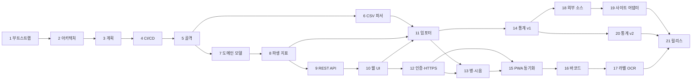

# 작업 계획과 진행 현황

**작업을 재개할 때 이 문서부터 읽는다.** §1에서 현재 위치를 확인하고, §2 절차로 환경을 되살린
다음, §4의 해당 Task 항목을 펼쳐 작업을 이어간다.

- 설계 근거: [architecture.md](architecture.md)
- 레거시 데이터 사양: [legacy-schema.md](legacy-schema.md)
- 개발 관례: [../AGENTS.md](../AGENTS.md)

> **갱신 규칙**: 모든 Task PR은 이 문서의 §1(현재 위치), §3(체크리스트), §5(결정 로그),
> §6(열린 질문) 갱신을 **같은 PR에 포함**한다. 문서 갱신 없는 Task는 완료로 보지 않는다.

---

## 1. 현재 위치

| 항목 | 값 |
|---|---|
| 최종 갱신 | 2026-07-31 |
| 완료된 Task | **Task 1 ~ Task 4** |
| 다음 착수 Task | **Task 5 — 애플리케이션 골격** |
| 현재 브랜치 | `feature/ci-cd` (Task 4) |
| 진행 중 잔여 항목 | 없음 |
| 최신 버전 | `0.1.0` (미태그. 태그는 Task 21에서만) |

### 즉시 해야 할 일 (Task 5)

> **선행 조건**: §6-Q1(데이터베이스 실행 방식)을 사용자와 먼저 확정한다. 이 환경에 Docker와
> PostgreSQL이 없고 passwordless sudo도 불가하다.

1. `pyproject.toml` 작성 (uv + hatchling, Python 3.14, ruff line-length 100, pytest 85% 게이트)
2. `src/sooljang/` 골격 — 설정 로딩, FastAPI 앱, `GET /health`(DB 연결·마이그레이션 버전 보고)
3. `web/` 골격 — Vite + React + TS + Biome + Vitest, `lint`·`typecheck`·`test:coverage`·`build`·
   `check` npm 스크립트 (CI가 이 이름들을 호출한다)
4. Alembic 초기화(`alembic.ini`, `env.py`), `Dockerfile`, `docker-compose.yml`
5. `Makefile`, `.env.example`
6. Task 4에서 게이팅해 둔 CI 잡(`python-quality`·`web-quality`·`migration-check`·`docker-build`)이
   자동 활성화되어 전부 통과하는지 확인

### 차단 요인

§6-Q1 데이터베이스 실행 방식 미확정.

---

## 1-1. CI 잡 활성화 상태

Task 4의 품질 게이트는 프로젝트 파일 존재 여부로 잡을 게이팅한다. Task 5에서 아래 파일이
추가되면 해당 잡이 자동으로 켜진다.

| 잡 | 활성 조건 | 현재 |
|---|---|---|
| `commit-convention` | 항상 | ✅ 동작 |
| `workflow-lint` | 항상 | ✅ 동작 |
| `secret-scan` | 항상 | ✅ 동작 |
| `python-quality` | `pyproject.toml` | ⏸ Task 5 |
| `migration-check` | `alembic.ini` | ⏸ Task 5 |
| `web-quality` | `web/package.json` | ⏸ Task 5 |
| `docker-build` | `Dockerfile` 또는 `docker/*.Dockerfile` | ⏸ Task 5 |
| `quality-gate` | 항상 (skipped 는 통과로 취급) | ✅ 동작 |

---

## 2. 재개 절차

```bash
cd /mnt/e/projects/SoolJang

# 1) 위치 확인
git status -sb
git log --oneline -5
gh pr list --state all --limit 5

# 2) main 최신화
git switch main && git pull --ff-only

# 3) git 훅 활성화 (클론 직후 1회. main 직접 푸시·버전 태그 푸시를 차단한다)
bash scripts/install-hooks.sh

# 4) 개발 환경 (Task 5 이후 유효)
uv sync                       # Python 의존성
npm ci --prefix web           # 프론트엔드 의존성
cp .env.example .env          # 최초 1회, 값 채우기

# 5) 검증
uv run ruff check . && uv run ruff format --check .
uv run ty check
uv run pytest                 # 브랜치 커버리지 85% 강제
npm --prefix web run check    # 포맷·린트·타입·테스트·빌드
bash scripts/scan-secrets.sh  # 시크릿·개인 데이터 커밋 여부

# 6) 새 Task 시작
git switch -c feature/<task-slug>
```

Task 5 이전에는 `uv`·`npm` 프로젝트가 아직 없어 4~5단계 일부를 건너뛴다.

---

## 3. Task 체크리스트

상태: ⬜ 대기 · 🟡 진행중 · ✅ 완료

| # | Task | 상태 | 브랜치 | PR |
|---|---|---|---|---|
| 1 | 환경 부트스트랩 — 디렉토리와 private repo 생성 | ✅ | (main 부트스트랩) | — |
| 2 | 아키텍처 설계 문서 | ✅ | `feature/architecture-docs` | [#1](https://github.com/jihoon22-lee/SoolJang/pull/1) |
| 3 | 상세 작업 계획 문서 | ✅ | `feature/work-plan-doc` | [#2](https://github.com/jihoon22-lee/SoolJang/pull/2) |
| 4 | CI/CD 워크플로 구축 | ✅ | `feature/ci-cd` | [#3](https://github.com/jihoon22-lee/SoolJang/pull/3) |
| 5 | 애플리케이션 골격 | ⬜ | `feature/app-skeleton` | |
| 6 | 레거시 CSV 블록 분리 파서 | ⬜ | `feature/legacy-parser` | |
| 7 | 도메인 모델과 마이그레이션 | ⬜ | `feature/domain-model` | |
| 8 | 파생 지표 계산 계층 | ⬜ | `feature/derived-metrics` | |
| 9 | REST API와 검색·필터·정렬 | ⬜ | `feature/rest-api` | |
| 10 | 웹 UI 수직 슬라이스 | ⬜ | `feature/web-ui-slice` | |
| 11 | 레거시 데이터 임포터 | ⬜ | `feature/legacy-import` | |
| 12 | 인증과 로컬 HTTPS 접근 환경 | ⬜ | `feature/auth-https` | |
| 13 | 개별 병 관리와 시음 세션 | ⬜ | `feature/bottles-tastings` | |
| 14 | 통계 대시보드 v1 | ⬜ | `feature/stats-v1` | |
| 15 | PWA와 오프라인 동기화 | ⬜ | `feature/pwa-sync` | |
| 16 | 바코드 스캔과 제품 매칭 | ⬜ | `feature/barcode-scan` | |
| 17 | 라벨 OCR 프리필 | ⬜ | `feature/label-ocr` | |
| 18 | 외부 소스 레지스트리와 온디맨드 조회 | ⬜ | `feature/external-sources` | |
| 19 | 사이트별 어댑터와 시세 이력 | ⬜ | `feature/site-adapters` | |
| 20 | 통계 v2 — 커스텀 피벗과 취향 분석 | ⬜ | `feature/stats-v2` | |
| 21 | 첫 정식 릴리스와 배포 | ⬜ | `release/v1.0.0` | |

### 의존 관계



핵심 마일스톤은 **Task 12**다. 이 지점에서 폰으로 HTTPS 접속해 실제 데이터를 보게 되므로,
이후 Task는 실사용 피드백을 받으며 진행할 수 있다.

---

## 4. Task 상세

각 Task는 PR 1개다. 완료 조건을 모두 만족해야 머지한다.

### ✅ Task 1 — 환경 부트스트랩

- **산출물**: `/mnt/e/projects/SoolJang`, git 저장소, `jihoon22-lee/SoolJang`(private),
  `.gitignore`, `README.md`, `AGENTS.md`, `.editorconfig`
- **완료 조건**: private 저장소 생성, `main` 추적, 초기 커밋 푸시
- **결과**: 커밋 `652d98d`. `gh repo view`로 `"visibility":"PRIVATE"` 확인
- **비고**: 저장소 생성 커밋만 `main` 직접 푸시를 허용했다(부트스트랩 예외). 이후는 전부 PR

### ✅ Task 2 — 아키텍처 설계 문서

- **산출물**: `docs/architecture.md`(665줄), `docs/legacy-schema.md`(275줄)
- **완료 조건**: 데이터 모델·API·동기화·배포·위협 모델·ADR 기술, 레거시 실측 근거 기록,
  mermaid 문법 검증
- **결과**: PR [#1](https://github.com/jihoon22-lee/SoolJang/pull/1) 머지. mermaid 5개 전체 통과
- **주요 산출 사실**: §5 결정 로그 D3~D8 참조

### ✅ Task 3 — 상세 작업 계획 문서

- **산출물**: `docs/plan.md` (이 문서)
- **완료 조건**: 이 문서만 읽고 다음 할 일을 특정할 수 있다. 재개 절차, 의존 그래프, 결정 로그,
  열린 질문 포함
- **결과**: PR [#2](https://github.com/jihoon22-lee/SoolJang/pull/2)

### ✅ Task 4 — CI/CD 워크플로 구축

- **산출물**
  - `.github/workflows/quality.yml` — PR 트리거. 잡 8개: `detect`, `commit-convention`,
    `workflow-lint`, `secret-scan`, `python-quality`, `migration-check`, `web-quality`,
    `docker-build`, 그리고 단일 필수 체크 역할의 `quality-gate`
  - `.github/workflows/release.yml` — `v*.*.*` 태그 + `workflow_dispatch`(dry-run 기본값 true).
    **작성만 하고 실행하지 않았다**
  - `.github/release.yml`, `.github/pull_request_template.md`, `.github/ISSUE_TEMPLATE/`
  - `.githooks/commit-msg`, `.githooks/pre-push`, `scripts/install-hooks.sh`,
    `scripts/check_commit_message.sh`, `scripts/scan-secrets.sh`, `.node-version`
- **검증 결과**
  - `actionlint` 1.7.12 + `shellcheck` 0.11.0 — 오류 0
  - 커밋 메시지 검증: 정상 3종 통과, 비정상 3종 거부, 머지 커밋 예외 통과
  - `pre-push`: `main` 푸시 차단(exit 1), `v1.0.0` 태그 푸시 차단(exit 1),
    `SOOLJANG_ALLOW_TAG_PUSH=1` 우회 통과, feature 브랜치 통과
  - 시크릿 스캔: 정상 상태 통과, `alcohol.csv`·OpenAI 키 패턴 주입 시 2건 검출
- **설계 판단**
  - Task 5 이전에는 Python·Node 프로젝트가 없다. `detect` 잡이 파일 존재 여부를 출력하고
    후속 잡이 이를 조건으로 삼아, 워크플로가 지금도 유효하고 Task 5에서 자동 활성화된다
  - Docker 관련 서드파티 액션을 쓰지 않고 러너 내장 `buildx`를 직접 호출한다. 공급망 표면을
    줄이고 검증되지 않은 액션 SHA를 pin 하지 않기 위한 선택이다
  - 개별 검사를 `continue-on-error`로 돌리고 마지막에 합산한다. 첫 실패에서 멈추면 나머지
    문제를 다음 실행에서야 알게 되어 왕복이 늘어난다
  - `quality-gate`가 `needs.*.result`를 합산해 `skipped`는 통과로 취급한다. 게이팅된 잡이
    필수 체크를 영구 대기 상태로 만드는 문제를 피한다

### ⬜ Task 5 — 애플리케이션 골격

- **선행 확인**: §6-Q1 데이터베이스 실행 방식 확정
- **산출물**: `pyproject.toml`(uv/hatchling), `src/sooljang/`(FastAPI, 설정, `/health`),
  `web/`(Vite+React+TS+Biome+Vitest), `docker-compose.yml`, Alembic 초기화, `Makefile`,
  `.env.example`
- **테스트**: `/health` 200(DB 연결·마이그레이션 버전 포함), 프론트 스모크 렌더, DB 연결
- **데모**: 백엔드·프론트 기동 후 브라우저에서 화면과 `/health` 응답 확인
- **완료 조건**: Task 4의 CI 잡이 실제 코드에 대해 전부 통과

### ⬜ Task 6 — 레거시 CSV 블록 분리 파서

- **사양**: [legacy-schema.md](legacy-schema.md) §3 블록 판별 규칙, §4 정규화 규칙
- **산출물**: `src/sooljang/infrastructure/legacy/` — 블록 분리기, 필드 정규화기,
  주종 매핑 테이블, 품종 오타 정규화 사전
- **핵심 구현 포인트**
  - CP949 디코딩, `\`(0x5C) → ₩ 금액 정규화, `" \- "` → NULL
  - 빈 행에서 종료하지 않는다 (326행 함정)
  - 이름 없는 행 배제 (432행 합계행)
  - 464~476행 우측 주종 롤업 매트릭스 오탐 방지
  - `종류` forward-fill
  - 총액 → 병당 단가 변환, 이름 후행 `, YYYY` 빈티지 분리
  - 다중값 분해: 품종·외부 평점(`값 (태그)`)·구매처·이름 2번째 줄
  - 비고에서 외화 `$금액 (환율 N원)` 파싱
- **테스트**: 익명화 fixture로 회귀 — 레코드 429건, 블록 경계 3종, 정규화 함수 단위,
  `#N/A` 통과, 다중 행 노트
- **데모**: 파서 실행 결과로 레코드 수와 정규화 샘플 출력, 통계 블록 배제 확인

### ⬜ Task 7 — 도메인 모델과 마이그레이션

- **사양**: [architecture.md](architecture.md) §2
- **산출물**: `category`(자기참조)·`producer`·`variety`·`product_variety`·`product`·`sku`·
  `vendor`·`purchase`·`bottle` 모델 + Alembic 마이그레이션 + 주종 계층 시드
- **테스트**: 계층 재귀 조회, soft delete, 제약(도수 0~100, 용량 양수, 평점 0~6, 병수 정합),
  마이그레이션 up/down 왕복, `user_id` 스코프 누락 검출
- **데모**: 같은 제품에 가격·구매처가 다른 구매 건 2개 저장 (엑셀에서 불가능했던 기록)

### ⬜ Task 8 — 파생 지표 계산 계층

- **사양**: [architecture.md](architecture.md) §3 수식
- **산출물**: `domain/metrics.py` 순수 함수 + SQL 집계 뷰 (동일 결과 보장)
- **테스트**: 다중 구매·다중 용량 가중 평균, 병 상태 전이 후 재계산, 가격 NULL(선물) 제외,
  외화 환율 스냅샷 환산, 0병·전량 소진 경계, **순수 함수와 SQL 뷰 결과 일치 검증**
- **데모**: 구매 건 3개인 제품의 전체 파생 지표 자동 계산

### ⬜ Task 9 — REST API와 검색·필터·정렬

- **사양**: [architecture.md](architecture.md) §4
- **산출물**: 제품·규격·구매·구매처·주종 CRUD, `POST /purchases/{id}:split`,
  커서 페이지네이션, pg_trgm 검색, Problem Details 에러, OpenAPI 스펙
- **테스트**: 필터 조합, 한글 부분 일치, 정렬 안정성(id tie-breaker), 커서 경계,
  에러 응답 형식
- **데모**: "도수 40% 이상 싱글몰트 중 재고 있는 것을 100ml당 가격 낮은 순" 조회

### ⬜ Task 10 — 웹 UI 수직 슬라이스

- **산출물**: 반응형 레이아웃(PC 테이블 / 모바일 카드), 제품 목록 + 필터, 제품 상세(구매 이력·
  병 목록·파생 지표), 제품·구매 등록·수정 폼, 사진 첨부
- **테스트**: 컴포넌트 렌더, 폼 검증, 모바일 뷰포트, 접근성(키보드·라벨 연결·명암비)
- **데모**: 브라우저에서 술 등록 후 구매 건 2건 추가 → 지표 갱신 확인
- **주의**: 제품·규격·구매를 한 폼에서 만들 수 있게 해 4계층 입력 부담을 완화한다

### ⬜ Task 11 — 레거시 데이터 임포터

- **산출물**: 업로드 → 블록 분석 → 매핑 조정 UI → dry-run 미리보기 → 적재,
  제품 자동 병합(`normalized_name`+`vintage`+`abv`), 구매처 개행 분할 시도,
  실패 행 리포트, 재실행 멱등성
- **테스트**: 익명화 fixture 회귀, 병합, 재실행 중복 방지, **[legacy-schema.md](legacy-schema.md)
  §5 기준값 전체 대조**(1,078/819/259/225/34병, ₩42,401,100, ₩36,495,447, 704,970ml, 평점 3.4,
  구매처 82개)
- **데모**: 실제 기록 429행 전량 이관 후 요약 리포트가 엑셀 합계와 일치
- **주의**: 구매처 분할은 총합이 `구매` 병수와 맞지 않으면 포기하고 단일 구매 건으로 적재하되
  원문을 `import_note`에 보존한다

### ⬜ Task 12 — 인증과 로컬 HTTPS 접근 환경 🔑 핵심 마일스톤

- **산출물**: Argon2id 해시, 서버 세션 쿠키, CSRF, 레이트 리밋, 감사 로그, 전 API 인증 적용,
  Docker Compose 로컬 프로덕션 구성, `tailscale serve --https=443`, `pg_dump` 백업·복원 스크립트
- **테스트**: 미인증 차단, 세션 만료, 비밀번호 정책, 레이트 리밋, 백업·복원 왕복
- **데모**: 갤럭시 폰 크롬에서 `https://<머신>.<tailnet>.ts.net` 접속·로그인해 이관 데이터 조회
- **범위 제외**: 이미지 게시·릴리스 노트·버전 태그 (Task 21)

### ⬜ Task 13 — 개별 병 관리와 시음 세션

- **산출물**: 병 상태 전이(`:open`/`:finish`/`:gift`/`:sell`), 잔량 추적, 시음 세션 기록
  (날짜·따른 양·평점 6점 0.5단위·향/맛/피니시·사진·동석자·장소), 시음 타임라인
- **테스트**: 세션 기록 시 잔량 차감, 잔량 초과 거부, 상태 전이 제약, 세션 평균 평점,
  평점 변화 추이
- **데모**: 병 개봉 후 시음 2회 기록 → 잔량 감소와 평점 추이

### ⬜ Task 14 — 통계 대시보드 v1 (엑셀 통계 재현)

- **산출물**: 병당 가격·총 구매액·100ml당 가격·개인 평점 랭킹, 주종별 집계(병수·총액·평균 도수·
  평균 평점·평균 100ml가·할인율), 전체 합계, 주종 분포 차트
- **테스트**: **엑셀 실측 통계값과 대조**, 동점 처리, 빈 데이터, 대량 데이터 성능
- **데모**: 엑셀 통계표(주종별 통계 26행, 랭킹 3종, 합계)와 앱 화면 비교해 일치
- **주의**: 100ml당 가격은 **정가 기준**이다([legacy-schema.md](legacy-schema.md) §4.2)

### ⬜ Task 15 — PWA와 오프라인 동기화

- **사양**: [architecture.md](architecture.md) §5
- **산출물**: Workbox 앱 셸, Dexie 로컬 미러, outbox 직렬 큐, `GET /sync?since=`,
  `(updated_at, id)` 복합 커서, LWW 병합, soft delete 전파, 충돌 로그, 동기화 상태 UI, manifest
- **테스트**: 오프라인 생성 후 재전송, 동시 수정 LWW, 삭제 전파, idempotency 중복 방지,
  부모-자식 순서 보장
- **데모**: 폰 비행기 모드에서 등록 → 복구 시 PC 반영

### ⬜ Task 16 — 바코드 스캔과 제품 매칭

- **산출물**: `BarcodeDetector` + `@zxing/browser` 폴백 스캐너, 로컬 SKU → Open Food Facts →
  검색 폴백, 사용자 확인 후 바코드 학습 저장
- **테스트**: EAN-13/UPC-A 정규화, 로컬 히트·미스 분기, 외부 실패 시 수동 경로, RCN 경고
- **데모**: 실제 병 바코드 스캔으로 기존 제품 즉시 매칭
- **전제**: Task 12의 HTTPS(secure context)가 없으면 카메라가 동작하지 않는다

### ⬜ Task 17 — 라벨 OCR 프리필

- **산출물**: Vision LLM 구조화 추출(이름·생산자·도수·용량·빈티지·숙성연수·주종 추정),
  필드별 신뢰도 표시, 사용자 검수 후 저장, 원본·결과 보관
- **테스트**: 고정 이미지 fixture로 스키마 검증(LLM 목킹), 저신뢰 필드 표시, 실패 시 수동 폴백,
  실호출은 opt-in 마커
- **데모**: 라벨 촬영으로 폼 자동 완성

### ⬜ Task 18 — 외부 소스 레지스트리와 온디맨드 조회

- **사양**: [architecture.md](architecture.md) §7
- **산출물**: `external_source` 관리 UI(등록·수정·비활성·삭제·주종 범위·우선순위),
  `GenericSearchAdapter`, 스냅샷 저장, TTL 캐시·rate limit·robots.txt, 제품 상세 외부 정보 카드
- **테스트**: 어댑터 계약, 캐시 히트·만료, rate limit, 부분 결과 저장, **출처 URL 누락 시 저장 거부**
- **데모**: 보유 위스키에서 외부 평점·판매가·후기 요약을 출처와 함께 조회
- **주의**: 레거시 임포트가 넣은 `legacy://excel` 평점을 실측 조회로 갱신하는 경로를 포함한다

### ⬜ Task 19 — 사이트별 어댑터와 시세 이력

- **산출물**: YAML 셀렉터 `SiteAdapter`, 추천 소스 자동 탐색·승인 등록, 가격 시계열 차트,
  목표가 감시와 웹 푸시 알림
- **테스트**: YAML 스키마 검증, 셀렉터 파손 시 graceful 실패·`degraded` 표시, 시계열 집계,
  알림 중복 방지
- **데모**: 사이트 등록 후 가격 수집 → 추이 그래프와 목표가 알림

### ⬜ Task 20 — 통계 v2 — 커스텀 피벗과 취향 분석

- **산출물**: 피벗 뷰 빌더(그룹·집계·필터·정렬 저장), 시계열(월별 지출·누적 자산·소비 속도·
  개봉 후 소진 기간), 구매처별 할인율·절약액, 분포 히스토그램, 가성비 지표,
  개인 vs 외부 평점 상관, CSV·엑셀 내보내기, 읽기 전용 공유 링크
- **테스트**: 피벗 정의 직렬화·복원, 집계 정확성, 대량 성능, 내보내기 왕복, 공유 권한 격리
- **데모**: "구매처별 × 주종별 평균 할인율" 뷰 저장, 취향 리포트, 엑셀 내보내기

### ⬜ Task 21 — 첫 정식 릴리스와 배포

- **산출물**: 전체 회귀 통과, `v1.0.0` 태그, CHANGELOG, GHCR private 이미지, 자동 릴리스 노트,
  PC pull 배포, 백업·롤백 리허설, 운영 문서(업데이트 절차·백업 스케줄·클라우드 이전 지점)
- **테스트**: 릴리스 워크플로 전 단계 성공, 배포 이미지 스모크, 롤백 성공
- **데모**: 태그 1개 푸시로 릴리스 노트·이미지 생성, PC 재기동 후 폰에서 정상 동작
- **주의**: **여기가 유일하게 태그를 푸시하는 Task다**

---

## 5. 결정 로그

| # | 결정 | 근거 |
|---|---|---|
| D1 | 프로젝트명 `SoolJang`, 패키지 `sooljang`, 표시명 "술장" | 사용자 선택 |
| D2 | 기존 `NaverBlogAutomation` 관례 계승 (uv·ruff·ty·pytest 85%·Biome·Vitest 80%·Conventional Commits·한글 우선 문서) | 학습 비용 최소화, 도구 일관성 |
| D3 | 레거시 `종류` 컬럼은 forward-fill 대상 (AI 분류 불필요) | 결측 94.1%인데 고유값 26개가 각 1회만 등장 = 그룹 구분자. forward-fill 후 전파 실패 0건 |
| D4 | 레거시 `가격`·`실구매가`는 총액. DB에는 병당 단가 저장 | `평단가 = 가격/구매병수` 391건 검증(불일치 0). 구매 건 분할 시 단가가 보존되어야 함 |
| D5 | 100ml당 가격은 **정가 기준** | 실구매 기준으로 계산하면 168건 불일치. 레거시 통계 재현을 위해 정가 기준 확정 |
| D6 | 개인 평점 스케일 0.5~6.0 (6점 만점) | 레거시 실측 값 분포 |
| D7 | 외부 평점은 소스별 분리 저장 (`external_rating`) | 레거시가 `3.40 (RB)`/`3.96/89 (BA)`/`3.578 (U)`처럼 소스·스케일이 다른 값을 한 셀에 담고 있음 |
| D8 | 주종 최상위는 와인·사케·전통주·맥주·양주 5개 | 레거시 통계 롤업 병수 170+12+120+642+134 = 1,078 (합계행 일치) |
| D9 | 브랜치 보호 대신 로컬 `pre-push` 훅 | 무료 플랜 private 저장소는 ruleset API가 HTTP 403 (`Upgrade to GitHub Pro`) |
| D10 | PR 머지는 merge commit (`gh pr merge --merge`) | "작은 단위는 커밋" 요구를 만족하려면 개별 커밋이 히스토리에 남아야 함. squash는 이를 잃는다 |
| D11 | 배포는 GHCR pull 방식 | GitHub Actions가 홈 PC로 인바운드 배포할 수 없음 |
| D12 | 릴리스 태그는 Task 21에서만 1회 | 사용자 지시. 워크플로는 미리 작성하고 dry-run으로만 검증 |
| D13 | UUIDv7 PK, 파생값 비저장, 서버 세션 쿠키, PostgreSQL, PWA | [architecture.md](architecture.md) §9 ADR 참조 |
| D14 | CI 잡을 프로젝트 파일 존재 여부로 게이팅 | Task 5 이전에는 Python·Node 프로젝트가 없다. 게이팅하면 워크플로가 지금도 유효하고 Task 5에서 자동 활성화된다 |
| D15 | 단일 필수 체크 `quality-gate`로 결과 합산 | 게이팅으로 `skipped`된 잡이 필수 체크를 영구 대기 상태로 만드는 문제를 피한다. `skipped`는 통과, `failure`·`cancelled`만 실패로 취급 |
| D16 | Docker 서드파티 액션 대신 러너 내장 `buildx` 직접 호출 | 공급망 표면 축소. 검증되지 않은 액션 SHA를 pin 하지 않는다 |
| D17 | 액션은 커밋 SHA로 pin | 기존 프로젝트에서 검증된 SHA를 재사용한다 (`actions/checkout@de0fac2` v6.0.2, `actions/setup-node@2499707` v6, `astral-sh/setup-uv@0880764` v8.1.0) |
| D18 | 시크릿 스캔은 자체 스크립트 | 이 프로젝트의 고유 위험(개인 음주 기록 파일, 자격증명)에 초점을 맞춘다. 외부 스캐너 의존과 라이선스 제약을 피하고, 필요하면 나중에 gitleaks 로 교체·병행한다 |
| D19 | `pre-push` 훅이 버전 태그 푸시도 차단 | 릴리스는 Task 21에서 1회만 수행해야 한다. 의도한 릴리스는 `SOOLJANG_ALLOW_TAG_PUSH=1`로 우회 |
| D20 | 개별 검사를 `continue-on-error`로 실행하고 마지막에 합산 | 첫 실패에서 멈추면 나머지 문제를 다음 실행에서야 알게 되어 수정 왕복이 늘어난다 |

---

## 6. 열린 질문

| # | 질문 | 상태 | 필요 시점 |
|---|---|---|---|
| **Q1** | **데이터베이스 실행 방식.** 이 환경에 Docker와 PostgreSQL이 없고 passwordless sudo도 불가하다. 후보: (a) Docker Desktop/Engine 설치 (b) `pgserver` PyPI 패키지 — Postgres 바이너리를 번들해 root 없이 사용자 영역에서 실행 (c) micromamba로 사용자 영역 설치 (d) 개발·테스트는 SQLite, 운영만 Postgres(비권장 — 쿼리 divergence 위험). 권장은 (b)로 시작해 운영은 (a) | **미해결 — Task 5 착수 전 확정 필요** | Task 5 |
| Q2 | 검색·LLM API 제공자와 예산. Task 17(OCR)·18(요약)에 필요. 기존 프로젝트에 `anthropic`·`google-genai`·`openai` 의존성이 있어 키 보유로 추정 | 미해결 | Task 17 |
| Q3 | 초기 등록할 외부 소스 사이트 목록. 국내 가격은 데일리샷·이마트·GS25 와인25+ 등 후보. 사용자 승인 필요 | 미해결 | Task 18 |
| Q4 | Tailscale 설치·로그인 여부와 tailnet 이름. HTTPS 인증서 발급에 필요 | 미해결 | Task 12 |
| Q5 | 웹 푸시 알림 채널. 목표가 알림을 웹 푸시로 할지 다른 수단(이메일 등)으로 할지 | 미해결 | Task 19 |
| Q6 | 지인 공유 시 권한 모델 상세. 읽기 전용 링크만으로 충분한지, 계정 발급이 필요한지 | 미해결 | Task 20 |

---

## 7. 품질 게이트 (Task 4에서 구현)

PR마다 아래를 모두 통과해야 머지한다.

| 검사 | 도구 | 기준 |
|---|---|---|
| Python 린트 | `ruff check` | 위반 0 |
| Python 포맷 | `ruff format --check` | 차이 0 |
| Python 타입 | `ty check` | 오류 0 |
| Python 테스트 | `pytest` | 브랜치 커버리지 ≥ 85% |
| TS 린트·포맷 | Biome | 위반 0 |
| TS 타입 | `tsc --noEmit` | 오류 0 |
| TS 테스트 | Vitest | 커버리지 ≥ 80% |
| 마이그레이션 | Alembic | up/down 왕복 성공, 모델-마이그레이션 드리프트 없음 |
| 컨테이너 | Docker build | 빌드 성공 |
| 커밋 형식 | commitlint | Conventional Commits 준수 |
| 워크플로 | `actionlint` | 오류 0 |
| 의존성 취약점 | `pip-audit`, `npm audit` | 고위험 0 |
| 시크릿 | 시크릿 스캔 | 검출 0 |

---

## 8. 절대 규칙

1. `main`에 직접 푸시하지 않는다 (저장소 부트스트랩 커밋만 예외)
2. 개발 기간 중 `v*.*.*` 태그를 푸시하지 않는다 (Task 21 전용)
3. 실제 음주 기록(`alcohol.csv`·`alcohol.xlsx`), `.env`, 백업 덤프, 업로드 이미지를 커밋하지 않는다
4. 테스트에는 익명화·축약 fixture만 사용한다
5. 모든 API는 인증을 요구한다 (`/health` 예외)
6. 파생값을 DB에 저장하지 않는다
7. 외부 데이터는 출처 URL 없이 저장하지 않는다
8. 모든 Task PR에 이 문서 갱신을 포함한다
