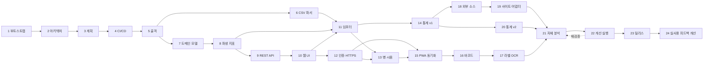

# 작업 계획과 진행 현황

**작업을 재개할 때 이 문서부터 읽는다.** §1에서 현재 위치를 확인하고, §2 절차로 환경을 되살린
다음, §4의 해당 Task 항목을 펼쳐 작업을 이어간다.

- 설계 근거: [architecture.md](architecture.md)
- 레거시 데이터 사양: [legacy-schema.md](legacy-schema.md)
- 개발 관례: [../AGENTS.md](../AGENTS.md)

> **갱신 규칙**: 모든 Task PR은 이 문서의 §1(현재 위치), §3(체크리스트), §5(결정 로그),
> §6(열린 질문) 갱신을 **같은 PR에 포함**한다. 문서 갱신 없는 Task는 완료로 보지 않는다.

---

## 1. 현재 위치

| 항목 | 값 |
|---|---|
| 최종 갱신 | 2026-08-05 (Task 24 PR1~PR6 머지 완료 — [#47](https://github.com/jihoon22-lee/SoolJang/pull/47), [#48](https://github.com/jihoon22-lee/SoolJang/pull/48), [#49](https://github.com/jihoon22-lee/SoolJang/pull/49), [#50](https://github.com/jihoon22-lee/SoolJang/pull/50), [#51](https://github.com/jihoon22-lee/SoolJang/pull/51), [#52](https://github.com/jihoon22-lee/SoolJang/pull/52). PR7 게이트 전부 통과, PR 오픈 대기 — 머지되면 Task 24 전체 완료) |
| 완료된 Task | **Task 1 ~ Task 17, Task 20, Task 21, Task 22**(Track 1~4, 10 PR + 사후 하드닝 PR 2개). Task 18 은 `adapter` 전략만 부분 완료. Q5(웹 푸시 채널) 는 웹 푸시로 결정됨(2026-08-03) — 단 Task 19 자체는 시세 데이터(스크래핑) 가 있어야 값이 있어 여전히 대기. **Task 23(첫 릴리스·배포)은 태그·릴리스·PC 배포까지 완료**, 모바일 접속(Tailscale Serve)만 사용자의 관리자 콘솔 활성화 대기 |
| 다음 착수 Task | **Task 24 PR7**(`perf/offline-queries`) 코드·테스트·문서 갱신 완료, 전체 게이트(`npm run check` 438 passed, 시크릿 스캔) 통과 — PR 오픈·CI·머지가 마지막 단계다. 머지되면 Task 24(실사용 피드백 기반 개선) 전체가 완료된다 |
| 현재 브랜치 | `perf/offline-queries` (Task 24 PR7) |
| 진행 중 잔여 항목 | Task 23: 모바일 접속만 남음 — 사용자의 Tailscale 관리자 콘솔 조작 대기(2026-08-03). Task 24: PR1~PR6 완료, PR7 머지 대기(마지막 PR) |
| 최신 버전 | **`v1.0.0` 릴리스 완료**([GitHub 릴리스](https://github.com/jihoon22-lee/SoolJang/releases/tag/v1.0.0), GHCR `sooljang-api`/`sooljang-web:1.0.0`), 홈 PC 에 배포 완료(로컬 재빌드본) |

> 세션이 바뀌어 이어받는 경우 [handoff.md](handoff.md) 를 먼저 읽는다. 환경 함정과 재개
> 절차를 5분 안에 파악할 수 있게 정리해 두었다.

### Task 22 실행 요약 (2026-08-03)

Task 21 의 자체 통합 테스트 중 사용자가 실데이터(제품 405종·병 1,078개·구매처 64곳)로
직접 써 보며 다수의 문제를 보고했고, 이를 받아 코드베이스를 전면 감사한 결과가 예정된
Task 22 실행의 입력이 됐다 — 상세 계획은 세션 로컬 plan 파일에 먼저 정리했고(항목·PR
분할·근거), 그 계획대로 아래 10개 PR 을 순서대로 실행·머지했다. 각 PR 은 CI(린트·타입·
테스트·마이그레이션 왕복·컨테이너 빌드·시크릿 스캔)를 통과한 뒤에만 머지했다.

| PR | 내용 | 링크 |
|---|---|---|
| 1 | URL 해시 네비게이션(뒤로가기 지원) | [#26](https://github.com/jihoon22-lee/SoolJang/pull/26) |
| 2 | 제품 목록 밀도·정렬·필터 확대 | [#27](https://github.com/jihoon22-lee/SoolJang/pull/27) |
| 3 | 제품 상세 전면 개편(수정+병 관리 통합+구매 관리) | [#28](https://github.com/jihoon22-lee/SoolJang/pull/28) |
| 4 | 병 개봉 되돌리기 + "소진" 클릭 프레임 드랍 수정 | [#29](https://github.com/jihoon22-lee/SoolJang/pull/29) |
| 5 | 통계 크로스 링크 + 주종별 집계 정렬 | [#30](https://github.com/jihoon22-lee/SoolJang/pull/30) |
| 6 | 구매처 관리 화면 + 비밀번호 변경 + 시음 기록 삭제 | [#31](https://github.com/jihoon22-lee/SoolJang/pull/31) |
| 7 | 이름·구매처 자동완성, 한글 초성 검색, 입력 기본값 | [#32](https://github.com/jihoon22-lee/SoolJang/pull/32) |
| 8 | 비주얼 디자인 전면 개편("Cellar Dark") | [#33](https://github.com/jihoon22-lee/SoolJang/pull/33) |
| 9 | 외부 소스 레지스트리 + `adapter` 기반 조회(Task 18 부분) | [#34](https://github.com/jihoon22-lee/SoolJang/pull/34) |
| 10 | 매장 모드(`#scan`) — 바코드/이름 검색으로 구매가·평점·외부 정보 즉시 확인 | [#35](https://github.com/jihoon22-lee/SoolJang/pull/35) |

**PR 11(시세 이력·목표가 알림, Task 19 본 사양)은 포함하지 않았다** — Q5(웹 푸시 채널)가
여전히 미해결이고, plan 자체가 "PR9·10 이 실제로 쓸 만한지 확인한 뒤 별도로 계획한다"고
명시했다. 아직 실사용 확인 전이라 착수하지 않는다.

**PR9 범위 축소**: Task 18 원 사양의 `search` 전략(구글 검색 결과 스크래핑으로 모든 주종
기본 지원)은 ToS·신뢰성 위험이 있어 이번 배치에서 뺐다(사용자 결정, 아래 Q2 참조) —
`adapter` 전략(사용자가 등록한 사이트의 CSS 셀렉터 파싱)만 구현했다. **Q3(초기 등록 사이트
목록: 데일리샷·이마트·트레이더스·코스트코·CU·GS25·emart24)에 대한 사용자 답변은 이미
받았지만, 실제 `adapter_spec` 등록은 하지 않았다** — 각 사이트의 실제 HTML 구조 조사가
필요한 별도 작업이라 이번 PR 에 억지로 끼워 넣지 않았다. 레지스트리 UI(`#sources`)는
준비돼 있다.

**이 조사는 지금 이 개발 환경(샌드박스)에서 할 수 없다는 것을 확인했다(2026-08-03)** —
`WebFetch`·Playwright 브라우저 둘 다 외부 도메인 DNS 조회 자체가 안 된다(`example.com`
조차 `ETIMEOUT`). 이 샌드박스는 GitHub·PyPI·npm 레지스트리 등 개발에 필요한 소수 호스트로
아웃바운드가 제한돼 있고, 임의의 외부 사이트로는 나갈 수 없다. 7개 사이트의 실제 HTML
구조 조사·`adapter_spec` 작성은 실제 인터넷 접속이 되는 환경(사용자의 로컬 머신, 또는
§8.1 의 배포된 홈 PC)에서 해야 한다 — Task 19/PR11 착수 전 남은 작업이라는 점은
그대로다.

#### PR9/10 사후 코드 리뷰 하드닝 (PR #41, 2026-08-03)

PR9(외부 소스 레지스트리)·PR10(매장 모드)이 실제 인터넷 접속 없이도 검증할 수 있는 위험
영역(오탈자 있는 사용자 입력, 악성 원격 콘텐츠, 캐시·에러 처리 경계 조건)이 남아 있어,
`code-reviewer` 서브에이전트로 별도 적대적 코드 리뷰를 돌렸다. 실행 검증(실제 프로브
스크립트로 각 주장을 직접 재현)까지 마친 6개 결함을 모두 이 PR 에서 고쳤다 — 상세 근거는
아래 결정 로그 D99~D104.

| # | 결함 | 수정 |
|---|---|---|
| 1 | `adapter_spec` 모양이 조금만 틀려도(오타 난 transform 이름, `url_template` 형식 오류, 문법 오류 있는 CSS 셀렉터 등) `infrastructure/external/adapter.py` 가 예외를 던져 그 요청에 포함된 다른 소스의 결과까지 500 으로 함께 죽었다 | `fetch_snapshot` 을 예외를 삼키는 공개 래퍼로 감싸고, 필드 추출(`_extract_field`)·`_apply_transform`·검색 아이템 파싱 각각을 방어적으로 처리해 그 필드·소스 하나만 `degraded=True` 로 건너뛰게 했다 |
| 2 | 검색 결과에서 뽑은 상세 페이지 링크(`best_url`)를 호스트 검증 없이 그대로 조회했다 — 등록한 사이트(또는 그 사이트에 실린 악성 링크)가 사설망·클라우드 메타데이터 엔드포인트를 가리키게 만들 수 있었다(SSRF). 리다이렉트도 안 따라가 정상 사이트의 흔한 트래킹 리다이렉트조차 실패로 처리됐다 | `_same_host()` 로 등록된 소스와 같은 호스트인지 조회 **전**과 리다이렉트 **후**(최종 URL) 두 번 확인. `httpx.AsyncClient` 에 `follow_redirects=True, max_redirects=5` 추가 |
| 3 | 상세 페이지 조회 자체가 실패해도 `source_url` 만 채워져 있으면 캐시에 저장돼, 그 실패가 TTL(기본 24시간) 동안 성공처럼 굳어 재조회도 계속 빈 결과만 돌려줬다 | `AdapterResult` 에 `ok: bool` 필드를 추가해 "상세 페이지를 실제로 성공적으로 가져와 파싱했는지"를 `source_url` 유무와 분리했다. `lookup_product` 의 캐시 저장 조건을 `source_url is not None` → `ok and source_url is not None` 으로 좁혔다 |
| 4 | `register_error_handlers` 의 `Exception` 캐치올 핸들러(D97)가 `ServerErrorMiddleware` 안에서 실행돼(`CORSMiddleware` 보다 바깥) CORS 헤더가 안 붙었다 — 개발 환경처럼 프론트(5173)와 API 가 다른 origin 이면 이 500 응답이 브라우저에서 CORS 오류로 가려져 실제 에러 메시지를 볼 수 없었다 | `register_error_handlers` 가 `cors_origins` 를 받아, 요청 `Origin` 이 허용 목록에 있으면 이 핸들러가 직접 `Access-Control-Allow-Origin`/`-Credentials`/`Vary` 헤더를 붙이게 했다 |
| 5 | `useCreateProduct` 온라인 분기에서 로컬 Dexie 미러 반영(D93)·`triggerSync` 가 구매·첨부 호출 **뒤**에 있었다 — 제품은 서버에 이미 만들어졌는데 그 뒤 구매·첨부 호출이 실패하면 미러링이 실행되지 않아, 로컬에서는 안 보이는(델타 풀 전까지) 서버 측 "고아" 제품이 남고 재시도 시 중복 생성으로 이어질 수 있었다 | 미러링·`triggerSync` 를 `productsApi.create` 성공 직후, 구매·첨부 호출 **전**으로 옮겼다 |
| 6 | `external_sources` 생성·수정이 `category_id` 소유권을 확인하지 않아(다른 사용자의 카테고리, 또는 존재하지 않는 카테고리 id 를 그대로 저장) 다른 CRUD(`products`·`categories`)와 다른 기준을 썼다. PATCH 도 이름·주소 앞뒤 공백을 안 지웠다 | `create_source`/`update_source` 가 `ensure_category_exists`(기존 `application/products.py` 함수 재사용)로 카테고리를 검증하고, PATCH 라우터를 인라인 `setattr` 루프 대신 이 새 `update_source` 를 쓰게 바꿨다 |

매장 모드(`StoreModeRegister`)가 `ProductForm` 에 `existingProducts`/`vendorNames` 를 안
넘겨 중복 등록 경고·자동완성이 조용히 빠져 있던 것도 같은 리뷰에서 함께 발견해 이 PR 에서
고쳤다(PR7 이 만든 기능이 매장 모드 등록 경로에서만 누락돼 있었다).

#### 오프라인 동기화·재고 정합성 하드닝 (PR #42, 2026-08-03)

`v1.0.0` 태그·실사용 배포를 승인받은 직후, PR9/10 에는 이미 적대적 리뷰를 돌렸지만 나머지
Task 22 배치(PR1~8)의 **병 상태 전이·동기화 델타 적용·구매 관리** 코드는 Task 21 의 UX
차원 리뷰(입력효율·정보밀도·…)만 거쳤을 뿐 데이터 정합성 관점의 적대적 리뷰는 받지 않았다는
공백을 발견해, 별도로 `code-reviewer` 서브에이전트를 돌렸다. 실사용(모바일·오프라인)을
시작하기 직전에 발견해 전부 이 PR 에서 고쳤다 — 상세 근거는 아래 결정 로그 D105~D109.

| # | 결함 | 수정 |
|---|---|---|
| 1(치명) | 오프라인에서 병을 개봉·소진·증여·판매하면 `BottlePanel.tsx` 가 outbox `fields` 를 `{}` 로 보내, 서버가 재접속 시점 날짜(`today()`)로 채웠다 — 실제 행동 날짜가 조용히 사라졌다 | 로컬 낙관적 계산(`transitionFields`)의 날짜·잔량을 서버가 읽는 필드명(`opened_on`/`finished_on`/`on`/`remaining_ml`)에 맞춰 outbox `fields` 로도 그대로 전달(`transitionOutboxFields`) |
| 2(치명) | `apply_batch` 가 실패한 작업에 `OutboxReceipt` 를 안 남겨, 같은 작업이 재전송될 때마다 도메인 검증을 다시 돌려 같은 실패를 반복 생성했다(그 뒤 큐 전체가 영구 정지). `IntegrityError` 는 그 예외 목록에도 없어 배치 전체가 500 으로 죽으며 이 배치에서 이미 성공한 앞선 작업까지 롤백됐다 — 이 경우 클라이언트 어느 항목도 로컬에서 실패로 표시되지 않아 배지가 "최신 상태"라고 잘못 표시했다 | `apply_batch` 가 실패도 `status="failed"` receipt 를 남겨(재전송은 도메인 검증 없이 캐시된 결과만 재사용) `IntegrityError` 도 다른 도메인 예외와 같은 방식으로 그 작업만 실패 처리하게 했다(제약 이름은 노출하지 않고 일반 문구로 대체) |
| 2(배지) | `SyncStatusBadge` 의 상태 문구가 `failedCount`/`conflictCount` 만 보고 "최신 상태"를 판단해, 네트워크 오류 등으로 `flushOutbox` 자체가 실패해 아무 항목도 로컬에서 실패로 표시되지 않은 경우를 놓쳤다 | `state === "idle" && pendingCount > 0` 을 별도 "동기화 대기 N건"(경고 톤) 상태로 추가 |
| 3 | `hand_over_bottle`(증여·판매) 는 `finish_bottle` 과 달리 날짜 역전 검사가 없어, 개봉일보다 이른 증여·판매일이 DB `CHECK` 제약을 직접 건드려 위 2번의 배치 전체 롤백을 유발할 수 있었다 | `finish_bottle` 과 같은 방식으로 "증여·판매일이 개봉일보다 앞설 수 없습니다" 가드 추가 |
| 4 | `pullDeltas` 가 `pendingEntityIds()` 를 `syncApi.pull` 네트워크 왕복 **전**에 스냅샷해, 그 왕복 도중 사용자가 만든 낙관적 쓰기가 보호되지 않고 스테일한 서버 값에 덮였다(TOCTOU) | pending 조회를 pull *이후*, 행 적용과 같은 Dexie 트랜잭션 안(outbox 도 테이블 목록에 포함)으로 옮겨 완전히 원자적으로 만들었다 |
| 4 | 시음 기록(`TastingForm`)이 병의 잔량·상태를 `db.bottle.update()` 로 직접 바꾸지만 그 병 id 에 대한 outbox 항목이 전혀 없어, `pendingEntityIds()` 가 이 병을 보호 대상으로 보지 못해 동시에 도는 풀이 방금 바뀐 잔량을 덮을 수 있었다 | `OutboxEntry`/`enqueue()` 에 `touched_ids`(주 `entity_id` 외에 부작용으로 건드리는 엔티티) 를 추가하고, 시음 기록이 병 잔량을 바꿀 때 병 id 를 여기 담아 `pendingEntityIds()` 가 함께 보호하게 했다 |
| 5 | `scheduleSyncSoon` 의 디바운스 타이머가 만료될 때 동기화가 이미 진행 중이면 `triggerSync()` 가 조용히 no-op 하고 아무것도 다시 예약하지 않아, 그 사이 생긴 쓰기가 다음 60초 폴링이나 `visibilitychange`/`online` 이벤트까지(탭이 백그라운드면 그마저 없이 무기한) 미뤄졌다 | `dirty` 플래그를 추가해, 진행 중 트리거는 버리지 않고 표시만 해 뒀다가 현재 회차가 끝난 `finally` 에서 한 번 더 자동으로 돈다 |

**남은 것(이 PR 범위 밖, 의도적으로 미룸)**: 실패한 outbox 항목을 사용자가 직접 건너뛰거나
재시도할 수 있는 UI(현재는 위 수정으로 "무한 재시도"는 막았지만, 여전히 그 항목 뒤로는
막힌 채로 사용자가 문제를 고치거나 기다려야 한다 — receipt 30일 보관 정책이 지나면 자동
소멸). 실사용 중 실제로 이 상황을 겪으면 그때 UI 를 추가한다.

### 차단 요인

Q2(§6)는 "검색·LLM API 제공자와 예산"을 하나로 묶고 있었지만, 실제로는 서로 다른 두
결정이었다. Task 17 PR 에서 **LLM 쪽만** 풀렸다 — 사용자가 OpenAI API 키를 제공했고,
`.env` 로 고정하는 대신 로그인 후 설정 화면에서 관리하게 만들었다(D82). 단,
"테스트로 몇 차례만" 이라는 제한적 승인만 받았다 — 상시적으로 LLM 을 호출하는 기능을
붙이기 전에는 실사용 예산 상한을 다시 확인해야 한다. PR9(외부 소스, adapter 전략)는
LLM 을 쓰지 않아 이 제한과 무관하다 — LLM 이 필요한 건 `search` 전략(요약)뿐이다.

**검색 API 제공자는 여전히 미해결이다.** `search` 전략은 웹 검색 API 가 필요한데, 이건
아직 선택되지 않았다 — PR9 에서 `adapter` 전략만으로 부분 착수했다.

**Task 20(통계 v2)은 완료했다** — 외부 API 없이 Task 14(통계 v1) 데이터만으로 커스텀
피벗·시계열·저장뷰를 만들었다.

### 로컬 환경 기동

```bash
make install      # 의존성 설치 + git 훅 활성화
make db-up        # PostgreSQL 기동 (Docker, 운영과 같은 postgres:17-alpine)
make migrate
make api          # 다른 터미널에서 make web
make check        # CI 와 동일한 전체 검증
```

Docker 를 쓸 수 없는 상황에서는 폴백을 쓴다. `scripts/dev-db.sh` 가 micromamba 로 홈
디렉토리에 PostgreSQL 17 을 설치해 root 없이 실행한다.

```bash
make db-local-setup   # 최초 1회
make db-local-start
export SOOLJANG_DATABASE_URL=postgresql+psycopg://sooljang@127.0.0.1:54329/sooljang_dev
```

> Docker 를 설치한 직후에는 `docker` 그룹 추가가 기존 셸 세션에 반영되지 않아
> `permission denied ... /var/run/docker.sock` 가 발생한다. 새 셸을 열거나
> `sg docker -c "docker ..."` 로 감싼다.

---

## 1-1. CI 잡 활성화 상태

Task 4의 품질 게이트는 프로젝트 파일 존재 여부로 잡을 게이팅한다. Task 5에서 해당 파일이
추가되어 모든 잡이 활성화되었다.

| 잡 | 활성 조건 | 현재 |
|---|---|---|
| `commit-convention` | 항상 | ✅ 동작 |
| `workflow-lint` | 항상 | ✅ 동작 |
| `secret-scan` | 항상 | ✅ 동작 |
| `python-quality` | `pyproject.toml` | ✅ 활성 (Task 5) |
| `migration-check` | `alembic.ini` | ✅ 활성 (Task 5) |
| `web-quality` | `web/package.json` | ✅ 활성 (Task 5) |
| `docker-build` | `Dockerfile` 또는 `docker/*.Dockerfile` | ✅ 활성 (Task 5) |
| `quality-gate` | 항상 (skipped 는 통과로 취급) | ✅ 동작 |

CI 는 `services: postgres`(`postgres:17-alpine`)를 쓰므로 로컬 Docker 부재와 무관하다.

---

## 2. 재개 절차

```bash
cd /mnt/e/projects/SoolJang

# 1) 위치 확인
git status -sb
git log --oneline -5
gh pr list --state all --limit 5

# 2) main 최신화
git switch main && git pull --ff-only

# 3) git 훅 활성화 (클론 직후 1회. main 직접 푸시·버전 태그 푸시를 차단한다)
bash scripts/install-hooks.sh

# 4) 개발 환경 (Task 5 이후 유효)
uv sync                       # Python 의존성
npm ci --prefix web           # 프론트엔드 의존성
cp .env.example .env          # 최초 1회, 값 채우기

# 5) 검증
uv run ruff check . && uv run ruff format --check .
uv run ty check
uv run pytest                 # 브랜치 커버리지 85% 강제
npm --prefix web run check    # 포맷·린트·타입·테스트·빌드
bash scripts/scan-secrets.sh  # 시크릿·개인 데이터 커밋 여부

# 6) 새 Task 시작
git switch -c feature/<task-slug>
```

Task 5 이전에는 `uv`·`npm` 프로젝트가 아직 없어 4~5단계 일부를 건너뛴다.

---

## 3. Task 체크리스트

상태: ⬜ 대기 · 🟡 진행중 · ✅ 완료

| # | Task | 상태 | 브랜치 | PR |
|---|---|---|---|---|
| 1 | 환경 부트스트랩 — 디렉토리와 private repo 생성 | ✅ | (main 부트스트랩) | — |
| 2 | 아키텍처 설계 문서 | ✅ | `feature/architecture-docs` | [#1](https://github.com/jihoon22-lee/SoolJang/pull/1) |
| 3 | 상세 작업 계획 문서 | ✅ | `feature/work-plan-doc` | [#2](https://github.com/jihoon22-lee/SoolJang/pull/2) |
| 4 | CI/CD 워크플로 구축 | ✅ | `feature/ci-cd` | [#3](https://github.com/jihoon22-lee/SoolJang/pull/3) |
| 5 | 애플리케이션 골격 | ✅ | `feature/app-skeleton` | [#4](https://github.com/jihoon22-lee/SoolJang/pull/4) |
| 6 | 레거시 CSV 블록 분리 파서 | ✅ | `feature/legacy-parser` | [#5](https://github.com/jihoon22-lee/SoolJang/pull/5) |
| 7 | 도메인 모델과 마이그레이션 | ✅ | `feature/domain-model` | [#6](https://github.com/jihoon22-lee/SoolJang/pull/6) |
| 8 | 파생 지표 계산 계층 | ✅ | `feature/derived-metrics` | [#7](https://github.com/jihoon22-lee/SoolJang/pull/7) |
| 9 | REST API와 검색·필터·정렬 | ✅ | `feature/rest-api` | [#8](https://github.com/jihoon22-lee/SoolJang/pull/8) |
| 10 | 웹 UI 수직 슬라이스 | ✅ | `feature/web-ui-slice` | [#9](https://github.com/jihoon22-lee/SoolJang/pull/9) |
| 11 | 레거시 데이터 임포터 | ✅ | `feature/legacy-import` | [#10](https://github.com/jihoon22-lee/SoolJang/pull/10) |
| 12 | 인증과 로컬 HTTPS 접근 환경 | ✅ | `feature/auth-https` | [#13](https://github.com/jihoon22-lee/SoolJang/pull/13) |
| 13 | 개별 병 관리와 시음 세션 | ✅ | `feature/bottles-tastings`, `feature/bottles-tastings-ui` | [#14](https://github.com/jihoon22-lee/SoolJang/pull/14), [#15](https://github.com/jihoon22-lee/SoolJang/pull/15) |
| 14 | 통계 대시보드 v1 | ✅ | `feature/stats-v1` | [#21](https://github.com/jihoon22-lee/SoolJang/pull/21) |
| 15 | PWA와 오프라인 동기화 | ✅ | `feature/pwa-sync` | [#22](https://github.com/jihoon22-lee/SoolJang/pull/22) |
| 16 | 바코드 스캔과 제품 매칭 | ✅ | `feature/barcode-scan` | [#23](https://github.com/jihoon22-lee/SoolJang/pull/23) |
| 17 | 라벨 OCR 프리필 | ✅ | `feature/label-ocr` | [#24](https://github.com/jihoon22-lee/SoolJang/pull/24) |
| 18 | 외부 소스 레지스트리와 온디맨드 조회 | 🟡 `adapter` 전략만 | `feature/improvements-external-sources` | [#34](https://github.com/jihoon22-lee/SoolJang/pull/34) |
| 19 | 사이트별 어댑터와 시세 이력 | ⬜ | `feature/site-adapters` | |
| 20 | 통계 v2 — 커스텀 피벗과 취향 분석 | ✅ | `feature/stats-v2` | [#25](https://github.com/jihoon22-lee/SoolJang/pull/25) |
| 21 | 자체 통합 테스트와 다각도 분석 | ✅ 모바일 실기기만 배포 후로 이연 | `feature/self-review` | [#36](https://github.com/jihoon22-lee/SoolJang/pull/36) |
| 22 | 분석 결과 기반 개선 실행 | ✅ Track 1~4(10/11 PR) + 사후 하드닝 2건. PR11 은 조건 미충족으로 별도 계획 | `feature/improvements-*`, `fix/external-sources-hardening`, `fix/sync-data-integrity` | [#26~#35](https://github.com/jihoon22-lee/SoolJang/pulls?q=is%3Apr+base%3Amain+is%3Amerged) (위 표 참조), [#41](https://github.com/jihoon22-lee/SoolJang/pull/41), [#42](https://github.com/jihoon22-lee/SoolJang/pull/42) |
| 23 | 첫 정식 릴리스와 배포 | 🟡 태그·릴리스·PC 배포 완료. 모바일 접속(Tailscale Serve)만 사용자 활성화 대기 | `chore/release-v1.0.0` | [#43](https://github.com/jihoon22-lee/SoolJang/pull/43), [v1.0.0 릴리스](https://github.com/jihoon22-lee/SoolJang/releases/tag/v1.0.0) |
| 24 | 실사용 피드백 기반 개선 + 코드베이스 감사 결과 반영 | 🟡 PR1~PR6/7 완료·머지, PR7/7 게이트 통과(머지 대기, 마지막 PR) | `fix/sync-queue-recovery`·`fix/frontend-resilience`·`refactor/design-system`·`feat/navigation-restructure`·`feat/stats-charts`·`feat/category-manager-ux`(머지됨), `perf/offline-queries`(PR 오픈 대기) | [#47](https://github.com/jihoon22-lee/SoolJang/pull/47), [#48](https://github.com/jihoon22-lee/SoolJang/pull/48), [#49](https://github.com/jihoon22-lee/SoolJang/pull/49), [#50](https://github.com/jihoon22-lee/SoolJang/pull/50), [#51](https://github.com/jihoon22-lee/SoolJang/pull/51), [#52](https://github.com/jihoon22-lee/SoolJang/pull/52) |

### 의존 관계



Task 21 → 22 는 **반복 루프**다. 분석에서 도출된 개선안을 실행하고 다시 검증하며, 남은
개선안이 없거나 릴리스 이후로 미룰 항목만 남았을 때 Task 23 으로 넘어간다. 릴리스를 분석
뒤에 두는 이유는 이미 개선 여지를 아는 상태로 `v1.0.0` 을 내보내지 않기 위해서다.

핵심 마일스톤은 **Task 12**다. 이 지점에서 폰으로 HTTPS 접속해 실제 데이터를 보게 되므로,
이후 Task는 실사용 피드백을 받으며 진행할 수 있다.

---

## 4. Task 상세

각 Task는 PR 1개다. 완료 조건을 모두 만족해야 머지한다.

### ✅ Task 1 — 환경 부트스트랩

- **산출물**: `/mnt/e/projects/SoolJang`, git 저장소, `jihoon22-lee/SoolJang`(private),
  `.gitignore`, `README.md`, `AGENTS.md`, `.editorconfig`
- **완료 조건**: private 저장소 생성, `main` 추적, 초기 커밋 푸시
- **결과**: 커밋 `652d98d`. `gh repo view`로 `"visibility":"PRIVATE"` 확인
- **비고**: 저장소 생성 커밋만 `main` 직접 푸시를 허용했다(부트스트랩 예외). 이후는 전부 PR

### ✅ Task 2 — 아키텍처 설계 문서

- **산출물**: `docs/architecture.md`(665줄), `docs/legacy-schema.md`(275줄)
- **완료 조건**: 데이터 모델·API·동기화·배포·위협 모델·ADR 기술, 레거시 실측 근거 기록,
  mermaid 문법 검증
- **결과**: PR [#1](https://github.com/jihoon22-lee/SoolJang/pull/1) 머지. mermaid 5개 전체 통과
- **주요 산출 사실**: §5 결정 로그 D3~D8 참조

### ✅ Task 3 — 상세 작업 계획 문서

- **산출물**: `docs/plan.md` (이 문서)
- **완료 조건**: 이 문서만 읽고 다음 할 일을 특정할 수 있다. 재개 절차, 의존 그래프, 결정 로그,
  열린 질문 포함
- **결과**: PR [#2](https://github.com/jihoon22-lee/SoolJang/pull/2)

### ✅ Task 4 — CI/CD 워크플로 구축

- **산출물**
  - `.github/workflows/quality.yml` — PR 트리거. 잡 8개: `detect`, `commit-convention`,
    `workflow-lint`, `secret-scan`, `python-quality`, `migration-check`, `web-quality`,
    `docker-build`, 그리고 단일 필수 체크 역할의 `quality-gate`
  - `.github/workflows/release.yml` — `v*.*.*` 태그 + `workflow_dispatch`(dry-run 기본값 true).
    **작성만 하고 실행하지 않았다**
  - `.github/release.yml`, `.github/pull_request_template.md`, `.github/ISSUE_TEMPLATE/`
  - `.githooks/commit-msg`, `.githooks/pre-push`, `scripts/install-hooks.sh`,
    `scripts/check_commit_message.sh`, `scripts/scan-secrets.sh`, `.node-version`
- **검증 결과**
  - `actionlint` 1.7.12 + `shellcheck` 0.11.0 — 오류 0
  - 커밋 메시지 검증: 정상 3종 통과, 비정상 3종 거부, 머지 커밋 예외 통과
  - `pre-push`: `main` 푸시 차단(exit 1), `v1.0.0` 태그 푸시 차단(exit 1),
    `SOOLJANG_ALLOW_TAG_PUSH=1` 우회 통과, feature 브랜치 통과
  - 시크릿 스캔: 정상 상태 통과, `alcohol.csv`·OpenAI 키 패턴 주입 시 2건 검출
- **설계 판단**
  - Task 5 이전에는 Python·Node 프로젝트가 없다. `detect` 잡이 파일 존재 여부를 출력하고
    후속 잡이 이를 조건으로 삼아, 워크플로가 지금도 유효하고 Task 5에서 자동 활성화된다
  - Docker 관련 서드파티 액션을 쓰지 않고 러너 내장 `buildx`를 직접 호출한다. 공급망 표면을
    줄이고 검증되지 않은 액션 SHA를 pin 하지 않기 위한 선택이다
  - 개별 검사를 `continue-on-error`로 돌리고 마지막에 합산한다. 첫 실패에서 멈추면 나머지
    문제를 다음 실행에서야 알게 되어 왕복이 늘어난다
  - `quality-gate`가 `needs.*.result`를 합산해 `skipped`는 통과로 취급한다. 게이팅된 잡이
    필수 체크를 영구 대기 상태로 만드는 문제를 피한다

### ✅ Task 5 — 애플리케이션 골격

- **산출물**
  - `pyproject.toml` (uv + hatchling, Python 3.14, ruff line-length 100, pytest 브랜치 85% 게이트)
  - `src/sooljang/` — `config.py`(환경 변수 설정, 시크릿 기본값 없음), `api/app.py`(앱 팩토리),
    `api/routes/health.py`, `infrastructure/database/{session,base}.py`
  - `web/` — Vite + React 19 + TS + Biome + Vitest. npm 스크립트 `lint`·`typecheck`·
    `test:coverage`·`build`·`check` (CI 가 호출하는 이름)
  - `alembic.ini`, `migrations/env.py`, `0001_enable_pg_trgm` 마이그레이션
  - `docker/{api,web}.Dockerfile`, `docker/nginx.conf`, `docker-compose.yml`
  - `Makefile`(21개 명령), `.env.example`, `scripts/dev-db.sh`
- **검증 결과**
  - `ruff check`·`ruff format --check`·`ty check` — 전부 통과
  - `pytest` — 30개 통과, **브랜치 커버리지 100%** (기준 85%)
  - Vitest — 11개 통과, 커버리지 100% stmts / 95.65% branch (기준 80%)
  - `vite build` — 성공 (76 모듈, 229.85 kB)
  - Alembic up → down → up 왕복 성공 (사용자 영역 인스턴스와 Docker `postgres:17-alpine`
    양쪽에서 확인). `pg_trgm` 생성·삭제 확인
  - **Docker Compose 전체 스택 기동 성공** — `db`/`api`/`web` 모두 `healthy`.
    `docker/api.Dockerfile`·`docker/web.Dockerfile` 이미지 빌드 성공
  - web 컨테이너(8080)를 통한 `/api/v1/health` → `200 {"status":"ok","environment":
    "production","database_connected":true,"migration_revision":"0001_enable_pg_trgm"}`
    → 리버스 프록시 경로까지 검증됨
  - `make check` 전체 통과
- **설계 판단**
  - 시크릿에 기본값을 두지 않는다. 기본값이 있으면 설정을 잊은 채 배포되어도 동작해
    잘못된 구성이 조용히 통과한다
  - `/health` 는 DB 장애 시 503 과 함께 본문을 반환한다. 프론트엔드는 503 을 오류로 던지지
    않고 degraded 로 표시한다. 상태 표시 화면이 사라지면 원인을 알 수 없다
  - 제약 이름 규칙(`NAMING_CONVENTION`)을 metadata 에 고정했다. 이름 없는 제약은 Alembic
    downgrade 에서 찾을 수 없어 왕복이 깨진다
  - Compose 포트를 `127.0.0.1` 에만 바인딩한다. 외부 노출은 `tailscale serve` 가 담당한다
  - 프론트엔드 컨테이너가 정적 자산 서빙과 `/api` 프록시를 겸한다. Tailscale 이 머신당
    인증서 1개만 발급하므로 단일 진입점이 필요하다
  - uv 공식 이미지에 Python 3.14 태그가 없어, `python:3.14-slim` 위에 버전을 고정한 설치
    스크립트로 uv 를 넣는다. 버전을 고정하지 않으면 재현 가능한 빌드가 깨진다

### ✅ Task 6 — 레거시 CSV 블록 분리 파서

- **산출물** `src/sooljang/infrastructure/legacy/`
  - `blocks.py` — 블록 분리. 헤더 시그니처 인식, 빈 행 통과, 합계행 배제, 가로 배치
    블록 모양 판정
  - `normalize.py` — CP949 금액(`\`=₩), 용량, 도수, 정수, 평점(6점), 다중값 분해,
    이름/부가설명 분리, 후행 빈티지 추출, 외부 평점 소스 태그 파싱, 비고 외화 파싱,
    중복 판정용 이름 정규화
  - `categories.py` — 기본 시드 계층(사용자가 자유롭게 관리), forward-fill, 미분류 보존
  - `varieties.py` — 오타 정규화 사전(실측 `Carbernet Sauvignon` 포함), 다중값 중복 제거
  - `records.py` — 행→레코드 변환, **총액→병당 단가 환산**, 경고 수집, 집계 리포트
  - `report.py` — 데모·dry-run 용 요약 출력 CLI
  - `scripts/generate_legacy_fixture.py` — 합성 픽스처 생성 (실제 데이터 비커밋)
- **검증 결과**
  - 합성 픽스처 테스트 **145개 통과, 커버리지 98%** (기준 85%)
  - **실제 시트 대조 검증 14개 전부 통과** (opt-in): 레코드 429건, 병수
    1,078/819/259/225/34, 정가 42,401,108원, 실구매 36,495,454원, 총 용량 704,970ml,
    고유 구매처 82곳, 다중 구매처 28행, 빈티지 99행, 외부 평점 태그 RB 28·U 19·BA 18·
    무태그 107, 외화 15행, 주종 전파 실패 0건, 총액→병당 단가 환산이 시트 평단가 컬럼과
    380건 이상 비교해 불일치 0
  - 데모 CLI 출력이 문서 기준값과 정확히 일치. 빈 행 [326] 통과, 합계행 [432] 배제,
    통계 블록 100행 배제, 경고 0건
- **설계 판단**
  - 빈 행에서 종료하지 않고 **행 모양으로 판정**한다. 실측 326행 빈 줄이 데이터 종료가
    아니기 때문이다
  - 가로 배치 블록(실측 464~476)은 이름·병수 조건을 모두 통과한다. **도수 칸이 비어
    있지 않다면 유효한 도수여야 한다**는 조건이 유일한 방어선이다. 합계행 도달만으로도
    실측 파일은 처리되지만, 합계행이 없는 시트에서도 안전하도록 모양 자체로 판정한다
  - 형식이 깨진 행 하나로 블록을 끝내지 않는다. 연속 2회일 때만 종료한다
  - 파싱 실패는 예외 대신 경고로 모은다. 429행 중 한 행의 이상값이 전체 임포트를
    중단시키면 사용자는 아무것도 얻지 못한다
  - 사전에 없는 주종·품종은 버리지 않고 보존한다. 데이터를 조용히 잃는 것보다 사용자가
    나중에 옮길 수 있게 하는 것이 낫다
  - 테스트 격리 결함을 수정했다. 설정이 개발자의 로컬 `.env` 를 읽어 CORS 테스트가
    환경에 따라 실패했다. `SOOLJANG_ENV_FILE` 재정의 지점을 추가해 차단

### ✅ Task 7 — 도메인 모델과 마이그레이션

- **산출물**
  - `infrastructure/database/models/category.py` — `Category`(자기참조), `Producer`, `Variety`
  - `infrastructure/database/models/product.py` — `Product`, `ProductVariety`, `Sku`
  - `infrastructure/database/models/inventory.py` — `Vendor`, `Purchase`, `Bottle`
  - `application/categories.py` — 재귀 CTE 조회, 순환 검사, 깊이 상한, 시드 upsert
  - 마이그레이션 `0002_domain_model` (테이블 9개)
- **검증 결과**
  - **45개 DB 테스트 통과.** 전체 190개 통과, 커버리지 97% (기준 85%)
  - 마이그레이션 up → down → up 왕복 성공, `alembic check` 드리프트 없음
  - metadata 기준 드리프트 검사도 통과 (`compare_metadata` 결과 빈 목록)
  - 깊이 8까지 계층 생성 성공, 9단계 시도는 `CategoryDepthError`
  - 후손을 부모로 지정하는 이동은 `CategoryCycleError` 로 거부. 서브트리 동반 이동 확인
  - 같은 제품에 서로 다른 구매처·가격·구매일의 구매 건 2개 저장 성공 (엑셀 한계 해결 확인),
    병 3개가 개별 레코드로 생성
  - 제약 검증: 도수 범위, 빈티지 범위, 6점 평점, 용량 양수, 병수 양수, 외화에 환율 필수,
    미개봉에 개봉일 금지, 소진 시 잔량 0, 소진일 ≥ 개봉일, 병 순번 유일, 바코드 사용자 범위 유일
  - `user_id` 스코프 격리 확인 (다른 사용자의 계층이 섞이지 않음)
- **설계 판단**
  - `Enum` 컬럼은 **값**으로 저장한다. SQLAlchemy 기본은 멤버 **이름**(`UNOPENED`)을 저장해
    `status <> 'unopened'` CHECK 제약이 절대 일치하지 않고 조용히 무력화된다. 실제로 이 문제로
    두 제약이 통과해 버리는 것을 테스트가 잡아냈다. `str_enum_column` 헬퍼로 고정
  - 유일 인덱스는 `deleted_at IS NULL` 부분 인덱스로 만든다. 그러지 않으면 soft delete 후
    같은 이름을 다시 만들 수 없다
  - `Producer` 에 종류 구분을 강제하지 않는다. 주종을 넘나드는 생산자가 있어 분류를 강제하면
    사용자가 맞지 않는 값을 고르게 된다
  - 재귀 CTE 의 경로 컬럼은 `text` 로 캐스팅해야 한다. PostgreSQL 은 비재귀 항과 재귀 항의
    타입이 같아야 하고, `varchar(120)` 과 연결 결과 `text` 가 달라 실패한다
  - 경로 구분자는 `\x1f`(unit separator). 카테고리 이름에 나타날 수 없는 문자여야
    `와인 > 레드와인` 같은 이름을 쪼갤 때 오작동하지 않는다
  - conftest 가 모델을 명시적으로 import 한다. 없으면 `Base.metadata` 가 비어 `create_all` 이
    아무 테이블도 만들지 않고 그 사실이 조용히 통과한다
  - `alembic.ini` 의 post-write 훅을 `console_scripts` → `exec` 로 바꿨다. `ruff` 는 별도
    실행 파일이라 alembic 프로세스 안에서 entrypoint 를 찾지 못한다

### ✅ Task 8 — 파생 지표 계산 계층

- **산출물**
  - `domain/metrics.py` — 순수 함수. SQLAlchemy·HTTP 를 import 하지 않아 DB 없이 테스트 가능
  - `infrastructure/database/metrics_sql.py` — 같은 공식의 SQL 구현 (목록·통계 성능 경로)
  - `tests/domain/test_metrics.py` — 단위 테스트 31개
  - `tests/infrastructure/database/test_metrics_parity.py` — **두 구현 일치 검증 12개**
- **검증 결과**
  - 전체 **233개 통과, 커버리지 98%** (기준 85%). 프론트엔드 11개 통과, 빌드 성공
  - ruff / ruff format / ty 전부 통과
  - 레거시 실측 케이스 재현: 750ml 1병 23,980원 → 100ml당 3,197.33원,
    500ml 2병 32,000원 → 평단가 16,000원·100ml당 3,200원,
    평단가 219,900/750ml → 29,320원(정가 기준. 실구매 기준이면 23,986.67원으로 어긋난다)
  - 일치 검증 시나리오 12종: 단일/다중 구매, 다중 용량 가중 평균, 선물(가격 결측),
    전부 선물, 정가만 있는 경우, 부분 가격 할인율, 증여·판매 제외, 병 없는 제품,
    사용자 스코프, soft delete 제외, 도메인 상태 문자열과 ORM enum 값 일치
- **설계 판단**
  - 가격 정보가 없을 때 **0 이 아니라 None** 을 반환한다. 0 을 반환하면 "전부 무료" 와
    "가격 정보 없음" 을 구분할 수 없다
  - 평단가의 분모는 **가격이 있는 구매 건의 병수**다. 선물 병수가 분모에 들어가면
    평단가가 실제보다 낮게 나온다
  - 할인율은 정가와 실구매가가 **모두 있는** 구매 건만으로 계산한다. 한쪽만 있는 구매 건을
    섞으면 분자와 분모의 모집단이 달라져 왜곡된다
  - 100ml당 가격은 여러 용량이 섞인 경우를 위해 가중 평균으로 계산한다.
    `Σ(단가×병수)×100 / Σ(용량×병수)`. 단일 용량이면 단순 공식과 같은 결과다
  - 도메인 계층은 ORM enum 을 import 하지 않는다. import 하면 의존 방향이 뒤집힌다.
    값이 어긋나는 것은 전용 테스트가 잡는다
  - 병수 정합성 불일치는 예외 대신 경고다. 레거시 데이터가 완벽하지 않을 수 있고, 지표를
    아예 못 보는 것보다 경고와 함께 보는 것이 낫다
  - SQL 은 `NULLIF` 로 0 분모를 NULL 로 바꿔 나눗셈 오류 대신 NULL 을 만든다

### ✅ Task 9 — REST API와 검색·필터·정렬

- **산출물** (엔드포인트 17개)
  - `api/errors.py` — RFC 9457 Problem Details. 도메인 예외·검증 실패·DB 제약 위반·HTTP
    예외를 한 형식으로 통일
  - `api/pagination.py` — `(정렬키, id)` 복합 커서. 불투명 문자열로 인코딩
  - `api/deps.py` — 세션과 현재 사용자. **Task 12 에서 실제 인증으로 교체할 지점**
  - `api/schemas/{category,product}.py` — 요청·응답 스키마
  - `api/routes/{categories,products,purchases}.py` — 라우터
  - `application/products.py` — 필터·검색·정렬 쿼리 조립
  - `application/categories.py` 확장 — 삭제 전략, 병합, 순서 변경, 제품 수 롤업
- **검증 결과**
  - 전체 **317개 통과, 커버리지 95%** (기준 85%). ruff/format/ty 통과
  - API 테스트 67개: 카테고리 20, 제품 27, 구매 18, 페이지네이션 19(단위)
  - 실서버 데모: "도수 40% 이상 + 위스키(하위 포함) + 재고 있음 + 100ml당 가격 오름차순"
    → 라프로익 12,857.14원 / 글렌알라키 21,428.57원 순으로 정렬. 재고 없는 위스키와
    저도수 리큐르는 제외됨
  - 한글 부분 검색, Problem Details(404·422 필드 오류), 구매 건 분할 모두 실서버 확인
- **설계 판단**
  - **커서 페이지네이션.** offset 은 목록을 보는 중에 술을 등록하면 중복·누락이 생긴다.
    정렬키만으로는 값이 같은 행에서 순서가 불안정해 `id` 를 tie-breaker 로 항상 붙인다
  - **NULL 정렬키를 명시적으로 처리.** NULL 비교는 항상 거짓이라 커서 조건에 그대로 넣으면
    나머지 페이지가 조용히 사라진다. 레거시에 도수 결측 26건, 평점 결측 114건이 있어 실제로
    발생하는 문제다. `nullslast()` 와 NULL 그룹 전용 분기로 해결하고 회귀 테스트로 고정
  - **구매 건이 없는 제품도 목록에 남는다.** 지표 서브쿼리를 LEFT JOIN 한다. 등록만 하고
    구매 기록을 넣지 않은 술이 사라지면 데이터가 없어진 것으로 오해한다
  - **지표 조회는 구매 건이 없어도 404 가 아니다.** "구매 기록이 아직 없다" 는 정상 상태를
    오류로 알리면 안 된다. 병수 0, 금액 null 로 응답한다
  - **금액을 응답 경계에서 정규화한다.** SQL 은 `Numeric(20,4)` 로 계산해
    `12857.142857142857900000` 처럼 나오는데, 그대로 내보내면 화면에서 잘라야 하고 순수 함수
    구현의 출력과 형식이 달라진다
  - **구매 건 응답은 항상 DB 값을 읽는다.** flush 직후 인메모리 값은 입력 그대로 `85000` 이지만
    저장된 값은 `85000.00` 이다. 생성 직후와 재조회 형식이 다르면 클라이언트가 같은 필드를
    두 방식으로 처리해야 한다
  - **부모 변경을 `PATCH` 에 섞지 않고 `:reparent` 로 분리.** 순환 검사와 깊이 검사가 필요한
    별개의 연산이다
  - **구매 건 분할은 병 레코드를 재배치한다.** 새로 만들면 시음 기록이 끊긴다
  - **구매처 삭제는 사용 중이면 거부.** 구매 건의 구매처를 NULL 로 만들면 "어디서 샀는지
    모름" 과 구분할 수 없게 된다

### ✅ Task 10 — 웹 UI 수직 슬라이스

- **산출물**
  - `api/types.ts`, `api/client.ts` — 타입과 클라이언트. Problem Details 를 `ApiError` 에
    보존해 폼이 필드별 오류를 표시할 수 있다
  - `format.ts` — 표시 형식. **금액 `null` → "가격 정보 없음"** 규칙을 여기 한 곳에 고정
  - `components/ProductList.tsx` — PC 테이블 / 모바일 카드
  - `components/ProductFilterPanel.tsx` — 필터 6종 + 정렬
  - `components/ProductForm.tsx` — 제품·규격·구매를 한 폼에서
  - `components/ProductDetail.tsx` — 파생 지표 10종 + 구매 이력
  - `components/CategoryManager.tsx` — 계층 트리 추가·이름 변경·이동·병합·삭제 전략
  - `pages/{ProductsPage,CategoriesPage}.tsx` — TanStack Query 연결, 커서 기반 더 보기
  - `App.tsx` — 앱 셸, 건너뛰기 링크, 화면 전환
  - `styles.css` — 반응형·접근성 기본 스타일
- **검증 결과**
  - **119개 테스트 통과.** 커버리지 90.4% stmts / 87.2% branches / 83.9% functions (기준 80%)
  - Biome / `tsc --noEmit` 통과, `vite build` 성공 (CSS 4.58kB, JS 260.84kB gzip 79.97kB)
  - 실서버 연동 확인: Vite 개발 서버 프록시 경유로 제품 4건·카테고리 45개 조회 성공,
    100ml당 가격 21,428.57 표시
- **설계 판단** (상세는 [architecture.md](architecture.md) §9.8~§9.10)
  - **금액 표시 규칙을 `formatMoney` 한 곳에 고정.** `null` 은 0원이 아니라 가격 정보 없음이다.
    `formatMoney(null)` 이 `0원` 을 포함하지 않는다는 테스트를 뒀다
  - **반응형은 CSS 만으로.** 테이블과 카드를 둘 다 렌더하고 미디어 쿼리로 하나만 보인다.
    JS 뷰포트 감지는 초기 페인트에서 잘못된 뷰를 잠깐 보이게 하고, 테스트에서 한쪽만 검증된다
  - **Tailwind·shadcn/ui 를 쓰지 않는다.** 화면이 넷뿐이고 디자인 시스템이 필요한 규모가
    아니다. CSS 가 4.6kB 로 유지된다
  - **라우터 라이브러리를 쓰지 않는다.** 화면이 셋이고 URL 공유가 요구사항이 아니다
  - **카테고리 이동은 드래그가 아니라 드롭다운.** 드래그는 키보드로 조작할 수 없고 모바일에서
    스크롤과 충돌한다. 계층 변경은 드문 작업이라 정확성이 편의보다 중요하다
  - **자기 자신과 후손은 이동·병합 대상에서 제외한다.** 서버도 거부하지만 애초에 고를 수 없게
    하는 것이 낫다
  - **터치 타깃 최소 44px.** 모바일에서 누르기 어려우면 기록 자체를 안 하게 된다
- **범위에서 제외한 것**
  - **사진 첨부.** 첨부 API(`POST /attachments`)가 아직 없고, 시음 사진이 필요한 Task 13 에서
    업로드 저장소·검증·표시를 함께 다루는 것이 응집도가 높다. Task 13 으로 이동

### ✅ Task 11 — 레거시 데이터 임포터

- **산출물**
  - `application/import_plan.py` — 적재 전 계획 수립. DB 를 건드리지 않는 순수 계산
  - `application/legacy_import.py` — 계획 적재. 멱등성, 행 단위 격리, 구매처 종류 추정
  - `api/routes/legacy_import.py` + `api/schemas/legacy_import.py` — `:analyze` / `:commit`
  - `web/src/pages/ImportPage.tsx` — 분석 → 확인 → 적재 화면
- **검증 결과 (실제 429행)**
  | 항목 | 적재 결과 | 엑셀 합계행 | 일치 |
  |---|---|---|---|
  | 원본 행 수 | 429 | 429 | ✅ |
  | 구매 병수 | 1,078 | 1,078 | ✅ |
  | 정가 총액 | ₩42,401,108 | ₩42,401,108 | ✅ |
  | 실구매 총액 | ₩36,495,453 | ₩36,495,454 | 1원 차 (아래 설명) |
  | 총 용량 | 704,970ml | 704,970ml | ✅ |
  | 소비 / 미개봉 / 개봉 | 819 / 225 / 34 | 819 / 225 / 34 | ✅ |
  - 실패 행 **0건**. 제품 405종 생성 + 24종 병합(= 429행), 규격 414, 구매 건 434,
    주종 33, 구매처 64, 품종 82
  - **재실행 멱등성 확인**: 두 번째 실행에서 제품 생성 0, 병 생성 0, 구매 건 434건 skip
  - 전체 테스트 352개 통과(커버리지 95%), 프론트엔드 131개 통과(커버리지 90.9%)
  - 실제 시트 opt-in 검증 10개 전부 통과
- **실구매 총액 1원 차이의 원인**: 레거시는 총액을 저장했고 DB 는 병당 단가를 저장한다.
  `총액 ÷ 병수` 를 소수 둘째 자리로 반올림한 뒤 다시 `× 병수` 하면 나누어떨어지지 않는
  건에서 1원 미만 잔여가 생긴다. 병당 단가를 저장하는 것이 구매 건 분할에 필요하므로
  (§5-D4) 이 오차를 받아들인다. 허용 범위를 20원으로 두고 테스트로 고정했다
- **실제 데이터가 드러낸 두 가지 결함** (합성 픽스처로는 잡히지 않았다)
  1. **환율 뒤 부가어.** `$195.00 (환율 1378원 정도)` 처럼 `원` 뒤에 말이 붙으면 정규식이
     환율을 놓쳐 외화 가격만 남고, DB 의 "외화 가격에는 환율 필수" 제약을 위반해 3행이
     실패했다. 정규식을 닫는 괄호까지 허용하도록 고치고, 그래도 환율이 없으면 외화 필드를
     비우고 원문만 보존하도록 방어했다
  2. **한 행에 같은 구매처가 두 번.** `스타보틀 인계 * 3 / 스타보틀 인계 * 1` 처럼 같은
     구매처가 반복되면 멱등성 키가 충돌해 두 번째 조각이 재실행으로 오인되어 건너뛰어졌다
     (병수 1,077로 1병 손실). 멱등성 키에 조각 순번을 넣어 해결
- **설계 판단**
  - **계획과 적재를 분리한다.** dry-run 과 실제 적재가 같은 `ImportPlan` 을 쓰므로 미리 본
    것과 다른 결과가 나오지 않는다
  - **구매처 분할은 확실할 때만 한다.** 병수 힌트(`* 3`, 뒤따르는 정수)의 합이 `구매` 병수와
    맞을 때만 나눈다. 어긋나면 포기하고 단일 구매 건으로 적재하되 원문을 `import_note` 에
    보존해 사용자가 나중에 쪼갤 수 있게 한다. 억지로 균등 분배하면 실제와 다른 금액이 기록된다
  - **괄호 안 숫자는 병수가 아니다.** `레투와(9.1)` 은 만원 단위 가격 메모다. 병수로 오인하면
    9병으로 적재된다
  - **행 단위로 격리한다.** savepoint 로 감싸 한 행이 실패해도 나머지를 적재한다. 전체를
    되돌리면 429행 중 428행이 정상인데도 아무것도 얻지 못한다
  - **멱등성은 출처 표시로 판정한다.** 레거시에 구매일이 없어 (규격, 구매처, 병수) 만으로는
    정상적인 중복 구매와 재실행을 구분할 수 없다
  - **구매처 종류는 추정하되 강제하지 않는다.** 이름으로 맞히지 못하면 `기타` 로 두고 사용자가
    고친다. 틀린 분류를 넣는 것보다 낫다

### ✅ Task 12 — 인증과 로컬 HTTPS 접근 환경 🔑 핵심 마일스톤

- **산출물**: Argon2id 해시, 서버 세션 쿠키(`app_user`·`app_session`, `0003_auth`), double-submit
  cookie CSRF, 로그인 레이트 리밋(계정·IP 각 5분 8회), 라우터 단위 인증 적용,
  `scripts/serve-https.sh`(Tailscale), `scripts/backup.sh`(`pg_dump -Fc` + 검증)
- **결과**: PR [#13](https://github.com/jihoon22-lee/SoolJang/pull/13) 머지. 결정 근거는
  §5 D50~D59
- **검증 결과**: 미인증 401, CSRF 없는 쓰기 403, 로그아웃 후 재접근 401, 백업 34K 생성 →
  `pg_restore --list` 테이블 12개 확인 → 복원 → 데이터 유지 확인. 실서버 확인 상세는
  [handoff.md](handoff.md)
- **범위 제외**: 감사 로그(미구현, [handoff.md](handoff.md) §6 참조), 이미지 게시·릴리스
  노트·버전 태그(Task 23)
- **Tailscale 실접속**: Task 14 세션에서 확인됨. 설치·로그인 완료, tailnet
  `tail30f401.ts.net`, 접속 주소 `https://main.tail30f401.ts.net`. Docker 이미지를
  재빌드(`docker compose up -d --build`)한 뒤 `scripts/serve-https.sh` 로 공개한다 —
  현재 컨테이너는 Task 12 이전 빌드다

### ✅ Task 13 — 개별 병 관리와 시음 세션

- **산출물**: 병 상태 전이(`:open`/`:finish`/`:gift`/`:sell`/`:reopen`), 잔량 추적, 시음 세션
  기록(날짜·따른 양·평점 6점 0.5단위·향/맛/피니시·동석자·장소), 시음 타임라인·요약(평점 추이).
  테이블 `tasting_session`·`attachment`(`0004_tasting`)
- **결과**: PR [#14](https://github.com/jihoon22-lee/SoolJang/pull/14)(백엔드),
  [#15](https://github.com/jihoon22-lee/SoolJang/pull/15)(프론트엔드) 머지. 결정 근거는 §5
  D60~D67
- **검증 결과**: 실서버에서 병 개봉 → 시음 2회 기록(40ml·60ml) → 잔량 700→600ml, 평점 추이
  4.0→5.0(+1.0) 확인. 잔량 초과 요청은 409. 상세는 [handoff.md](handoff.md)
- **범위 제외**: 사진 첨부(`POST /attachments` 미구현, Task 10 에서 이미 이관 결정)

### ✅ Task 14 — 통계 대시보드 v1 (엑셀 통계 재현)

- **산출물**
  - `infrastructure/database/metrics_sql.py` 확장 — `product_stats_rows_query(user_id)`.
    기존 `product_metrics_query` 서브쿼리를 `Product.category_id`·`abv`·`personal_rating` 과
    조인하고, 주종별 집계에 필요한 `list_volume`·`discount_list_total`·`discount_paid_total`
    을 추가로 노출한다
  - `application/stats.py`(신규) — `get_rankings`·`get_category_rollup`·`get_summary`.
    제품 수백 건 규모라 파이썬에서 집계한다
  - `api/schemas/stats.py`·`api/routes/stats.py`(신규) — `GET /stats/rankings`,
    `GET /stats/by-category`, `GET /stats/summary` (`docs/architecture.md` §4.2 에 이미
    정의된 엔드포인트). 결과가 항상 작고 고정 크기라 커서 페이지네이션을 쓰지 않는다
  - `web/src/pages/StatsPage.tsx` — 전체 합계(`metrics-grid` 재사용), 랭킹 4종, 주종별 집계
    표(`stats-table`/`stats-cards` 이중 렌더), 주종 분포는 새 의존성 없이 CSS 막대로 표현
  - `App.tsx` 에 "통계" 탭 추가
- **검증 결과**
  - 합성 데이터 테스트: `tests/infrastructure/database/test_stats.py`(10개),
    `tests/api/test_stats.py`(4개), 프론트엔드 `StatsPage.test.tsx`(3개) 전부 통과
  - **실제 시트 대조** (`tests/api/test_legacy_stats_real.py`,
    `SOOLJANG_LEGACY_SHEET=/mnt/e/alcohol.csv uv run pytest -m requires_legacy_sheet`):
    구매/소비/재고/미개봉/개봉 병수·총 용량 정확히 일치, 정가·실구매 총액·평균 정가
    (39,333원)·평균 실구매(33,855원)·평균 100ml가(6,015원)·평균 평점(3.4) 오차범위 내 일치,
    주종 롤업 병수(와인 170·사케 12·전통주 120·맥주 642·양주 134) 정확히 일치, 100ml당
    가격 랭킹 1위(글렌고인 25y, ₩154,286/100ml) 일치
  - 전체 스위트 496 passed, 커버리지 95.06%. 프론트엔드 167 passed, 커버리지 88.23%
    stmts / 81.12% branch
- **설계 판단** (§5 결정 로그 참조)
  - **랭킹 3종의 금액 기준이 서로 다르다.** "병당 가격"·"총 구매액"은 **실구매가** 기준,
    "100ml당 가격"은 기존 **정가** 기준(D5)이다. 엑셀 원본 랭킹 블록(464~531행)을 직접
    파싱해 상위 20건 소계(₩8,246,807 / ₩11,689,451 / ₩1,303,064)와 대조해 확정했다.
    엑셀 라벨은 "상위 10위"지만 실제로는 20건씩 들어 있었다
  - **"총 구매액" 랭킹은 엑셀 소계를 완전히 재현하지 못한다.** 이 앱은 같은 제품의 반복
    구매를 하나로 합산하지만(§9.3, 엑셀 한계 해결의 핵심), 엑셀은 반복 구매를 별도 행으로
    남겼다. 병합된 제품이 어떤 단일 행보다도 큰 총액을 갖게 되어 상위권 구성이 달라진다.
    이는 결함이 아니라 데이터 모델 개선의 자연스러운 결과다
  - **전체 합계의 평균값은 전체 병수·용량을 분모로 쓴다.** 제품별 지표(`avg_list_price` 등,
    분모가 가격 있는 병수)와 다른 기준이다. 실측 대조로 발견: `39,333원 = 정가 총액 ÷
    전체 1,078병`(가격 없는 선물 병도 분모에 포함). "가격이 있는 것만의 평균"이 아니라
    "컬렉션 전체의 평균"이기 때문이다
  - **주종별 집계는 SQL 이 아니라 파이썬에서 그룹핑한다.** 카테고리 깊이가 컬럼으로
    저장되지 않아(D26) 최상위 조상을 구하려면 부모 포인터를 루트까지 따라가야 하는데,
    제품 수백 건·카테고리 수십 개 규모에서는 SQL 재귀 조인보다 `load_tree()` 결과를 한 번
    읽어 파이썬에서 매핑하는 편이 간단하다
  - **차트는 새 의존성 없이 CSS 로 만든다.** 이 프로젝트는 라우터·Tailwind·shadcn 을
    "필요 규모가 아니다"로 배제해 온 관례가 있다(D41). 병수 막대 하나만 필요한데 차트
    라이브러리를 추가할 이유가 없다

### ✅ Task 15 — PWA와 오프라인 동기화

- **사양**: [architecture.md](architecture.md) §5(오프라인 동기화 프로토콜)·§1.2(컴포넌트
  다이어그램)
- **사용자 결정**: 오프라인 읽기 범위로 "최근 본 화면만"(가벼움) 대신 **"전체 컬렉션 오프라인
  탐색"**(큰 쪽)을 선택했다 — Dexie 미러가 각 화면의 기본 조회 경로가 되고, 파생 지표 공식을
  TypeScript 로 세 번째 구현해야 함을 뜻한다(아래 참조)
- **백엔드 산출물**
  - 마이그레이션 `0005_offline_sync.py` — `outbox_receipt`(재전송 시 멱등 응답 캐시)·
    `sync_cursor`(부기용)·`conflict_log`(EntityMixin 사용, 풀 대상) 3개 테이블 + 기존
    12개 동기화 대상 테이블에 `(user_id, updated_at)` 인덱스
  - `application/sync.py`(신규, ~840줄) — `pull_changes`(단조 커서 델타 풀, `deleted_at`
    필터 없음), `apply_batch`(SAVEPOINT 로 작업별 격리, 실패 시 이후 작업 중단 —
    head-of-line blocking), 엔티티별 제네릭 CRUD 디스패치 + `bottle`/`tasting_session`
    의 `action` 오퍼레이션(기존 `application/tastings.py` 함수 재사용, 재구현하지 않음)
  - `api/routes/sync.py`·`api/schemas/sync.py` — `GET /sync?since=`, `POST /sync/batch`,
    `POST /sync/conflicts/{id}:resolve`
  - `create_category`·`record_tasting` 에 `id` 파라미터 추가 — 오프라인 클라이언트가 미리
    생성한 UUIDv7 PK 를 그대로 반영
- **프론트엔드 산출물**
  - `web/src/sync/db.ts` — Dexie 로 12개 미러 테이블 + `outbox` + `sync_meta`
  - `web/src/sync/outbox.ts`·`engine.ts` — `enqueue()`(낙관적 로컬 반영 + 큐 적재),
    `SyncEngine`(outbox FIFO 전송 → 델타 풀, 대기 중 항목이 있는 행은 풀로 덮어쓰지 않음)
  - `web/src/domain/metrics.ts` — `domain/metrics.py` 의 TS 포팅. 공유 골든값 픽스처
    (`tests/fixtures/metrics_cases.json`)로 Python 순수 함수·SQL·TS 3-way parity 확인
  - `web/src/sync/queries.ts`(~520줄) — Dexie 미러에서 `api/types.ts` 모양을 만든다.
    `application/products.py` 의 필터·정렬·카테고리 하위 포함 로직과 `application/stats.py`
    의 랭킹·주종 롤업·전체 합계 로직을 TS 로 재구현하되, 파생 지표 계산 자체는
    `domain/metrics.ts` 를 그대로 써서 공식이 네 번째로 갈라지지 않게 했다
  - Products·Categories·Bottles·Stats 4개 화면을 Dexie 기반 조회(`useLiveQuery`)로 전환
  - outbox 로 전환한 쓰기: 주종 생성·이름 변경, 병 상태 전이(개봉·소진·증여·판매·되돌리기),
    시음 기록, 제품 등록 체인(제품→규격→구매처→구매, 서버가 `purchase.create` 안에서
    `bottle_ids` 로 병을 자동 생성하므로 별도 `bottle.create` 오퍼레이션은 보내지 않는다),
    제품 소프트 삭제
  - 온라인 전용으로 남긴 쓰기: 주종 이동·병합·삭제(전략 지정)·기본값 복원(순환·깊이
    재검사가 필요해 로컬의 오래됐을 수 있는 미러를 신뢰하면 위험하다), 온라인일 때의 제품
    등록(품종 지정 지원 — outbox 는 아직 `product_variety` 를 쓰기 대상으로 지원하지 않는다)
  - `vite-plugin-pwa` 로 앱 셸 프리캐시 + manifest(`filename: "sw.js"`, 기존
    `docker/nginx.conf` 의 `/sw.js` 캐시 무효화 규칙과 이름을 맞췄다)
  - `SyncStatusBadge` — 헤더에 항상 노출(탭 무관). "동기화 중…"/"오프라인 (대기 N건)"/
    "동기화 실패 N건"/"충돌 N건"(클릭 → 확인 패널)/"최신 상태"
- **검증 결과**
  - 백엔드: `ruff check`·`ruff format --check`·`ty check` 전부 통과, `alembic` 업/다운그레이드
    왕복 정상, 드리프트 없음. `pytest` **521 passed, 27 skipped**(skip 는 전부
    `SOOLJANG_LEGACY_SHEET` opt-in 테스트), 커버리지 90.10%(임계값 85%)
  - 프론트엔드: `npm run check`(lint + typecheck + coverage + build) 전부 통과. **207
    passed**, 커버리지 89.0% stmts / 80.2% branch / 84.5% funcs / 91.0% lines — branch
    임계값(80%)에 가장 근접했던 지점이라 `SyncStatusBadge`·`BottlePanel`·
    `ProductFilterPanel`·`ProductForm` 상호작용 테스트를 추가로 보강했다
  - `SyncStatusBadge` 충돌 패널 테스트에서 재현 가능한 플레이키(약 20% 확률)를 하나
    발견·수정: `useLiveQuery` 로 막 마운트된 컴포넌트의 첫 계산은 비동기라, 클릭 직후
    동기 `getByText` 로 단언하면 로딩 중 빈 상태를 잡을 수 있다 — `findByText` 로 바꿔
    해결. 프로덕션 버그가 아니라 테스트 자체의 async 처리 누락이었다
- **설계 판단** (§5 결정 로그 참조)
  - **오프라인 쓰기 대상은 7개 엔티티로 제한한다**(`category`·`product`·`sku`·`vendor`·
    `purchase`·`bottle`·`tasting_session`). `producer`·`variety`·`product_variety`·
    `attachment`·`conflict_log` 는 풀(읽기) 대상이지만 오프라인에서 새로 만들 수 없다
  - **온라인 제품 등록과 오프라인 제품 등록은 별개 코드 경로**다. 온라인일 때는 기존
    REST 체인(`productsApi.create` + `purchasesApi.create`, 품종 지정 지원)을 그대로
    쓰고, 오프라인일 때만 outbox 체인으로 전환한다. 온라인에서도 outbox 로 통일하면
    품종 입력이 조용히 무시되므로, 이미 검증된 경로를 그대로 살리는 쪽을 택했다
  - **PWA 는 API 응답 런타임 캐싱을 하지 않는다.** 읽기가 이제 Dexie 가 우선이라
    Workbox 의 역할은 설치 가능성 + 앱 셸(JS/CSS/HTML) 캐싱으로 좁아진다

### ✅ Task 16 — 바코드 스캔과 제품 매칭

- **백엔드 산출물**
  - `application/barcodes.py`(신규) — `normalize_and_classify(raw)`: EAN-8·UPC-A·EAN-13
    인식, UPC-A → EAN-13 정규화(GS1 표준대로 0 패딩), RCN(Restricted Circulation Number,
    매장 내부용) 판별. UPC-A 는 원본 12자리의 "number system digit" 이 2 인지로,
    네이티브 EAN-13 은 정규화된 13자리의 접두어(20~29·04)로 각각 판별한다 — 패딩 때문에
    자릿수가 밀려 두 규칙을 하나로 합칠 수 없다(구현 중 발견, 테스트로 고정)
  - `infrastructure/external/open_food_facts.py`(신규) — 유일한 온디맨드 외부 조회
    (§1.1). 인증·API 키 불필요. 실패해도 예외를 던지지 않고 `None` — "있으면 좋은"
    보조 정보일 뿐이라 실패가 전체 요청을 막지 않는다. `httpx.AsyncClient` 에 `transport`
    를 주입할 수 있게 열어 둬 `httpx.MockTransport` 로 실제 네트워크 없이 테스트한다
  - `GET /barcodes/{code}`(신규) — 로컬 SKU → Open Food Facts 순으로 조회만 한다(쓰지
    않는다). RCN 이면 전역 조회가 무의미해 외부 호출 자체를 건너뛴다
  - `PATCH /skus/{id}`(신규) — 이미 등록된 규격에 나중에 바코드를 붙이는 "학습" 경로.
    architecture.md 가 Task 9 산출물로 이미 문서화했지만 실제로는 구현되지 않았던
    엔드포인트다(문서-코드 불일치, 이번에 정정). 바코드 필드는 항상
    `normalize_and_classify` 를 거쳐 저장되므로, 어느 경로로 등록하든(생성·수정) 조회
    정규화와 형식이 항상 맞는다
- **프론트엔드 산출물**
  - `web/src/barcode/scanner.ts` — 네이티브 `BarcodeDetector` 우선, 미지원 브라우저는
    `@zxing/browser` 로 폴백(동적 import 로 코드 스플릿 — 대부분의 사용자는 다운로드하지
    않는다). `startScanning` 을 주입 가능한 함수로 노출해, 실제 하드웨어 없이는 검증할 수
    없는 카메라 상호작용과 UI 로직을 분리했다
  - `web/src/components/BarcodeScanPanel.tsx` — 스캔 → 조회 → (로컬 매칭 시 이동 /
    미매칭 시 새로 등록 또는 기존 규격에 연결) 흐름. 스캔은 카메라 + 온디맨드 외부 조회가
    필요해 **온라인 전용**이다(오프라인이면 버튼 자체를 감춘다 — Task 15 의 다른
    온라인 전용 기능들과 같은 패턴)
  - `ProductsPage.tsx` 에 "바코드로 스캔" 버튼 추가
- **검증 결과**
  - 백엔드: `ruff check`·`ruff format --check`·`ty check` 전부 통과. `pytest` 정확한
    건수는 §2(handoff.md) 참조. UPC-A RCN 판별 버그(자릿수 밀림)를 테스트 작성 중 직접
    발견·수정 — 처음 짠 구현은 "20000100000X" 류의 UPC-A 를 EAN13 으로 잘못 분류했다
  - 프론트엔드: `npm run check` 전부 통과. 카메라 하드웨어 상호작용(`scanner.ts`)까지
    `navigator.mediaDevices`·`BarcodeDetector`·`@zxing/browser` 를 전부 가짜로 주입해
    실제 브라우저 없이 검증했다 — "테스트 못 하니 제외"가 아니라 목킹으로 커버리지
    임계값(branch 80%)을 실제로 통과시켰다
  - `docker build -f docker/web.Dockerfile .` · `docker build -f docker/api.Dockerfile .`
    양쪽 다 새 의존성(`@zxing/browser`)·새 모듈(`infrastructure/external/`) 포함해서
    정상 빌드 확인
- **설계 판단** (§5 결정 로그 참조)
  - **바코드 정규화·분류를 저장 시점에 서버가 강제한다.** 클라이언트가 보낸
    `barcode_type` 힌트를 신뢰하지 않고 서버가 다시 계산한다 — 분류는 신뢰 경계에서
    확정해야 하는 데이터이지 UI 편의 값이 아니다
  - **"검색 폴백"은 별도 검색 API 통합이 아니라 앱 안의 수동 등록·연결 흐름이다.**
    Task 18(외부 소스 레지스트리)의 웹 검색 API 도입까지 기다리지 않고, 로컬·외부
    양쪽에서 못 찾으면 사용자가 직접 새로 등록하거나 기존 술에 연결하게 한다. 이렇게
    범위를 좁혀 Q2(검색·LLM API 제공자 미해결)에 막히지 않고 Task 16 을 끝냈다
  - **스캔으로 만드는 새 제품은 outbox 를 거치지 않는다.** 카메라 접근과 Open Food
    Facts 조회 자체가 온라인을 전제하므로, 오프라인 대응 범위를 넓히는 대신 버튼을
    숨기는 쪽을 택했다(Task 15 의 주종 이동·병합 등과 같은 판단)

### ✅ Task 17 — 라벨 OCR 프리필

Q2(검색·LLM API 제공자)가 미해결이라 차단돼 있었으나, 세션 도중 사용자가 OpenAI API 키를
제공하며 착수를 지시했다(§6 Q2 갱신 참조). 동시에 "LLM API 설정 등은 애플리케이션
내에서 할 수 있게" 해 달라는 새 요구가 나와, Task 17 자체보다 먼저 **LLM 설정 인프라**를
만들어야 했다 — 이 PR 은 그래서 라벨 OCR 뿐 아니라 그 전제 조건인 설정 화면·저장 방식까지
포함한다.

- **백엔드 산출물**
  - `infrastructure/security/secrets.py`(신규) — Fernet 대칭 암호화 `encrypt_secret`/
    `decrypt_secret`. 마스터 키(`SOOLJANG_SECRET_KEY`, 신규 필수 환경 변수, 기본값 없음)는
    호출부가 매번 넘긴다 — 전역 상태로 두지 않아 이 모듈만 마스터 키 없이도 단위 테스트할
    수 있다
  - `models/llm.py`(신규) — `LlmSetting`(`EntityMixin`), API 키는 암호문(`api_key_ciphertext`,
    `LargeBinary`)만 저장하고 마지막 4자만 평문 힌트(`api_key_hint`)로 따로 둬, 매번
    복호화하지 않고도 조회 응답에 마스킹 값(`...ab12`)을 실을 수 있게 했다. **동기화
    대상에서 의도적으로 제외**했다 — API 키가 클라이언트 IndexedDB 로 미러링되면 안 된다.
    마이그레이션 `0006_llm_settings`
  - `GET·PUT·DELETE /llm-settings`(신규) — 저장·조회·삭제. 응답은 항상 마스킹된 값뿐,
    원문은 절대 내려주지 않는다
  - `infrastructure/external/llm.py`(신규) — OpenAI `chat.completions.parse` 로 구조화
    출력을 받는다(수작업 JSON 파싱 대신 SDK 가 Pydantic 모델로 직접 역직렬화). 거부·
    스키마 불일치·네트워크 오류를 전부 `LabelExtractionFailedError` 하나로 통일해, 호출부가
    SDK 예외 종류를 몰라도 "실패 시 수동 폴백"으로 넘어갈 수 있게 했다. `http_client`
    주입점으로 `httpx.MockTransport` 목킹(Task 16 의 Open Food Facts 패턴과 동일)
  - `POST /ocr/label`(신규) — 아무것도 저장하지 않는다. 설정이 없으면 별도 에러 타입
    (`llm-not-configured`, 409)으로 구분해, 프론트가 일반 오류와 다르게(설정 화면 안내)
    보여줄 수 있게 했다
  - `POST /attachments`(신규) — **문서-코드 갭 메우기.** architecture.md 가 Task 10
    산출물로 문서화했지만 실제로는 구현되지 않았던 엔드포인트다(Task 16 의
    `PATCH /skus/{id}` 와 같은 종류). 라벨 OCR 의 "원본 보관"이 실제 첨부 저장을 요구해서
    이번에 채웠다. 이미지만 받는다(`infrastructure/storage.py`)
  - **부수 발견**: `httpx` 가 Task 16 부터 프로덕션 코드(`open_food_facts.py`)에서 실제로
    쓰이는데 `pyproject.toml` 의 dev 그룹에만 있었다 — `docker build --no-dev` 로 만든
    운영 이미지엔 `httpx` 가 아예 설치되지 않는 잠재 버그였다. 이번에 main dependencies 로
    옮겨 정정(§5 결정 로그 D83)
- **프론트엔드 산출물**
  - `pages/SettingsPage.tsx`(신규) — API 키 입력·모델 지정·저장·삭제. 새 탭("설정")으로
    노출
  - `components/LabelOcrPanel.tsx`(신규) — `<input type="file" capture="environment">`
    로 사진 한 장만 받는다(`BarcodeScanPanel` 과 달리 실시간 카메라 스트림이 필요 없어
    `barcode/scanner.ts` 같은 별도 모듈이 없다 — 테스트도 `userEvent.upload` 로 바로
    가능). 인식 결과를 필드별 신뢰도와 함께 보여주고, "이 정보로 등록"을 누르면
    `ProductForm` 을 프리필해서 연다
  - `ProductForm.tsx` 에 `initialValues` prop 추가(마운트 시점에만 반영). `ProductsPage.tsx`
    는 라벨 스캔이 이미 열려 있는 폼에 다시 프리필해야 할 때(재촬영) `key` 를 바꿔 강제
    리마운트한다
  - **필드 매핑의 한계**: OCR 이 뽑는 생산자·숙성연수는 `ProductForm` 에 대응하는 입력칸이
    없다(제품 생성 API 자체가 아직 `producer_id` 를 프리필할 자유 텍스트 경로를 제공하지
    않는 기존 공백 — Task 17 이 새로 만들지 않는다). 잃어버리지 않게 메모 필드에 적어
    둔다. 주종 추정은 카테고리 목록과 이름이 정확히 일치할 때만 채운다(오탐이 이름
    불일치로 안 채워지는 것보다 나쁘다)
  - 저장 성공 시 같은 사진을 `POST /attachments` 로 한 번 더 올려 원본을 보관한다("원본·
    결과 보관" — 원본은 첨부, 결과는 저장된 제품 필드 자체다)
- **검증 결과**
  - 백엔드: `ruff check`·`ruff format --check`·`ty check` 전부 통과. `pytest` 592
    passed(opt-in `live_llm` 제외), 커버리지 90.84%(임계값 85%)
  - **실제 OpenAI API 로 1회 왕복 검증**: `live_llm` 마커 테스트를 실제 키로 1회 실행해
    인증·요청 형식·구조화 출력 파싱이 실제로 동작함을 확인했다(평소 CI 는 이 마커를
    제외한다 — 비용과 결정성 때문에 기본 실행 대상이 아니다)
  - 프론트엔드: `npm run check` 전부 통과. `vitest` 237 passed, 커버리지 89.87%
    stmts / **80.2% branch**(임계값 80%, 근소하게 통과) / 85.79% funcs / 91.96% lines
  - `docker build -f docker/api.Dockerfile .` 로 만든 이미지를 직접 실행해
    `create_app()` 이 새 의존성(`openai`·`cryptography`) 전부 정상 임포트하는지 확인 —
    `httpx` 버그가 재발하지 않았는지 같은 방식으로 재확인한 것이다.
    `docker build -f docker/web.Dockerfile .` 도 정상 빌드
- **설계 판단** (§5 결정 로그 D82~D86 참조)

### 🟡 Task 18 — 외부 소스 레지스트리와 온디맨드 조회 (`adapter` 전략만)

- **사양**: [architecture.md](architecture.md) §7
- **완료(PR9, [#34](https://github.com/jihoon22-lee/SoolJang/pull/34))**: `external_source`
  관리 UI(등록·수정·비활성·삭제·주종 범위·우선순위, `#sources`), `adapter` 전략 실행
  (`infrastructure/external/adapter.py` — CSS 셀렉터 검색·상세 파싱), `external_lookup_cache`
  TTL 캐시, 소스별 rate limit·robots.txt 확인(인메모리, §7.3 결정 참조), 제품 상세·매장
  모드 공용 "외부 정보" 카드, **출처 URL 누락 시 저장 거부**(테스트로 확인)
- **남은 것**: `GenericSearchAdapter`(`search` 전략, 웹 검색 API 필요 — Q2 후반 미해결),
  `legacy://excel` 평점을 실측 조회로 갱신하는 경로(가능하지만 아직 UI 에서 자동화하지
  않음 — 사용자가 매장 모드/제품 상세에서 수동으로 조회), Q3 사이트 7곳의 실제
  `adapter_spec` 등록(위 "Task 22 실행 요약" 참조)

### ⬜ Task 19 — 사이트별 어댑터와 시세 이력

- **산출물**: YAML 셀렉터 `SiteAdapter`(Task 18 의 `adapter_spec` 을 그대로 재사용), 추천
  소스 자동 탐색·승인 등록, 가격 시계열 차트, 목표가 감시와 웹 푸시 알림
- **테스트**: YAML 스키마 검증, 셀렉터 파손 시 graceful 실패·`degraded` 표시(Task 18 에서
  이미 검증한 계약과 같다), 시계열 집계, 알림 중복 방지

### ⬜ Task 19 — 사이트별 어댑터와 시세 이력

- **산출물**: YAML 셀렉터 `SiteAdapter`, 추천 소스 자동 탐색·승인 등록, 가격 시계열 차트,
  목표가 감시와 웹 푸시 알림
- **테스트**: YAML 스키마 검증, 셀렉터 파손 시 graceful 실패·`degraded` 표시, 시계열 집계,
  알림 중복 방지
- **데모**: 사이트 등록 후 가격 수집 → 추이 그래프와 목표가 알림

### ✅ Task 20 — 통계 v2 — 커스텀 피벗과 취향 분석

원 사양(그룹·집계·필터·정렬 저장 피벗, 4종 시계열, 히스토그램, 개인 vs 외부 평점 상관,
CSV·엑셀 내보내기, 읽기 전용 공유 링크)은 한 PR 로 감당하기엔 컸다. 데모 시나리오("구매처별
× 주종별 평균 할인율" 뷰 저장, 취향 리포트, 엑셀 내보내기)를 실제로 동작시키는 데 필요한
핵심만 구현하고, 나머지는 아래 "설계 판단"에 명시적으로 이연했다 — 조용히 빠뜨리지 않는다.

- **백엔드 산출물**
  - `infrastructure/database/metrics_sql.py::purchase_stats_rows_query`(신규) — **구매 건
    단위** 원자 행. 기존 `product_stats_rows_query`(제품 단위로 미리 합산)와 다른 이유는,
    피벗의 그룹 축(구매처 등)이 제품이 아니라 구매 건에 붙어 있어서다 — 한 제품을 서로
    다른 구매처에서 살 수 있다. 제품 단위로 먼저 합치면 그 그룹을 나눌 수 없다
  - `application/stats.py::get_pivot`(신규) — 행·열(선택) 두 축으로 묶어 지표 하나를
    계산한다. 행렬로 조립하지 않고 셀 목록(flat)을 그대로 반환한다 — 결측 셀까지 채운
    2차원 배열을 서버가 만드는 것보다, 화면이 필요한 모양으로 다시 묶는 편이 단순하다.
    그룹 축은 주종·구매처·국가·빈티지(10년 단위) 4종, 지표는 병수·정가합계·실구매합계·
    평균 100ml당 가격·평균 평점·할인율·가성비 7종
  - `application/stats.py::get_timeseries`(신규) — 월별 지출·구매 병수. `purchased_on`
    이 없는 구매 건은 시계열에 놓을 위치가 없어 뺀다
  - `models/saved_view.py`(신규) — 피벗 정의(JSON)를 이름 붙여 저장. `conflict_log` 의
    `client_snapshot` 과 같은 판단으로, 정의를 컬럼으로 쪼개지 않고 JSONB 그대로 둔다.
    **동기화 대상이 아니다** — 통계 v2 전체가 온라인 전용이라 저장된 정의만 오프라인에
    미러링해 봐야 다시 실행할 방법이 없다. 마이그레이션 `0007_saved_views`
  - `POST /stats/pivot`, `GET /stats/timeseries`, `GET·POST /saved-views`,
    `PATCH·DELETE /saved-views/{id}`(모두 신규)
  - `domain/metrics.py::value_for_money`(Task 8 부터 있었지만 어디서도 쓰지 않던 순수
    함수)를 `GET /products/{id}` 응답의 `metrics.value_for_money` 로 처음 노출했다
- **프론트엔드 산출물**
  - `components/PivotExplorer.tsx`(신규) — 행·열·지표·필터(구매처·주종·기간) 선택 →
    실행 → 표. 저장된 뷰 목록(불러오기·삭제), 월별 시계열 표+막대, CSV 내보내기(클라이언트
    Blob, Excel 이 UTF-8 을 EUC-KR 로 오해석하지 않게 BOM 을 붙인다)
  - `StatsPage.tsx` 에 연결. **온라인일 때만** 렌더링한다(D87) — Dexie 미러는 원자값만
    있어 피벗 집계를 오프라인에서 재현할 수 없다(Task 16·17 과 같은 판단)
  - `domain/metrics.ts::valueForMoney`(신규 포팅) — Task 15 가 "필요해지면 그때
    추가한다"고 남겨 둔 함수. 오프라인 제품 목록의 `metrics.value_for_money` 에도 이제
    필요해져 포팅했다
- **검증 결과**
  - 백엔드: `ruff check`·`ruff format --check`·`ty check` 전부 통과. `pytest` 612
    passed(opt-in `live_llm` 제외), 커버리지 90.97%
  - 프론트엔드: `npm run check` 전부 통과. `vitest` 254 passed, 커버리지 90.3%
    stmts / **80.02% branch**(임계값 80%, 근소하게 통과) / 87.13% funcs / 92.36% lines
  - `docker build -f docker/api.Dockerfile .`·`docker build -f docker/web.Dockerfile .`
    둘 다 정상 빌드. api 이미지는 직접 실행해 `create_app()` 확인
- **설계 판단 — 원 사양에서 이번 PR 이 이연한 것** (§5 결정 로그 D87~D90 참조)
  - **엑셀 내보내기 대신 CSV 만.** `openpyxl` 류의 새 무거운 의존성을 이 PR 에 들이지
    않는다. CSV 는 Excel 에서 그대로 열리고(BOM 처리), 스프레드시트 가공이 목적이라면
    충분하다
  - **읽기 전용 공유 링크는 이연.** 인증 없이 접근 가능한 URL 을 만드는 건 보안에
    민감한 설계라(토큰 발급·만료·폐기·범위 제한) 별도 설계 검토가 필요하다. Q6(§6, 지인
    공유 권한 모델)이 아직 미해결인 것과도 맞물려 있다
  - **개인 vs 외부 평점 상관은 이연.** Task 18(외부 소스)이 아직 외부 평점 데이터를
    수집하지 않는다 — 비교할 대상 자체가 없다. Task 18 완료 후 자연스러운 후속이다
  - **시계열은 월별 지출·구매 병수 2종만.** "누적 자산"은 병 단가 이력을 시점별로
    재구성해야 하고, "개봉 후 소진 기간"은 이미 `web/src/domain/metrics.ts
    ::computeProductMetrics` 의 `averageDaysToFinish` 로 제품 단위로는 존재한다 — 시계열
    로 다시 뽑는 건 범위를 넓히는 별도 작업으로 남긴다
  - **분포 히스토그램은 이연.** 피벗·시계열만으로 데모 시나리오를 완결할 수 있어, 세
    번째 시각화 유형을 이번에 더하지 않았다

### ✅ Task 21 — 자체 통합 테스트와 다각도 분석 (모바일 실기기 검증만 환경 제약으로 제외)

기능 구현이 끝난 상태에서 **직접 써 보며** 개선 여지를 찾는다. 단위 테스트가 통과하는 것과
쓰기 좋은 것은 다른 문제다. 사용자 요구사항이며, 결과는 Task 22 의 입력이 된다.

- **통합 테스트 (실제 데이터 기준)**
  - ✅ 엔드투엔드 시나리오: 등록→검색→구매 분할→개봉→시음→통계→바코드→피벗→저장뷰→
    오프라인 동기화까지 한 흐름을 잇는 영구 회귀 테스트(`tests/api/test_e2e_scenario.py`)
    로 고정했다. Task 22 각 PR 의 Playwright 실클릭 검증도 별도로 커버(PR9/10 은 외부
    정보 조회·매장 모드를 405종 실데이터로 확인)
  - ✅ 실사용 규모 성능: `tests/performance/test_scale_benchmarks.py`(opt-in,
    `SOOLJANG_RUN_BENCHMARKS=1`)로 429/1,078 규모와 10배(4,290/10,780) 규모를 모두 실측
    — 가장 느린 `POST /stats/pivot` 도 10배 규모에서 211ms. **실측 중 실제 성능 결함을
    발견해 수정**: 대량 임포트 직후 `ANALYZE` 미실행으로 플래너가 옛 통계를 써 정상
    4~6ms 쿼리가 25~30초로 느려지는 문제(`application/legacy_import.py::apply_plan`).
    수치·표는 [`docs/review-2026-08-03.md`](review-2026-08-03.md) "성능" 절 참조
  - ⬜ 모바일 실기기 검증: 갤럭시에서 입력 흐름, 바코드 스캔, OCR, 오프라인 전환 — 이 개발
    환경(WSL2 샌드박스)엔 실기기가 없어 검증 불가능하다고 확정(#56). 배포 후 수동 확인 필요
    (Task 21 의 유일한 미완료 항목이지만 환경 제약이라 이 세션에서는 처리할 수 없다)
  - ✅ 장애 주입: DB 중단, 외부 소스 타임아웃, 셀렉터 파손, 동기화 충돌, LLM 네트워크
    타임아웃 — 외부 소스 타임아웃·셀렉터 파손·robots.txt 차단은 PR9 의 `test_adapter.py`
    (8개 시나리오), 동기화 충돌은 `test_sync.py`, LLM 타임아웃은 `test_llm.py` 가 검증한다.
    **DB 연결 중단은 검증 중 실제로 Problem Details 계약을 어기는 결함을 발견해 즉시
    수정했다** — `api/errors.py` 에 처리되지 않은 예외를 위한 캐치올 핸들러를 추가
    (`test_error_handling.py` 로 검증: 500 이 나도 다음 요청은 정상 처리됨까지 확인)
  - ✅ 데이터 무결성: 백업 → 복원 → 통계 재계산 결과가 동일한지 — 실데이터(406종·1,079병)
    로 `pg_dump`→`pg_restore`→재계산까지 수행해 백업 전후 결과가 완전히 일치함을 확인
- **다각도 분석**: `docs/review-2026-08-03.md` 에 입력 효율·정보 밀도·탐색·통계 유용성·
  접근성·성능·오류 회복·데이터 안전 8개 관점으로 정리했다
- **산출물**: [`docs/review-2026-08-03.md`](review-2026-08-03.md)
- **완료 조건**: 모바일 실기기 검증을 제외한 모든 항목 완료. 실기기 검증은 배포 후
  수행하는 것으로 남긴다(환경 제약, #56 에서 이미 이렇게 범위를 정했다)

### 🟡 Task 22 — 분석 결과 기반 개선 실행 (Track 1~4 완료, PR11 대기)

Task 21 에서 도출된 개선안을 우선순위대로 실행한다. 항목별로 별도 PR 을 만들고
`feature/improvements-<slug>` 브랜치를 쓴다. 실행 후 Task 21 의 해당 검증을 다시 수행해
개선이 실제로 효과가 있었는지 확인한다.

- **범위 판단 기준**: 사용성·안정성·데이터 안전에 관한 것은 릴리스 전에 처리한다. 새 기능
  아이디어는 `docs/plan.md` §9(릴리스 후 백로그)로 옮기고 `v1.0.0` 을 막지 않는다
- **실행 완료**: 위 "Task 22 실행 요약" 표의 10개 PR(#26~#35) — 라우팅, 목록 밀도·정렬·
  필터, 제품 상세 개편, 병 되돌리기+성능, 통계 크로스 링크, 구매처 관리+설정, 자동완성,
  비주얼 디자인, 외부 소스 레지스트리(Task 18 부분), 매장 모드. 이후 PR9/10 을 적대적
  코드 리뷰로 재검토해 나온 6개 결함(§7.2 계약을 깨는 크래시, SSRF, 캐시 오염, CORS 누락,
  오프라인 미러 고아 제품, 카테고리 소유권 미검증)을 [PR #41](https://github.com/jihoon22-lee/SoolJang/pull/41)
  에서 모두 고쳤다(위 "PR9/10 사후 코드 리뷰 하드닝" 절, D99~D104 참조). 이어서 나머지
  배치(PR1~8)의 병 상태 전이·동기화 델타 적용도 같은 방식으로 재검토해 나온 5개 결함
  (오프라인 날짜 오기록, 동기화 큐 영구 정지+배지 오표시, 날짜 역전 가드 누락, 풀 TOCTOU
  경쟁, 디바운스 트리거 유실)을 [PR #42](https://github.com/jihoon22-lee/SoolJang/pull/42)
  에서 고쳤다(위 "오프라인 동기화·재고 정합성 하드닝" 절, D105~D109 참조) — `v1.0.0`
  실사용·모바일 배포를 앞두고 발견해 태그 푸시 전에 반영했다
- **남은 것**: PR11(시세 이력·목표가 알림, Task 19) — Q5(웹 푸시 채널) 는 해결됐지만
  Q3 의 판매처 시세 조사·등록을 사용자가 뒤로 미루기로 해(2026-08-03) 비교할 시세 데이터
  자체가 없다. Task 21 잔여 검증도 마쳐야 이 Task 를 완료로 볼 수 있다(Task21↔22 재검증
  루프)
- **완료 조건**: 릴리스 전 처리로 분류한 항목이 모두 반영되고 재검증을 통과. 미룬 항목은
  백로그에 근거와 함께 기록
- **주의**: 이 단계에서 범위가 무한히 늘어날 수 있다. Task 21 에서 정한 우선순위를 임의로
  확장하지 않고, 새로 발견된 항목은 백로그에 넣는다

### 🟡 Task 23 — 첫 정식 릴리스와 배포

- **산출물**: 전체 회귀 통과, `v1.0.0` 태그, CHANGELOG, GHCR private 이미지, 자동 릴리스 노트,
  PC pull 배포, 백업·롤백 리허설, 운영 문서(업데이트 절차·백업 스케줄·클라우드 이전 지점)
- **테스트**: 릴리스 워크플로 전 단계 성공, 배포 이미지 스모크, 롤백 성공
- **데모**: 태그 1개 푸시로 릴리스 노트·이미지 생성, PC 재기동 후 폰에서 정상 동작
- **주의**: **여기가 유일하게 태그를 푸시하는 Task다.** `pre-push` 훅이 태그 푸시를 차단하므로
  `SOOLJANG_ALLOW_TAG_PUSH=1` 로 명시적으로 우회해야 한다
- **사전 점검(2026-08-03, 태그 푸시 없이 `workflow_dispatch` dry-run 으로 검증)**: 릴리스
  워크플로가 실제로는 실패하고 있었다 — `release.yml` 의 "Run full test suite" 단계에
  PostgreSQL 서비스 정의가 없어 `connection refused` 로 테스트 전체가 실패했다
  (`quality.yml` 의 `python-quality` 잡에만 있고 `release.yml` 에는 없었다 — Task 4 때
  만든 최초 dry-run 은 `pyproject.toml` 이 생기기 **전**이라 이 경로 자체를 안 탔다).
  `services.postgres` 를 추가해 수정([PR #38](https://github.com/jihoon22-lee/SoolJang/pull/38)),
  다시 dry-run 을 돌려 확인했다 — 이번엔 "Run full test suite" 와 두 이미지(web·api) 빌드까지
  전부 통과했다(run [30784846639](https://github.com/jihoon22-lee/SoolJang/actions/runs/30784846639),
  6분). 태그 푸시·GHCR push·릴리스 생성은 dry-run 이라 여전히 건너뛴다 — 그 부분은 실제
  태그를 푸시할 때만 검증된다. **이 시점 기준으로 릴리스 파이프라인 자체는 준비됐다**
- **사용자 승인(2026-08-03)**: 사용자가 `v1.0.0` 태그 푸시·배포·모바일 접속 설정을 명시적으로
  승인했다. 배포 전 마지막 검증(PR9/10, 나머지 배치 하드닝)을 마친 뒤 진행한다
- **버전 범프([PR #43](https://github.com/jihoon22-lee/SoolJang/pull/43))**: `release.yml`
  의 "Verify project version matches tag" 가 `pyproject.toml` 버전과 태그를 비교하므로,
  태그를 푸시하기 전에 `uv version 1.0.0`(`pyproject.toml`+`uv.lock`)·
  `src/sooljang/__init__.py::__version__`·`web/package.json`+`package-lock.json`(`npm
  version 1.0.0 --no-git-tag-version`)을 `0.1.0` → `1.0.0` 으로 올렸다. `/health` 의
  `version` 필드는 `__version__` 을 그대로 쓰므로 테스트(`test_health.py`)가 자동으로
  따라간다 — 하드코딩된 값이 없어 별도 수정이 필요 없었다
- **실제 릴리스·배포(2026-08-03)**: 백업(`SOOLJANG_DOCKER_SG=1 bash scripts/backup.sh` —
  176KB, 테이블 데이터 21개 항목 검증)을 먼저 뜬 뒤 `SOOLJANG_ALLOW_TAG_PUSH=1 git push
  origin v1.0.0` 로 태그를 푸시했다. 릴리스 워크플로가 실제로(dry-run 아님) 돌아 GHCR 에
  `sooljang-api:1.0.0`/`sooljang-web:1.0.0` 를 게시하고 [GitHub 릴리스](https://github.com/jihoon22-lee/SoolJang/releases/tag/v1.0.0)
  를 만들었다(자동 생성 노트에 병합된 PR 43개 전부 반영, 6분 33초).
  **이 개발 환경 자체가 홈 PC라는 것을 이 세션에서 확인했다**(hostname `Main` = tailnet
  노드 `main`, §5 핸드오프 참조) — 그 사실을 이용해 실제로 `docker compose` 재배포까지
  진행했다:
  - **GHCR pull 은 막혔다**: 이 머신의 `gh` CLI 토큰에 `read:packages` 스코프가 없어(현재
    스코프: `gist`·`read:org`·`repo`·`workflow`) `docker pull ghcr.io/.../sooljang-*:1.0.0`
    이 `denied` 로 실패했다. `gh auth refresh -s read:packages` 는 기기 코드 인증(브라우저
    방문 필요)이 필요해 사용자의 실시간 상호작용 없이는 끝낼 수 없어 진행하지 않았다(중단)
  - **대신 로컬에서 같은 소스로 재빌드**했다(`SOOLJANG_VERSION=1.0.0` 을 `.env` 에 반영 후
    `docker compose build && docker compose up -d`) — GHCR 에 게시된 것과 내용이 동일한
    이미지를, 출처만 pull 대신 로컬 빌드로 확보한 것이다. `db` 서비스는 이미지가 안 바뀌어
    재시작되지 않았다(데이터 위험 없음). 배포 후 `GET /health` 로 `version: "1.0.0"`,
    `database_connected: true`, 두 컨테이너 모두 `healthy` 확인
  - **모바일 접속(Tailscale Serve)은 사용자 조작 대기 중**: `tailscale serve --bg
    --https=443 http://127.0.0.1:8080` 이 "Serve is not enabled on your tailnet" 로
    거부됐다 — 관리자 콘솔에서 한 번 활성화해야 하는 계정 단위 설정으로, API/CLI 로 우회할
    방법이 없다. 사용자가 다음에 집에서 활성화하면 이어서 `tailscale serve` 를 다시 실행해
    마무리하기로 함. **Task 23 의 "PC 재기동 후 폰에서 정상 동작" 데모 기준은 아직 미충족**
    — 그 전 단계(태그·릴리스·GHCR 게시·PC 배포)까지는 전부 검증됨
  - **배포 이미지 스모크(2026-08-03)**: 재배포 직후 `127.0.0.1:8000`/`:8080` 에 직접
    확인했다 — `/health`(버전·DB 연결), `/docs`·`/openapi.json`(200), 웹 루트가 실제
    빌드된 SPA(올바른 해시의 JS 자산까지 200)를 서빙, 인증 없는 `/auth/me`·틀린 비밀번호
    로그인이 500 이 아니라 401 로 정상 처리됨을 확인. Task 23 "테스트" 항목의 "배포 이미지
    스모크"는 이걸로 충족
  - **롤백 경로 확인(2026-08-03)**: 배포 직전 `docker images` 로 확인한 결과 이전
    `:local` 태그 이미지(2026-07-31 빌드, Task 22 배치 이전)가 그대로 로컬에 남아 있다 —
    문제가 생기면 `.env` 의 `SOOLJANG_VERSION` 을 `local` 로 되돌리고 `docker compose up -d`
    만 하면 재빌드 없이 즉시 되돌아간다. `db` 서비스는 이번 배포에서 아예 재시작되지 않아
    (이미지 안 바뀜) 되돌릴 데이터베이스 상태 자체가 없다 — 배포 직전 백업(위 참조)도
    별도로 있다. **실제로 되돌렸다가 다시 앞으로 돌리는 실습은, 이미 스모크로 정상 확인된
    운영 배포를 굳이 흔들 이유가 없어 하지 않았다** — 필요해지면 그때 수행한다. Task 23
    "테스트" 항목은 이 정도로 충분히 충족됐다고 본다

### 🟡 Task 24 — 실사용 피드백 기반 개선 + 코드베이스 감사 결과 반영

`v1.0.0` 배포 후 사용자가 실사용하며 보고한 6가지 불편(모바일 접속, 구매처 드릴다운, 설정
탭 정리, 통계 빈약, 주종 관리 불편, UI 일관성)과 함께 코드베이스 전면 감사를 요청받았다.
감사 결과 사용자가 보고하지 않은 심각한 결함들도 나왔다 — 특히 정상 UI 조작만으로 오프라인
동기화 큐가 **영구히 막히는** 경로(B6). 항목 1(모바일 접속)은 이 세션에서 Tailscale 설정을
실측 검증해 이미 정상 동작함을 확인했다(코드 변경 없음) — 남은 원인은 Task 23 항목의
Tailscale Serve 관리자 콘솔 활성화 대기뿐이다.

세션 로컬 plan 파일에 7개 PR 로 분할한 상세 계획을 먼저 정리했다(항목·근거·검증 계획).
매장 모드는 PC 탭에서 제거하고 모바일 전용 진입 버튼으로, 통계는 사내 SVG 차트 + 사용자가
기준·측정값을 직접 조합하는 방식으로, 색감은 "Cellar Dark" 를 유지하고 치수 체계(크기·
간격·줄바꿈)만 통일하기로 사용자가 결정했다(2026-08-04).

#### PR1 — `fix/sync-queue-recovery`: 큐 영구 정지 + 데이터 무결성 (2026-08-04)

사용자가 실사용을 시작한 시점이라 가장 급한 결함부터 처리했다 — 병수에 `2.5` 를 입력하는
정상 UI 조작 한 번이면 그 뒤 모든 오프라인 기록이 조용히 안 올라가는 경로였다.

| # | 결함 | 수정 |
|---|---|---|
| B6 | `ProductForm` 병수 입력이 `min={1}` 뿐 `step`/`max` 가 없어 `2.5` 입력이 가능 → 낙관적으로 만드는 병 id 개수(`Array.from({length:2.5})`→2개)와 서버에 보내는 `quantity`(2.5)가 어긋나 `_create_bottles` 가 거부 → PR #42 의 실패 멱등화 때문에 30일간 같은 실패가 캐시되고 그 뒤 모든 오프라인 쓰기가 막힘. 지우는 UI 도 없었음 | `ProductForm` 에 `step={1}`+`max` 추가, `handleSubmit`/`useCreateProduct`/`createProductOffline` 모두 `Number.isInteger` 아닌 수량을 거부(방어 3중화). `noValidate` 로 네이티브 검증이 `handleSubmit` 실행 자체를 막던 문제도 해결. `SyncStatusBadge` 의 `ConflictPanel` 을 `SyncIssuesPanel` 로 확장해 실패한 outbox 항목 목록 + "건너뛰기"(`discardFailedEntry`, 해당 항목만 `db.outbox.delete`) 제공 |
| B4 | `/sync/batch` 가 온라인 라우트의 Pydantic 경계 검증(quantity `le=1000` 등)을 전부 우회 — `quantity: 10_000_000` 한 번이면 병 1천만 행이 한 트랜잭션에 들어감 | `application/sync.py` 에 `_bounded_int`/`_bounded_str` 헬퍼를 추가해 각 디스패처(카테고리·제품·SKU·구매처 이름, 구매 `quantity`, SKU `volume_ml`)가 온라인 스키마와 동일한 경계를 강제 |
| B5 | `apply_batch` 가 `IntegrityError` 는 잡지만 형제 예외인 `DataError`(예: 300자 초과 이름)는 안 잡아 배치 전체가 500 + 롤백 — 이미 성공한 앞선 op 들까지 되돌아감 | 예외 목록에 `DataError`/`ProgrammingError` 추가(`IntegrityError` 의 서브클래스가 아니라 형제라 별도로 나열 필요). 실제로 `sqlalchemy.exc.DataError` 가 발생함을 프로브 스크립트로 확인 |
| B7 | 온라인 제품 등록에서 구매/첨부 단계가 실패하면 제품은 이미 서버에 커밋된 채 폼이 열려 있어, 사용자가 다시 저장하면 `POST /products` 에 멱등키가 없어 **중복 제품이 생김** | `useCreateProduct` 가 `PartialProductCreationError`(제품·구매 완료 여부를 담음)를 던지고, `ProductsPage`/`StoreModePage` 가 재시도 시 이를 읽어 `existingProduct`/`purchaseAlreadyCreated` 로 넘겨 이미 성공한 단계를 되풀이하지 않게 함. 첨부는 B1 의 서버 측 중복 제거(sha256+소유 대상)로 재시도해도 안전해 별도 추적 불필요. 폼을 취소·성공으로 닫을 때는 `createProduct.reset()` 으로 이 상태를 지워 무관한 다음 등록에 재사용되지 않게 함 |
| B1 | 첨부 중복 제거 쿼리가 `(user_id, sha256, kind)` 로만 조회해 `product_id` 등 소유 대상을 무시 — 같은 라벨 사진을 다른 제품에 붙이면 앞서 만든 첨부가 그대로 반환되고 새 제품엔 안 붙음(201 로 성공하지만 조용히 실패) | 조회·`UniqueConstraint` 양쪽에 소유 대상(`product_id`/`bottle_id`/`tasting_session_id`) 과 `deleted_at IS NULL` 추가. 새 마이그레이션(`b3f6ef67c93a`)으로 제약 교체 |
| B2 | 커서 페이지네이션 내림차순에서 NULL 정렬키 행이 2페이지부터 조용히 사라짐(오름차순엔 있는 `is_(None)` 분기가 내림차순엔 없었음) | `apply_cursor` 내림차순 분기에 `sort_column.is_(None)` 추가. 스태시로 수정 전 상태에서 재현 테스트가 예측한 증상 그대로 실패함을 먼저 확인한 뒤 고쳤다 |
| B12 | 정렬 "등록일" 이 동작하지 않고 방향까지 반대 — `SORT_ACCESSORS.created_at` 이 `() => null` 스텁이라 id 정렬로 폴백하는데, UUIDv7 이라 id 오름차순 = 오래된 것 먼저 | `SORT_ACCESSORS.created_at`/`updated_at` 을 실제 값으로 구현. `toProduct()` 에도 두 필드를 반영 |

검증: `uv run pytest` 686 passed(29 skipped, 전부 opt-in), 커버리지 91.50%. `npm run check`
403 passed, 커버리지 91.36% stmts / 83.2% branch, `vite build` 정상. `alembic check` 클린,
마이그레이션 왕복 확인. 시크릿 스캔 통과. B7 은 구매 생성이 1회 실패 후 재시도하는 시나리오를
`StoreModePage.test.tsx` 에 회귀 테스트로 고정(`POST /products` 가 정확히 1회만 호출됨을 확인).

**환경 노트**: 이 세션에서 전체 `pytest` 를 처음 돌릴 때 `tests/infrastructure/database/*`·
`tests/performance/*` 전체가 `password authentication failed` 로 실패했다 — 새 셸에 `SOOLJANG_DATABASE_URL`
을 안 실어서 `conftest.py` 의 하드코딩 기본값(비밀번호 `sooljang`)이 쓰였는데 실제 컨테이너
비밀번호는 `.env` 의 `localdevonly` 다. `docs/handoff.md` 에 이미 기록된 함정(§5)이 그대로
재발한 사례다 — `export SOOLJANG_DATABASE_URL=...` 후 재실행하니 전부 통과했다.

#### PR2 — `fix/frontend-resilience`: 화면이 죽거나 조용히 실패하는 것 (2026-08-04)

PR1 이 데이터 무결성을 고쳤다면, PR2 는 "화면 자체가 복구 불가능해지거나 실패를 사용자가
전혀 알 수 없는" 결함을 고친다.

| # | 결함 | 수정 |
|---|---|---|
| B10 | 렌더 중 예외 하나로 전체 React 트리가 언마운트돼 백지 화면이 되고, 새로고침 외에는 복구할 방법이 없었다(`ErrorBoundary` 0건) | `components/ErrorBoundary.tsx` 신설(클래스 컴포넌트 — React 는 아직 훅으로 이걸 대체할 방법이 없다). `main.tsx` 에서 `QueryClientProvider` 를 감싸 루트에 배치. 폴백 화면은 오류 요약 + "새로고침" 버튼(기존 `.auth-screen`/`.auth-card` 톤 재사용) |
| B8 | `SyncStatusBadge` 의 충돌 "확인" 버튼이 `try/finally` 뿐 `catch` 가 없어, `syncApi.resolveConflict` 가 실패해도 버튼이 조용히 다시 눌러지는 상태로 돌아갈 뿐이었다 — 사용자는 반응 없는 버튼을 계속 누르게 된다 | `resolve()` 에 `catch` 추가, `resolveError` 상태를 `role="alert"` 로 표시(기존 `.alert` 패턴 재사용) |
| B9 | `BarcodeScanPanel`/`LabelOcrPanel` 모두 조회·인식 요청이 늦게 응답하면, 그 사이 사용자가 패널을 닫아도(`BarcodeScanPanel` 은 phase 를 idle 로 되돌리는 명시적 닫기 버튼이 있다) 늦게 온 응답의 `setPhase` 가 그대로 실행돼 **이미 닫은 다이얼로그가 다시 열렸다**(liveness 체크가 스캔 콜백 dispatch 전에만 있었다) | 두 컴포넌트 모두 `liveRef` 로 "이 세션이 아직 살아 있는지" 를 추적해, 언마운트·명시적 닫기 후에는 늦게 온 응답의 `setPhase` 를 무시한다. `LabelOcrPanel` 은 현재 인식 중 닫기 버튼이 없어 언마운트 경로만 실제로 닿는다(React 18 은 함수형 컴포넌트의 언마운트 후 `setState` 를 이미 조용히 무시하므로 이 경로는 방어적 성격이 강하다) — `BarcodeScanPanel` 은 닫아도 컴포넌트가 마운트된 채 phase 만 바뀌므로 실제로 다이얼로그가 재등장하는 관찰 가능한 버그였다(테스트로 재현 확인) |
| B11 | 업로드 크기 검사가 `await file.read()` **뒤에** 있어, 사용자가 사진 대신 큰 동영상을 잘못 고르면 전량을 메모리에 올린 뒤에야 거부했다. `content_type` 만 믿고 실제 바이트(매직 바이트) 확인이 없어 임의 파일을 이미지인 척 올릴 수 있었다 | `infrastructure/storage.py` 에 `read_upload_within_limit()`(1MiB 씩 읽어 상한 초과 즉시 중단) 과 `sniff_image_extension()`(PNG/JPEG/WEBP/HEIC 매직 바이트 판별 — HEIC 는 MP4/MOV 와 같은 ISO-BMFF 컨테이너를 써서 브랜드까지 확인해야 실제로 구분된다) 을 추가해 `attachments.py`/`ocr.py`(이미지, 크기+매직 바이트)/`legacy_import.py`(CSV, 크기만) 세 라우터가 함께 쓰게 했다 |

검증: `uv run pytest` 689 passed(29 skipped, 전부 opt-in), `npm run check` 408 passed, `vite
build` 정상. B9 는 `BarcodeScanPanel.test.tsx` 에 응답 지연 중 닫기 시나리오를 회귀 테스트로
고정했고(수정 전 코드로 되돌려 실제로 다이얼로그가 재등장함을 먼저 확인), B11 은 두 이미지
라우터 모두에 "선언한 형식과 실제 바이트가 다르면 422" 테스트를, `legacy_import` 에는 상한
초과 테스트를 추가했다.

#### PR3 — `refactor/design-system`: 치수 체계 확립 후 전면 적용 (2026-08-05, 사용자 항목 7)

색은 "Cellar Dark" 를 그대로 두고(사용자 결정) **치수만** 통일했다. `styles.css` 한 파일만
바꾼 순수 CSS 리팩터라 백엔드·JSX 변경이 전혀 없다.

- **타입 스케일 6단계 도입**: `--text-xs`(0.75rem)~`--text-2xl`(1.75rem) 를 `:root` 에
  추가하고, 흩어져 있던 12종의 폰트 크기(0.75em·0.75/0.8/0.85/0.9/0.95/1/1.05/1.1/1.15/
  1.35/1.6rem)를 전부 이 6단계로 옮겼다. 같은 역할이면 같은 토큰을 쓰게 했다 — 예를 들어
  "카드·패널 안 소제목" 역할에 0.95/1.05/1.1rem 세 값이 섞여 있던 것을 전부 `--text-md`
  하나로 합쳤다
- **버튼 크기 통일**: `--control-h-sm`(2rem, `.sort-button` 같은 밀집 데스크톱 전용 예외)·
  `--control-h-md`(**44px** — rem 이 아니라 px 다. rem 이면 사용자가 브라우저 기본 글자
  크기를 줄일 때 실제 터치 타깃도 함께 줄어든다)·`--control-h-lg`(3rem) 를 도입해, `44px`
  와 `2.75rem` 두 가지로 흩어져 있던 표기를 `--control-h-md` 하나로 통일했다(17곳)
- **`--font-weight-semibold`/`--font-weight-normal` 토큰화**: 흩어진 `font-weight: 600`
  리터럴을 전부 토큰으로 교체
- **`--font-mono` 정의**: `.code-textarea` 가 정의되지 않은 `var(--font-mono, ...)` 폴백
  체인에 기대고 있었다 — `:root` 에 실제로 정의해 간접 표현을 없앴다
- **브레이크포인트 정리**: 문서화된 600px/900px 외에 `.tasting-form` 에서만 몰래 쓰던
  `40rem`(640px)을 제거하고 600px 로 흡수했다(같은 "짧은 입력 두 개를 나란히" 패턴을 쓰는
  `.field-row` 와 같은 기준을 쓰게 함) — "화면 크기에 따라 줄바꿈이 제멋대로" 라는 인상의
  직접 원인이었다
- **말줄임·줄바꿈 규칙**: `.category-bar-row` 의 `grid-template-columns` 를 `6em` 고정에서
  `minmax(0, 6em)` 으로 바꿔 긴 이름이 행 전체를 밀어내지 않게 했고, `.category-bar-label`/
  `.ranking-name` 에 `display: block` 을 추가해 `.sort-button` 의 `inline-flex` 가 무효화
  하던 `text-overflow: ellipsis` 를 되살렸다(flex 컨테이너의 넘치는 텍스트는 익명 flex
  아이템으로 감싸져 `text-overflow` 가 안 먹는다는 CSS 함정). 표 데이터 셀(`.product-table
  td`/`.stats-table td`)과 카드 제목(`.product-card h3`/`.stats-card h4`)에는
  `overflow-wrap: anywhere` 를 추가했다 — 이전엔 `word-break`/`overflow-wrap` 이 파일
  전체에 0건이었다
- **접근성 회귀 복구**: `.sort-button { all: unset }` 이 지워 버리던 `:focus-visible`
  아웃라인을 `.sort-button:focus-visible` 규칙으로 되살렸다(소스 순서상 뒤에 둬 이기게
  함) — 정렬 헤더·랭킹 항목·주종 라벨에 키보드 포커스가 다시 보인다. `.link-like` 는
  `min-height: auto` 를 `var(--control-h-md)` 로 바꿔 모바일 카드에서 제품 상세로 들어가는
  주 진입점의 터치 타깃을 20px 안팎에서 44px 로 늘렸다
- **죽은 CSS 제거**: JSX 어디서도 안 쓰는 `.bottle-filters`(관련 `[aria-pressed]` 규칙
  포함)·`.fieldset-plain`·`.self-center` 삭제, 아무 데도 참조 안 되던 `--space-xl` 토큰
  삭제(억지로 쓸 자리를 만들지 않고 정직하게 지웠다)

검증: `npm run check` 408 passed(회귀 0건 — 동작을 바꾸는 변경이 아니라 CSS 전용), `vite
build` 정상, 시크릿 스캔 통과. Playwright 로 360/768/1280px 세 폭에서 내 술 목록·통계·
주종 관리 화면을 직접 렌더링해 확인했다 — 표 안 긴 이름이 셀 안에서 줄바꿈되고(전엔 표를
밀어냈다), 모바일 카드 뷰의 제품명 링크가 눈에 띄게 넓어진 터치 영역으로 보이고, 내비게이션
줄바꿈·버튼 높이가 세 폭 모두에서 고르게 나타남을 확인했다.

#### PR4 — `feat/navigation-restructure`: 탭 정리 + 구매처 드릴다운 + 매장 모드 모바일 전용 (2026-08-05, 사용자 항목 2·3·6)

- **설정 메뉴로 분리(항목 3)**: `가져오기`/`외부 소스`/`설정`/`서비스 상태` + 로그아웃을
  헤더 우측 "설정" 버튼 하나로 접었다(`App.tsx` 의 `SETTINGS_VIEWS`). `SyncStatusBadge` 의
  팝오버 패턴을 재사용하되, 자주 여닫는 상시 내비게이션이라 바깥 클릭·Esc 로도 닫히게
  했다(기존 동기화 패널엔 없던 것 — 드물게 여는 패널과 달리 이건 자주 쓰여 닫는 방법이
  트리거 재클릭뿐이면 불편하다). 라우트 유효성 자체는 `router.ts` 가 별도로 갖고 있어
  `#settings`/`#status` 같은 해시는 메뉴에서 빠져도 그대로 살아 있다(북마크 안 깨짐).
  남는 주 탭: `내 술`/`주종 관리`/`구매처`/`통계`
- **매장 모드 모바일 전용(항목 6)**: nav 에서 제거하고 `ProductsPage` "내 술" 목록 위에
  큰 진입 버튼(`.store-mode-entry`)을 추가했다 — 900px 이상에서는 CSS 로 숨긴다(PC 는
  카메라도 없고 표를 스캔하며 훑는 게 더 빠르다). `#scan` 라우트·화면·테스트는 그대로 유지
- **구매처 → 그 구매처에서 산 술(항목 2)**: `vendor_id` 필터는 이미 端到端 지원돼 있었다
  (`queries.ts`/`ProductFilterPanel.tsx`) — 없던 건 연결뿐이었다. `Route` 에 `vendorId` 추가,
  `#products?vendor=<id>` 파싱/직렬화(`router.ts`), `ProductsPage` 에 `initialVendorId`
  prop(`initialCategoryId` 와 같은 "마운트 시점에만 시딩" 패턴), `VendorsPage` 행 이름을
  `.link-like` 버튼으로 바꿔 클릭 가능하게 했다. 구매처 이름/종류/건수 외에 **총 지출**도
  이때 함께 노출했다(`getVendors()` 에 `total_spend` 추가 — 실구매가 우선, 없으면 정가로
  보충, 둘 다 없으면 그 구매 건은 합계에서 제외해 "0원"과 "가격 정보 없음"을 구분한다)

검증: `npm run check` 413 passed(회귀 0건), `vite build` 정상, 시크릿 스캔 통과. 백엔드
변경 없음. Playwright 로 실데이터(406종 · 구매처 64곳)를 대상으로 구매처 "CU어플" 클릭 →
"내 술 (2)" 로 정확히 필터링됨을 실제로 확인했고, 설정 메뉴 열기/바깥 클릭 닫기/1280px
숨김·360px 노출되는 매장 모드 진입 버튼도 눈으로 검증했다. 근거는 `plan.md` Task 24 PR4
절, D130~D133.

#### PR5 — `feat/stats-charts`: 통계 화면 차트 개편 (2026-08-05, 사용자 항목 4)

"엑셀 통계표를 그대로 html로 옮긴 느낌" 이라는 지적(항목 4)의 원인은 정확했다 — 유일한
"차트" 가 CSS `<div>` 막대 하나였고 나머지는 전부 표였다. 사용자 결정대로 **진짜 차트 +
사용자가 직접 조합**하는 방향으로 바꿨다.

- **사내 SVG 차트 프리미티브**(`components/charts/`, 외부 라이브러리 미도입 — 이미 번들이
  508KB 로 Vite 경고선을 넘었고 오프라인 PWA 라 용량이 곧 체감된다): `BarChart`(수평 막대,
  라벨은 HTML 로 렌더링해 SVG 텍스트의 줄바꿈 예측 불가 문제를 피함) · `DonutChart`(비율,
  `stroke-dasharray` 트릭으로 둘레를 정확히 100으로 잡아 대시 길이 = 백분율) ·
  `LineChart`(시계열, 점이 13개를 넘으면 라벨을 한 칸씩 걸러 보여줌). 셋 다 `role="img"` +
  `aria-label` + 화면에 없는 `<table>` 대체 텍스트를 갖췄다. scatter 는 짓지 않았다 — 이번에
  실제로 쓸 화면(막대·비율·시계열)에 필요하지 않아 미리 만들어 두는 대신 필요해지면 그때
  추가한다
- **범주형 팔레트 신설**(PR3 의 토큰 작업 위에 올림): `--chart-1`~`--chart-6` 6색을
  `styles.css` 와 `charts/palette.ts` 양쪽에(SVG `fill` 은 CSS 커스텀 프로퍼티를 못 읽어
  리터럴로 다시 적어야 한다) 같은 값으로 뒀다
- **"주종별 집계" 를 조합 가능하게**: 기준(주종)은 이 절 자체가 이미 그 기준으로 묶은
  데이터라 고정이지만, 측정값(병수·총액·평균 도수·평균 평점·평균 100ml가·할인율)을 셀렉트로
  바꾸면 `BarChart` 가 즉시 다시 그려진다 — 값이 없는 주종은 "0" 이 아니라 아예 막대에서
  뺀다. 병 상태(미개봉/개봉/소진/증여/판매)는 `DonutChart` 로, 커스텀 피벗(온라인 전용, 이미
  기준×열×지표 조합 UI 가 있었다)의 월별 시계열은 기존 CSS 막대 흉내(`aria-hidden` +
  별도 표)를 `LineChart` 로 교체했다
- **안 보여주던 지표 노출**: `getStatsSummary()`(오프라인 계산)에 `gifted_count`/
  `sold_count`/`avg_days_to_finish`/`avg_value_for_money` 를 추가해 "전체 합계" 에 노출했다.
  `avg_days_to_finish` 는 `domain/metrics.ts::computeProductMetrics` 내부에 있던 로직을
  `averageDaysToFinish()` 로 뽑아 컬렉션 전체(병 목록을 평평하게 모음)에도 그대로 썼다 —
  제품별 평균을 다시 평균 내면 병이 적은 제품과 많은 제품이 똑같이 반영되는 왜곡이 생겨서,
  항상 병 단위로 직접 평균한다. `getStatsRankings()` 에 `by_value_for_money` 랭킹도
  추가했다(`top(keyFn)` 클로저에 한 줄) — 평점은 낮아도 가격 대비로는 막걸리가 고가 위스키를
  이기는 걸 실데이터로 확인했다
- **`StatsSummary`/`Rankings` 의 새 필드는 오프라인 계산 전용이다**: `/stats/summary`·
  `/stats/rankings` 를 실제로 호출하는 화면이 없다(둘 다 죽은 API 클라이언트 메서드) — 백엔드
  스키마는 건드리지 않고 TS 타입에만 필드를 추가했다. `PR5` 는 순수 프론트엔드 변경이다

검증: `npm run check` 431 passed(회귀 0건), `vite build` 정상, 시크릿 스캔 통과. 백엔드
변경 없음. Playwright 로 실데이터(406종·1,079병)를 대상으로 렌더링해 확인했다 — 도넛 차트가
실제 병 상태 비율을 정확히 보여주고, 측정값 셀렉트를 "평균 도수" 로 바꾸면 막대 차트가
즉시 다시 그려지며, "가성비" 랭킹 1위가 실제로 저가 막걸리로 나오는 것까지 확인했다. 근거는
`plan.md` Task 24 PR5 절, D134~D137.

#### PR6 — `feat/category-manager-ux`: 주종 관리 개편 (2026-08-05, 사용자 항목 5)

지금까지는 이동·병합 `<select>` 를 바꾸는 순간 확인 없이 즉시 실행되고 되돌릴 수 없었다 —
사용자 항목 5(주종 관리 불편)의 핵심 원인이었다.

- **즉시 실행 드롭다운 제거**: `CategoryBranch` 의 이동·병합 `<select onChange={...}>` 를
  `이동`/`병합` 버튼 + 대상 선택 패널로 바꿨다. 기존 `DeleteControl` 의 `asking` 2단계 패턴을
  그대로 재사용했다(새 상호작용 패턴을 추가하지 않음). 이동은 대상을 현재 상위 주종과
  다르게 고르기 전까지 "이동 확인" 버튼이 비활성 상태다. 병합은 대상을 고르는 순간
  "{이름}(제품 N종)을 {대상} 로 합치고 삭제합니다. 되돌릴 수 없습니다." 문구가 나타난 뒤에야
  "병합 확인" 이 활성화된다 — 되돌릴 수 없는 조작이라 영향 범위를 먼저 보여준다
- **접기/펼치기 + 이동 후 하이라이트**: `CategoryBranch` 에 `expanded` 상태(기본 펼침)를 추가해
  하위가 있는 행에만 토글 버튼(`.sort-button` 재사용 — 기존 `:focus-visible` 복구 규칙을
  그대로 물려받는다)을 보여준다. 이동이 성공하면 해당 행에 2초간
  `.category-row--highlight` 클래스를 붙인다(`useEffect` + `setTimeout`, `ref` 로 같은
  성공 상태에 대해 중복 트리거되지 않게 가드)
- **행 단위 busy/오류**: `CategoryManagerProps` 의 `busy: boolean`/`error: unknown` 을
  `renameStatus`/`reparentStatus`/`mergeStatus`/`removeStatus`(각각
  `{isPending, isSuccess, variables, error}` 구조)로 바꿨다. `CategoriesPage` 는 실제
  `useMutation` 결과 객체를 그대로 넘긴다 — `UseMutationResult` 가 이 구조를 구조적으로
  만족해 글루 코드가 필요 없다. `CategoryBranch` 는 `status.variables?.id === node.id` 로
  "이 행이 지금 처리 중인가/오류가 있는가" 를 판별해, 뮤테이션 하나가 진행 중이어도 다른
  행은 그대로 조작 가능하다. 오류는 최상단 `.alert` 하나 대신 해당 행 바로 아래
  `role="alert"` 로 표시하고, `createError`/`resetSeedError` 는 각각 폼·복원 버튼 근처에
  표시한다(둘은 행이 없는 페이지 단위 작업이라 별도)
- **정렬 순서는 노출하지 않기로 결정**: `categoriesApi.reorder` 는 구현·테스트까지 돼 있지만
  호출처를 두지 않았다. `queries.ts::getCategoryTree` 의 정렬 로직에 결정 근거를 주석으로
  남겼다 — 주종은 수십 개 규모라 이름순으로도 충분하고, 위/아래 이동 버튼과 그 상태까지
  트리 UI 에 얹는 비용이 얻는 편의보다 크다고 판단했다

검증: `npm run check` 438 passed(회귀 0건), `vite build` 정상. 백엔드 변경 없음. Playwright
로 실데이터(주종 44개, 최대 깊이 4)를 대상으로 확인했다 — 브랜디·와인·위스키 등 하위가 있는
행만 토글이 보이고 접으면 하위가 화면에서 사라지는 것, "메즈칼" 을 "럼" 하위로 이동한 뒤
해당 행이 잠깐 강조되는 것, 병합 대상을 고르면 "메즈칼(제품 1종)을 리큐르 로 합치고
삭제합니다. 되돌릴 수 없습니다." 문구가 뜨는 것, 취소가 상태를 되돌리는 것을 모두 실제
클릭으로 확인했다(확인한 이동은 되돌려 원래 상태로 복구). 근거는 `plan.md` Task 24 PR6 절,
D138~D141.

#### PR7 — `perf/offline-queries`: 오프라인 조회 성능 (2026-08-05, B13)

`liveTable()` 이 매 호출마다 전체 테이블을 JS 로 읽고 `deleted_at` 을 JS 에서 거르는 문제(B13)
를 고치기 전에, "선언된 Dexie 인덱스를 실제로 쓴다" 는 게 정확히 무엇을 뜻하는지부터
검증했다 — 결과가 원래 가설과 달랐다(아래 D142).

- **`deleted_at` 인덱스로는 애초에 "살아있는 행" 을 조회할 수 없다는 걸 먼저 실측으로
  확인했다**: `fake-indexeddb` 로 `db.table(t).where("deleted_at").equals(null)` 를 직접
  호출해 보니 `Invalid key provided` 예외가 났다 — IndexedDB 스펙에서 `null` 은 애초에
  유효한 키가 아니다(숫자·문자열·Date·ArrayBuffer·Array 만 키가 될 수 있다). 값이 없는
  레코드는 인덱스에서 아예 빠지므로, `deleted_at` 인덱스로 "값이 null 인 행" 을 range
  query 로 찾는 건 기술적으로 불가능하다 — B13 작성 당시의 가정이 틀렸다
- **대신 소유 관계(FK)로 범위를 좁히는 쪽이 진짜로 쓸 수 있는 인덱스였다**: `getProduct`/
  `getPurchasesForProduct`/`getBottlesForProduct` 세 함수가 전부 "제품 하나" 를 위해
  `sku`/`purchase`/`bottle` 전체 테이블을 읽고 있었다 — 이 세 테이블은 각각
  `product_id`/`sku_id`/`purchase_id` 가 선언된 인덱스다. `loadProductScope()` 하나로
  묶어 `sku.product_id`→`purchase.sku_id`→`bottle.purchase_id` 순으로 인덱스 조회만
  하도록 바꿨다 — 컬렉션이 몇 배로 커져도 이 조회량은 제품 하나 분량으로 고정된다.
  `assembleProducts()`(전체 목록)와 이 단일 제품 경로가 조립 로직(`assembleOneProduct`)
  자체는 공유해 두 경로가 갈라지지 않게 했다
- **화면 하나가 카탈로그를 여러 번 다시 조립하던 것도 없앴다**: `ProductsPage` 는 필터
  있는 목록과 없는 목록(자동완성용)을 각각 `getProducts()` 로 따로 불러 조립을 두 번
  했다 — `getProductCatalog()`(조립 1회) + `filterAndSortProducts()`(순수 함수, 이미
  구독 중인 `CategoryTree` 를 받아 카테고리 하위 범위도 DB 재조회 없이 계산)로 나눠
  한 번만 조립하게 했다. `StatsPage` 는 랭킹·주종별 집계·전체 합계·카테고리 트리 넷이
  각자 `assembleProducts()`(3번)·`getCategoryTree()`(2번)를 다시 계산했다 —
  `getStatsDashboard()` 하나로 묶었다(기존 `getStatsRankings`/`getCategoryRollup`/
  `getStatsSummary` 는 선택적 `StatsData` 인자로 계산을 공유하되, 테스트가 기대하는
  기존 시그니처·동작은 그대로 뒀다)
- **`StoreModePage` 의 `rankByQuery` 를 `useMemo` 로 감쌌다**: 검색어와 무관한 재렌더에도
  매번 전체 제품(수백 종)을 다시 정렬하고 있었다
- **`pullDeltas` 가 페이지마다 커밋하던 것을 하나로 묶었다**: 여러 페이지에 걸친 델타 풀은
  네트워크 응답을 먼저 다 모은 뒤 DB 반영만 트랜잭션 하나로 끝낸다(`flushOutbox` 가 이미
  같은 이유로 낱개 `put` 을 트랜잭션 하나로 묶어 둔 것과 대칭). IndexedDB 트랜잭션 안에서
  `fetch` 처럼 인덱스 밖 비동기 작업을 기다리면 네이티브 트랜잭션이 조기 커밋될 수 있어
  네트워크 호출은 트랜잭션 밖에서 순차로 끝낸다

검증: `npm run check` 438 passed(회귀 0건), `vite build` 정상, 시크릿 스캔 통과. 백엔드
변경 없음. **측정은 두 갈래로 했다** — (1) 코드 근거: `sku`/`purchase`/`bottle` 전체 테이블
읽기 횟수가 제품 상세 조회에서 세 함수 모두 "전체" 에서 "그 제품 몫" 으로, 내 술 목록에서
카탈로그 조립이 화면당 2회에서 1회로, 통계에서 `assembleProducts()` 가 3회에서 1회로
줄어드는 것을 코드로 확인했다(grep 으로 호출 지점 추적). (2) 실측: Chrome DevTools MCP 트레이스
전후 비교는 별도 브라우저 프로필의 로그인 준비가 이번 세션에서 여의치 않아, 대신 Playwright
로 실데이터(406종·1,079병) 대상 내 술 목록·제품 상세(구매/병 포함)·통계·매장 모드 검색을
전부 실클릭으로 확인해 회귀가 없음을 검증했다 — 절대 지연시간 비교는 다음 세션 과제로 남긴다.
근거는 `plan.md` Task 24 PR7 절, D142~D146.

---

## 9. 릴리스 후 백로그

Task 21 분석·Task 22 실행 중 나왔지만 `v1.0.0` 을 막지 않는 항목을 여기에 모은다. 각 항목은
근거와 함께 기록해, 나중에 다시 판단할 때 맥락을 잃지 않게 한다.

| 항목 | 근거 | 비고 |
|---|---|---|
| 대량 편집(여러 제품 주종 일괄 변경) | 405종 CSV 임포트라 교정 수요가 있을 수 있으나, 개별 수정(PR3)이 먼저다 — 실제로 불편한지 써 보고 판단한다 | Task 22 감사에서 이연 |
| 구매처 통합(merge) | 백엔드에 이 API 자체가 없어 신규 개발이 필요하다(주종 merge 는 이미 있음, `application/categories.py`) | PR6(구매처 관리 화면)에서 이연 — 레지스트리 UI 는 있지만 병합 기능은 없다 |
| 홈/대시보드 화면 | 진입 시 바로 "내 술" 목록이 뜬다(PR1). 요약 대시보드는 새 기능 아이디어라 릴리스를 막지 않는다 | |
| 목표가 감시·웹 푸시 알림(Task 19/PR11) | Q5(웹 푸시 채널)가 미해결이다. PR9·10(외부 정보·매장 모드)이 실제로 쓸 만한지 확인한 뒤 별도로 계획한다 | 실제 인터넷 환경에서의 확인이 선행 조건(§1 참조) |
| 읽기 전용 공유 링크 | Q6(지인 공유 권한 모델)이 미해결이라 Task 20 에서 이미 이연했다(D88) | Task 20 후속 |
| `search` 전략(구글 검색 결과 스크래핑, Task 18 원 사양) | ToS·신뢰성 위험이 커 PR9 범위에서 뺐다(D91). 사용자가 "adapter 만 먼저" 를 선택 | 별도 PR + 별도 위험 검토 필요 |
| 라벨 OCR 의 생산자·숙성연수 프리필 | `ProductForm` 에 대응 입력칸이 없어 메모 필드로 우회 중이다(Task 17 에서부터, `handoff.md` §2 참조). 제품 생성 API 에 `producer_id` 프리필 경로(이름→id 자동 매칭, `resolveVendorId` 와 같은 패턴)를 붙이는 게 개선 후보 | |

---

## 5. 결정 로그

| # | 결정 | 근거 |
|---|---|---|
| D1 | 프로젝트명 `SoolJang`, 패키지 `sooljang`, 표시명 "술장" | 사용자 선택 |
| D2 | 기존 `NaverBlogAutomation` 관례 계승 (uv·ruff·ty·pytest 85%·Biome·Vitest 80%·Conventional Commits·한글 우선 문서) | 학습 비용 최소화, 도구 일관성 |
| D3 | 레거시 `종류` 컬럼은 forward-fill 대상 (AI 분류 불필요) | 결측 94.1%인데 고유값 26개가 각 1회만 등장 = 그룹 구분자. forward-fill 후 전파 실패 0건 |
| D4 | 레거시 `가격`·`실구매가`는 총액. DB에는 병당 단가 저장 | `평단가 = 가격/구매병수` 391건 검증(불일치 0). 구매 건 분할 시 단가가 보존되어야 함 |
| D5 | 100ml당 가격은 **정가 기준** | 실구매 기준으로 계산하면 168건 불일치. 레거시 통계 재현을 위해 정가 기준 확정 |
| D6 | 개인 평점 스케일 0.5~6.0 (6점 만점) | 레거시 실측 값 분포 |
| D7 | 외부 평점은 소스별 분리 저장 (`external_rating`) | 레거시가 `3.40 (RB)`/`3.96/89 (BA)`/`3.578 (U)`처럼 소스·스케일이 다른 값을 한 셀에 담고 있음 |
| D8 | 주종 최상위는 와인·사케·전통주·맥주·양주 5개 | 레거시 통계 롤업 병수 170+12+120+642+134 = 1,078 (합계행 일치) |
| D9 | 브랜치 보호 대신 로컬 `pre-push` 훅 | 무료 플랜 private 저장소는 ruleset API가 HTTP 403 (`Upgrade to GitHub Pro`) |
| D10 | PR 머지는 merge commit (`gh pr merge --merge`) | "작은 단위는 커밋" 요구를 만족하려면 개별 커밋이 히스토리에 남아야 함. squash는 이를 잃는다 |
| D11 | 배포는 GHCR pull 방식 | GitHub Actions가 홈 PC로 인바운드 배포할 수 없음 |
| D12 | 릴리스 태그는 Task 23에서만 1회 | 사용자 지시. 워크플로는 미리 작성하고 dry-run으로만 검증 |
| D13 | UUIDv7 PK, 파생값 비저장, 서버 세션 쿠키, PostgreSQL, PWA | [architecture.md](architecture.md) §9 ADR 참조 |
| D14 | CI 잡을 프로젝트 파일 존재 여부로 게이팅 | Task 5 이전에는 Python·Node 프로젝트가 없다. 게이팅하면 워크플로가 지금도 유효하고 Task 5에서 자동 활성화된다 |
| D15 | 단일 필수 체크 `quality-gate`로 결과 합산 | 게이팅으로 `skipped`된 잡이 필수 체크를 영구 대기 상태로 만드는 문제를 피한다. `skipped`는 통과, `failure`·`cancelled`만 실패로 취급 |
| D16 | Docker 서드파티 액션 대신 러너 내장 `buildx` 직접 호출 | 공급망 표면 축소. 검증되지 않은 액션 SHA를 pin 하지 않는다 |
| D17 | 액션은 커밋 SHA로 pin | 기존 프로젝트에서 검증된 SHA를 재사용한다 (`actions/checkout@de0fac2` v6.0.2, `actions/setup-node@2499707` v6, `astral-sh/setup-uv@0880764` v8.1.0) |
| D18 | 시크릿 스캔은 자체 스크립트 | 이 프로젝트의 고유 위험(개인 음주 기록 파일, 자격증명)에 초점을 맞춘다. 외부 스캐너 의존과 라이선스 제약을 피하고, 필요하면 나중에 gitleaks 로 교체·병행한다 |
| D19 | `pre-push` 훅이 버전 태그 푸시도 차단 | 릴리스는 Task 23에서 1회만 수행해야 한다. 의도한 릴리스는 `SOOLJANG_ALLOW_TAG_PUSH=1`로 우회 |
| D20 | 개별 검사를 `continue-on-error`로 실행하고 마지막에 합산 | 첫 실패에서 멈추면 나머지 문제를 다음 실행에서야 알게 되어 수정 왕복이 늘어난다 |
| D21 | 로컬 DB 는 Docker Compose 를 기본, `scripts/dev-db.sh`(micromamba) 를 폴백으로 | 운영과 같은 `postgres:17-alpine` 을 쓰면 동작 차이가 없다. 폴백은 Docker 접근이 막힌 상황에서도 개발을 계속할 수 있게 한다. `pgserver` PyPI 는 Python 3.14 휠이 없어 배제 |
| D22 | 컨테이너 이미지는 `python:3.14-slim` + 버전 고정 uv 설치 스크립트 | uv 공식 이미지에 Python 3.14 태그가 없다. 버전을 고정하지 않으면 재현 가능한 빌드가 깨진다 |
| D23 | 시크릿 설정에 기본값을 두지 않는다 | 기본값이 있으면 설정을 잊은 채 배포되어도 동작해 잘못된 구성이 조용히 통과한다 |
| **D24** | **주종 계층은 사용자 데이터다. 깊이 제한 없이 추가·수정·이동·순서 변경·삭제·병합이 가능하고, 레거시에서 도출한 계층은 기본 시드일 뿐이다** | 사용자 요구. 개인 컬렉션의 분류 기준은 사용자마다 다르고 시간이 지나며 바뀐다. 고정 분류는 반드시 어긋난다. 상세는 [architecture.md](architecture.md) §2.3 |
| D25 | 카테고리 삭제는 제품을 지우지 않는다 | 개인 기록을 잃는 것이 가장 큰 손실이다. 하위·소속 제품이 있으면 기본은 거부하고, `promote_children`·`reassign` 전략을 명시적으로 지정해야 삭제된다 |
| D26 | `category.depth` 를 컬럼으로 저장하지 않는다 | 이동이 자유로워 매 이동마다 서브트리 전체를 갱신해야 하고, 값이 어긋나면 조회가 조용히 틀린다. 깊이는 조회 시 계산한다 |
| D27 | 시드 적용은 upsert | 사용자가 이름을 바꾸거나 삭제한 항목을 시드가 되살리면 사용자의 편집을 무시하는 셈이 된다 |
| D28 | 레거시 파서는 빈 행이 아니라 **행 모양**으로 블록 경계를 판정한다 | 실측 326행 빈 줄이 데이터 종료가 아니다. 가로 배치 블록(464~476)은 이름·병수 조건을 통과하므로 도수 칸의 유효성이 유일한 방어선이다 |
| D29 | 파싱 실패는 예외 대신 경고로 수집 | 429행 중 한 행의 이상값이 전체 임포트를 중단시키면 사용자는 아무것도 얻지 못한다 |
| D31 | `Enum` 컬럼은 멤버 **값**으로 저장한다 (`str_enum_column`) | SQLAlchemy 기본은 멤버 **이름**을 저장해 `status <> 'unopened'` 같은 CHECK 제약이 절대 일치하지 않고 조용히 무력화된다. 실제로 두 제약이 통과해 버리는 것을 테스트가 잡아냈다 |
| D32 | 유일 인덱스는 `deleted_at IS NULL` 부분 인덱스 | 그러지 않으면 soft delete 후 같은 이름을 다시 만들 수 없다 |
| D34 | 파생 지표는 순수 함수와 SQL 로 **이중 구현**하고 일치를 테스트로 보장한다 | 목록·통계에서 제품 수백~수천 건을 한 번에 계산해야 해 SQL 이 필요하고, 경계값 검증에는 순수 함수가 필요하다. 갈라지면 화면과 API 가 다른 값을 보여준다 |
| D35 | 가격 정보가 없으면 0 이 아니라 NULL/None | 0 을 반환하면 "전부 무료" 와 "가격 정보 없음" 을 구분할 수 없다 |
| D37 | 커서 페이지네이션 (`(정렬키, id)` 복합, 불투명 인코딩) | offset 은 데이터가 바뀌면 중복·누락이 생긴다. 정렬키만으로는 동일값 행에서 순서가 불안정하다. 불투명하게 만들어 클라이언트가 내부 구조에 의존하지 않게 한다 |
| D38 | NULL 정렬키를 별도 분기로 처리 | NULL 비교는 항상 거짓이라 나머지 페이지가 조용히 사라진다. 레거시에 도수 결측 26건, 평점 결측 114건 |
| D39 | 에러는 RFC 9457 Problem Details 로 통일 | FastAPI 기본 `{"detail": ...}` 는 필드별 오류를 표현하기 어렵고 타입 식별자가 없다. 폼 화면이 어느 입력에 오류를 표시할지 알아야 한다 |
| D41 | 프론트엔드는 일반 CSS + 상태 기반 화면 전환 (Tailwind·shadcn/ui·라우터 미사용) | 화면이 넷뿐이고 디자인 시스템이 필요한 규모가 아니다. CSS 4.6kB 유지. 필요해지면 그때 도입 |
| D42 | 반응형은 CSS 만으로. 테이블·카드를 둘 다 렌더 | JS 뷰포트 감지는 초기 페인트에서 잘못된 뷰를 보이게 하고 테스트에서 한쪽만 검증된다 |
| D43 | 금액 표시 규칙을 `formatMoney` 한 곳에 고정 | `null` 은 0원이 아니라 가격 정보 없음이다. 컴포넌트마다 되풀이하면 언젠가 한 곳에서 빠진다 |
| D44 | 카테고리 이동은 드래그가 아니라 드롭다운 | 드래그는 키보드로 조작할 수 없고 모바일에서 스크롤과 충돌한다. 계층 변경은 드문 작업이라 정확성이 우선 |
| D46 | 임포트는 계획(`ImportPlan`)과 적재를 분리한다 | dry-run 과 실제 적재가 같은 계획을 쓰므로 미리 본 것과 다른 결과가 나오지 않는다 |
| D47 | 구매처 분할은 병수 힌트 합계가 맞을 때만 | 억지로 균등 분배하면 실제와 다른 금액이 기록된다. 실패 시 원문을 보존해 사용자가 나중에 쪼갠다 |
| D48 | 임포트는 행 단위 savepoint 로 격리 | 한 행의 문제로 전체를 되돌리면 429행 중 428행이 정상인데도 아무것도 얻지 못한다 |
| D49 | 멱등성 키 = 출처 행 번호 + 조각 순번 + 구매처 | 레거시에 구매일이 없어 (규격, 구매처, 병수) 만으로는 정상 중복 구매와 재실행을 구분할 수 없다. 한 행에 같은 구매처가 두 번 나오는 경우가 실측에 있어 순번이 필요하다 |
| D45 | 사진 첨부를 Task 13 으로 이동 | 첨부 API 가 아직 없고, 시음 사진이 필요한 Task 13 에서 업로드 저장소·검증·표시를 함께 다루는 것이 응집도가 높다 |
| D40 | 금액은 응답 경계에서 소수 둘째 자리로 정규화 | SQL 은 정밀도를 유지해야 하지만 응답은 순수 함수 구현과 형식이 같아야 한다 |
| D36 | 평단가 분모는 가격이 있는 구매 건의 병수, 할인율은 양쪽 가격이 모두 있는 구매 건만 | 선물 병수가 분모에 들어가면 평단가가 실제보다 낮게 나오고, 한쪽만 있는 구매 건을 섞으면 할인율의 모집단이 어긋난다 |
| D33 | 재귀 CTE 경로 컬럼은 `text` 캐스팅, 구분자는 `\x1f` | PostgreSQL 은 비재귀 항과 재귀 항 타입이 같아야 한다. 구분자는 카테고리 이름에 나타날 수 없는 문자여야 경로 분해가 안전하다 |
| D30 | 테스트는 `SOOLJANG_ENV_FILE=""` 로 로컬 `.env` 를 차단한다 | 설정이 개발자의 `.env` 를 읽어 CORS 테스트가 환경에 따라 실패했다. 로컬과 CI 결과가 갈리면 게이트를 신뢰할 수 없다 |

---

### Task 12 결정 (D50~D56)

| # | 결정 | 이유 |
|---|---|---|
| D50 | 세션은 **서버 저장**, JWT 미사용 | 로그아웃·기기 분실 시 즉시 무효화가 필요하다. JWT 는 만료 전까지 유효해 회수할 수 없다 |
| D51 | 세션 토큰은 **해시만 저장** (SHA-256) | DB 가 유출되어도 세션을 재현할 수 없어야 한다. 비밀번호와 같은 등급의 비밀이다 |
| D52 | 비밀번호는 **Argon2id** | 현재 권장 기본값. 메모리 하드해서 GPU 공격에 강하다 |
| D53 | 인증을 **라우터 단위**로 적용 | 엔드포인트마다 붙이면 새 라우터에서 빠뜨려 조용히 공개된다. `app.py` 에서 한 번에 걸어 기본이 인증이 되게 한다 |
| D54 | CSRF 는 **double-submit cookie** | 세션을 서버에 저장하므로 토큰을 세션에 묶을 수도 있지만, `SameSite=Lax` 가 1차 방어이고 이 방식이 상태를 늘리지 않는다 |
| D55 | `Secure` 플래그는 **HTTPS 일 때만** | 로컬 개발은 평문 HTTP 라 항상 켜면 쿠키가 저장되지 않아 로그인이 안 된다. `X-Forwarded-Proto` 도 본다 |
| D56 | 테스트는 인증을 **우회하지 않는다** | 의존성을 오버라이드해 인증을 끄면, 인증이 깨져도 테스트가 초록색이라 알 수 없다. `api_client` 가 실제 `/auth/setup` 을 호출한다 |
| D57 | 비밀번호 변경 시 **다른 세션 전부 폐기** | 비밀번호를 바꾸는 이유는 대개 유출 우려다. 기존 세션을 살려 두면 바꾼 의미가 없다 |
| D58 | 레이트 리밋은 **인메모리** | 단일 사용자·단일 프로세스 전제. 여러 워커로 늘리면 공유 저장소가 필요해진다 |
| D59 | 백업은 `pg_dump -Fc` + **검증까지** | 파일이 존재하는 것과 복원 가능한 것은 다르다. `pg_restore --list` 로 실제로 읽어 본다 |

### Task 13 결정 (D60~D66)

| # | 결정 | 이유 |
|---|---|---|
| D60 | 상태 전이는 `:open`·`:finish`·`:gift`·`:sell`·`:reopen` **동작 엔드포인트** | 상태·잔량·날짜가 얽혀 있다. `PATCH` 로 필드를 개별로 쓰게 두면 어긋난 조합이 저장된다 |
| D61 | 시음 기록 시 미개봉 병은 **자동 개봉** | 마시기 시작한 것 자체가 개봉이다. 따로 버튼을 누르게 하면 잊어버린다 |
| D62 | 잔량이 0 이 되면 **자동 소진** | 마지막 잔을 마신 뒤 소진 버튼을 잊으면 재고가 남아 있는 것처럼 보인다. `finish_if_empty=False` 로 끌 수 있다 |
| D63 | 증여·판매는 **잔량을 0 으로 만들지 않는다** | 남은 양이 있는 채로 넘긴 사실을 보존해야 한다. 재고 집계는 `IN_STOCK_STATUSES` 가 이미 제외한다 |
| D64 | 병 없는 시음도 기록 가능 (`bottle_id` NULL) | 바에서 잔으로 마신 술은 내 병이 아니지만 평점과 노트는 남기고 싶다 |
| D65 | 평점은 **6점 만점 0.5 단위**를 DB CHECK 로 강제 | 레거시 실측 척도다. 3.7 이 들어오면 엑셀 통계와 대조할 수 없다 |
| D66 | 첨부는 **파일 경로만 DB 저장** | 바이너리를 DB 에 두면 백업이 폭증해 `pg_dump` 가 실용적이지 않다. `sha256` 으로 중복 업로드를 재사용 |
| D67 | 시음 삭제는 **잔량을 되돌리지 않는다** | 실제로 마신 양을 되돌릴 방법이 없다. 잘못 입력했다면 병 잔량을 직접 고치는 편이 명확하다 |

### Task 14 결정 (D68~D71)

| # | 결정 | 이유 |
|---|---|---|
| D68 | "병당 가격"·"총 구매액" 랭킹은 **실구매가** 기준, "100ml당 가격"은 **정가** 기준(D5 유지) | 엑셀 랭킹 블록(464~531행)을 직접 파싱해 상위 20건 소계(₩8,246,807 / ₩11,689,451 / ₩1,303,064)와 대조한 결과다. 정가로 계산하면 "병당 가격" 소계가 어긋나고, 실구매가로 계산하면 "100ml당 가격" 소계가 어긋난다 — 엑셀 자체가 랭킹 블록마다 다른 컬럼을 참조했다 |
| D69 | "총 구매액" 랭킹은 엑셀 소계를 완전히 재현하는 것을 목표로 하지 않는다 | 이 앱은 같은 제품의 반복 구매를 하나로 합산한다(§9.3, 엑셀 한계 해결의 핵심 목적). 엑셀은 반복 구매를 별도 행으로 남겼으므로, 병합된 제품이 어떤 단일 행보다도 큰 총액을 갖게 되어 상위권 구성이 달라진다. 이는 데이터 모델 개선의 의도된 결과이지 결함이 아니다 |
| D70 | 통계 요약(`/stats/summary`)의 평균값은 분모를 **전체 병수·전체 용량**으로 쓴다 | 제품별 지표(`avg_list_price`, 분모가 가격 있는 병수)와는 다른 기준이다. 실측 대조로 발견: `병당 평균 정가 39,333원 = 정가 총액 42,401,108 ÷ 전체 1,078병`(가격 없는 선물 병도 포함). "가격이 있는 것만의 평균"이 아니라 "컬렉션 전체를 병 하나당으로 나눈 평균"이기 때문이다 |
| D71 | 주종별 집계는 SQL 재귀 조인이 아니라 `load_tree()` 결과를 파이썬에서 그룹핑한다 | 카테고리 깊이를 컬럼으로 저장하지 않으므로(D26) 최상위 조상을 구하려면 부모 포인터를 루트까지 따라가야 한다. 제품 수백 건·카테고리 수십 개 규모에서는 SQL 재귀보다 트리 전체를 한 번 읽어 매핑하는 편이 간단하고, Task 21 에서 10배 규모로도 성능을 재확인한다 |

### Task 15 결정 (D72~D77)

| # | 결정 | 이유 |
|---|---|---|
| D72 | 오프라인 쓰기 대상을 `category`·`product`·`sku`·`vendor`·`purchase`·`bottle`·`tasting_session` 7개로 제한한다 | `producer`·`variety`·`product_variety`·`attachment`·`conflict_log` 까지 쓰기 대상으로 넓히면 각각 전용 디스패치·충돌 규칙·프론트 outbox 체인이 늘어난다. 이번 Task 의 실제 요구(제품 등록·병 관리·시음 기록을 오프라인에서)를 충족하는 최소 범위로 시작하고, 필요해지면 넓힌다 |
| D73 | `purchase.create` 는 서버가 `bottle_ids`(클라이언트 생성 UUIDv7)로 병을 자동 생성한다. 별도 `bottle.create` 오퍼레이션은 두지 않는다 | 기존 온라인 `POST /purchases` 도 구매 건 생성 시 병을 자동으로 만든다(라벨 번호 순차 부여). 오프라인 클라이언트가 이 로직을 다시 구현해 별도 오퍼레이션 N개를 보내게 하는 대신, `bottle_ids` 필드로 서버가 만들 병의 id 만 미리 정하게 해 클라이언트·서버 로직을 하나로 유지했다. 로컬 미러의 병 행은 outbox 를 거치지 않고 직접 낙관적으로 써 넣는다 |
| D74 | 주종 이동·병합·전략 지정 삭제·기본값 복원은 온라인 전용으로 남긴다 | 순환·깊이 재검사, 계단식 재배치가 필요한 연산이다. 로컬의 오래됐을 수 있는 미러를 기준으로 처리하면 다른 기기에서 이미 동기화된 서브트리를 조용히 고아로 만들 위험이 있다. 생성·이름 변경만 outbox 로 전환했다 |
| D75 | 온라인일 때의 제품 등록은 outbox 가 아니라 기존 REST 체인을 그대로 쓴다 | outbox 는 아직 `product_variety` 를 쓰기 대상으로 지원하지 않는다(D72). 온라인에서도 outbox 로 통일하면 이미 동작하던 품종 입력이 조용히 무시되는 회귀가 생긴다. 오프라인일 때만 outbox 체인(품종 미지원, 폼에 안내 없음 — 다음 세션에서 보완 여지)으로 전환한다 |
| D76 | 통계·제품 목록의 파생 지표는 TypeScript 로 세 번째 구현하되, `domain/metrics.ts` 한 곳에서만 계산한다 | Dexie 는 원자값만 미러링하고 파생 지표를 저장하지 않는다(절대 규칙 6, 서버와 동일 원칙). 오프라인에서 제품 목록·통계 화면을 보여주려면 같은 공식이 필요하다. `queries.ts` 는 필터·정렬·롤업 로직만 재구현하고, 금액·병수 계산은 전부 `domain/metrics.ts` 를 호출해 공식이 네 곳(Python 순수 함수·SQL·TS)으로 갈라지지 않게 했다. 3-way parity 는 공유 골든값 픽스처로 확인한다 |
| D77 | PWA(Workbox)는 API 응답에 런타임 캐싱 전략을 두지 않는다 | 오프라인 읽기의 기본 경로가 Dexie 로 바뀌었으므로(사용자가 선택한 "전체 컬렉션 오프라인 탐색"), 네트워크 응답을 별도로 캐싱할 이유가 없다. Workbox 의 역할은 설치 가능성(manifest)과 앱 셸(JS/CSS/HTML) 프리캐시로 좁힌다 |

### Task 16 결정 (D78~D81)

| # | 결정 | 이유 |
|---|---|---|
| D78 | RCN 판별은 UPC-A·EAN-13 을 서로 다른 규칙으로 검사한다 — UPC-A 는 0 패딩 **전** 원본 12자리의 첫 자리, EAN-13 은 정규화된 13자리 자체의 접두어(20~29·04) | 처음에는 정규화 후 13자리 문자열 하나에 규칙을 통일하려 했으나, UPC-A 를 0 패딩하면 자릿수가 한 칸 밀려 EAN-13 접두어 범위와 겹치지 않는다는 것을 테스트 작성 중 발견했다(예: UPC-A "2000010000059" → 패딩 후 "02000100000059" 라 접두어가 "02" 가 되어 "20~29" 범위를 벗어난다). 두 표준의 RCN 예약 규칙 자체가 다르므로 패딩 전/후 각각 검사해야 한다 |
| D79 | `PATCH /skus/{id}` 를 Task 16 에서 새로 만든다 | architecture.md 는 Task 9 산출물로 이미 문서화했지만 실제 코드에는 없었다(문서-코드 불일치, `POST /products/{id}/skus` 만 존재). 바코드 학습(이미 등록된 규격에 나중에 바코드를 붙이는 것)에 반드시 필요해 이번에 채웠다 |
| D80 | "검색 폴백"은 별도 검색 API 를 통합하지 않고, 앱 안의 수동 등록·연결 흐름으로 구현한다 | Q2(검색·LLM API 제공자와 예산)가 아직 미해결이다. Task 18(외부 소스)까지 기다리지 않고, 로컬·Open Food Facts 양쪽에서 못 찾으면 사용자가 직접 새로 등록하거나 기존 술에 연결하게 해 Task 16 범위를 스스로 완결시켰다 |
| D81 | 바코드 스캔으로 만드는 새 제품·바코드 학습은 outbox(Task 15)를 거치지 않고 항상 온라인 REST 로 처리한다 | 카메라 접근과 Open Food Facts 조회 자체가 온라인을 전제한다. 오프라인 대응 범위를 넓히는 대신 오프라인일 때 스캔 버튼을 감추는 쪽을 택했다(Task 15 의 주종 이동·병합과 같은 판단 기준) |

### Task 17 결정 (D82~D86)

| # | 결정 | 이유 |
|---|---|---|
| D82 | LLM API 키는 `.env` 가 아니라 **DB 에 암호화해 저장**하고, 로그인 후 설정 화면에서 관리한다. 예외는 그 암호화에 쓰는 마스터 키(`SOOLJANG_SECRET_KEY`) 하나뿐 — 이건 배포 시 한 번만 환경 변수로 넣는다 | 사용자가 Task 17 착수 시점에 명시적으로 요구했다("가능한 모든 작업(설정 작업 조차) 다 애플리케이션에서 하고 싶어"). `.env` 를 고치고 프로세스를 재시작해야 하는 방식은 이 요구에 맞지 않는다 |
| D83 | `httpx` 를 `pyproject.toml` 의 dev 그룹에서 main dependencies 로 옮긴다 | Task 16 부터 `infrastructure/external/open_food_facts.py`(프로덕션 코드)가 이미 이걸 직접 쓰고 있었는데 dev 전용으로 잘못 분류돼 있었다 — `docker build --no-dev` 로 만드는 운영 이미지엔 설치되지 않는 잠재 버그였다(발견 당시 아직 터지지 않았던 이유: 로컬·CI 는 항상 dev 의존성이 함께 설치된다). Task 17 에서 `openai` 를 추가하며 같은 실수를 반복하지 않으려고 조사하다 발견했다 |
| D84 | `llm_setting` 테이블은 동기화 대상(`SYNC_ENTITIES`)에 넣지 않는다 | API 키가 클라이언트 IndexedDB(Dexie)로 미러링되면 브라우저 저장소에 평문에 가깝게 노출된다. 이 값은 서버(라벨 OCR 처리)에서만 쓰인다 |
| D85 | API 키는 Fernet 암호문과 별개로 **마지막 4자를 평문 힌트로 따로 저장**한다(`api_key_hint`) | 설정 화면이 "지금 어떤 키가 저장돼 있는지"를 보여주려면 마스킹된 값(`...ab12`)이 필요하다. 매 조회마다 복호화하는 대신, 애초에 노출해도 무해한 마지막 4자만 평문으로 남겨 둔다 |
| D86 | `POST /ocr/label` 은 아무것도 저장하지 않는다 — 추출 결과만 반환한다. 원본 사진은 사용자가 실제로 제품을 저장하기로 결정한 **뒤**에만 `POST /attachments` 로 올린다 | 촬영만 하고 등록을 취소하는 경우가 흔할 것이다. OCR 단계에서 바로 저장하면 아무도 안 쓰는 고아 첨부·미완성 레코드가 쌓인다. "원본·결과 보관"은 저장이 실제로 일어났을 때만 의미가 있다 |

### Task 20 결정 (D87~D90)

| # | 결정 | 이유 |
|---|---|---|
| D87 | 통계 v2(피벗·시계열·저장뷰) 전체를 **온라인 전용**으로 만든다 — Dexie 미러 기반으로 포팅하지 않는다 | 피벗은 임의의 그룹 축·지표 조합을 즉석에서 계산해야 해서, Task 15 처럼 특정 화면 하나의 집계 공식만 TS 로 포팅하는 것과 범위가 다르다. 오프라인 지원 범위를 넓히는 대신 Task 16·17 과 같은 판단(카메라·LLM 호출처럼 서버 조회를 전제하는 기능은 온라인 전용)을 확장 적용했다 |
| D88 | 원 사양(피벗·4종 시계열·히스토그램·개인 vs 외부 평점 상관·엑셀 내보내기·공유 링크) 중 데모 시나리오에 필요한 핵심만 구현하고 나머지는 명시적으로 이연한다 | 전부를 한 PR 로 감당하기엔 크다. 규칙 9(§6)의 "PR 을 쪼개지 않는다"를 지키려면 범위를 좁히는 수밖에 없다 — 대신 무엇을 뺐는지 `plan.md` Task 20 절의 "설계 판단"에 남겨 조용히 빠뜨리지 않는다 |
| D89 | 구매 건 단위 피벗은 `product_stats_rows_query`(제품 단위로 미리 합산)를 재사용하지 않고 `purchase_stats_rows_query` 를 새로 만든다 | 구매처 등 피벗의 그룹 축이 제품이 아니라 개별 구매 건에 붙어 있다. 같은 제품을 서로 다른 구매처에서 살 수 있으므로, 제품 단위로 먼저 합산하면 그 뒤엔 구매처별로 다시 나눌 수 없다 |
| D90 | `saved_view.definition` 은 컬럼으로 정규화하지 않고 JSONB 로 그대로 저장한다. 서버는 이 값을 검증하지 않는다 — 불러와 `POST /stats/pivot` 에 다시 보낼 때 그 스키마가 검증한다 | 피벗 정의 자체가 필드 몇 개뿐인 작은 구조라 컬럼으로 쪼갤 이득이 없다(`conflict_log.client_snapshot` 과 같은 판단). 저장 시점과 실행 시점에 검증을 두 번 하지 않는다 |

### Task 22 결정 (D91~D95)

| # | 결정 | 이유 |
|---|---|---|
| D91 | Task 18 을 `adapter` 전략만으로 부분 착수한다. `search` 전략(구글 검색 결과 스크래핑)은 별도 PR 로 이연한다 | 구글 SERP 스크래핑은 ToS 위반 소지와 신뢰성(차단·구조 변경) 위험이 크다. 사용자에게 `AskUserQuestion` 으로 직접 확인해 "adapter 만 먼저" 를 선택받았다(2026-08-03) |
| D92 | robots.txt 파서 캐시와 소스별 rate limit 카운터는 DB 가 아니라 프로세스 메모리에 둔다. 재조회를 피하기 위한 TTL 캐시(`external_lookup_cache`)만 DB 에 남긴다 | §8.1 토폴로지가 단일 프로세스 배포다 — 재시작 사이에 카운트가 리셋되는 정도는 안전 마진 안이다. `llm_setting` 이 "단일 활성 행을 애플리케이션 계층에서 강제"하기로 한 것(D84 인접 판단)과 같은 종류의 단순화 |
| D93 | 온라인 제품 등록(`productsApi.create`) 응답을 `useCreateProduct` 가 로컬 Dexie 미러에 낙관적으로 반영하도록 보강한다(제품·규격 행만, 구매·병 행은 제외) | 매장 모드에서 등록 직후 그 제품 요약 화면으로 바로 넘어가는데, 서버 응답을 미러에 안 쓰면 델타 풀이 오기 전까지 "제품을 찾을 수 없습니다"가 순간적으로 보인다. 구매·병 행까지는 서버가 만드는 병 id 를 몰라 여기서 만들지 않는다 — 곧 sync 가 채운다(Playwright 실클릭으로 실제 지연이 무시할 수준임을 확인) |
| D94 | 매장 모드의 "새로 등록"(이름 검색에서 후보가 없을 때)은 기존 `ProductForm`(구매 정보 포함)을, 바코드 스캔 경로는 기존 `BarcodeScanPanel`(구매 정보 없는 빠른 등록)을 그대로 재사용한다 — 두 등록 경로를 하나로 통일하지 않는다 | 바코드 스캔은 "이 바코드가 이 규격"이라는 사실만 확정하면 충분한 빠른 흐름이고, 이름 검색으로 새로 등록하는 흐름은 애초에 구매 정보까지 한 번에 남기는 게 자연스럽다 — 이미 각각 검증된 컴포넌트를 재사용하는 편이 억지로 통일하는 것보다 낫다 |
| D95 | `useCreateProduct`(제품 등록)와 `ExternalInfoCard`(외부 정보 조회 카드)를 각각 `ProductsPage`/`ProductDetail` 에서 뽑아 공유 모듈로 만든다 | 매장 모드가 두 로직을 완전히 동일하게 필요로 하는 실제 중복이다(가상의 미래 재사용이 아니다) — 추출 비용이 즉시 회수된다 |

### Task 21 결정 (D96~D97)

| # | 결정 | 이유 |
|---|---|---|
| D96 | 대량 임포트(`legacy_import.py::apply_plan`) 직후 영향받은 8개 테이블에 `ANALYZE` 를 직접 돌린다 | 실사용 규모 성능 실측 중 429행 임포트 직후 첫 조회가 25~30초로 느려지는 걸 발견했다. `autovacuum` 의 자동 `ANALYZE` 는 수십 초~1분 뒤에나 돌아, 그 사이 플래너가 "빈 테이블" 기준 옛 통계로 계획을 짜 중첩 루프를 고른다 — 사용자가 임포트 직후 바로 목록을 열어 보는 게 자연스러운 흐름이라 그 창을 없애는 게 맞다고 판단했다 |
| D97 | `register_error_handlers` 에 `Exception` 캐치올 핸들러를 추가한다. 원인(스택 트레이스)은 응답에 담지 않고 서버 로그(`logger.exception`)에만 남긴다 | API 설명이 "에러는 RFC 9457 Problem Details 형식이다"라고 명시했는데, 처리기 없는 예외(DB 접속 실패 등)는 Starlette 기본 일반 텍스트 500 으로 샜다 — 장애 주입 검증 중 발견한 문서-코드 괴리. 원인을 응답에 담지 않는 이유는 스키마·쿼리 정보가 노출될 수 있어서다(§9.13 세션 토큰을 해시만 저장하는 것과 같은 종류의 판단 — 민감한 내부 정보는 클라이언트로 보내지 않는다) |
| D98 | `release.yml` 의 `release` 잡에 `quality.yml::python-quality` 와 같은 `services.postgres` 정의를 추가한다 | Task 23 전에 태그 없이 dry-run 으로 미리 검증하려고 `workflow_dispatch` 를 돌려 보니, "Run full test suite" 단계가 PostgreSQL 서비스 없이 그냥 `pytest` 를 돌려 전부 접속 거부로 실패하고 있었다 — 만들어 둔 이후로 한 번도 실제 테스트 경로로 검증된 적이 없던 잠복 결함이다(최초 dry-run 은 `pyproject.toml` 이 생기기 전이라 이 코드 경로를 안 탔다). 태그를 처음 실제로 푸시하기 전에 발견해서 다행이었다 |

### PR9/10 사후 코드 리뷰 하드닝 결정 (D99~D104)

`code-reviewer` 서브에이전트로 PR9(외부 소스 레지스트리)·PR10(매장 모드)을 적대적으로
재검토해 나온 6개 결함 수정. 각 결함은 실제 프로브 스크립트(`httpx.MockTransport`, 최소
FastAPI 앱)로 재현해 확인한 뒤 고쳤다 — 위 "PR9/10 사후 코드 리뷰 하드닝" 절 참조.

| # | 결정 | 이유 |
|---|---|---|
| D99 | `infrastructure/external/adapter.py::fetch_snapshot` 을 예외를 삼키는 공개 래퍼(`_fetch_snapshot_unsafe` 를 감싼다)로 만들고, 필드·변환 추출을 각각 방어적으로 처리한다 | `adapter_spec` 은 사용자가 등록 화면에서 직접 쓰는 JSON 이라 모양이 자유롭게 틀릴 수 있다 — 오타 난 transform 이름, 문법 오류 있는 CSS 셀렉터 등. 이런 입력이 예외를 던지면 그 소스 하나 때문에 같은 요청에 포함된 다른 소스의 결과까지 500 으로 함께 죽는다(§7.2 "셀렉터가 깨지면 예외 대신 degraded" 계약 위반) |
| D100 | 상세 페이지 링크(`best_url`)를 조회하기 전과 리다이렉트를 따라간 뒤 두 번 `_same_host()` 로 등록된 소스와 같은 호스트인지 확인한다. `httpx.AsyncClient` 에 `follow_redirects=True, max_redirects=5` 를 추가한다 | 검색 결과 페이지의 링크는 신뢰할 수 없는 원격 콘텐츠다 — 그대로 따라가면 등록한 사이트(또는 거기 실린 악성/제휴 링크)가 사설망·클라우드 메타데이터 엔드포인트 등 전혀 다른 호스트를 가리키게 만들 수 있다(SSRF). 리다이렉트를 안 따라가면 정상 사이트의 흔한 트래킹 리다이렉트조차 실패로 처리되는 부작용도 있었다 |
| D101 | `AdapterResult` 에 `ok: bool` 필드를 추가해 "상세 페이지를 실제로 성공적으로 가져와 파싱했는지"를 `source_url` 유무와 분리한다. `lookup_product` 의 캐시 저장 조건을 `ok and source_url is not None` 으로 좁힌다 | `source_url` 만 보고 캐시하면, 상세 페이지 조회 자체가 실패한 경우(어느 URL 을 시도했는지는 남지만 실패는 실패다)에도 그 실패가 TTL(기본 24시간) 동안 성공인 것처럼 굳어 재조회도 계속 빈 결과만 돌려주게 된다 |
| D102 | `register_error_handlers` 가 `cors_origins` 를 받아, `Exception` 캐치올 핸들러(D97)가 요청 `Origin` 이 허용 목록에 있을 때 `Access-Control-Allow-Origin`/`-Credentials`/`Vary` 헤더를 직접 붙이게 한다 | `Exception` 핸들러는 `ServerErrorMiddleware` 안에서 실행돼 `CORSMiddleware` 보다 바깥(더 먼저 요청을 받고 더 나중에 응답을 내보내는 계층)이라 평소 CORS 헤더가 안 붙는다. 개발 환경처럼 프론트(5173)와 API(8000)가 다른 origin 이면 이 500 응답이 브라우저에서 CORS 오류로 가려져 실제 에러 메시지를 볼 수 없다. 운영은 단일 리버스 프록시라 origin 이 같아 원래도 문제가 없다 |
| D103 | `useCreateProduct` 온라인 분기에서 로컬 Dexie 미러 반영(D93)·`triggerSync` 호출을 `productsApi.create` 성공 직후, 구매·첨부 호출보다 앞으로 옮긴다 | 미러링이 구매·첨부 호출 뒤에 있으면, 제품은 서버에 이미 만들어졌는데 그 뒤 단계가 실패할 때 미러링이 실행되지 않아 로컬에서는 안 보이는(델타 풀 전까지) 서버 측 "고아" 제품이 남는다 — 재시도 시 중복 생성으로 이어질 수 있다 |
| D104 | `application/external_sources.py::create_source`/신설 `update_source` 가 `category_id` 를 `ensure_category_exists`(`application/products.py` 의 기존 함수)로 검증한다. PATCH 라우터는 인라인 `setattr` 루프 대신 이 `update_source` 를 쓴다(이름·주소 앞뒤 공백도 지운다) | 다른 사용자의 카테고리, 또는 존재하지 않는 카테고리 id 를 그대로 저장할 수 있었다 — `products`·`categories` 등 다른 CRUD 가 이미 지키는 소유권 검증 기준과 어긋났다 |

### 오프라인 동기화·재고 정합성 하드닝 결정 (D105~D109)

`v1.0.0` 실사용·모바일 배포를 앞두고 병 상태 전이·동기화 델타 적용 코드를 `code-reviewer`
서브에이전트로 별도 재검토했다 — 위 "오프라인 동기화·재고 정합성 하드닝" 절 참조. 실제
Postgres·Dexie(fake-indexeddb) 로 재현해 확인한 뒤 고쳤다.

| # | 결정 | 이유 |
|---|---|---|
| D105 | `BottlePanel.tsx` 의 병 전이(`open`/`finish`/`gift`/`sell`) 가 낙관적으로 계산한 날짜·잔량을 `transitionOutboxFields()` 로 서버가 읽는 필드명에 맞춰 outbox `fields` 에도 그대로 담는다(이전엔 `fields: {}` 였다) | 오프라인에서 한 행동의 실제 날짜가, 서버가 `fields` 에 값이 없을 때 쓰는 기본값(`datetime.date.today()`, 재접속 시점)으로 조용히 바뀌었다 — 이 앱이 기록하려는 바로 그 데이터다 |
| D106 | `apply_batch` 가 캐치한 도메인 예외(및 새로 추가한 `IntegrityError`)에도 `status="failed"` `OutboxReceipt` 를 남긴다. 재전송(같은 `idempotency_key`) 은 도메인 검증을 다시 돌리지 않고 이 receipt 를 그대로 재사용하며, head-of-line blocking(§5.2) 도 그대로 지킨다(캐시된 failed 도 `stopped=True` 로 처리) | 실패에 receipt 가 없으면 클라이언트가 outbox 전체를 매번 통째로 재전송하는 구조(`flushOutbox`) 상, 이미 실패가 확정된 작업이 재시도마다 같은 검증을 다시 돌려 같은 실패를 반복 생성하고 그 뒤 큐 전체를 영구히 막았다 |
| D107 | `apply_batch` 의 per-op 예외 목록에 `sqlalchemy.exc.IntegrityError` 를 추가한다. 메시지는(다른 도메인 예외와 달리) 원문을 쓰지 않고 `_integrity_error` 핸들러와 같은 일반 문구로 대체한다 | DB 제약(CHECK·UNIQUE) 위반은 이 목록에 없어 `apply_batch` 밖으로 새 나갔다 — 라우터 단의 `IntegrityError` 핸들러가 요청 전체를 409 로 응답하기 전에 세션이 롤백돼, 이 배치에서 이미 성공한 앞선 작업까지 함께 되돌아갔다. 원문을 안 쓰는 이유는 제약·테이블명 노출을 막기 위해서다(D97 과 같은 판단) |
| D108 | `SyncStatusBadge` 의 상태 판정에 `state === "idle" && pendingCount > 0` 을 별도 케이스로 추가해 "동기화 대기 N건"(경고 톤) 을 보여준다 | 기존 판정은 `failedCount`/`conflictCount` 만 봐서, 네트워크 오류 등으로 `flushOutbox` 자체가 던져 로컬 항목이 하나도 `failed` 로 표시되지 못한 경우 "최신 상태"라고 잘못 보여줬다 |
| D109 | `pullDeltas` 의 `pendingEntityIds()` 조회를 `syncApi.pull` 이후, 행 적용과 같은 Dexie 트랜잭션(outbox 도 테이블 목록에 포함) 안으로 옮긴다. `OutboxEntry`/`enqueue()` 에 `touched_ids` 를 추가해, 시음 기록처럼 주 엔티티 외에 다른 엔티티(병)를 부작용으로 직접 바꾸는 작업이 그 엔티티도 보호 대상으로 등록하게 한다 | 전자는 TOCTOU(pull 왕복 중 생긴 낙관적 쓰기가 보호되지 않음), 후자는 애초에 보호 대상 자체가 아니었던 문제(시음 기록의 outbox `entity_id` 는 시음 id 지, 그게 건드리는 병 id 가 아니다) — 둘 다 동시에 도는 풀이 방금 바뀐 로컬 값을 스테일한 서버 값으로 덮을 수 있었다 |

### Task 24 PR1 결정 (D110~D118)

| # | 결정 | 근거 |
|---|---|---|
| D110 | `ProductForm` 병수·용량 입력에 `step={1}`+`max` 를 추가하고, `handleSubmit` 이 `Number.isInteger` 로 한 번 더 검증한다. `<form>` 에는 `noValidate` 를 추가한다 | 네이티브 HTML5 `step`/`min` 제약이 `handleSubmit` 실행 자체를 막아, `noValidate` 없이는 새로 추가한 검증 로직이 전혀 실행되지 않았다(테스트로 실제 확인) |
| D111 | `useCreateProduct`(온라인)·`createProductOffline`(오프라인) 양쪽 모두 `parseQuantity` 로 비정수 수량을 outbox 적재·API 호출 전에 거부한다 | 폼이 이미 막지만, 이 값이 그대로 서버 요청/outbox 항목이 되는 신뢰 경계라 독립적으로도 막아야 한다 — B6 은 실제로 이 경계가 뚫려 발견됐다 |
| D112 | `SyncStatusBadge` 의 `ConflictPanel` 을 `SyncIssuesPanel` 로 확장해 실패한 outbox 항목 목록과 "건너뛰기"(`discardFailedEntry`, 해당 항목만 `db.outbox.delete`)를 제공한다 | 실패가 멱등화(D106)돼 30일 캐시되는데 지우는 UI 가 없어, 한 번 막힌 큐가 사용자 개입 없이는 영구히 안 풀렸다 |
| D113 | `application/sync.py` 에 `_bounded_int`/`_bounded_str` 헬퍼를 추가해 `/sync/batch` 각 디스패처가 온라인 라우트와 동일한 Pydantic 경계(quantity `le=1000`, `volume_ml` `le=100_000`, 이름 길이 등)를 강제한다 | `/sync/batch` 는 `dict[str, Any]` 설계(문서화된 의도)라 Pydantic 검증을 완전히 우회했다 — `quantity: 10_000_000` 한 번으로 병 1천만 행이 한 트랜잭션에 들어갈 수 있었다 |
| D114 | `apply_batch` 의 예외 목록에 `DataError`/`ProgrammingError` 를 `IntegrityError` 와 나란히 추가한다 | 둘은 `IntegrityError` 의 서브클래스가 아니라 형제 예외라 기존 목록에서 빠져 있었다 — 실제로 정수 컬럼에 문자열을 써서 `DataError` 가 발생함을 프로브로 확인했다. 잡지 않으면 배치가 500 으로 죽으며 그 배치에서 이미 성공한 앞선 op 들까지 롤백됐다 |
| D115 | `useCreateProduct` 가 `PartialProductCreationError`(제품·구매 완료 여부 포함)를 던지고, 호출자(`ProductsPage`/`StoreModePage`)가 재시도 시 `existingProduct`/`purchaseAlreadyCreated` 로 되돌려 넘긴다. 폼을 취소·성공으로 닫을 때는 `createProduct.reset()` 으로 이 상태를 지운다 | `POST /products`·`POST /purchases` 모두 멱등키가 없어, 구매/첨부 단계 실패 후 같은 폼으로 재시도하면 제품(또는 구매)이 중복 생성됐다. 첨부는 B1(D116)의 서버 측 중복 제거 덕에 별도 추적이 필요 없다. `reset()` 이 없으면 폼을 취소하고 전혀 다른 제품을 등록할 때도 이전 시도의 제품을 재사용하려 들었다 |
| D116 | 첨부 중복 제거 조회와 `Attachment` 의 `UniqueConstraint` 양쪽에 소유 대상(`product_id`/`bottle_id`/`tasting_session_id`)과 `deleted_at IS NULL` 을 추가한다 | 기존엔 `(user_id, sha256, kind)` 로만 판단해, 같은 라벨 사진을 다른 제품에 붙이면 앞서 만든 첨부가 그대로 반환되고 새 제품엔 안 붙었다(요청은 201 로 성공하지만 조용히 실패). PostgreSQL 은 UNIQUE 제약에서 NULL 을 서로 다른 값으로 취급해, 소유자 세 컬럼을 추가해도 "정확히 하나만 채운다" CHECK 제약과 함께라면 실제 소유자가 다른 행끼리는 충돌하지 않는다 |
| D117 | `apply_cursor` 의 내림차순 분기에도 오름차순과 동일하게 `sort_column.is_(None)` 을 추가한다 | 오름차순엔 있는 NULL 분기가 내림차순엔 없어, 정렬키가 NULL 인 행이 2페이지부터 조용히 사라졌다 — 수정 전 상태로 되돌려 재현 테스트가 정확히 이 증상으로 실패함을 먼저 확인했다 |
| D118 | `SORT_ACCESSORS.created_at`/`updated_at` 을 실제 필드값을 반환하도록 구현하고 `toProduct()` 에도 두 필드를 반영한다 | 기존엔 `() => null` 스텁이라 id 정렬로 조용히 폴백했는데, id 가 UUIDv7(시간순)이라 우연히 "그럴듯하게" 보였을 뿐 오름차순 토글이 실제로는 무효했다 |

### Task 24 PR2 결정 (D119~D122)

| # | 결정 | 근거 |
|---|---|---|
| D119 | `ErrorBoundary` 를 클래스 컴포넌트로 새로 만들어 `main.tsx` 의 `QueryClientProvider` 바깥(루트)에 배치한다. 폴백은 오류 요약 + "새로고침" 버튼 | React 는 아직 `getDerivedStateFromError`/`componentDidCatch` 를 대체할 훅을 제공하지 않는다. 이 경계가 없으면 렌더 중 예외 하나로 전체 트리가 언마운트돼 새로고침 외 복구 방법이 없는 백지 화면이 됐다(B10) |
| D120 | `SyncStatusBadge` 의 충돌 `resolve()` 에 `catch` 를 추가해 `resolveError` 를 `role="alert"` 로 보여준다 | `catch` 없이 `finally` 만 있으면, 서버가 확인 요청을 거부해도 버튼이 조용히 다시 눌러지는 상태로 돌아가 사용자가 반응 없는 버튼을 계속 누르게 됐다(B8) |
| D121 | `BarcodeScanPanel`/`LabelOcrPanel` 에 `liveRef` 를 추가해, 조회·인식 요청이 늦게 응답할 때 그 사이 닫힘·언마운트된 세션의 `setPhase` 를 무시한다 | 기존엔 스캔 콜백이 재호출되는 것만 막았지(`active` 플래그), 이미 시작된 네트워크 요청의 콜백 자체는 못 막아 늦게 온 응답이 이미 닫은 다이얼로그를 다시 열었다(B9). `BarcodeScanPanel` 은 닫아도 컴포넌트가 마운트된 채라 실제로 관찰 가능한 버그였고, `LabelOcrPanel` 은 유일한 트리거가 언마운트라 React 18 의 기본 동작만으로도 이미 안전했지만 향후 닫기 버튼이 생길 경우를 대비해 같은 패턴을 적용했다 |
| D122 | `infrastructure/storage.py` 에 `read_upload_within_limit()`(청크 단위로 읽어 상한 초과 시 즉시 중단) 과 `sniff_image_extension()`(매직 바이트로 실제 형식 판별, HEIC 는 MP4/MOV 와 같은 컨테이너라 브랜드까지 확인) 을 추가해 `attachments.py`/`ocr.py`/`legacy_import.py` 세 라우터가 공유한다. 인프라 계층이 API 계층을 몰라도 되도록 `UploadTooLargeError` 라는 평범한 예외로 신호하고 변환은 라우터가 한다(`LegacySheetError` 와 같은 기존 패턴) | 기존엔 `await file.read()` 로 전체를 읽은 **뒤에** 크기를 검사해, 사용자가 사진 대신 큰 동영상을 잘못 고르면 전량이 메모리에 올라간 뒤에야 거부됐다. `content_type` 만 믿고 실제 바이트를 확인하지 않아 임의 파일을 이미지인 척 올릴 수도 있었다(B11) |

### Task 24 PR3 결정 (D123~D129)

| # | 결정 | 근거 |
|---|---|---|
| D123 | `:root` 에 `--text-xs`~`--text-2xl` 6단계 타입 스케일을 추가하고, 기존 12종 폰트 크기를 "같은 역할이면 같은 값" 기준으로 이 6단계에 흡수시킨다(예: 카드·패널 소제목 0.95/1.05/1.1rem → `--text-md` 하나) | 사용자가 "글자 크기가 어디는 애매하게 크고 어디는 애매하게 작다" 고 지적한 항목(항목 7)의 직접 원인 — 감사 결과 실제로 12종이 쓰이고 있었고, 그중 다수가 같은 역할에 다른 값을 쓴 결과였다 |
| D124 | `--control-h-md` 를 `44px`(px, rem 아님)로 고정하고 `2.75rem`/`44px` 두 표기를 여기로 통일한다. 마우스 전용 밀집 UI 를 위한 `--control-h-sm`(2rem), 향후 큰 CTA 용 `--control-h-lg`(3rem) 도 함께 정의한다 | rem 은 사용자가 브라우저 기본 글자 크기를 줄이면 실제 터치 타깃도 함께 줄어든다 — 44px 는 WCAG 최소 접근성 규격이라 이 값만큼은 절대 단위여야 한다는 게 기존 코드 주석에도 이미 있던 판단이다. 그런데도 실제로는 두 표기가 섞여 있었다 |
| D125 | `.category-bar-row` 의 `grid-template-columns` 를 `6em` 고정에서 `minmax(0, 6em)` 으로 바꾼다. `.category-bar-label`/`.ranking-name` 에 `display: block` 을 추가해 `.sort-button` 의 `inline-flex` 를 무효화한다 | 그리드 아이템은 기본적으로 `min-width: auto`(내용의 최소 크기)를 가져 고정 트랙이어도 밀어낼 수 있다 — 긴 주종명이 행 전체를 넓히던 원인이었다. 또한 flex 컨테이너의 넘치는 텍스트는 익명 flex 아이템으로 감싸져 `text-overflow: ellipsis` 가 적용되지 않는다 — `.sort-button` 과 겹쳐 쓰이는 라벨의 말줄임이 실제로 한 번도 동작한 적이 없었다 |
| D126 | `.sort-button:focus-visible` 규칙을 `.sort-button { all: unset; ... }` 뒤에 명시적으로 추가한다 | `all: unset` 은 전역 `:focus-visible` 규칙의 outline 도 함께 지운다 — 소스 순서상 더 뒤에 있는 규칙이 같은 특이도에서 이기므로, 뒤에 별도로 다시 선언해야 정렬 헤더·랭킹·주종 라벨의 키보드 포커스 표시가 돌아온다 |
| D127 | `button.link-like` 의 `min-height: auto` 를 `var(--control-h-md)` 로 바꾼다 | 모바일 카드에서 제품 상세로 들어가는 주 진입점으로 쓰이는데, 기존 `padding: 2px 4px` 뿐인 상태에서는 실제 탭 영역이 20px 안팎이었다 |
| D128 | `.tasting-form` 전용 `40rem`(640px) 브레이크포인트를 제거하고 기존 600px 로 흡수한다 | 문서화된 브레이크포인트는 600px/900px 뿐인데 이 한 곳만 몰래 세 번째 값을 썼다 — "화면 크기에 따라 줄바꿈이 제멋대로" 인상의 직접 원인이었다. 이 폼의 두 입력(날짜·평점)은 짧아 같은 "필드 두 개 나란히" 패턴을 쓰는 `.field-row` 와 같은 기준(600px)으로도 충분하다 |
| D129 | `.product-table td`/`.stats-table td`/`.product-card h3`/`.stats-card h4` 에 `overflow-wrap: anywhere` 를 추가한다. JSX 어디서도 안 쓰는 `.bottle-filters`(관련 `[aria-pressed]` 규칙 포함)·`.fieldset-plain`·`.self-center`, 참조되지 않던 `--space-xl` 토큰을 삭제한다 | `word-break`/`overflow-wrap` 이 파일 전체에 0건이라 긴 이름이 표를 밀어내거나 카드 레이아웃을 깨뜨릴 수 있었다. 죽은 CSS 는 억지로 쓸 자리를 만들어 정당화하는 대신 정직하게 삭제했다 — `--space-xl` 처럼 실제 쓰임이 없는 토큰을 남겨두면 나중에 "이거 왜 있지" 하는 조사 비용만 남는다 |

### Task 24 PR4 결정 (D130~D133)

| # | 결정 | 근거 |
|---|---|---|
| D130 | `가져오기`/`외부 소스`/`설정`/`서비스 상태`/로그아웃을 헤더의 "설정" 토글 버튼 하나로 접는다(`App.tsx` 의 `SETTINGS_VIEWS`). `SyncStatusBadge` 팝오버와 같은 시각 패턴을 재사용하되, 이 메뉴는 바깥 클릭(`pointerdown`)과 Esc 로도 닫히게 별도 로직을 추가한다 | 사용자가 항목 3 에서 요청한 정리다. 기존 동기화 문제 패널은 드물게 여는 화면이라 트리거 재클릭으로만 닫혀도 괜찮았지만, 설정 메뉴는 훨씬 자주 여닫을 상시 내비게이션이라 같은 수준으로는 불충분하다고 판단했다 |
| D131 | "매장 모드" 를 주 nav 에서 빼고 `ProductsPage` 상단에 모바일 전용(900px 미만) 진입 버튼(`.store-mode-entry`)을 추가한다. `#scan` 라우트·`StoreModePage`·기존 테스트는 그대로 둔다 | 사용자 항목 6 — PC 는 카메라가 없고 표를 스캔하며 훑는 게 매장 모드보다 빠르다. 라우트 자체를 없애지 않고 진입점만 옮기면 URL 직접 접근·북마크는 계속 동작한다 |
| D132 | `Vendor` 에 `total_spend`(실구매가 우선, 없으면 정가로 보충, 둘 다 없으면 그 구매 건은 합계에서 제외)를 추가해 `VendorsPage` 목록에 노출한다. 구매 건 존재 자체를 반영하는 `purchase_count` 와 달리, "가격 정보가 없는 구매" 를 0 원으로 합산하면 실제보다 적게 보인다 | 사용자 항목 2 가 요청한 "총 지출 같은 요약" — `getVendors()` 가 이미 구매 건수를 집계하고 있어 같은 순회에서 함께 계산하는 게 자연스럽다. NULL 을 0 으로 두지 않는 원칙은 D35 와 동일하다 |
| D133 | `VendorsPage` 의 구매처 이름을 `<span className="name">` 대신 `<button className="link-like">` 로 바꿔 `onSelectVendor` 콜백을 연결하고, `Route`/`router.ts` 에 `vendorId`(`?vendor=<id>`)를 `categoryId` 와 대칭으로 추가한다. `ProductsPage` 는 `initialCategoryId` 와 같은 "마운트 시점에만 시딩" 패턴으로 `initialVendorId` 를 받는다 | `vendor_id` 필터 자체는 `queries.ts`/`ProductFilterPanel.tsx` 에 이미 端到端 구현돼 있었다 — 빠진 건 구매처 화면에서 그 필터로 넘어가는 연결 하나였다. 기존 카테고리 드릴다운과 완전히 같은 아키텍처를 재사용해 새 개념을 추가하지 않았다 |

### Task 24 PR5 결정 (D134~D137)

| # | 결정 | 근거 |
|---|---|---|
| D134 | `components/charts/` 에 사내 SVG 프리미티브(`BarChart`/`DonutChart`/`LineChart`)를 새로 만든다(외부 차트 라이브러리 미도입). `BarChart` 의 라벨은 SVG `<text>` 가 아니라 일반 HTML 로 렌더링한다 | 번들이 이미 508KB 로 Vite 경고선을 넘었고 오프라인 PWA 라 용량이 곧 체감된다 — 필요한 차트가 단순해 직접 그리는 비용이 낮다. SVG `<text>` 는 폰트 지표를 몰라 긴 한글 라벨의 줄바꿈·말줄임을 예측할 수 없다(PR3 에서 이미 겪은 문제) |
| D135 | scatter 프리미티브는 만들지 않는다 | 이번에 실제로 쓸 화면(막대·비율·시계열)에 필요하지 않다 — 미리 만들어 두는 대신 필요해지면 그때 추가한다. 가상의 미래 재사용을 위한 추상화는 비용만 남긴다 |
| D136 | "주종별 집계" 절의 기준(주종)은 고정하고 측정값만 셀렉트로 바꿀 수 있게 한다. 커스텀 피벗(온라인 전용, 기준×열×지표 조합 UI 는 이미 있었다)의 순수 재구현(클라이언트 피벗)은 이번 PR 범위에서 뺀다 | 커스텀 피벗은 **구매 건 단위**로 묶어야 해서(`purchase_stats_rows_query`) 제품 단위로 미리 합산한 `statsRows()` 로는 재현할 수 없다 — 재현하려면 Dexie 에서 구매 건 원자 행을 새로 조립해야 하는데, 이는 사실상 파이썬 피벗 로직의 병행 구현이라 이번 PR 범위를 벗어난다. 반면 "주종별 집계" 는 이미 제품 단위로 묶여 있어 측정값 전환만으로도 오프라인에서 실질적인 "조합 가능" 경험을 준다 |
| D137 | `averageDaysToFinish()` 를 `computeProductMetrics` 내부에서 뽑아 공개 함수로 만들고, 컬렉션 전체 평균(`getStatsSummary()`)도 병 목록을 평평하게 모아 이 함수 하나로 계산한다. 마찬가지로 `avg_value_for_money` 는 제품별 가성비의 단순 평균이다(`avg_rating`/`avg_abv` 와 같은 패턴) | 제품별 평균을 다시 평균 내면 병이 적은 제품과 많은 제품이 똑같이 반영되는 왜곡이 생긴다 — 항상 원자 단위(병)에서 직접 평균해야 한다. `StatsSummary`/`Rankings` 의 새 필드는 `/stats/summary`·`/stats/rankings` 를 실제로 호출하는 화면이 없어(죽은 API 클라이언트 메서드) 백엔드 스키마는 건드리지 않고 TS 타입에만 추가했다 |

### Task 24 PR6 결정 (D138~D141)

| # | 결정 | 근거 |
|---|---|---|
| D138 | `CategoryBranch` 의 이동·병합 `<select onChange={...}>`(즉시 실행)를 `이동`/`병합` 버튼 + 대상 선택 패널로 바꾼다. 기존 `DeleteControl` 의 `asking` 2단계 패턴을 그대로 재사용한다. 병합은 대상을 고르는 즉시 "{이름}(제품 N종)을 {대상} 로 합치고 삭제합니다. 되돌릴 수 없습니다." 를 보여준 뒤에야 확인 버튼이 활성화된다 | select `onChange` 즉시 실행은 값을 실수로 한 칸 잘못 고르는 것만으로 되돌릴 수 없는 변경(특히 병합은 삭제를 동반)을 만든다. 같은 파일에 이미 검증된 2단계 확인 패턴이 있어 새로 설계하지 않고 재사용했다 |
| D139 | `CategoryManagerProps` 의 `busy: boolean`/`error: unknown` 을 `renameStatus`/`reparentStatus`/`mergeStatus`/`removeStatus`(각각 `{isPending, isSuccess, variables, error}`)로 바꾼다. `CategoriesPage` 는 실제 `useMutation` 결과 객체를 그대로 전달한다(`UseMutationResult` 가 이 구조를 구조적으로 만족해 글루 코드 불필요) | 기존 블랭킷 `busy`/`error` 는 뮤테이션 6개 중 하나만 진행 중이어도 트리 전체 모든 버튼을 잠그고 오류도 최상단 하나로 뭉쳤다(사용자 항목 5). `mutation.variables?.id === node.id` 로 "이 행이 지금 처리 중인가" 를 판별하려면 각 뮤테이션의 `variables`/`isPending`/`error` 가 필요했다 — 컴포넌트가 react-query 를 몰라도 되는 기존 설계(테스트가 plain `vi.fn()` 으로 구성)는 그대로 유지했다 |
| D140 | `CategoryBranch` 에 `expanded` 상태(기본 펼침)를 추가해 하위가 있는 행에만 토글 버튼을 보여준다. 이동 성공 시 해당 행에 2초간 강조 클래스를 붙인다(`useEffect`+`setTimeout`, `ref` 로 같은 성공 상태의 중복 트리거를 막음) | 트리가 항상 전부 펼쳐져 있어 계층이 점선 들여쓰기로만 구분됐고, 이동해도 결과가 어디로 갔는지 한눈에 보이지 않았다(사용자 항목 5) |
| D141 | `categoriesApi.reorder` 를 UI 에 노출하지 않고, `getCategoryTree` 의 이름순 정렬 유지 결정을 `queries.ts` 주석으로 문서화한다 | 주종은 수십 개 규모라 이름순으로도 원하는 항목을 바로 찾을 수 있다 — 위/아래 이동 버튼과 그 상태(뮤테이션·오류·오프라인 처리)까지 트리 UI 에 얹는 복잡도가 얻는 편의보다 크다고 판단했다 |

### Task 24 PR7 결정 (D142~D146)

| # | 결정 | 근거 |
|---|---|---|
| D142 | `deleted_at` 인덱스로 "살아있는 행" 을 range query 하는 시도를 하지 않는다 — 대신 소유 관계(FK: `sku.product_id`/`purchase.sku_id`/`bottle.purchase_id`)로 범위를 좁히는 쪽으로 B13 을 구현한다 | `fake-indexeddb` 로 `db.table(t).where("deleted_at").equals(null)` 를 직접 실행해 `Invalid key provided` 예외를 실측으로 확인했다 — IndexedDB 스펙에서 `null` 은 유효한 키 타입이 아니다(숫자·문자열·Date·ArrayBuffer·Array 만 가능). B13 작성 당시 "선언된 인덱스를 안 쓴다" 는 진단은 맞았지만 제안된 해법(그 필드로 range query)은 기술적으로 불가능하다는 걸 구현 전에 먼저 검증했다 |
| D143 | `getProduct`/`getPurchasesForProduct`/`getBottlesForProduct` 를 `loadProductScope()` 하나로 묶어 `sku`/`purchase`/`bottle` 전체 테이블 대신 인덱스로 좁힌 제품 하나 몫만 읽는다. 조립 로직(`assembleOneProduct`)은 전체 목록 경로(`assembleProducts`)와 공유한다 | 예전엔 제품 하나를 보려고 전체 제품(수백 종)의 지표를 계산한 뒤 `.find()` 했다(B13, 제품 상세 18회 읽기 중 9회). 두 경로가 각자 조립 로직을 들고 있으면 언젠가 갈라져 결과가 달라질 위험이 있어 공유 함수로 뽑았다 |
| D144 | `ProductsPage` 는 `getProductCatalog()`(조립 1회) + `filterAndSortProducts()`(순수 함수)로 나눠 필터 있는/없는 두 뷰를 한 번의 조립에서 파생시킨다. `StatsPage` 는 `getStatsDashboard()` 로 랭킹·주종별 집계·전체 합계·트리를 한 쿼리로 묶는다 — 기존 `getStatsRankings`/`getCategoryRollup`/`getStatsSummary` 는 선택적 `StatsData` 인자로 계산을 공유하되 공개 시그니처는 그대로 둔다(테스트가 각각 독립 호출한다) | 내 술 목록이 필터 있는/없는 조회를 각각 `getProducts()` 로 불러 카탈로그 조립을 두 번 했고(B13), 통계는 네 화면 요소가 각자 `assembleProducts()`(3회)·`getCategoryTree()`(2회)를 다시 계산했다. 기존 함수의 공개 동작을 바꾸지 않는 선에서 공유 계산 경로만 추가하는 쪽이 테스트 회귀 위험이 가장 낮았다 |
| D145 | `StoreModePage` 의 `rankByQuery(products, query, ...)` 호출을 `useMemo([products, trimmedQuery])` 로 감싼다 | 검색어와 무관한 재렌더에도 매번 전체 제품(수백 종)을 다시 정렬하고 있었다(B13) |
| D146 | `pullDeltas` 가 여러 페이지의 네트워크 응답을 먼저 다 모은 뒤 DB 쓰기는 트랜잭션 하나로 끝내게 한다. `pendingEntityIds()` 확인도 이 최종 트랜잭션 안에서 한 번만 한다 | 페이지마다 별도 트랜잭션을 커밋하면 `useLiveQuery` 구독자가 페이지 수만큼 다시 계산된다(B13) — `flushOutbox` 가 이미 같은 이유로 낱개 `put` 을 트랜잭션 하나로 묶어 둔 전례를 그대로 따랐다. IndexedDB 트랜잭션 안에서 `fetch` 를 기다리면 네이티브 트랜잭션이 조기 커밋될 수 있어(Dexie 의 알려진 제약) 네트워크 호출 자체는 트랜잭션 밖에서 순차 실행한다. 트레이드오프: 여러 페이지 도중 앱이 중단되면(드문 경우) 다음 재개가 처음 커서부터 다시 페치한다 — 페이지마다 커서를 저장하던 기존 재개 세밀함은 잃지만 재요청은 멱등이라 정확성엔 영향이 없다 |

## 6. 열린 질문

| # | 질문 | 상태 | 필요 시점 |
|---|---|---|---|
| ~~Q1~~ | ~~데이터베이스 실행 방식~~ | **✅ 해결 (Task 5)** — Docker Compose `postgres:17-alpine` 을 기본 경로로, `scripts/dev-db.sh`(micromamba, root 불필요) 를 폴백으로 확정. CI 는 Actions `services: postgres`. 세 환경 모두 PostgreSQL 17 | — |
| Q2 | 검색·LLM API 제공자와 예산. Task 17(OCR)·18(요약)에 필요 | **LLM 쪽 부분 해결 (Task 17 세션)** — 제공자 OpenAI, 사용자가 다른 프로젝트(naver-blog-assistant)에서 쓰던 키를 "테스트로 몇 차례만" 제공. 상시 예산 상한은 아직 정해지지 않았다. **`adapter` 전략은 LLM 을 쓰지 않아 이 제한과 무관하게 PR9 에서 구현했다(D91).** **검색 API 제공자(`search` 전략)는 여전히 미해결** | `search` 전략(PR11 이후) |
| Q3 | 초기 등록할 외부 소스 사이트 목록 | **답 받음(세션 로컬 plan, 2026-08-03) — 데일리샷·이마트·트레이더스·코스트코·CU·GS25·emart24.** 단 실제 `adapter_spec`(CSS 셀렉터) 등록은 아직 안 했다. **사용자가 이 조사·등록 작업 자체를 뒤로 미루기로 결정함(2026-08-03)** — 레지스트리 UI(`#sources`)는 PR9 에서 이미 준비돼 있으니, 나중에 하고 싶을 때 각 사이트를 조사해 등록하면 된다 | Task 19/PR11 착수 전 |
| ~~Q4~~ | ~~Tailscale 설치·로그인 여부와 tailnet 이름~~ | **✅ 해결 (Task 14 세션, 2026-08-03 재확인)** — 설치·로그인 완료. tailnet `tail30f401.ts.net`, 이 개발 환경 자체가 이 tailnet 의 `main` 노드(홈 PC)다. `docker compose`(web/api/db, 2026-07-31 빌드 — Task 22 배치 이전) 가 이미 떠 있으나 `tailscale serve` 는 아직 설정 안 돼 있어 폰에서 아직 접속 불가. 폰에 Tailscale 앱 설치 + 같은 계정 로그인 + `tailscale serve` 실행 + 최신 이미지 재배포가 남았다(Task 23 진행 중) | — |
| ~~Q5~~ | ~~웹 푸시 알림 채널~~ | **✅ 해결(사용자 결정, 2026-08-03)** — 웹 푸시로 간다. 단 Task 19 는 목표가를 비교할 시세 데이터(Q3 의 스크래핑) 가 있어야 값이 있어, 그 조사·등록을 미루기로 한 결정과 함께 Task 19 실행도 자연히 미뤄진다 | Task 19 |
| Q6 | 지인 공유 시 권한 모델 상세. 읽기 전용 링크만으로 충분한지, 계정 발급이 필요한지 | 미해결 — Task 20 이 "읽기 전용 공유 링크"를 이 질문 때문에 이연했다(D88) | Task 20 후속 |

---

## 7. 품질 게이트 (Task 4에서 구현)

PR마다 아래를 모두 통과해야 머지한다.

| 검사 | 도구 | 기준 |
|---|---|---|
| Python 린트 | `ruff check` | 위반 0 |
| Python 포맷 | `ruff format --check` | 차이 0 |
| Python 타입 | `ty check` | 오류 0 |
| Python 테스트 | `pytest` | 브랜치 커버리지 ≥ 85% |
| TS 린트·포맷 | Biome | 위반 0 |
| TS 타입 | `tsc --noEmit` | 오류 0 |
| TS 테스트 | Vitest | 커버리지 ≥ 80% |
| 마이그레이션 | Alembic | up/down 왕복 성공, 모델-마이그레이션 드리프트 없음 |
| 컨테이너 | Docker build | 빌드 성공 |
| 커밋 형식 | commitlint | Conventional Commits 준수 |
| 워크플로 | `actionlint` | 오류 0 |
| 의존성 취약점 | `pip-audit`, `npm audit` | 고위험 0 |
| 시크릿 | 시크릿 스캔 | 검출 0 |

---

## 8. 절대 규칙

1. `main`에 직접 푸시하지 않는다 (저장소 부트스트랩 커밋만 예외)
2. 개발 기간 중 `v*.*.*` 태그를 푸시하지 않는다 (Task 23 전용)
3. 실제 음주 기록(`alcohol.csv`·`alcohol.xlsx`), `.env`, 백업 덤프, 업로드 이미지를 커밋하지 않는다
4. 테스트에는 익명화·축약 fixture만 사용한다
5. 모든 API는 인증을 요구한다 (`/health` 예외)
6. 파생값을 DB에 저장하지 않는다
7. 외부 데이터는 출처 URL 없이 저장하지 않는다
8. 모든 Task PR에 이 문서 갱신을 포함한다
9. **PR은 계층별로 쪼개지 않는다.** 한 Task 의 백엔드·프론트엔드·테스트·문서 갱신을
   전부 같은 PR 에 담는다. 문서만 고치는 후속 PR 을 따로 만들지 않는다 — Task 13 에서
   백엔드/프론트엔드 PR 2개 + 문서 전용 PR 5개로 쪼개졌던 것은 반례다(사용자 피드백,
   2026-08-01)
