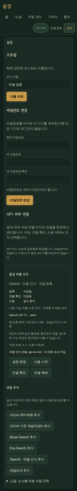
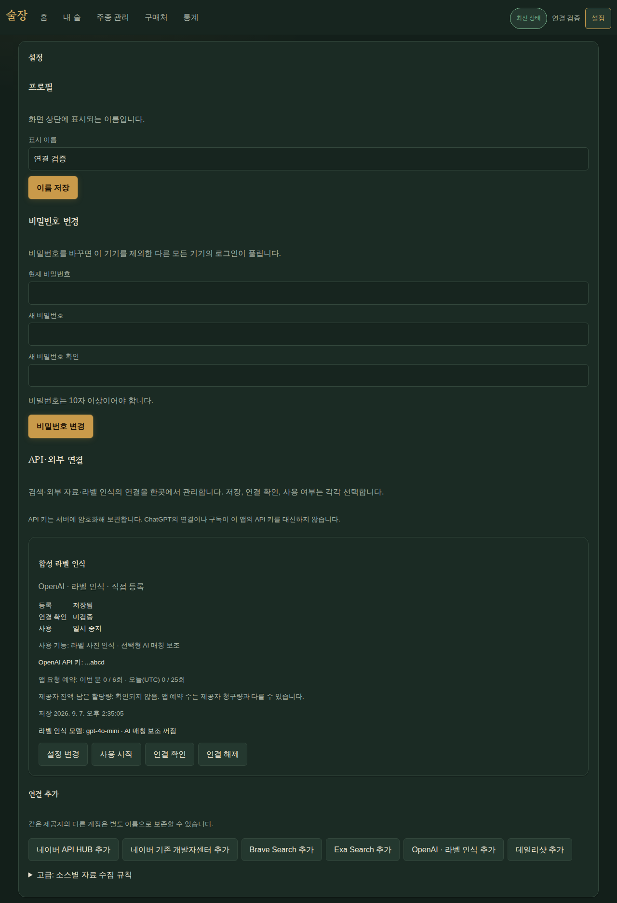

# B03 — API·외부 연결 통합

WP05 #123의 R04~08/R24, S01~03/S07. 기준 B01 `e9c52b5`; 모델·0014 선행 커밋
`bda8516`, 나머지 구현은 이 기록과 같은 PR의 후속 커밋이다. 운영 키 조회/발급·유료
계약·실제 제공자 인증·운영 migration은 수행하지 않았다.

## 변경

- 사용자별 제공자 연결과 credential 테이블, 기존 source/LLM 참조를 추가한다. 0014는
  stable UUID로 각각 이전하고 동일 suffix의 키도 합치지 않는다. opaque ciphertext,
  source override·revision, OCR 모델·opt-in·상한을 보존한다.
- 설정을 단일 진입점으로 통합하고 등록/확인/사용, 힌트·참조 기능·소스·시각·앱 예약 수를
  분리한다. 빈 키는 유지, 명시 삭제와 일시 중지는 별도 동작이다. 고급 소스 설정을 접는다.
- 소유권·revision 충돌·늦은 응답·중지/삭제 후 송신·공유 연결 상한을 적용한다. 응답은
  no-store, 키는 서버 암호화 DB에만 저장한다. 기존 OCR/선택형 매칭도 연결 키와 사용
  상태를 거치며 SDK 자동 재시도를 끈다. 공급자 오류 원문과 키 반사를 그대로 표시하지 않는다.
- 네이버 API HUB/legacy를 구분하고 종료된 쇼핑 상품 검색을 제외한다. OpenAI는 모델 목록,
  Exa는 fast search만 명시 확인에 사용한다. 공개 소스의 robots를 먼저 검사한다.
- 운영 이전·복구와 사용자 조작은 [연결 관리 문서](../docs/provider-connections.md)에 정리한다.

## 실제 검증

전용 PostgreSQL `127.0.0.1:54329/sooljang_connections_test`, 합성 fixture와 MockTransport를
사용했다. 브라우저는 별도 `sooljang_connections_browser_test`, API 8220/Vite 5180이다.

| 범위 | 실행·결과 |
|---|---|
| 연결/OCR API | `pytest tests/api/test_provider_connections.py tests/api/test_llm_settings.py tests/api/test_ocr.py -q --no-cov`: 35 통과 |
| provider HTTP 계약 | `pytest tests/infrastructure/external/test_providers.py -q --no-cov`: 15 통과; 고정 host/auth, 최소 비생성 요청, 오류 분리, 키 반사·redirect 방어, robots |
| 실제 migration | 0013→head→0013→head 왕복, 암호문·override·OCR 옵션 보존 및 생산 모델 drift 없음 |
| 회귀 수정 | `pytest tests/infrastructure/test_base.py tests/infrastructure/database/test_provider_connection_migration.py tests/infrastructure/database/test_external_sources.py tests/infrastructure/external/test_providers.py -q --no-cov`: 84 통과 |
| 웹 전체 | `npm --prefix web run check`: 42파일/517테스트 통과, branch 82.22%; Biome/tsc/build/PWA 통과 |
| 정적 검사 | `uv run ruff check .`, `ruff format --check .`, `ty check`, `git diff --check` 통과 |
| 실제 브라우저 | Playwright/Chromium, 390×844·1280×900: 합성 키 등록→reload 보존→빈 키 옵션 변경→사용 시작/중지, 미검증 유지·자동 probe 없음·가로 overflow 없음 통과 |

전체 Python 첫 실행은 1020 통과/29 opt-in skip/2 실패였다. 전체 collection에서 테스트 전용
`sample_entity`가 migration drift metadata에 섞이는 문제를 생산 mapper 목록으로 분리했다.
복구 키가 틀려 실제 요청이 발생하지 않은 AI 호출을 기록하던 기존 기대는 호출로그 0으로
갱신했다. 자격 확인 실패가 비용 상한을 소비하거나 복구 후 정상 재시도를 dedup하지 않는다.
수정 후 전체 `pytest -q`는 **1037 통과 / 29 opt-in skip**, branch coverage 포함 총 91.68%로 통과했다.
추가로 2번째 credential 복사에 실패를 주입해 DDL/부분 복사의 rollback과 원본 보존,
재실행을 검증했다. `test_base.py`와 함께 migration 테스트 8개가 통과했다.

스크린샷은 민감정보가 없는 합성 화면이다. `/tmp/sooljang-ui-validation/b03-mobile.png`,
`b03-desktop.png`; 실행 요약 `/tmp/sooljang-connections-browser-result.log`. 정식 PR 첨부는
주 담당자가 통합한다. UI 단위 테스트는 저장·오류·OCR 옵션 보존을 새 ConnectionsPanel로
옮기고 상태 분리·명시 확인·삭제·revision 안내를 추가했다.

## 제한

실제 공급자 인증/유료 응답·계정 잔액·원문 권리는 검증하지 않았다. 각 제공자 확인 성공은
검색 자료 수용·OCR 추론 성공을 보장하지 않는다. 운영 암호문 이전/복구는 B02/B09의 별도
승인된 검증과 연결한다. B05의 탐색 소비자가 이 연결을 참조하며 검색 자체는 이 PR 범위가 아니다.

## 주 담당자 통합

B02가 포함된 `07245ed` main을 통합했다. `docs/plan.md`에 D202와 현재 위치를 반영했다. 합성 스크린샷은 아래에 보존한다.

B02 통합 후 연결/OCR/설정/health/복구·migration 집중82검사 통과. Ruff·format·ty·시크릿 스캔·diff 검사도 통과했다. 공개 테스트의 합성 credential 한 줄은 스캐너에 테스트 전용으로 표시했다.
