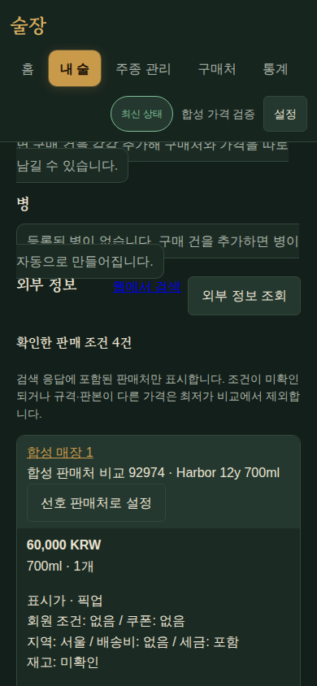
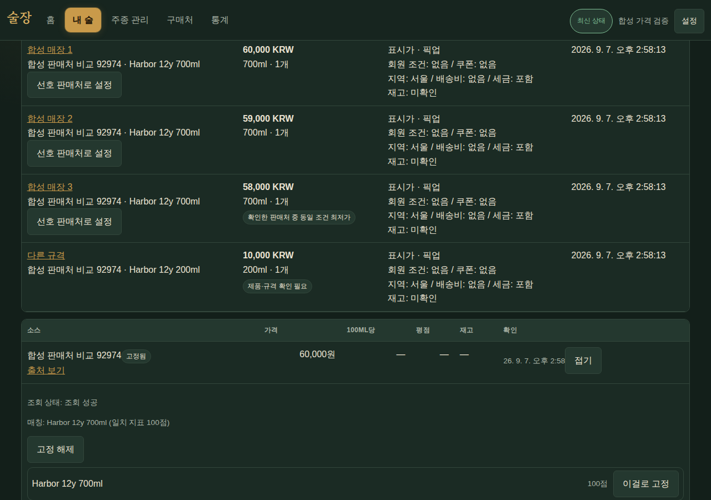

# v1.7.0 B04 — 제품 식별과 복수 판매 조건·가격 관측

기준 `07245ed`(B01 #133·B02 #134 머지) + B03 모델 `bda8516`, `feature/v170-matching-offers` 로컬 검증 완료. B03 #136 (`23f9e3e`) 전체 API/UI를 통합했다.
WP06 #124·WP07 #125, R03/R06/R09~15/R24·S03/S05/S06. B03의
`0014_provider_connections` 뒤에 `0015_external_offers`를 연결한다.

괄호의 배치·캐스크를 지우거나 축약 검색어로 원래 제품을 대체하던 판정을 수정했다.
NFKC·Latin 악센트·등록된 원어명을 사용하고 일본어/한자를 보존한다. 연수·빈티지·배치·
캐스크·용량·세트 충돌과 결측을 분리하며 상세 필드는 명시된 속성만 보완한다. 점수는 확률로
표시하지 않는다. 상세 필드끼리/이름과 상세의 상충은 확정 근거로 쓰지 않는다.

외부 제품 key 아래 판매 항목·판매자/지점·통화·용량/개수·가격 종류·쿠폰/회원·픽업/배송·
지역·배송비·세금·재고·원문/취득 시각을 보존한다. 결측을 일반가·무료배송·재고 있음으로
채우지 않는다. 같은 규격과 알려진 판매 조건만 비교하며, 기존 단일 요약 가격에서 무조건
100ml 최저가를 고르던 표시를 제거했다. 선호 판매처는 제품 고정과 별도로 저장한다.

- 기존 pin의 URL/key/명칭을 그대로 보존한다. 원래 판매 항목을 실제로 다시 찾은 경우에만
  명시된 외부 제품 key를 연결한다. 이후 그 제품의 다른 판매 조건을 모두 유지하고,
  고정 제품을 못 찾으면 유사 이름으로 바꾸지 않는다. schema 이전은 additive다.
- JSON 검색의 `fields.product_key`, `offer_fields`, 선택형 `pagination.next_path`를 지원한다.
  후속 페이지도 같은 safe HTTP·robots·요청 예산을 거치며 최대 3페이지/100 offer다.
  일부 실패·상한이면 이전 성공 결과를 유지하고 부분 수집으로 표시한다. 전체 매장 전수
  수집으로 표시하지 않는다. HTML 단일 상세의 가격도 같은 사실 계약을 사용한다.
- `ExternalOffer`와 `ExternalPriceObservation`은 실제 취득의 1차 사실만 저장한다.
  acquisition 재처리/캐시 읽기는 새 관측을 추가하지 않는다. 비교 지표는 저장하지 않고
  현재 identity·조건에서 재계산한다. 실패 시 원래 시각의 마지막 관측을 제공한다.
- 소스별 `price_history_allowed`는 기존 소스도 기본 false다. 보관 허용을 확인하고 켠
  소스만 새로운 복수 가격을 장기 관측/캐시에 남긴다. 꺼진 소스는 새 복수 가격을 그 조회
  응답에서만 표시한다. 기존 개인 구매·병·시음·암호문을 수정하지 않는다.
- 새 LLM 기능/요청은 추가하지 않았다. 기존 선택형 재판정 경로는 보존하며 B05 새 탐색은
  별도로 생성형 요청 0 계약을 사용한다.

## 실행한 검증

| 검증 | 결과 |
|---|---|
| 고정 합성 평가셋 v1 16사례, `uv run python scripts/evaluate-discovery.py --check` | 자동 오탐 2→0, 자동 정탐 7→13, 정답 후보 회수 9/13→13/13. 정답 없는 3사례도 자동 확정 없음. 최종 규칙 집중 측정 median 1.55ms/peak 5731bytes, 네트워크 0. 실제 전체 주류 정확도 추정치는 아님 |
| 매칭/adapter/복수 판매 순수 집중 검사 | 145 passed; 다국어·연도/연수·축약 질의·상세 상충·3판매처·조건/규격 분리 포함 |
| 후속 페이지 추가 후 adapter/offer 검사 | 100 passed; 정상 2페이지·후속 500·사설 next 차단에서 성공 페이지 보존 |
| 소스 API/DB 집중 검사 | 90 passed; 이후 기존 pin 재매핑·미발견 보존 추가 3 passed |
| 실제 PostgreSQL offer/관측 검사 | 3판매처, 캐시·같은 acquisition 재처리 관측수 3 유지, 이력 미허용 저장 0, 실패 시 last-good 시각 보존, pin 제품/선호 판매자 보존 |
| `npm --prefix web run check` | 517 tests, branch 82.71%, Biome·타입·PWA build 통과. 이후 선호 판매처/원문 시각 표시와 중복된 최저가 분기 정리 후 최종 통합 검증 예정 |
| Ruff·format·ty·시크릿 스캔·diff | 현재 집중 검사 통과 |

## 남은 수용

B03 통합 후 전체 Python **1117 passed/30 opt-in skipped**, branch 포함 coverage **91.72%**. 전체 웹 **519 passed**, branch **82.30%**, Biome·타입·PWA build 통과.

생산 mapper만 비교하도록 B03 migration 테스트를 통합해 test_base와 함께 8개 검사를 통과했다. 0013→0015→0013→0015에서 기존 키/override를 보존하고 실제 CLI Alembic check도 통과했다. `tests/scripts/test_recovery_live.py`를 확장해 0015의 실제 가격 관측 3건·pin·캐시·원통화 가격을 pg_dump/pg_restore와 복원 후 앱 조회로 대조했다(1 passed). 실제 원본 구매 2병·잔량·시음·PNG·암호화 설정도 계속 보존된다.

실제 Chromium+격리 API/PostgreSQL에서 390/1280 화면, 같은 제품 3판매처+다른 200ml, 동일 조건 최저가·선호 판매자·캐시 관측 보존·body 가로 overflow 없음 검증을 통과했다. 외부 취득은 MockTransport다. 모바일 `.table-scroll`이 표를 숨기는 기존 공통 스타일을 발견해 항상 표시하고 항목별 읽기 형태를 적용했다. 운영/실연결로 세지 않는다. PR CI와 최종 배포 수용은 별도다.

데일리샷 프리셋 v3의 product/seller 필드는 B01에서 공개 응답의 구조만 확인했다.
이 PR에서 실제 판매 가격을 수집·저장하거나 운영 소스를 갱신하지 않았다. 데일리샷/키햐
자료 취득·재표시·장기 보관 허용과 독립 국내 가격 출처 2곳의 실제 수용은 미확정이다.
[source 원장](../docs/plans/v1.7.0/sources.md)의 필수 외부 입력을 해결하거나 사용자의
명시적 범위 결정이 있어야 한다. 합성 3판매처·mock 통과로 실제 2출처 수용을 대체하지 않는다.

PR #137 첫 전체 CI를 통과했다. B06 #135 머지 후 동기화/입력 보호를 통합했으며 현재 위치/결정 로그의 문서 충돌을 보존 해결했다. 새 SHA의 관련 가격·혼합 동시성 검사와 전체 웹 검사 및 CI를 다시 실행한다.

B06 통합 후 가격 API/DB·온라인/동기화 동시 수정 집중 검사 **95 passed**, 전체 웹 **582 passed**, branch **80.95%**와 build 통과. 첫 실행의 95 setup 오류는 이전 B05 실험의 `interest` FK가 폐기용 `sooljang_test`에 남아 생겼다. 대상 DB를 확인하고 public schema만 초기화한 뒤 동일 검사를 통과했다. 운영 DB에는 접근하지 않았다.
