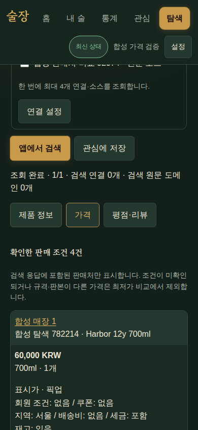
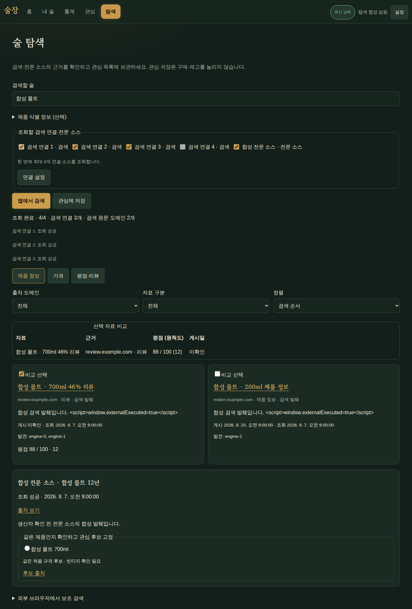

# v1.7.0 B05 — 앱 내 다중 출처 탐색과 관심 저장

WP08 #126·WP09 #127. R01~03/R05/R08/R10~14/R19/R24, S01~02/S04~07/S09.
B01/B03/B04/B06의 요청·연결·매칭·입력 보호와 B08의 공유 관심 원장을 연결한다.

## 결과와 데이터 경계

`#discover`, 제품 상세·매장 모드·관심 목록에서 공통 탐색 화면을 제공한다. 네이버
API HUB/기존 Developers 웹·블로그, Brave web, Exa fast를 명시적으로 선택하며 검색
한 번의 연결·소스는 최대4개다. 부분 결과·취소·실패를 유지하고 이전 질의/계정의 늦은
응답을 배제한다. 새 경로는 생성형 답변·요약·LLM 재판정을 요청하지 않는다. 기존 OCR와
선택형 설정·기존 API를 보존하며 자동 활성화하지 않는다.

검색 문서는 원문 URL/도메인·작성일/조회 시각·자료 종류·확인 수준과 발견 경로를 유지한다.
동일 canonical URL만 합치며 SKU/판본/fragment는 버리지 않는다. 엔진/원문 도메인 수를
분리하고 원척도·평가 수는 제공된 경우만 표시한다. HTML을 제거한 발췌는 최대500자,
API 응답은 no-store이며 검색 본문·이미지·증거 토큰을 DB/브라우저 영속 저장하지 않는다.
Brave 요약, Exa summary/highlights/deep/Answers/Research/outputSchema는 요청하지 않는다.

관심 UUID는 구매·재고와 분리되고 생성 request_id 재시도는 멱등이다. 공유0016 schema와
최소 CRUD는 B08 #138에도 포함된다. 제품→관심은 `/discovery/products/{id}/context`에서
정확한 기존 pin URL/key/product_key/명칭/선호 판매처·규격을 가져온다. 관심 조회와 구매
전환도 같은 ID를 유지한다. 새 관심 관측은 보관이 허용된 소스에서 실제 취득했을 때만
저장하며 캐시·실패 반환은 새 관측을 만들지 않는다.

외부 값 적용은 서버의 15분 Fernet 증거·사용자/출처/연결 revision과 현재 제품 revision을
확인해 선택한 필드만 바꾼다. 검색 제목에서는 명시 도수·숙성 연수만 제안하고 본문의
작성연도·다른 술·주관적 맛/평점을 추론하지 않는다. 여러 자료는 현재 값과 나란히 비교한다.

## 검토에서 보강한 경계

- 전역 송신 슬롯 대기 후 취소/설정 상태를 다시 확인한다. 중첩된 취소·worker·연결 가드를
  함께 실행하고 범위 종료 시 복원하며, robots/예산 예약은 중복 실행하지 않는다.
- 제품/관심 조회 후 identity·pin·소스 보관 허용·연결 revision을 다시 검증한다. 제품 pin
  변경과 가격 저장은 공통 잠금으로 직렬화하고 오래된 성공 응답은 관측/캐시에 남기지 않는다.
- 증거 적용은 최신 제품과 연결/소스 상태를 잠근 뒤 검증해 중지된 연결의 이전 값을
  적용하지 않는다. URL의 중첩 percent-encoding으로 반사된 인증 정보도 제거한다.
- 제품을 같은 트랜잭션에서 수정한 호출은 identity와 서버 갱신 시각을 비동기로 함께
  새로 읽는다. 만료된 ORM 속성의 동기 lazy load를 피한다.

## 실제 검증

| 층 | 결과·범위 |
|---|---|
| Python 전체 | 최종 로컬 **1215 passed/30 opt-in skipped**, coverage **92.37%**. 동일 트랜잭션 갱신 시각 회귀 수정 후 전체 재검사 통과 |
| 보안/경합 집중 | API·검색·가드42검사 통과. 별도 세션의 보관 허용 해제/pin 교체·연결 중지, 인코딩 키 반사, 대기 중 취소, 중첩 가드와 예산1회 예약 포함 |
| 웹 전체 | 605 tests, branches81.55%, statements88.65%, functions84.14%, lines90.09%. Biome·TypeScript·Vite/PWA build 통과 |
| 합성 API 경계의 실제 Chromium | 1280/390 화면 14시나리오. 총/동시4요청·중복 원문·필드 적용/409·관심/기존pin·설정 이동/뒤로가기·draft·한글IME·취소. 구매POST0, 기존external-lookup0, pageerror0 |
| 실제 API/DB의 Chromium | schema0017, 합성 외부4offers(비교 가능3판매처+다른용량), 관심 전후 구매 합계 동일·같은 관심의 관측, 제품pin/선호판매처/규격 보존. 실제 Exa1검색→10문서/10도메인 표시. 브라우저 직접 제공자 요청0/기존LLM경로0/pageerror0 |
| 실제 Exa | 환경 키 확인1회, 6주종×1검색, 암호화 등록한 앱의 probe+검색2회, 브라우저 검색1회: 총10회 송신. 생성형 요청0. 키/원문은 공개 증거에 저장하지 않음 |
| 정적 검사 | Ruff·format·ty·시크릿 스캔·diff 검사 통과. 합성 키/증거 문자열의 스캔 예외는 해당 fixture 행에만 명시 |

Exa 6주종 평가에서 문서60/발췌60, 주종별 독립 도메인10/10/10/8/8/9개를 확인했다.
이는 제공자 text 취득률이며 정확한 판본 정답률·데일리샷 전체 미등록·원문 직접 확인을
뜻하지 않는다. 실제 앱 등록 검증은 별도 격리 DB에서 암호화 여부, 응답의 키 원문0,
minute/day2건 예약, no-store를 확인했다. 사용자 직접 설정한 ~/.bashrc export와
컨텍스트/압축 설정을 보존했으며 운영 계정의 연결은 아직 변경하지 않았다.

실제 API 브라우저 harness는 합성 제품을 UI 최초 동기화 전에 준비해 외부 API로 만든
제품이 아직 Dexie에 없는 상태를 피했다. 실제 Exa 화면의 원문은 스크린샷으로 보관하지
않고, 아래 화면은 합성 자료만 사용한다.

- [합성 Chromium 결과](assets/v170-b05-browser-results.json), [재실행 harness](assets/v170-b05-browser.cjs)
- [실제 API Chromium 결과](assets/v170-b05-integrated-results.json)
- [Exa 주종별 취득 요약](assets/v170-b05-exa-coverage.json), [암호화 앱 연결 요약](assets/v170-b05-exa-app.json)

## 남은 수용

NAVER·Brave는 contract 검증이며 실제 사용자 키로 인증하지 않았다. Wine21/더술닷컴 등
전문 원문은 검색 발견/제공자 발췌와 직접 취득 권한을 구분한다. 국내2가격출처의 허용된
실제 수용(R11)은 미확정이고 사용자의 범위 결정 또는 허용 근거가 필요하다. B06의 실제
SW 교체/cold start와 B05의 UI 검증을 합산해 새 배포에서 자동 통과로 기록하지 않는다.
최종 감시·복구·이미지/스키마·배포 수용은 B09에서 검증한다.

PR #139의 CodeQL은 브라우저 검증 스크립트에서 저장 금지를 확인하는 도메인 부분 문자열 검사를 URL 검증으로 해석했다. 검증을 URL parser의 정확한 hostname 비교로 바꿔 원문 URL 영속 저장 금지 의도를 유지한다. 앱의 허용 호스트 검증을 완화하지 않았다.
