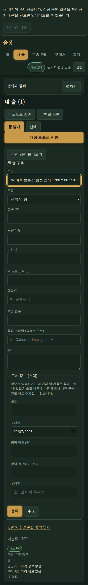
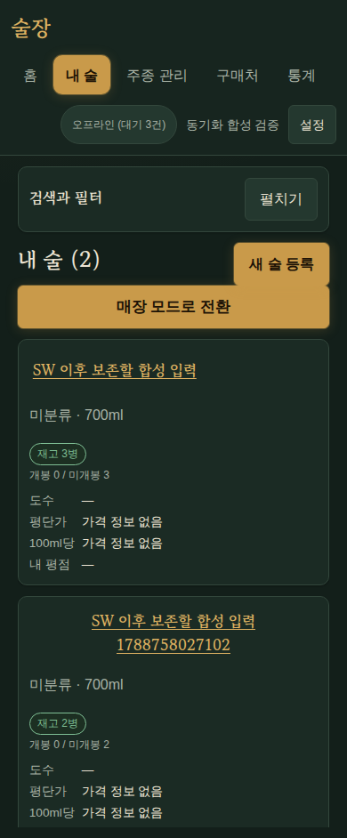
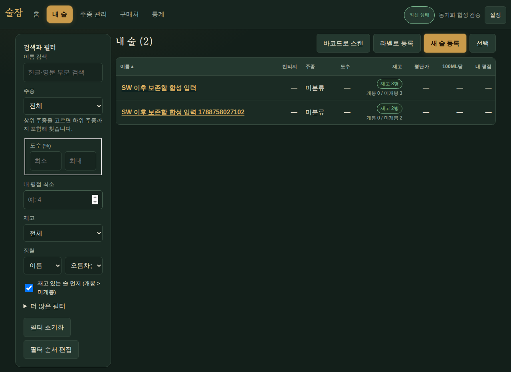
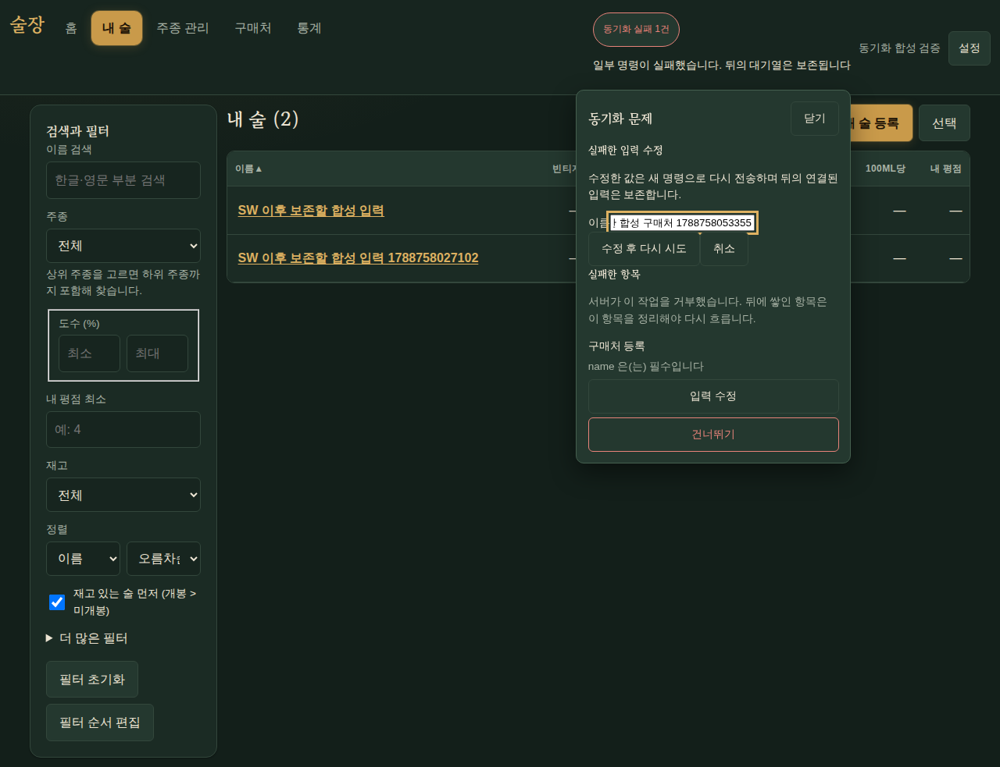

# v1.7.0 B06 — 오프라인 대기열과 미저장 입력 보존

관련: WP02 #120, R17~R19/R24, S08/S09. 기준 SHA
`30b573f8b71c34c285389ce277dc060f6cb02fba`, 브랜치 `feature/v170-sync`.
기록 시점은 미커밋 구현이며 PR·CI·릴리스·운영 배포 완료를 의미하지 않는다.

## 문제와 변경

- 200개를 초과한 outbox는 서버 상한에 맞춰 FIFO 200개 이하로 순차 전송한다.
  199/200/201/401개, 두 번째 배치 응답 유실과 같은 멱등 키 재전송을 검증했다.
  응답은 배열 위치 대신 멱등 키로 연결하며 누락·중복·알 수 없는 ID의 응답은 큐를
  보존하고 오류로 표시한다. 서버가 실패한 부모 뒤의 자식을 적용하지 않았는지도 확인한다.
- 같은 행의 연속 수정은 배치를 나누고 앞 명령의 성공 버전을 다음 명령 기준으로 연결한다.
  늦은 snapshot·델타는 미전송 변경과 더 최신 미러를 덮지 않는다. 사용자별 Web Locks로
  탭 간 전송을 직렬화하고, 계정 세대와 AbortSignal로 이전 세션 응답을 무시한다.
  `ifAvailable`과 `signal`을 함께 쓸 수 없다는 실제 Chromium 제약도 반영했다.
- 실패 명령은 무한 자동 재시도하지 않는다. 입력 수정은 새 멱등 키를 받으며 안정된
  `sequence_key`로 원래 FIFO 위치를 보존한다. 폐기는 실패가 확인된 명령에만 허용하고,
  의존하는 자식이 있으면 명시적으로 함께 폐기한다. 이후 미러를 서버와 다시 맞춘다.
- IndexedDB를 `sooljang-user-<user-id>`로 분리한다. 로그아웃/인증 만료는 로컬 접근을
  잠그며 큐와 draft를 삭제하지 않는다. 구버전 `sooljang` 미러에서 소유자가 확인되는
  행·명령만 복사하고 원본을 보존한다. 활성화 및 매 동기화 전에 구버전 큐를 확인해
  늦게 생성된 새 키를 가져오며, 명령별 이전 기록은 성공·폐기 뒤에도 유지해 재삽입을
  막는다. 기존 target 미러는 덮지 않고 새 명령에 필요한 누락 행만 추가한다.
  소유자를 확인할 수 없는 손상된 구버전 명령은
  자동 귀속하거나 삭제하지 않는다.
- 서버 batch/pull은 `expected_user_id`를 필수로 받아 현재 인증 계정과 대조한다.
  누락은 422, 불일치는 409이며 쓰기 전에 거절한다. 다른 계정 receipt는 응답 원문을
  반환하지 않는다. 사용자/멱등 키 잠금과 수정 행 잠금으로 두 기기의 동시 재전송·수정도
  직렬화한다. 온라인 제품·규격 쓰기도 `load_product`/`load_sku(for_update=True)`로
  현재 행을 잠그며, 병·시음은 `load_bottle_for_write`를 동기화와 공유한다. 읽기 API는
  쓰기 잠금을 요청하지 않는다. 30일 후 응답 snapshot은 지우되 최소 멱등 키 tombstone을 남겨 오래된
  상태 전이의 재실행을 막는다. 기존 테이블 구조를 사용하므로 migration은 추가하지 않았다.
- 제품→규격→구매→병의 오프라인 생성 및 시음→병 잔량 변경을 하나의 IndexedDB
  transaction으로 처리한다. 마지막 로컬 쓰기가 실패해도 앞의 행과 큐가 남지 않는다.
- SW는 `prompt` 방식으로 교체한다. 폼의 dirty 여부는 outbox와 독립적으로 추적한다.
  다른 탭이 SW를 활성화해도 작성 중인 탭의 새로고침은 미룬다. 제품·구매·시음 draft는
  사용자·탭별로 보관하고, 새 브라우저 세션은 **이전 입력 불러오기**로 복원한다.
  새 탭은 복제된 sessionStorage 탭 ID를 재사용하지 않는다. 비밀번호·키·토큰 필드는
  draft에 받지 않으며 SW는 앱 셸만 캐시한다.
- offline cold start는 마지막으로 인증 확인한 계정의 로컬 기록을 7일 동안 허용한다.
  인증 토큰을 로컬 프로필에 저장하지 않으며 서버 권한을 대체하지 않는다. 로그아웃 시
  이 접근 기록을 무효화한다. 로컬 세션이 없거나 만료됐으면 온라인 재확인을 안내한다.

## 계약과 호환성

주요 파일은 `web/src/sync/`, `App.tsx`, `main.tsx`, 폼 컴포넌트,
`application/sync.py`, 동기화 API route/schema다. 공통 숫자 fixture는
[`sync_input_contract.json`](../tests/fixtures/sync_input_contract.json)이며 Python 온라인
스키마·시음 도메인과 TS 입력 검증에서 같은 30개 null/0·상한·정수·평점 사례를 사용한다.
가격/재고 계산은 기존 [`metrics_cases.json`](../tests/fixtures/metrics_cases.json)을 유지한다.

구버전 클라이언트는 소유자 없는 batch를 보내도 현재 쿠키 계정에 임의 귀속되지 않는다.
대기열을 보존한 채 업데이트/계정 확인이 필요하다. 첫 v1.6→v1.7 교체 전에 기존 탭의 입력을
저장해야 한다. 새 코드가 아직 실행되지 않은 구버전 페이지의 메모리 입력을 소급해 보관할
수는 없다. 앞으로 추가되는 외부 정보 적용 폼은 `useDraftState`/`clearFormDraft`와
`DraftRecoveryButton` 계약을 사용해야 한다. 그 신규 폼 자체의 수용은 해당 WP에서 수행한다.

공식 근거: [Vite PWA prompt update](https://vite-pwa-org.netlify.app/guide/prompt-for-update.html),
[Web Locks](https://developer.mozilla.org/en-US/docs/Web/API/Web_Locks_API).
설치된 `vite-plugin-pwa 1.3.0`의 `onNeedReload` 타입과 register 구현을 대조했다.

## 실행 증거

- `uv sync --frozen`, `npm ci --prefix web`: 전용 worktree에 락된 환경 설치.
- `uv run ruff check .`, `uv run ruff format --check .`, `uv run ty check`: 통과.
- `SOOLJANG_DATABASE_URL=postgresql+psycopg://sooljang@127.0.0.1:54329/sooljang_sync_test uv run pytest tests/api/test_sync.py tests/api/test_sync_input_contract.py tests/api/test_e2e_scenario.py tests/domain/test_metrics.py --no-cov -q`: **99 passed**.
  다른 작업의 `sooljang_test`와 별개 DB를 사용했다. 전체 Python coverage/CI는 통합 담당자가 확인한다.
- 리뷰 후 `tests/api/test_sync_online_concurrency.py tests/api/test_products.py tests/api/test_tastings.py --no-cov -q`: **64 passed**.
  수정 전 독립 로그인 세션에서 100ml−30ml−40ml가 60ml로 남고, 80ml 소비 뒤 40ml도
  허용되며, 제품 PATCH의 명시적 값이 유실되는 3개 실패를 재현했다. 현재는 혼합 쓰기
  4개 회귀(잔량 보존·초과 거절·제품 값 보존·증여 후 소진 거절)가 모두 통과한다.
  동기화/시음 service까지 포함한 추가 검사도 **95 passed**. 위 검사는 범위가 겹치므로
  수를 합산하지 않는다.
- `npm --prefix web run check`: **577 passed**, branch **81.24%**, lint/typecheck/build 통과.
  Web Locks 옵션·offline 이벤트·탭 draft 분리 보완 후 최종 전체 검사를 다시 통과했다.
  번들 500kB 안내는 기존 도구의 비차단 경고이며 검사 임계값을 변경하지 않았다.
- 브라우저 DB `sooljang_sync_browser_test`, API `8218`, production preview `5178`.
  Alembic `upgrade head`·`check` 통과, Chromium 실제 SW 설치·대기·활성화 사용.
  합성 계정과 합성 명령만 사용했고 외부 소스/유료 API/운영 DB에는 접근하지 않았다.

실브라우저 결과는 [구조화 로그](assets/v170-b06-browser-results.json)에 모았다.
실제로 통과한 시나리오는 다음과 같다.

1. 작성 중 새 SW 준비 시 적용 버튼 비활성화. 다른 탭에서 실제 활성화해도 입력 유지.
2. 브라우저 프로세스 종료 후 offline cold start, 이전 세션 draft 명시 복원.
3. 오프라인 제품·규격·구매·병 2개 생성 후 온라인 복귀 시 실제 API 반영, outbox 0건.
4. 두 탭에서 201개 명령을 200+1로 전송. 동시 HTTP batch 최대 1개.
5. 쿠키 계정 변경 시 이전 계정 명령은 409로 중단하고 큐 1건 보존. 새 계정 쓰기 0건.
6. 실패 부모가 자식을 막음. 입력 수정 후 새 키로 부모·자식 적용. 폐기 확인에는 자식 수 표시.
7. 구매 단가/병수 및 시음량/향 메모가 페이지 reload 후 복원됨.
8. v1.7 탭 활성화 뒤 구버전 IndexedDB에 추가한 명령을 페이지 reload 없이 가져옴.
   두 번의 동기화에서 한 번만 전송하고 구버전 원본은 유지됨.

재실행용 합성 harness:
[`browser`](assets/v170-b06-browser.cjs), [`queue`](assets/v170-b06-queue-browser.cjs),
[`forms`](assets/v170-b06-forms-browser.cjs),
[`late legacy queue`](assets/v170-b06-legacy-browser.cjs).
별도 Playwright 환경을 `SOOLJANG_PLAYWRIGHT_MODULE`로 지정하고 저장소 루트에서 실행한다.
API/preview는 위 전용 포트에 기동하고, harness의 두 합성 계정을 전용 DB에 먼저 준비한다.
첫 harness는 생성 산출물 `web/dist/sw.js`에 검증용 주석을 추가해 실제 SW 업데이트를 유발한다.
검증 후 `npm --prefix web run build`로 생성 파일을 다시 만든다.

## 남은 통합 확인

현재 기록은 B06 구현·단위·격리 API·실브라우저 증거다. 마일스톤의 신규 외부 정보 적용 폼
소비 여부, 전체 PR CI, 운영 업그레이드/배포와 다른 묶음 변경의 병합 검증은 별도로 남아 있다.
`docs/plan.md`와 마일스톤 상태는 통합 담당자가 갱신한다.

## 주 담당자 통합

B01/B02가 머지된 `07245ed`를 작업 트리에 통합했다. `docs/plan.md`에 현재 위치와 D201을 반영했다. 별도 `sooljang_sync_test`에서 전체 Python 및 통합 웹 검사를 실행 중이며 최종 결과/PR CI는 이어 기록한다.
